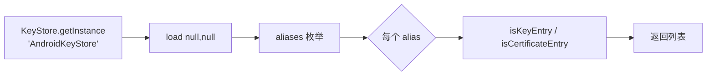
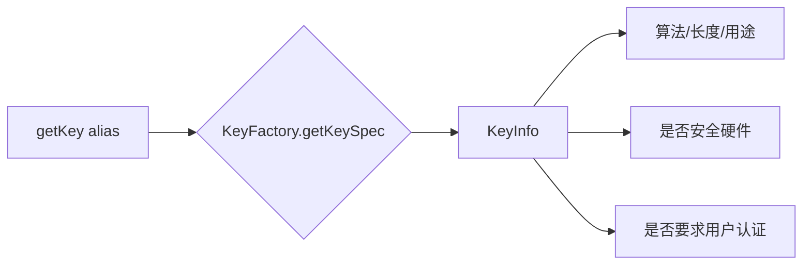
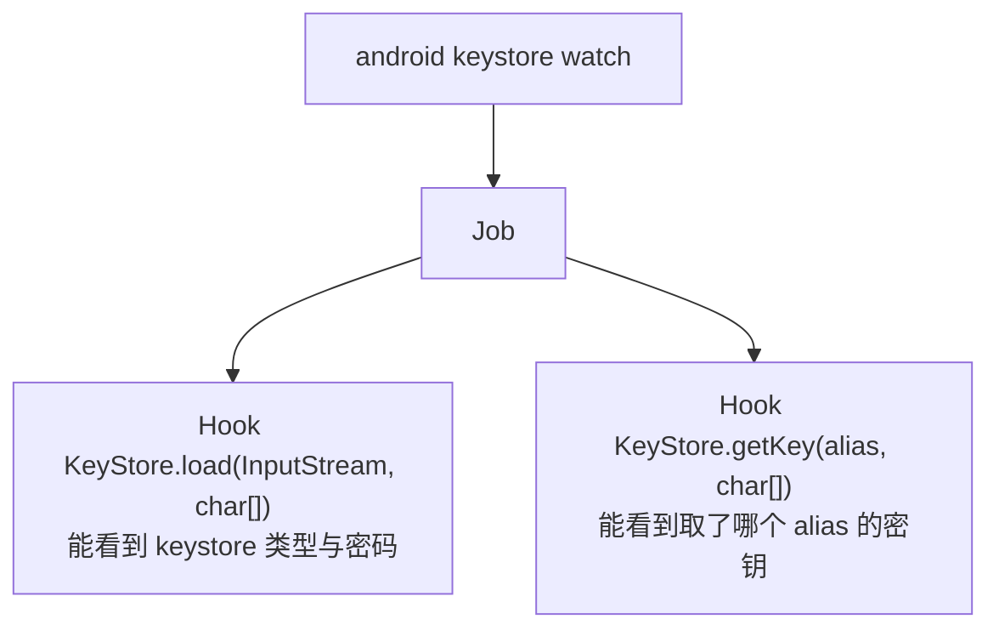
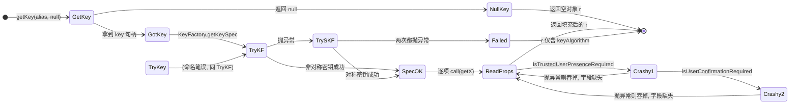
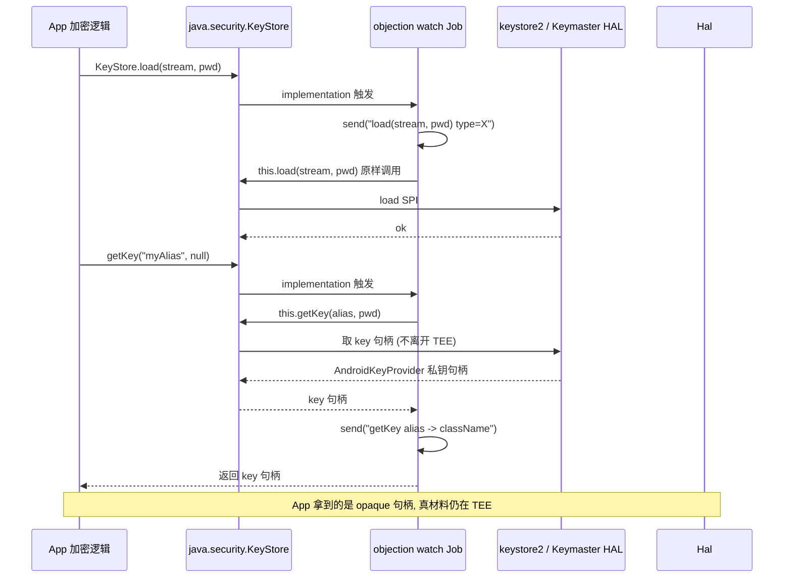

# Android Keystore 监控

Android Keystore 是存放密钥的系统区。objection 能列举、查看详情、清空，还能监控密钥的使用。

## 解决的问题

App 把密钥（签名密钥、加密密钥、证书）存在 `AndroidKeyStore` 这个 Provider 里。你想知道：

- App 用了哪些密钥别名（alias）？
- 每个密钥的算法、用途、是否在安全硬件里、是否要求用户认证？
- 运行时谁在 `load` keystore、谁在 `getKey` 取密钥？

## 用法

```text
# 列出所有别名
android keystore list

# 查看每个密钥的详细属性
android keystore detail

# 清空 keystore（慎用，会删掉 App 的密钥）
android keystore clear

# 监控 keystore 的 load / getKey 调用
android keystore watch
```

## 实现原理

关键文件：`agent/src/android/keystore.ts`。所有操作都通过 Java 反射调用 `java.security.KeyStore` API。

### 列举（list）

`keystore.ts:22` `list()`：拿到 `AndroidKeyStore` Provider，遍历所有别名：

```ts
const ks = keyStore.getInstance("AndroidKeyStore");
ks.load(null, null);
const aliases = ks.aliases();
while (aliases.hasMoreElements()) {
  const alias = aliases.nextElement();
  entries.push({
    alias: alias.toString(),
    is_certificate: ks.isCertificateEntry(alias),
    is_key: ks.isKeyEntry(alias),
  });
}
```



### 详情（detail）

`keystore.ts:64` `detail()` 拿到的是密钥的**安全属性**——这正是评估"密钥保护是否到位"的关键。通过 `KeyFactory.getKeySpec()` 拿到 `KeyInfo`，再读取其属性：

| 属性 | 含义 |
| --- | --- |
| `keyAlgorithm` / `keySize` | 算法与长度 |
| `purposes` / `blockModes` / `digests` / `paddings` | 密钥用途、模式、摘要、填充 |
| `isInsideSecureHardware` | **是否在 TEE/StrongBox 硬件里** |
| `isUserAuthenticationRequired` | 用密钥是否要求用户认证（指纹/锁屏） |
| `isInvalidatedByBiometricEnrollment` | 录入新指纹是否使密钥失效 |
| `keyValidityStart/...End` | 密钥有效期 |
| `origin` | 密钥来源（生成 / 导入） |



::: tip 安全评估价值
`detail()` 输出能直接回答"这把密钥够不够安全"：若 `isInsideSecureHardware=false` 且 `isUserAuthenticationRequired=false`，说明密钥在软件层且无认证保护，风险较高。
:::

### 清空（clear）

`keystore.ts:152`：遍历别名逐个 `ks.deleteEntry(alias)`。**破坏性操作**，会清除 App 的密钥。

### 监控（watch）

`keystore.ts:245` `watchKeystore()` 创建一个 Job，Hook 两个关键方法：



- `keystoreLoad`（`keystore.ts:186`）：Hook `load()`，打印 keystore 类型（`this.getType()`）和密码；
- `keystoreGetKey`（`keystore.ts:215`）：Hook `getKey()`，打印取了哪个 alias、返回的密钥类名。

这样 App 每次加载/取密钥，你都能实时看到——用于追踪密钥使用时机。

## 关键细节

- **只读 AndroidKeyStore Provider**：代码硬编码 `getInstance("AndroidKeyStore")`，不读文件型 JKS；
- **KeyInfo 的部分方法会"crashy"**：`isTrustedUserPresenceRequired`、`isUserConfirmationRequired` 单独 try/catch（`keystore.ts:113`），失败不致命；
- **密钥本身拿不到明文**：AndroidKeyStore 的私钥不可导出，`detail()` 只能看属性，看不到密钥材料——这正是 Keystore 的安全设计。

## 🔬 边界情况与失败模式

### `KeyFactory` 与 `SecretKeyFactory` 的双路回退

`detail()` 拿 KeySpec 时先试 `KeyFactory.getKeySpec`，失败回退 `SecretKeyFactory.getKeySpec`（[`keystore.ts:84`](https://github.com/android-security-engineer/objection-skills/blob/master/agent/src/android/keystore.ts#L84)）。原因：AndroidKeystore 里非对称密钥（RSA/EC）走 `KeyFactory`，对称密钥（AES/HMAC）走 `SecretKeyFactory`——两者 API 不通用。回退不命中就抛异常，整个 alias 的 detail 失败（但 `wrapJavaPerform` 不抛出，`keystore_info` 返回部分填充的 `r`）。

### `getKey(alias, null)` 返回 null 的处理

`detail()` 里 `key = keyStoreObj.getKey(alias, null)`，紧跟 `if (key == null) return null`（[`keystore.ts:81`](https://github.com/android-security-engineer/objection-skills/blob/master/agent/src/android/keystore.ts#L81)）。但 `keystore_info` 的返回值被外层 `info.push` 无条件塞进结果数组——所以 `list` 里出现的 alias 在 `detail` 里可能对应一个 `{}` 空对象（实际是 null 被忽略、或 keystore_info 内部 return 后外层 `r` 仍为初始空对象）。读 detail 输出时要容忍空条目。

### "crashy" 属性的吞异常

`isTrustedUserPresenceRequired` 与 `isUserConfirmationRequired` 单独 try/catch（[`keystore.ts:113`](https://github.com/android-security-engineer/objection-skills/blob/master/agent/src/android/keystore.ts#L113)）。这两个 API 在低 Android 版本（< API 28/30）的 `KeyInfo` 实现里会抛 `UnsupportedOperationException` 或 NoSuchMethod。吞异常后对应字段在结果里**不存在**（不是 false）——读字段缺失要当作"此版本不支持"，而非"未启用"。

### `clear` 不区分 App

`clear()`（[`keystore.ts:152`](https://github.com/android-security-engineer/objection-skills/blob/master/agent/src/android/keystore.ts#L152)）遍历 AndroidKeyStore 全部 alias 逐个 `deleteEntry`。AndroidKeyStore 是按 App UID 隔离的，但 objection 注入的目标 App 进程只能删**本 App 自己的** alias——删不了别的 App 的。所以 `clear` 影响范围限于目标 App，不会清掉系统或其他 App 密钥。但仍是破坏性操作，App 的签名/加密密钥会永久丢失。

### watch 只覆盖一个 `load` 重载

`keystoreLoad` Hook 的是 `KeyStore.load(java.io.InputStream, [C)` 这个特定重载（[`keystore.ts:190`](https://github.com/android-security-engineer/objection-skills/blob/master/agent/src/android/keystore.ts#L190)）。AndroidKeyStore 实际走的是 `load(null, null)`（Keystore Spi 的 `load(LoadStoreParameter)` 重载），可能不触发这个 Hook。AndroidKeyStore 的 load 通常无密码，监控 hit 率取决于 App 怎么调——这是 watch 的已知盲区。

## 🔧 与底层 Frida/系统 API 的交互细节

### `KeyInfo['getX'].call(keySpec)` 的反射式调用

`detail()` 读属性用的是 `keyInfo['getKeySize'].call(keySpec)`（[`keystore.ts:94`](https://github.com/android-security-engineer/objection-skills/blob/master/agent/src/android/keystore.ts#L94)）——拿到 `KeyInfo` 类的 Method 引用，再 `.call(keySpec)` 以 keySpec 为 receiver 调用。等价于 Java 的 `keySpec.getKeySize()`，但 Frida 里这么写是为了绕开 `keySpec` 的实际运行时类型可能是 `KeyInfo` 的私有实现类（`AndroidKeyStoreKeyInfo`），直接用基类 `KeyInfo` 的方法引用跨类型调用。这是 Frida Java bridge 的常见反射技巧。

### AndroidKeyStore 的 Keymaster 架构

`detail()` 读到的 `isInsideSecureHardware` 反映的是密钥是否在 **Keymaster HAL**（TEE/StrongBox）里。Android 密钥链路：

```text
App (Java KeyStore API)
  -> AndroidKeyStore Provider (framework, java)
    -> Keymaster HAL (C, 在系统进程 keystore2)
      -> TEE Keymaster 或 StrongBox Keymaster (硬件)
```

`KeyInfo` 是 framework 侧对 HAL 元数据的镜像，objection 只读这个镜像。真密钥材料从不离开 HAL/TEE，所以 objection 拿不到明文私钥——这是设计上的安全边界，不是 bug。

### `aliases()` 返回 `Enumeration<String>`

`list`/`detail` 用 `while (aliases.hasMoreElements()) { aliases.nextElement() }`（[`keystore.ts:45`](https://github.com/android-security-engineer/objection-skills/blob/master/agent/src/android/keystore.ts#L45)）——这是 Java 1.0 风格的 Enumeration 接口（不是 Iterator）。Frida Java bridge 直接暴露 Java 对象方法，所以必须按原 API 用 Enumeration 语义遍历，不能用 for-of。

## ⚡ 性能与并发考量

- **`detail()` 是重操作**：对每个 alias 都 `KeyFactory.getKeySpec`，背后是多次 IPC 到 keystore2 进程查 HAL 元数据。alias 多的 App（几十把密钥）`detail` 可能要几秒；
- **watch 命中的 `send()` 是同步阻塞**：`keystoreGetKey` 的 implementation 里 `this.getKey(alias, password)` 调原方法（[`keystore.ts:223`](https://github.com/android-security-engineer/objection-skills/blob/master/agent/src/android/keystore.ts#L223)），前后各一次 `send`。 getKey 通常发生在加密/签名热路径，高频调用时 JS 回调形成背压；
- **密码以明文形式出现在日志**：`load(stream, password)` 与 `getKey(alias, password)` 都把 `password` 打印（[`keystore.ts:195`](https://github.com/android-security-engineer/objection-skills/blob/master/agent/src/android/keystore.ts#L195) 与 [`:225`](https://github.com/android-security-engineer/objection-skills/blob/master/agent/src/android/keystore.ts#L225)）。AndroidKeyStore 通常 password=null，但若 App 用文件型 keystore 带密码，密码会泄露到 objection 日志——敏感环境要注意日志去向；
- **Job 化的 watch 可叠加**：多次 `android keystore watch` 起多个 Job，同一 `getKey` 被 Hook 多次，每次都 `send` 一条日志。低频无妨，高频叠加会放大开销。

## 📊 密钥属性读取状态机



## 📊 keystore watch 监控时序



## 🧱 AndroidKeyStore 密钥访问的分层布局

```text
+-----------------------------------------------------------+
|  objection agent (Java Hook 层)                           |
|    list / detail / clear / watch                          |
|    ↓ KeyStore.getInstance("AndroidKeyStore")              |
+----------------------------+------------------------------+
                             |  java.security.KeyStore API
                             v
+-----------------------------------------------------------+
|  Android Framework (App 进程内)                           |
|    AndroidKeyStore Provider                               |
|    - KeyStoreSpi 实现                                     |
|    - KeyInfo (属性镜像, objection 读的就是这层)            |
+----------------------------+------------------------------+
                             |  IPC (binder, 进程间)
                             v
+-----------------------------------------------------------+
|  keystore2 守护进程 (系统, SELinux 域 keystore)            |
|    Keymaster HAL client                                   |
|    - 按 UID 隔离 (objection 只能见本 App 的 alias)         |
+----------------------------+------------------------------+
                             |  HAL 接口
                             v
+-----------------------------------------------------------+
|  TEE Keymaster / StrongBox Keymaster (硬件)               |
|    - 密钥材料真身 (永不出 TEE)                             |
|    - isInsideSecureHardware=true 时密钥在此               |
|    - 签名/解密在此完成, 仅结果返回 framework              |
+-----------------------------------------------------------+
        ↑                                           ↑
   objection 拿不到这层明文                     App 用密钥时
   (设计边界, 非缺陷)                          操作下放到此
```

## 源码索引

| 内容 | 位置 |
| --- | --- |
| Python 命令 | `objection/commands/android/keystore.py` |
| RPC 注册 | [`agent/src/rpc/android.ts:78`](https://github.com/android-security-engineer/objection-skills/blob/master/agent/src/rpc/android.ts#L78) |
| list | [`agent/src/android/keystore.ts:22`](https://github.com/android-security-engineer/objection-skills/blob/master/agent/src/android/keystore.ts#L22) |
| detail | [`agent/src/android/keystore.ts:64`](https://github.com/android-security-engineer/objection-skills/blob/master/agent/src/android/keystore.ts#L64) |
| clear | [`agent/src/android/keystore.ts:152`](https://github.com/android-security-engineer/objection-skills/blob/master/agent/src/android/keystore.ts#L152) |
| watch | [`agent/src/android/keystore.ts:245`](https://github.com/android-security-engineer/objection-skills/blob/master/agent/src/android/keystore.ts#L245) |
