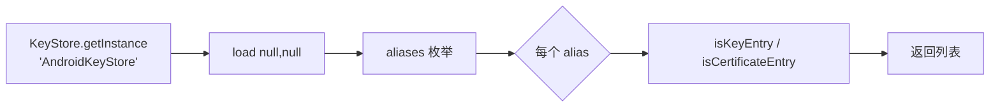
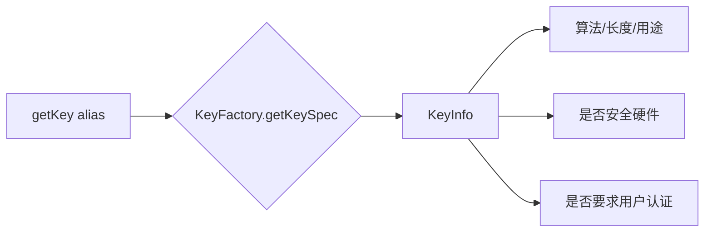
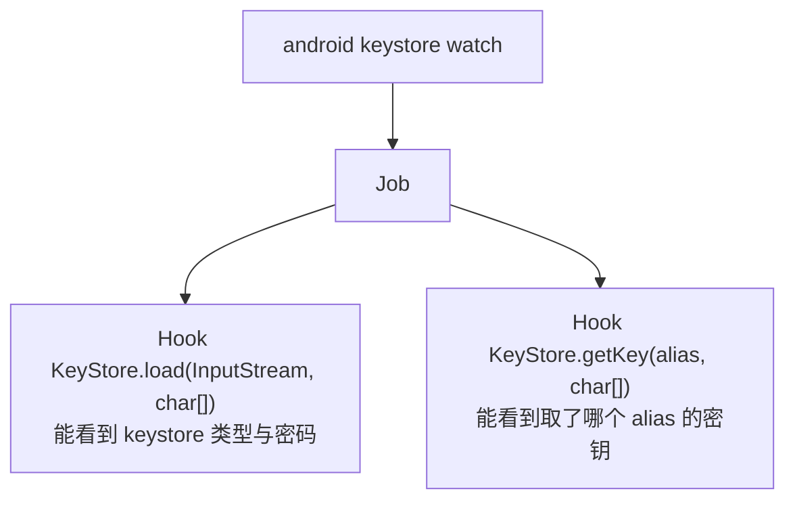

# Android Keystore 监控

Android Keystore 是存放密钥的系统区。objection 能列举、查看详情、清空，还能监控密钥的使用。

## 解决的问题

App 把密钥（签名密钥、加密密钥、证书）存在 `AndroidKeyStore` 这个 Provider 里。你想知道：

- App 用了哪些密钥别名（alias）？
- 每个密钥的算法、用途、是否在安全硬件里、是否要求用户认证？
- 运行时谁在 `load` keystore、谁在 `getKey` 取密钥？

## 用法

```text
# 列出所有别名
android keystore list

# 查看每个密钥的详细属性
android keystore detail

# 清空 keystore（慎用，会删掉 App 的密钥）
android keystore clear

# 监控 keystore 的 load / getKey 调用
android keystore watch
```

## 实现原理

关键文件：`agent/src/android/keystore.ts`。所有操作都通过 Java 反射调用 `java.security.KeyStore` API。

### 列举（list）

`keystore.ts:22` `list()`：拿到 `AndroidKeyStore` Provider，遍历所有别名：

```ts
const ks = keyStore.getInstance("AndroidKeyStore");
ks.load(null, null);
const aliases = ks.aliases();
while (aliases.hasMoreElements()) {
  const alias = aliases.nextElement();
  entries.push({
    alias: alias.toString(),
    is_certificate: ks.isCertificateEntry(alias),
    is_key: ks.isKeyEntry(alias),
  });
}
```



### 详情（detail）

`keystore.ts:64` `detail()` 拿到的是密钥的**安全属性**——这正是评估"密钥保护是否到位"的关键。通过 `KeyFactory.getKeySpec()` 拿到 `KeyInfo`，再读取其属性：

| 属性 | 含义 |
| --- | --- |
| `keyAlgorithm` / `keySize` | 算法与长度 |
| `purposes` / `blockModes` / `digests` / `paddings` | 密钥用途、模式、摘要、填充 |
| `isInsideSecureHardware` | **是否在 TEE/StrongBox 硬件里** |
| `isUserAuthenticationRequired` | 用密钥是否要求用户认证（指纹/锁屏） |
| `isInvalidatedByBiometricEnrollment` | 录入新指纹是否使密钥失效 |
| `keyValidityStart/...End` | 密钥有效期 |
| `origin` | 密钥来源（生成 / 导入） |



::: tip 安全评估价值
`detail()` 输出能直接回答"这把密钥够不够安全"：若 `isInsideSecureHardware=false` 且 `isUserAuthenticationRequired=false`，说明密钥在软件层且无认证保护，风险较高。
:::

### 清空（clear）

`keystore.ts:152`：遍历别名逐个 `ks.deleteEntry(alias)`。**破坏性操作**，会清除 App 的密钥。

### 监控（watch）

`keystore.ts:245` `watchKeystore()` 创建一个 Job，Hook 两个关键方法：



- `keystoreLoad`（`keystore.ts:186`）：Hook `load()`，打印 keystore 类型（`this.getType()`）和密码；
- `keystoreGetKey`（`keystore.ts:215`）：Hook `getKey()`，打印取了哪个 alias、返回的密钥类名。

这样 App 每次加载/取密钥，你都能实时看到——用于追踪密钥使用时机。

## 关键细节

- **只读 AndroidKeyStore Provider**：代码硬编码 `getInstance("AndroidKeyStore")`，不读文件型 JKS；
- **KeyInfo 的部分方法会"crashy"**：`isTrustedUserPresenceRequired`、`isUserConfirmationRequired` 单独 try/catch（`keystore.ts:113`），失败不致命；
- **密钥本身拿不到明文**：AndroidKeyStore 的私钥不可导出，`detail()` 只能看属性，看不到密钥材料——这正是 Keystore 的安全设计。

## 源码索引

| 内容 | 位置 |
| --- | --- |
| Python 命令 | `objection/commands/android/keystore.py` |
| RPC 注册 | `agent/src/rpc/android.ts:78` |
| list | `agent/src/android/keystore.ts:22` |
| detail | `agent/src/android/keystore.ts:64` |
| clear | `agent/src/android/keystore.ts:152` |
| watch | `agent/src/android/keystore.ts:245` |
