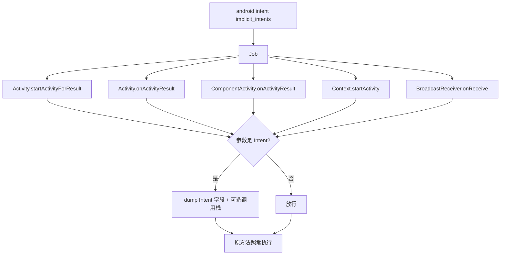
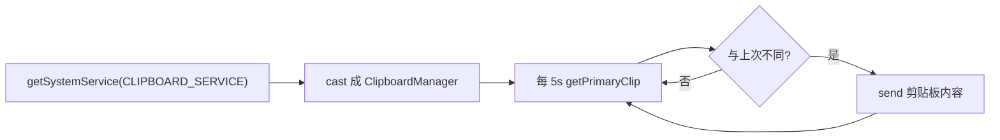
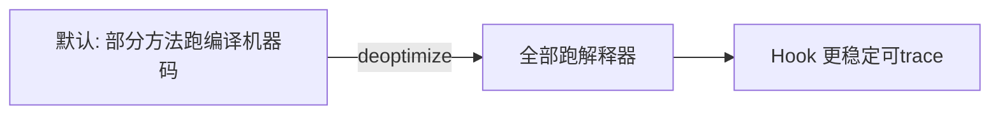

# Android 运行时监控

Hook 之外，objection 还有一组"观察 App 运行时行为"的监控命令。本页聚合几个常用的：Intent 分析、剪贴板监控、ART 反优化。

## 解决的问题

有时你不是要改 App 行为，而是要**看清 App 在做什么**：

- App 用隐式 Intent 启动了哪个组件？带了什么参数？
- 用户复制的敏感内容进了剪贴板吗？
- ART 把方法编译成机器码后，Hook 不稳定？

## Intent 隐式分析

```text
# 监控隐式 Intent，dump 内容
android intent implicit_intents
# 带调用栈
android intent implicit_intents --dump-backtrace
```

### 实现原理

[`agent/src/android/intent.ts:73`](https://github.com/android-security-engineer/objection-skills/blob/master/agent/src/android/intent.ts#L73) `analyzeImplicits()`。Hook 几个启动组件的方法，拦截传入的 `Intent` 对象并 dump：



关键逻辑（`intent.ts:96`）：遍历方法参数，凡是 `android.content.Intent` 类型的，调 `analyseIntent` 提取 action、data、extras 等字段并 `send` 出来。原方法用 `overload.apply(this, args)` 照常执行——**只观察不干预**。

```ts
overload.implementation = function (...args) {
  args.forEach(arg => {
    if (arg && arg.$className === "android.content.Intent") {
      analyseIntent(`${className}::${methodName}`, arg, backtrace);
    }
  });
  return overload.apply(this, args);   // 原样执行
};
```

用途：追踪 App 用隐式 Intent 跳转到了哪个 Activity/Service，extras 里带了什么数据——常用于发现**隐式 Intent 滥用**漏洞（敏感数据经 Intent 传递被其他 App 截获）。

## 剪贴板监控

```text
android clipboard monitor
```

### 实现原理

`agent/src/android/clipboard.ts`。拿到 `ClipboardManager` 系统服务，每 5 秒轮询 `getPrimaryClip()`，内容变化时 dump：



```ts
const clipboardHandle = context.getSystemService(CLIPBOARD_SERVICE);
const cp = Java.cast(clipboardHandle, clipboardManager);
setInterval(() => {
  const primaryClip = cp.getPrimaryClip();
  if (!primaryClip || primaryClip.getItemCount() <= 0) return;
  // 拿 ClipData.Item 的文本
}, 1000 * 5);
```

::: warning 模块状态
`clipboard.ts` 开头会打印一条 warning：`This module is still broken`。轮询方式拿 `getPrimaryClip` 在部分系统版本上行为不稳定，使用时留意。
:::

## ART 反优化（deoptimize）

```text
android deoptimize
```

`agent/src/android/general.ts`（`androidDeoptimize` RPC）。强制 ART 把代码跑在解释器里，不用 JIT/AOT 编译的机器码。



为什么需要？ART 的 JIT/AOT 优化会让某些方法的实际执行跳过 Java 层入口，导致 Frida 的 `implementation` 替换**不生效或时序异常**。`deoptimize` 强制走解释器后，Hook 更可靠。代价是 App 变慢。

这是 Hooking/trace 不稳定时的常用前置手段。

## 关键细节

- **只观察不干预**：Intent 分析 Hook 后仍 `apply` 原方法，不改 App 行为；剪贴板监控也是纯读；
- **Job 化**：Intent 分析装 Hook 进 Job，可撤销；剪贴板监控是 `setInterval` 轮询，结束靠 `jobs kill`；
- **deoptimize 是全局的**：影响整个 App 性能，用完不需要显式恢复（重启 App 即恢复）。

## 源码索引

| 内容 | 位置 |
| --- | --- |
| Intent 命令 | `objection/commands/android/intents.py` |
| analyzeImplicits | [`agent/src/android/intent.ts:73`](https://github.com/android-security-engineer/objection-skills/blob/master/agent/src/android/intent.ts#L73) |
| clipboard 命令 | `objection/commands/android/clipboard.py` |
| clipboard agent | `agent/src/android/clipboard.ts` |
| deoptimize RPC | [`agent/src/rpc/android.ts:31`](https://github.com/android-security-engineer/objection-skills/blob/master/agent/src/rpc/android.ts#L31) |
| deoptimize 实现 | `agent/src/android/general.ts` |
