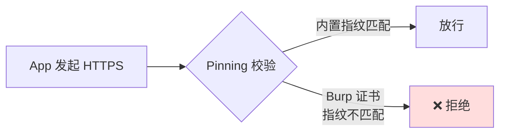
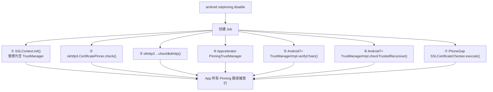
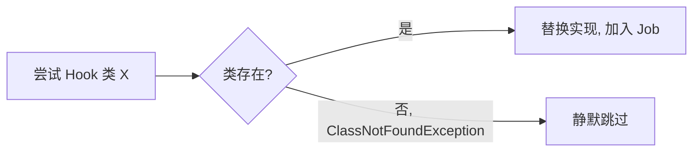
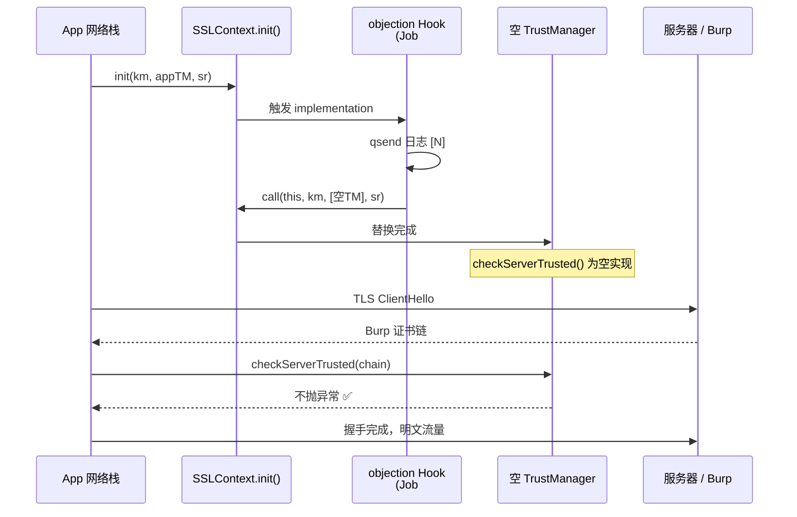
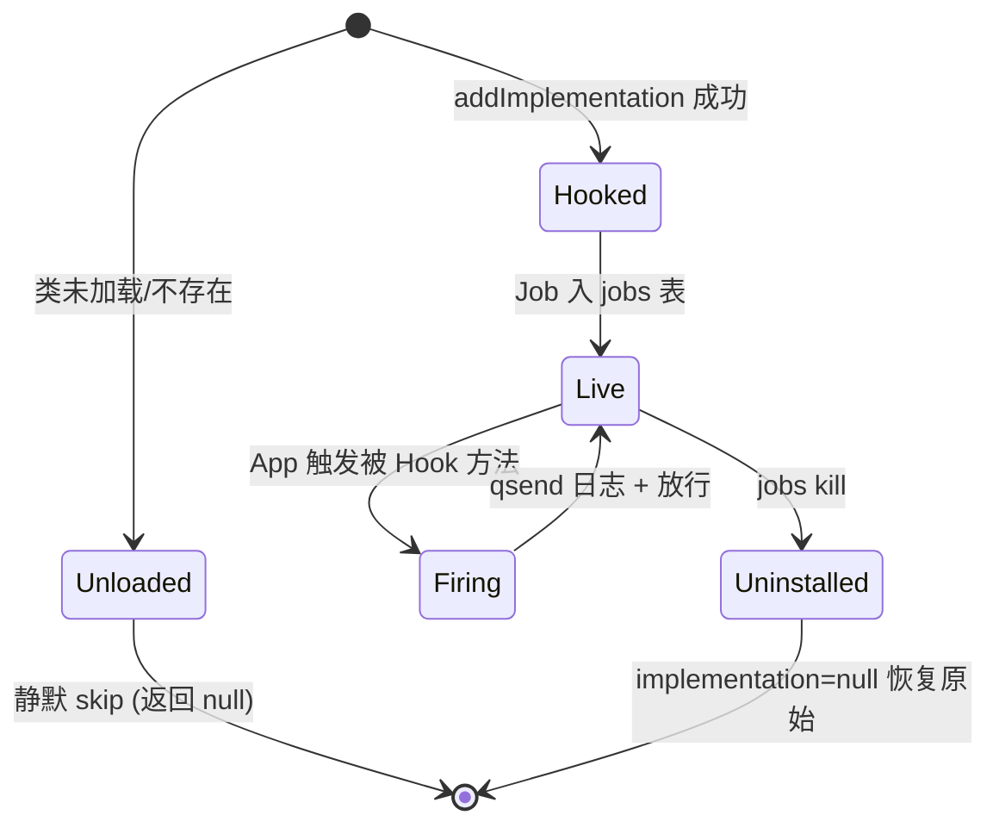

# Android SSL Pinning 绕过

这是 objection 最常用的功能之一。一行 `android sslpinning disable`，让 App 信任你 Burp 代理的证书。

## 解决的问题

App 为了防止中间人攻击，会做 **SSL Pinning（证书固定）**：不信任系统证书链，只接受自己内置的证书/公钥指纹。后果是——你装了 Burp 的 CA 证书到系统，App 依然拒绝连接，抓不到明文流量。



## 用法

```text
android sslpinning disable
# 安静模式，不打印每次命中
android sslpinning disable --quiet
```

## 实现原理

关键文件：`agent/src/android/pinning.ts`。它的策略是**广撒网**——把 Android 生态里常见的 Pinning 实现点全部 Hook 一遍，命中哪个就替换哪个。



### ① SSLContext.init() —— 通用 TrustManager 替换

这是最根本的一击（`pinning.ts:22`）。agent 用 `Java.registerClass` 动态实现一个**空实现**的 `X509TrustManager`：

```ts
const TrustManager = Java.registerClass({
  implements: [x509TrustManager],
  methods: {
    checkClientTrusted(chain, authType) { },   // 啥也不校验
    checkServerTrusted(chain, authType) { },   // 啥也不校验
    getAcceptedIssuers() { return []; },
  },
  name: "com.sensepost.test.TrustManager",
});
```

然后 Hook `SSLContext.init()`，无论 App 传入什么 TrustManager，都替换成上面这个空的（`pinning.ts:74`）：

```ts
SSLContextInit.implementation = function (keyManager, trustManager, secureRandom) {
  SSLContextInit.call(this, keyManager, TrustManagers, secureRandom); // 强制用空 TM
};
```

### ②③ OkHttp CertificatePinner

OkHttp 是 Android 最流行的 HTTP 客户端，自带 Pinning。agent Hook 其 `CertificatePinner.check()` / `check$okhttp()`，把校验方法替换成空函数——**不抛异常即视为通过**（`pinning.ts:88`、`138`）。

### ④ Appcelerator Titanium

Hybrid 框架 Appcelerator 有自己的 `PinningTrustManager`，Hook 其 `checkServerTrusted()`（`pinning.ts:194`）。

### ⑤⑥ Android 7+ 网络安全配置

Android 7 引入[网络安全配置](https://sensepost.com/blog/2018/tip-toeing-past-android-7s-network-security-configuration/)，校验落在 `com.android.org.conscrypt.TrustManagerImpl`：

- `verifyChain()`（`pinning.ts:240`）：直接返回原始证书链，跳过所有校验逻辑；
- `checkTrustedRecursive()`（`pinning.ts:288`）：返回空 `ArrayList`。

### ⑦ PhoneGap / Cordova

`nl.xservices.plugins.SSLCertificateChecker`，Hook `execute()` 直接回调 `CONNECTION_SECURE`（`pinning.ts:332`）。

## 关键细节

### 容错：类不存在不算错

每个 Hook 都包在 try/catch 里，捕获 `ClassNotFoundException` 时静默返回 `null`（`pinning.ts:128`）。因为不是每个 App 都用 OkHttp、Appcelerator——找不到是常态，不能让一个缺失的类导致整个 Job 失败。



### 反 Frida 检测规避

`pinning.ts:45` 有一处细节：Frida 默认的临时文件前缀是 `frida`，会出现在 `/proc/<pid>/maps` 里，被反 Frida 检测利用。agent 把它改名为 `onetwothree`：

```ts
if (Java.classFactory.tempFileNaming.prefix == 'frida') {
  Java.classFactory.tempFileNaming.prefix = 'onetwothree';
}
```

### Job 化

所有 Hook 实现注册进一个 `Job`（`pinning.ts:380`），意味着可以用 `jobs kill <id>` 撤销——把 `implementation` 置回 `null`，恢复原始校验。详见 [Jobs 任务](/features/jobs)。

## 局限

- 仅覆盖 Java 层 Pinning。若 App 用 **Native 层（C/C++）** 自行校验证书（如 BoringSSL 自定义校验、Flutter 的 `ssl_crypto_x509_session_verify_cert_chain`），Java Hook 无能为力，需配合 Native Hook；
- 某些 App 在 Pinning 之外还有**双向 TLS**（mTLS，需客户端证书），绕过 Pinning 后仍需提供客户端证书。

## 🔬 边界情况与失败模式

### `addImplementation` 的"成功才注册"语义

`disable()` 里每个 Hook 函数都可能返回 `undefined`（类不存在时）。`Job.addImplementation` 只在拿到非空值时才把 hook 句柄加入 Job 队列——见 [`agent/src/android/pinning.ts:382`](https://github.com/android-security-engineer/objection-skills/blob/master/agent/src/android/pinning.ts#L382) 及注释 `Exceptions can cause undefined values if classes are not found. Thus addImplementation only adds if function was hooked`。这意味着：

- 实际装上多少个 Hook 取决于 App 用了哪些库，可能是 7 个全装，也可能只装上 `SSLContext.init` + `TrustManagerImpl` 这 2 个；
- `jobs list` 里看到的实现数量不固定是正常现象；
- 即使只装 1 个也无所谓——`SSLContext.init` 那一发是兜底的，覆盖绝大多数 Java 层 HTTPS 栈。

### `check$okhttp` 的混淆名探测

OkHttp 3.3+ 把 `check()` 重命名为 `check$okhttp`（Kotlin/混淆产物）。agent 用 `certificatePinner.check$okhttp` 直接访问属性的方式探测（[`pinning.ts:158`](https://github.com/android-security-engineer/objection-skills/blob/master/agent/src/android/pinning.ts#L158)），而不是 `overload()`。这是因为混淆名在不同版本可能不存在，直接属性访问拿不到就是 `undefined`，安全跳过。两个 Hook 都装是为了同时覆盖新旧 OkHttp 版本。

### PhoneGap 回调的"伪成功"细节

`SSLCertificateChecker.execute` 不只是返回 `true`，还主动调 `callBackContext.success("CONNECTION_SECURE")`（[`pinning.ts:355`](https://github.com/android-security-engineer/objection-skills/blob/master/agent/src/android/pinning.ts#L355)）。Cordova 的 JS 侧在等这个回调决定是否放行请求——只 return `true` 不调回调，JS Promise 会一直 pending，App 卡死。这是个容易踩的坑。

## 🔧 与底层 Frida/系统 API 的交互细节

### `Java.registerClass` 的代价

`sslContextEmptyTrustManager` 用 `Java.registerClass` 在运行时合成一个全新类 `com.sensepost.test.TrustManager`（[`pinning.ts:51`](https://github.com/android-security-engineer/objection-skills/blob/master/agent/src/android/pinning.ts#L51)）。这背后是 Frida 的 ART ClassFactory 在目标进程里注册一个真类，会进 ClassTable，能被 `Java.use` 二次取到。代价是：第一次注册会触发 ClassLoader 链写入，在加固 App 里可能被 ClassLoader 监控发现。

### `tempFileNaming` 改名的副作用

把 `frida` 改成 `onetwothree`（[`pinning.ts:45`](https://github.com/android-security-engineer/objection-skills/blob/master/agent/src/android/pinning.ts#L45)）影响的是 `Java.classFactory.tempFileNaming.prefix`——Frida 在 ART 上做 method tracing 时会写临时 dex 文件，前缀会出现在 `/proc/<pid>/maps` 的文件路径段里。改名只影响**此后**新创建的 trace 文件，已经在 maps 里的旧条目不会消失。所以这条必须在任何 Hook 之前先跑（agent 正是这个顺序）。

### `wrapJavaPerform` 的线程桥接

所有 Hook 函数都包在 `wrapJavaPerform(() => {...})` 里。Frida 的 `Java.perform` 把回调投递到 ART 的 GC-safe 线程上下文执行，避免在 JS 线程直接操作 Java 对象引发 GC 状态不一致。`wrapJavaPerform` 是 agent 的封装（见 `agent/src/android/lib/libjava.js`），额外加了错误上报与 Promise 化。

## ⚡ 性能与并发考量

- **`quiet` 模式不是性能优化**：`qsend(quiet, ...)` 内部仍会构造字符串（模板拼接 + `c.blackBright` 颜色码），只是不调 `send()`。高频 App（每秒上百次 TLS 握手）想真省 CPU 得用 Frida 的 `Interceptor.attach` + 原生计数，而不是这个 Java 层 Hook；
- **Hook 命中是串行的**：`SSLContext.init` 每次 App 新建 SSL 上下文都会触发，Frida 在 ART 上单线程派发 JS 回调，握手密集时形成背压；
- **Job identifier 与日志前缀**：每个 Hook 闭包捕获了 `ident`（Job 的数字 ID），日志前缀 `[<ident>]` 用来在多 Job 并存时区分是哪个 `disable` 触发的——因为可以反复跑 `android sslpinning disable` 起多个 Job。

## 📊 绕过命中时的 TLS 握手时序



## 🗂️ Hook 类型与卸载状态机



## 🧱 OkHttp CertificatePinner 的调用栈布局

```text
+---------------------------------------------------------------+
|  App 调用 OkHttpClient.newCall(request).execute()             |
+----------------------------+----------------------------------+
                             |
                             v
+---------------------------------------------------------------+
| RealCall.execute()                                            |
|   -> RealConnection.connectTunnel()                          |
|       -> RealConnection.connectTls()  <-- TLS 握手在此        |
|           -> Address.certificatePinner()                     |
+----------------------------+----------------------------------+
                             |
                             v
+---------------------------------------------------------------+
| CertificatePinner.check$okhttp(hostname, peerCertificates)   |
|   ==[objection Hook 替换为空函数]==============================| <-- 命中点
|   (原逻辑: 比对 sha256 指纹, 不匹配抛 SSLPeerUnverifiedException)|
+----------------------------+----------------------------------+
                             |
                             v
+---------------------------------------------------------------+
| 不抛异常 => check 通过 => 握手继续 => 明文进入 OkHttp 拦截器链 |
+---------------------------------------------------------------+
```

## 源码索引

| 内容 | 位置 |
| --- | --- |
| Python 命令入口 | [`objection/commands/android/pinning.py:16`](https://github.com/android-security-engineer/objection-skills/blob/master/objection/commands/android/pinning.py#L16) |
| RPC 注册 | [`agent/src/rpc/android.ts:84`](https://github.com/android-security-engineer/objection-skills/blob/master/agent/src/rpc/android.ts#L84) |
| agent 主逻辑 | [`agent/src/android/pinning.ts:374`](https://github.com/android-security-engineer/objection-skills/blob/master/agent/src/android/pinning.ts#L374) |
| TrustManager 替换 | [`agent/src/android/pinning.ts:22`](https://github.com/android-security-engineer/objection-skills/blob/master/agent/src/android/pinning.ts#L22) |
| 反 Frida 改名 | [`agent/src/android/pinning.ts:45`](https://github.com/android-security-engineer/objection-skills/blob/master/agent/src/android/pinning.ts#L45) |
