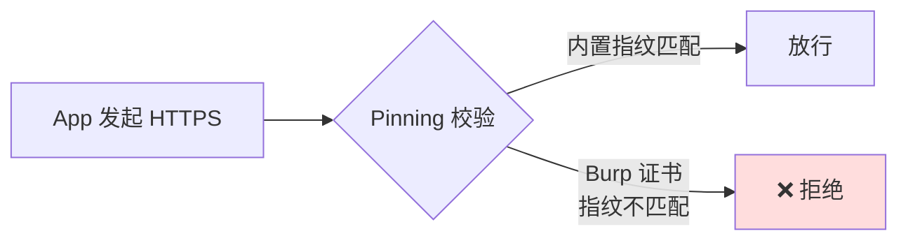
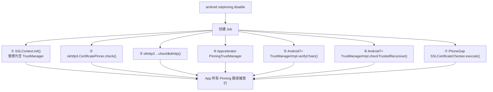
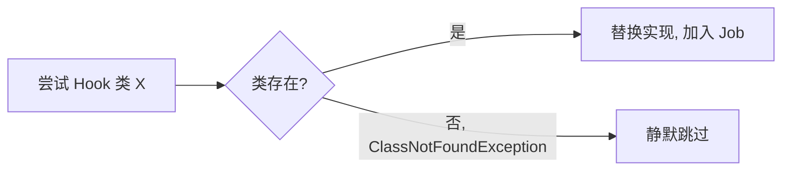

# Android SSL Pinning 绕过

这是 objection 最常用的功能之一。一行 `android sslpinning disable`，让 App 信任你 Burp 代理的证书。

## 解决的问题

App 为了防止中间人攻击，会做 **SSL Pinning（证书固定）**：不信任系统证书链，只接受自己内置的证书/公钥指纹。后果是——你装了 Burp 的 CA 证书到系统，App 依然拒绝连接，抓不到明文流量。



## 用法

```text
android sslpinning disable
# 安静模式，不打印每次命中
android sslpinning disable --quiet
```

## 实现原理

关键文件：`agent/src/android/pinning.ts`。它的策略是**广撒网**——把 Android 生态里常见的 Pinning 实现点全部 Hook 一遍，命中哪个就替换哪个。



### ① SSLContext.init() —— 通用 TrustManager 替换

这是最根本的一击（`pinning.ts:22`）。agent 用 `Java.registerClass` 动态实现一个**空实现**的 `X509TrustManager`：

```ts
const TrustManager = Java.registerClass({
  implements: [x509TrustManager],
  methods: {
    checkClientTrusted(chain, authType) { },   // 啥也不校验
    checkServerTrusted(chain, authType) { },   // 啥也不校验
    getAcceptedIssuers() { return []; },
  },
  name: "com.sensepost.test.TrustManager",
});
```

然后 Hook `SSLContext.init()`，无论 App 传入什么 TrustManager，都替换成上面这个空的（`pinning.ts:74`）：

```ts
SSLContextInit.implementation = function (keyManager, trustManager, secureRandom) {
  SSLContextInit.call(this, keyManager, TrustManagers, secureRandom); // 强制用空 TM
};
```

### ②③ OkHttp CertificatePinner

OkHttp 是 Android 最流行的 HTTP 客户端，自带 Pinning。agent Hook 其 `CertificatePinner.check()` / `check$okhttp()`，把校验方法替换成空函数——**不抛异常即视为通过**（`pinning.ts:88`、`138`）。

### ④ Appcelerator Titanium

Hybrid 框架 Appcelerator 有自己的 `PinningTrustManager`，Hook 其 `checkServerTrusted()`（`pinning.ts:194`）。

### ⑤⑥ Android 7+ 网络安全配置

Android 7 引入[网络安全配置](https://sensepost.com/blog/2018/tip-toeing-past-android-7s-network-security-configuration/)，校验落在 `com.android.org.conscrypt.TrustManagerImpl`：

- `verifyChain()`（`pinning.ts:240`）：直接返回原始证书链，跳过所有校验逻辑；
- `checkTrustedRecursive()`（`pinning.ts:288`）：返回空 `ArrayList`。

### ⑦ PhoneGap / Cordova

`nl.xservices.plugins.SSLCertificateChecker`，Hook `execute()` 直接回调 `CONNECTION_SECURE`（`pinning.ts:332`）。

## 关键细节

### 容错：类不存在不算错

每个 Hook 都包在 try/catch 里，捕获 `ClassNotFoundException` 时静默返回 `null`（`pinning.ts:128`）。因为不是每个 App 都用 OkHttp、Appcelerator——找不到是常态，不能让一个缺失的类导致整个 Job 失败。



### 反 Frida 检测规避

`pinning.ts:45` 有一处细节：Frida 默认的临时文件前缀是 `frida`，会出现在 `/proc/<pid>/maps` 里，被反 Frida 检测利用。agent 把它改名为 `onetwothree`：

```ts
if (Java.classFactory.tempFileNaming.prefix == 'frida') {
  Java.classFactory.tempFileNaming.prefix = 'onetwothree';
}
```

### Job 化

所有 Hook 实现注册进一个 `Job`（`pinning.ts:380`），意味着可以用 `jobs kill <id>` 撤销——把 `implementation` 置回 `null`，恢复原始校验。详见 [Jobs 任务](/features/jobs)。

## 局限

- 仅覆盖 Java 层 Pinning。若 App 用 **Native 层（C/C++）** 自行校验证书（如 BoringSSL 自定义校验、Flutter 的 `ssl_crypto_x509_session_verify_cert_chain`），Java Hook 无能为力，需配合 Native Hook；
- 某些 App 在 Pinning 之外还有**双向 TLS**（mTLS，需客户端证书），绕过 Pinning 后仍需提供客户端证书。

## 源码索引

| 内容 | 位置 |
| --- | --- |
| Python 命令入口 | `objection/commands/android/pinning.py:16` |
| RPC 注册 | `agent/src/rpc/android.ts:84` |
| agent 主逻辑 | `agent/src/android/pinning.ts:374` |
| TrustManager 替换 | `agent/src/android/pinning.ts:22` |
| 反 Frida 改名 | `agent/src/android/pinning.ts:45` |
