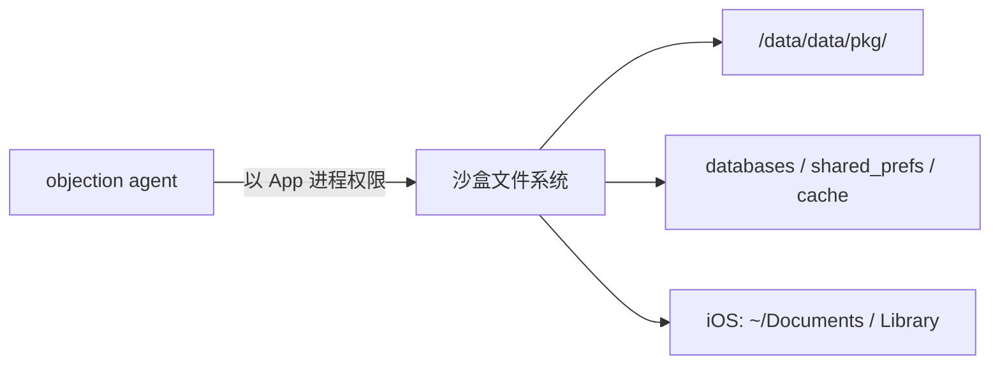

# 文件系统

objection 提供一套"类 shell"的文件系统操作命令，让你在 App 的沙盒里自由浏览、上传、下载文件。

## 解决的问题

移动 App 的数据存在沙盒里（Android 的 `/data/data/<pkg>/`、iOS 的 `~/Library/...`）。这些目录普通文件管理器进不去（需 root/越狱或 App 自身权限）。objection 注入到 App 进程后，**以 App 的权限**操作文件，能读到沙盒内的 SQLite、SharedPreferences、缓存、配置等。



## 用法

```text
# 进入某目录（影响后续相对路径）
cd /data/data/com.example.app/databases

# 列目录
ls

# 查看当前目录
pwd

# 下载文件到宿主机
file download users.db

# 上传文件到设备
file upload ./local.txt remote.txt

# 删除文件
file delete /data/data/.../cache.tmp

# 检查文件是否存在 / 是否可读写
file exists /path
file readable /path
file writable /path
```

## 实现原理

文件系统是平台相关的（Android 用 Java File API，iOS 用 NSFileManager），所以分两个实现：

| 平台 | 文件 |
| --- | --- |
| Android | `agent/src/android/filesystem.ts` |
| iOS | `agent/src/ios/filesystem.ts` |

但 RPC 层（`agent/src/rpc/android.ts:37` 等）把它们统一成相同的方法名（`androidFileLs`、`androidFileDownload`...），所以命令体验一致。

### Android 实现

以 `ls` 为例，用 `java.io.File` 列目录，返回文件名、大小、是否目录、权限等。`download` 用 `readFile` 把文件读成字节，经 RPC 返回给 Python 写到本地。

### iOS 实现

用 `NSFileManager` 枚举目录，`NSData` 读取文件内容。

### 当前目录（cd / pwd）

objection 维护一个"当前工作目录"状态（`objection/state/filemanager.py`），`cd` 切换它，后续相对路径基于它解析——就像 shell 一样。

## 关键细节

### 权限 = App 权限

你能读到的文件 = App 进程能读到的文件。Android 上一般就是自己的沙盒 + 少数共享存储；iOS 上是自己的沙盒容器。读不到其他 App 的私有数据（沙盒隔离）。

### 大文件传输

`file download` 把整个文件内容作为 RPC 返回值传回 Python。极大文件可能受 RPC 消息大小限制，需分块或用其他方式。

### 配合其他能力

文件系统常与 [内存 Dump](/features/memory)、数据库能力配合：先 `file download` 拿到 SQLite，再用 `sqlite` 命令查询；或 dump 内存后写到设备再下载。

## 源码索引

| 内容 | 位置 |
| --- | --- |
| Python 命令 | `objection/commands/filemanager.py` |
| 当前目录状态 | `objection/state/filemanager.py` |
| Android RPC | `agent/src/rpc/android.ts:37` |
| Android 实现 | `agent/src/android/filesystem.ts` |
| iOS 实现 | `agent/src/ios/filesystem.ts` |
