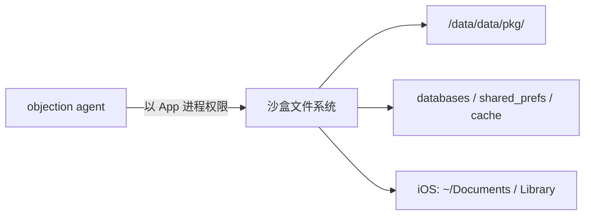
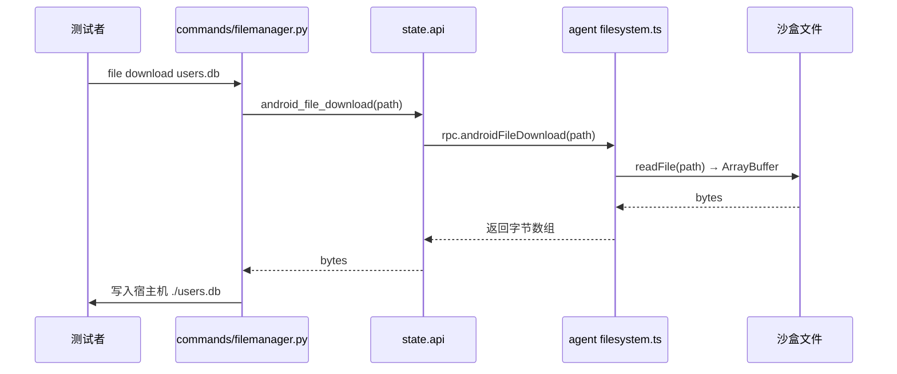
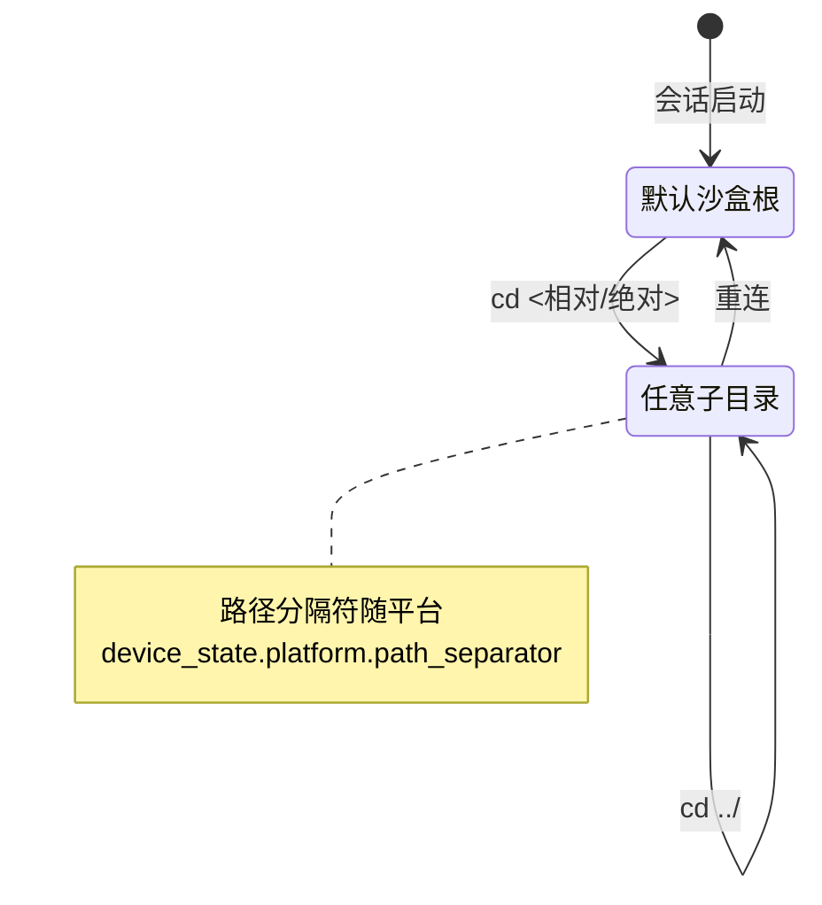

# 文件系统

objection 提供一套"类 shell"的文件系统操作命令，让你在 App 的沙盒里自由浏览、上传、下载文件。

## 解决的问题

移动 App 的数据存在沙盒里（Android 的 `/data/data/<pkg>/`、iOS 的 `~/Library/...`）。这些目录普通文件管理器进不去（需 root/越狱或 App 自身权限）。objection 注入到 App 进程后，**以 App 的权限**操作文件，能读到沙盒内的 SQLite、SharedPreferences、缓存、配置等。



## 用法

```text
# 进入某目录（影响后续相对路径）
cd /data/data/com.example.app/databases

# 列目录
ls

# 查看当前目录
pwd

# 下载文件到宿主机
file download users.db

# 上传文件到设备
file upload ./local.txt remote.txt

# 删除文件
file delete /data/data/.../cache.tmp

# 检查文件是否存在 / 是否可读写
file exists /path
file readable /path
file writable /path
```

## 实现原理

文件系统是平台相关的（Android 用 Java File API，iOS 用 NSFileManager），所以分两个实现：

| 平台 | 文件 |
| --- | --- |
| Android | `agent/src/android/filesystem.ts` |
| iOS | `agent/src/ios/filesystem.ts` |

但 RPC 层（[`agent/src/rpc/android.ts:37`](https://github.com/android-security-engineer/objection-skills/blob/master/agent/src/rpc/android.ts#L37) 等）把它们统一成相同的方法名（`androidFileLs`、`androidFileDownload`...），所以命令体验一致。

### Android 实现

以 `ls` 为例，用 `java.io.File` 列目录，返回文件名、大小、是否目录、权限等。`download` 用 `readFile` 把文件读成字节，经 RPC 返回给 Python 写到本地。

### iOS 实现

用 `NSFileManager` 枚举目录，`NSData` 读取文件内容。

### 当前目录（cd / pwd）

objection 维护一个"当前工作目录"状态（`objection/state/filemanager.py`），`cd` 切换它，后续相对路径基于它解析——就像 shell 一样。

## 关键细节

### 权限 = App 权限

你能读到的文件 = App 进程能读到的文件。Android 上一般就是自己的沙盒 + 少数共享存储；iOS 上是自己的沙盒容器。读不到其他 App 的私有数据（沙盒隔离）。

### 大文件传输

`file download` 把整个文件内容作为 RPC 返回值传回 Python。极大文件可能受 RPC 消息大小限制，需分块或用其他方式。

### 配合其他能力

文件系统常与 [内存 Dump](/features/memory)、数据库能力配合：先 `file download` 拿到 SQLite，再用 `sqlite` 命令查询；或 dump 内存后写到设备再下载。

## 🔬 技术细节

### 下载与上传的数据流

`file download` 的字节流并非走 HTTP，而是经 Frida 的同步 RPC 通道原样返回。agent 侧把文件读成 `ArrayBuffer`/字节，Python 侧 `api.android_file_download(...)` 拿到后写本地：



### `cd` / `pwd` 的 cwd 状态机

`objection/state/filemanager.py` 维护一个进程级 cwd 字符串，`cd` 解析相对/绝对路径后切换它，后续命令的相对路径都基于它拼接：



```
cwd 状态布局（state/filemanager.py 内存结构）:
+---------------------------------------------------+
|  current = "/data/data/com.x/databases"           |
|  platform.path_separator = "/"   (Android)        |
|  platform.path_separator = "/"   (iOS 容器)       |
+---------------------------------------------------+
        │ 相对路径 "users.db" 拼接
        ▼
  /data/data/com.x/databases/users.db
```

### 平台实现的 API 对照

| 操作 | Android (`File` API) | iOS (`NSFileManager` API) |
| --- | --- | --- |
| 列目录 | `File.list()` + `File.length()/isDirectory()` | `NSFileManager.contentsOfDirectoryAtPath:` |
| 读文件 | `FileInputStream` → 字节 | `NSData.dataWithContentsOfFile:` |
| 写文件 | `FileOutputStream` | `NSData.writeToFile:` |
| exists/readable/writable | `File.exists()/canRead()/canWrite()` | `fileExistsAtPath:` + `isReadableFileAtPath:` |

### 边界情况

- **符号链接**：`File` 与 `NSFileManager` 默认跟随 symlink，可能读到沙盒外文件（若 App 有权限）。
- **SELinux 限制**：即便 App 有 Unix 权限，SELinux 策略可能拒绝跨上下文访问，表现成"可读但 read 失败"。
- **iOS App Group 容器**：`cd` 默认进 App 自身容器，共享 App Group 容器需用绝对路径显式进入。
- **JSON 模式跳过 confirm**：`rm`、目录递归 `download` 在 JSON 模式（`should_output_json` 为真）下跳过 `click.confirm`，便于 Agent 无交互删除。

## 源码索引

| 内容 | 位置 |
| --- | --- |
| Python 命令 | [`objection/commands/filemanager.py`](https://github.com/android-security-engineer/objection-skills/blob/master/objection/commands/filemanager.py) |
| 当前目录状态 | [`objection/state/filemanager.py`](https://github.com/android-security-engineer/objection-skills/blob/master/objection/state/filemanager.py) |
| Android RPC 聚合 | [`agent/src/rpc/android.ts:37`](https://github.com/android-security-engineer/objection-skills/blob/master/agent/src/rpc/android.ts#L37) |
| Android 实现 | [`agent/src/android/filesystem.ts`](https://github.com/android-security-engineer/objection-skills/blob/master/agent/src/android/filesystem.ts) |
| iOS 实现 | [`agent/src/ios/filesystem.ts`](https://github.com/android-security-engineer/objection-skills/blob/master/agent/src/ios/filesystem.ts) |
| iOS RPC 聚合 | [`agent/src/rpc/ios.ts`](https://github.com/android-security-engineer/objection-skills/blob/master/agent/src/rpc/ios.ts) |

## 🔗 相关文档

- [运行时操作命令](/features/runtime-commands)
- [源码：commands/filemanager](/reference/commands/filemanager)
- [源码：state/filemanager](/reference/state/filemanager)

