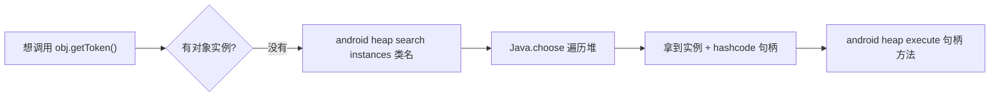
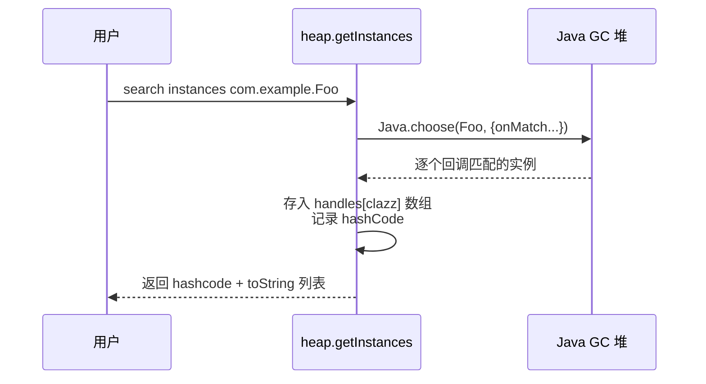
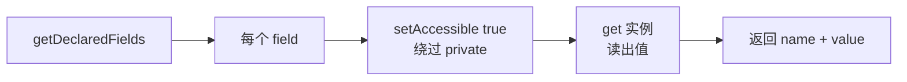
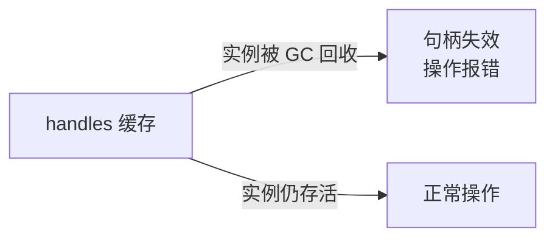

# 堆搜索与操作

Java 是面向对象的，很多关键方法是**实例方法**——你得先有一个对象实例才能调用。objection 的堆搜索能力让你在运行时找到这些实例并直接操作它们。

## 解决的问题

你发现某类有个敏感方法 `getToken()`，但它是实例方法。代码里这个对象什么时候创建、在哪？静态分析很难追踪。运行时，**它就活在堆上**——objection 帮你把它找出来。



## 用法

```text
# 1. 搜索堆上某类的所有实例
android heap search instances com.example.SessionManager

# 输出类似：
# Class instance enumeration complete for com.example.SessionManager.
# Hashcode  Hashcode  Class
# ---------  --------  -----
# 0x1a2b     12345     com.example.SessionManager

# 2. 列出某实例的方法
android heap print methods 0x1a2b

# 3. 列出某实例的字段
android heap print fields 0x1a2b

# 4. 调用某实例的无参方法
android heap execute 0x1a2b getToken

# 5. 执行任意 JS（以该实例为上下文）
android heap evaluate 0x1a2b
```

## 实现原理

关键文件：`agent/src/android/heap.ts`。核心是 Frida 的 `Java.choose`，它遍历 GC 堆上指定类的所有活动实例。

### 搜索实例

`heap.ts:46` `getInstances()`：

```ts
handles[clazz] = [];
Java.choose(clazz, {
  onMatch: function (instance) {
    handles[clazz].push({
      instance: instance,             // 保存实例引用
      hashcode: instance.hashCode(),  // 用 hashCode 作句柄标识
    });
  },
  onComplete: function () { /* done */ },
});
```



找到的实例引用保存在 agent 的 `handles` 字典里（`heap.ts:12`），用 `hashCode` 作为后续操作的**句柄**。

### 用句柄找回实例

后续命令传入 hashcode，`heap.ts:16` `getInstance()` 在 `handles` 里查回实例：

```ts
const getInstance = (hashcode: number) => {
  Object.keys(handles).forEach((clazz) => {
    handles[clazz].filter((h) => h.hashcode === hashcode && matches.push(h));
  });
  return matches[0]?.instance;
};
```

### 调用方法（execute）

`heap.ts:90` `execute()`：拿回实例后，直接像调方法一样调用：

```ts
const clazz = getInstance(handle);
const returnValue = clazz[method]();   // 直接调用实例方法
```

### 读字段（print fields）

`heap.ts:109` `fields()`：用反射 `getDeclaredFields()`，对每个字段 `setAccessible(true)` 绕过访问控制，再 `get(clazz)` 读值——包括 private 字段。



### 执行任意代码（evaluate）

`heap.ts:137` `evaluate()`：最灵活——把实例作为上下文，`eval` 一段你提供的 JS：

```ts
const clazz = getInstance(handle);
eval(js);   // 你的 JS 可直接引用 clazz
```

适合做复杂操作：连续调多个方法、组合字段值等。

## 关键细节

### 句柄 = hashCode

objection 用 Java 对象的 `hashCode()` 作为句柄标识。这意味着：

- **句柄会失效**：若实例被 GC 回收，hashcode 仍在 `handles` 里但实例引用已无效，再操作会报错；
- **多实例同 hashcode**：理论上 `hashCode` 不保证唯一，代码对此有告警（`heap.ts:29`）。



### 时机很重要

`Java.choose` 只能找到**当前时刻活在堆上**的实例。若目标对象是临时创建的（如某请求中 new 出来用完即弃），你需要在它存活的那一刻搜索——可以配合 Hook，在方法命中时停下来再搜。

### private 也能碰

`print fields` 用 `setAccessible(true)`，连 private 字段都能读。这是 Java 反射的标准能力，objection 透明地暴露了出来。

## 局限

- 只能搜 Java/Kotlin 对象（Java 堆），Native 堆的对象搜不到；
- 实例生命周期短的话，搜索窗口难把握；
- `evaluate` 用了 `eval`，需注意你注入的 JS 正确性。

## 源码索引

| 内容 | 位置 |
| --- | --- |
| Python 命令 | `objection/commands/android/heap.py` |
| RPC 注册 | `agent/src/rpc/android.ts:64` |
| 搜索实例 | `agent/src/android/heap.ts:46` |
| 句柄查找 | `agent/src/android/heap.ts:16` |
| 调用方法 | `agent/src/android/heap.ts:90` |
| 读字段 | `agent/src/android/heap.ts:109` |
| evaluate | `agent/src/android/heap.ts:137` |
