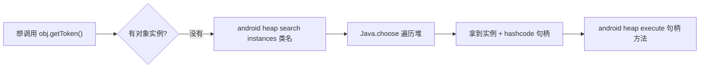
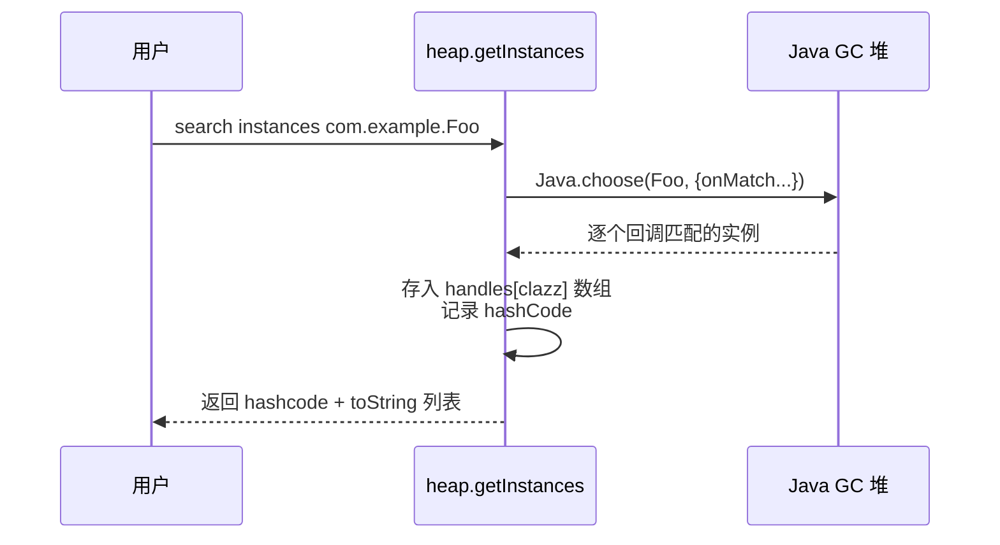
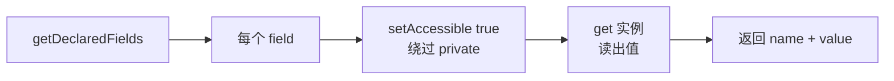
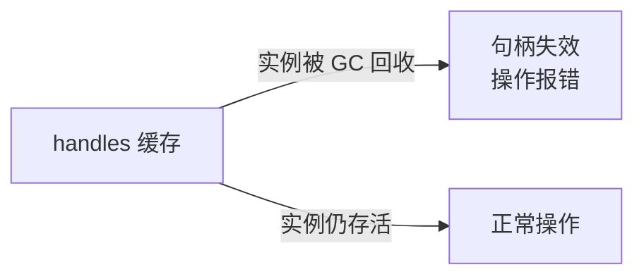
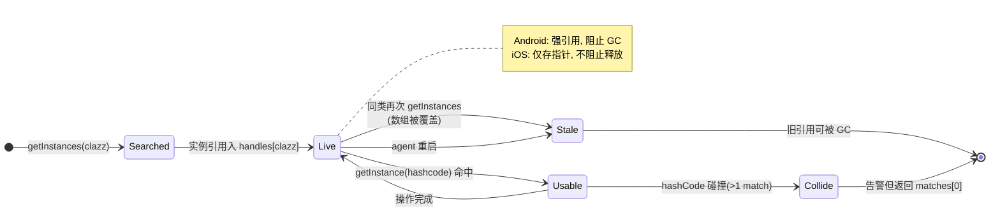
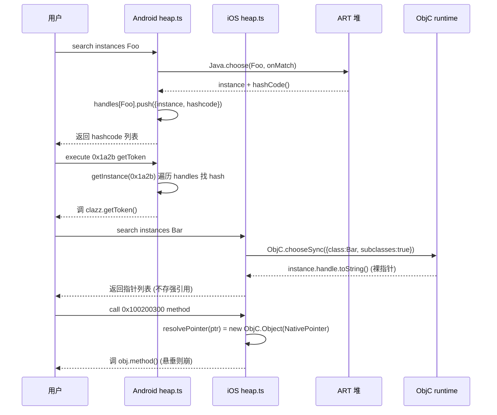

# 堆搜索与操作

Java 是面向对象的，很多关键方法是**实例方法**——你得先有一个对象实例才能调用。objection 的堆搜索能力让你在运行时找到这些实例并直接操作它们。

## 解决的问题

你发现某类有个敏感方法 `getToken()`，但它是实例方法。代码里这个对象什么时候创建、在哪？静态分析很难追踪。运行时，**它就活在堆上**——objection 帮你把它找出来。



## 用法

```text
# 1. 搜索堆上某类的所有实例
android heap search instances com.example.SessionManager

# 输出类似：
# Class instance enumeration complete for com.example.SessionManager.
# Hashcode  Hashcode  Class
# ---------  --------  -----
# 0x1a2b     12345     com.example.SessionManager

# 2. 列出某实例的方法
android heap print methods 0x1a2b

# 3. 列出某实例的字段
android heap print fields 0x1a2b

# 4. 调用某实例的无参方法
android heap execute 0x1a2b getToken

# 5. 执行任意 JS（以该实例为上下文）
android heap evaluate 0x1a2b
```

## 实现原理

关键文件：`agent/src/android/heap.ts`。核心是 Frida 的 `Java.choose`，它遍历 GC 堆上指定类的所有活动实例。

### 搜索实例

`heap.ts:46` `getInstances()`：

```ts
handles[clazz] = [];
Java.choose(clazz, {
  onMatch: function (instance) {
    handles[clazz].push({
      instance: instance,             // 保存实例引用
      hashcode: instance.hashCode(),  // 用 hashCode 作句柄标识
    });
  },
  onComplete: function () { /* done */ },
});
```



找到的实例引用保存在 agent 的 `handles` 字典里（`heap.ts:12`），用 `hashCode` 作为后续操作的**句柄**。

### 用句柄找回实例

后续命令传入 hashcode，`heap.ts:16` `getInstance()` 在 `handles` 里查回实例：

```ts
const getInstance = (hashcode: number) => {
  Object.keys(handles).forEach((clazz) => {
    handles[clazz].filter((h) => h.hashcode === hashcode && matches.push(h));
  });
  return matches[0]?.instance;
};
```

### 调用方法（execute）

`heap.ts:90` `execute()`：拿回实例后，直接像调方法一样调用：

```ts
const clazz = getInstance(handle);
const returnValue = clazz[method]();   // 直接调用实例方法
```

### 读字段（print fields）

`heap.ts:109` `fields()`：用反射 `getDeclaredFields()`，对每个字段 `setAccessible(true)` 绕过访问控制，再 `get(clazz)` 读值——包括 private 字段。



### 执行任意代码（evaluate）

`heap.ts:137` `evaluate()`：最灵活——把实例作为上下文，`eval` 一段你提供的 JS：

```ts
const clazz = getInstance(handle);
eval(js);   // 你的 JS 可直接引用 clazz
```

适合做复杂操作：连续调多个方法、组合字段值等。

## 关键细节

### 句柄 = hashCode

objection 用 Java 对象的 `hashCode()` 作为句柄标识。这意味着：

- **句柄会失效**：若实例被 GC 回收，hashcode 仍在 `handles` 里但实例引用已无效，再操作会报错；
- **多实例同 hashcode**：理论上 `hashCode` 不保证唯一，代码对此有告警（`heap.ts:29`）。



### 时机很重要

`Java.choose` 只能找到**当前时刻活在堆上**的实例。若目标对象是临时创建的（如某请求中 new 出来用完即弃），你需要在它存活的那一刻搜索——可以配合 Hook，在方法命中时停下来再搜。

### private 也能碰

`print fields` 用 `setAccessible(true)`，连 private 字段都能读。这是 Java 反射的标准能力，objection 透明地暴露了出来。

## 局限

- 只能搜 Java/Kotlin 对象（Java 堆），Native 堆的对象搜不到；
- 实例生命周期短的话，搜索窗口难把握；
- `evaluate` 用了 `eval`，需注意你注入的 JS 正确性。

## 🔬 边界情况与失败模式

### Android：`handles` 是进程内全局可变状态

`handles` 是 `export let` 的模块级可变字典（[`heap.ts:12`](https://github.com/android-security-engineer/objection-skills/blob/master/agent/src/android/heap.ts#L12)）。每次 `getInstances(clazz)` 会**覆盖** `handles[clazz]`（`:49` `handles[clazz] = []`）。后果：

- 对同一类连续搜两次，第一次拿到的 hashcode 句柄在第二次搜索后**仍可用**（因为只覆盖了那个 clazz 的数组，旧引用还在——但若期间实例被 GC，引用变 stale）；
- 不同类的句柄共存于一个 dict，`getInstance` 遍历**所有类**找匹配 hashcode（[`heap.ts:20`](https://github.com/android-security-engineer/objection-skills/blob/master/agent/src/android/heap.ts#L20)），跨类 hashcode 碰撞会命中错误类。

### Android：`hashCode()` 非唯一性的告警

`getInstance` 找到 >1 个匹配时打告警 `Found N handles, this is probably a bug`（[`heap.ts:29`](https://github.com/android-security-engineer/objection-skills/blob/master/agent/src/android/heap.ts#L29)），但**仍返回 matches[0]**——不抛错。Java 的 `hashCode` 是 32 位 int，理论上存在碰撞（尤其 `Object.hashCode` 默认基于内存地址的某种映射，短生命周期对象可能复用哈希槽）。命中碰撞时你操作的可能不是你以为的那个实例。

### Android：句柄随 GC 失效

`getInstances` 把实例引用强引用进 `handles`——这会**阻止**该实例被 GC 回收（强引用链：handles[clazz] -> heapObject.instance）。所以只要 objection agent 进程在、handles 没被覆盖，实例就**不会被 GC**。这与"句柄失效"看似矛盾，实际失效场景是：

- 同一 clazz 再次 `getInstances`，旧数组被替换，旧强引用消失，旧实例可被 GC；
- agent 重启（重新 attach）后 handles 清空。

所以"句柄失效"的主因是**重新搜索覆盖了数组**或 **agent 重启**，而非 GC 在你眼皮底下回收。

### iOS：句柄是裸指针，不是 hashcode

iOS heap（[`ios/heap.ts`](https://github.com/android-security-engineer/objection-skills/blob/master/agent/src/ios/heap.ts)）的句柄是 `instance.handle.toString()`（[`ios/heap.ts:31`](https://github.com/android-security-engineer/objection-skills/blob/master/agent/src/ios/heap.ts#L31)）——ObjC 对象的**原始内存指针**。`resolvePointer` 用 `new ObjC.Object(new NativePointer(pointer))` 重新包装（[`ios/heap.ts:46`](https://github.com/android-security-engineer/objection-skills/blob/master/agent/src/ios/heap.ts#L46)）。这比 Android 的 hashcode 更脆弱：

- 对象被释放后指针变成**悬垂指针**（dangling），`new ObjC.Object(ptr)` 拿到的是僵尸对象，访问 ivar 会崩或读到垃圾；
- iOS 不在 dict 里存强引用，**对象生命周期不受 objection 控制**，ARC 随时可能释放；
- 但好处是指针天然唯一，无碰撞。

### iOS：`$ivars` 的访问错误与克隆

`getIvars` 注释 `we could have just replaces values in $ivars, but there are some access errors for that`（[`ios/heap.ts:57`](https://github.com/android-security-engineer/objection-skills/blob/master/agent/src/ios/heap.ts#L57)）——直接改 `$ivars` 会触发 frida-objc-bridge 的访问保护。所以 `toUTF8=true` 时克隆到新对象再转码。不克隆直接读 `$ivars` 拿到的是原始 NSData/字节，需自己解码。

### iOS `callInstanceMethod` 调了两次方法

`callInstanceMethod` 在 `returnString=true` 时先 `result = i[method]()` 再 `return result.toString()`；`returnString=false` 时 `return i[method]()`——但前面已经调过一次 `i[method]()`（[`ios/heap.ts:84`](https://github.com/android-security-engineer/objection-skills/blob/master/agent/src/ios/heap.ts#L84) 与 `:89`）。**实际上方法被调用了两次**。对有副作用的方法（如自增计数器、发网络请求），这是真 bug，调用方要意识到。

## 🔧 与底层 Frida/系统 API 的交互细节

### `Java.choose` 的堆遍历机制

`Java.choose` 是 Frida-java-bridge 提供的 ART 堆枚举。它底层：

1. 暂停 ART 的并发 GC（Suspend）
2. 遍历堆上所有对象，按类过滤
3. 对每个匹配实例回调 `onMatch`
4. 恢复 GC

这意味着搜索期间堆被"冻结"，App 短暂停顿。大堆（几十万对象）单次 `choose` 可能几百毫秒到秒级。Android 8+ 的 ART 把堆分区（zygote/image/app），`choose` 主要扫 app heap。

### `ObjC.chooseSync` 的 `subclasses: true`

iOS 用 `ObjC.chooseSync({class, subclasses: true})`（[`ios/heap.ts:14`](https://github.com/android-security-engineer/objection-skills/blob/master/agent/src/ios/heap.ts#L14)）——不仅找该类实例，还找**子类**实例。这覆盖了常见的"基类持有、运行时是子类"场景（如 `UIView` 的实际类是 `UIListView`）。代价是扫描范围更大。

### `setAccessible(true)` 绕过 Java 访问控制

`fields()` 对每个 `Field` 调 `setAccessible(true)`（[`heap.ts:120`](https://github.com/android-security-engineer/objection-skills/blob/master/agent/src/android/heap.ts#L120)）。这是 Java 反射的标准后门：`setAccessible(true)` 跳过 `private`/package-private 检查。在 Android 上对系统类（如 `android.*`）可能被 hidden-api 屏蔽清单挡——但 objection 注入的 App 类不受影响。

### `eval(js)` 的执行上下文

`evaluate`（Android [`heap.ts:137`](https://github.com/android-security-engineer/objection-skills/blob/master/agent/src/android/heap.ts#L137)，iOS [`ios/heap.ts:92`](https://github.com/android-security-engineer/objection-skills/blob/master/agent/src/ios/heap.ts#L92)）把实例绑定为闭包变量 `clazz`/`ptr`，然后 `eval(js)`。eval 在 agent 的 JS 上下文里执行，能访问 `Java`/`ObjC`/`send` 等 Frida 全局。用户 JS 里写 `clazz.foo()` 即调实例方法。注意：eval 在 `wrapJavaPerform` 内，已在 ART 线程上下文，可直接操作 Java 对象。

## ⚡ 性能与并发考量

- **`Java.choose` 是 STW 操作**：搜索期间 App 暂停。高频搜索（脚本循环）会卡死 App。建议搜一次、缓存句柄、后续都用句柄；
- **`$ivars` 全量序列化开销**：iOS `getInstances` 对每个实例都读 `$ivars`、`$ownMethods`、`$superClass`（[`ios/heap.ts:32`](https://github.com/android-security-engineer/objection-skills/blob/master/agent/src/ios/heap.ts#L32)）并塞进结果。命中几千实例时，JS↔ObjC 桥接 + 序列化开销巨大，可能 OOM。Android 的 `getInstances` 只取 toString，更轻；
- **`fields()` 对每个字段 `setAccessible` + `get`**：字段多的对象（如大 Activity）每次 `print fields` 都做 N 次反射调用，单次几百 ms；
- **多类搜索的 dict 共存**：`handles` 不清理，搜过的类引用全留着，相当于 objection 替 App 持有了一堆强引用——长会话下会显著放大 App 堆占用，间接阻止 GC；
- **`callInstanceMethod` 双调用的并发隐患**：若方法是异步的或修改共享状态，两次调用可能引发竞态（iOS 侧已知缺陷）。

## 📊 实例句柄生命周期状态机



## 📊 Android vs iOS 句柄寻址对比时序



## 🧱 Android handles 字典的数据结构布局

```text
handles (模块级 export let, IHeapClassDictionary)
|
+-- "com.example.SessionManager" : IHeapObject[]
|       |
|       +-- [0] { instance: <Java wrapper>, hashcode: 12345 }
|       +-- [1] { instance: <Java wrapper>, hashcode: 67890 }
|
+-- "com.example.TokenStore" : IHeapObject[]
|       |
|       +-- [0] { instance: <Java wrapper>, hashcode: 11111 }
|       |        ^ 强引用: 阻止此实例被 GC
|       +-- [1] { ... }

  getInstance(hashcode):
    遍历所有 clazz 的数组, 找 hashcode 匹配
    (跨类碰撞会误命中!) -> matches[0]
    (matches.length > 1 -> 告警但继续)

  getInstances(clazz) 再次调用:
    handles[clazz] = []  <-- 旧数组被丢弃, 旧强引用消失
                          <-- 旧实例可被 GC, 旧 hashcode 失效
```

## 源码索引

| 内容 | 位置 |
| --- | --- |
| Python 命令 | `objection/commands/android/heap.py` |
| RPC 注册 | [`agent/src/rpc/android.ts:64`](https://github.com/android-security-engineer/objection-skills/blob/master/agent/src/rpc/android.ts#L64) |
| 搜索实例 | [`agent/src/android/heap.ts:46`](https://github.com/android-security-engineer/objection-skills/blob/master/agent/src/android/heap.ts#L46) |
| 句柄查找 | [`agent/src/android/heap.ts:16`](https://github.com/android-security-engineer/objection-skills/blob/master/agent/src/android/heap.ts#L16) |
| 调用方法 | [`agent/src/android/heap.ts:90`](https://github.com/android-security-engineer/objection-skills/blob/master/agent/src/android/heap.ts#L90) |
| 读字段 | [`agent/src/android/heap.ts:109`](https://github.com/android-security-engineer/objection-skills/blob/master/agent/src/android/heap.ts#L109) |
| evaluate | [`agent/src/android/heap.ts:137`](https://github.com/android-security-engineer/objection-skills/blob/master/agent/src/android/heap.ts#L137) |
