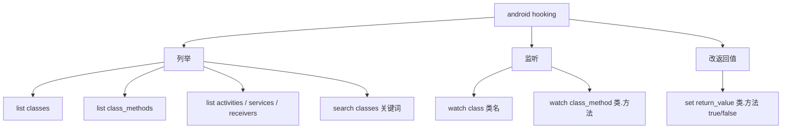
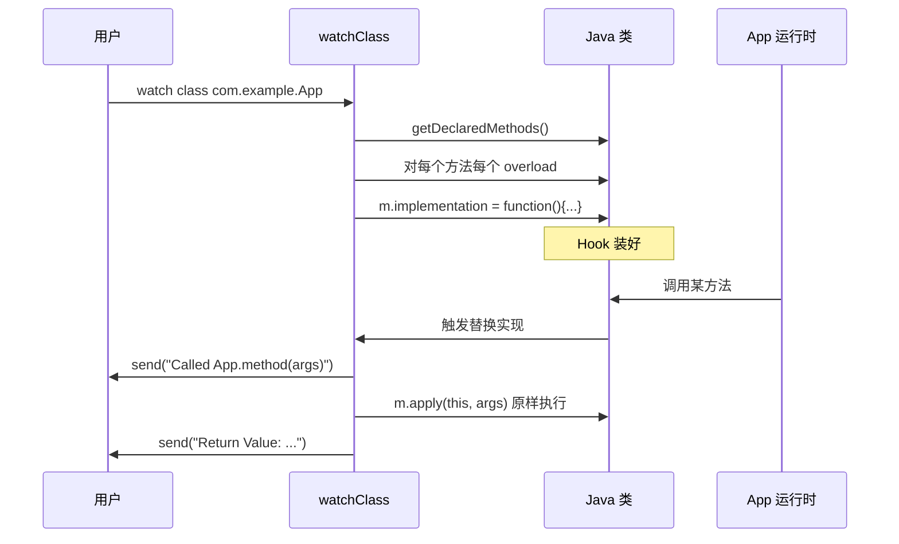
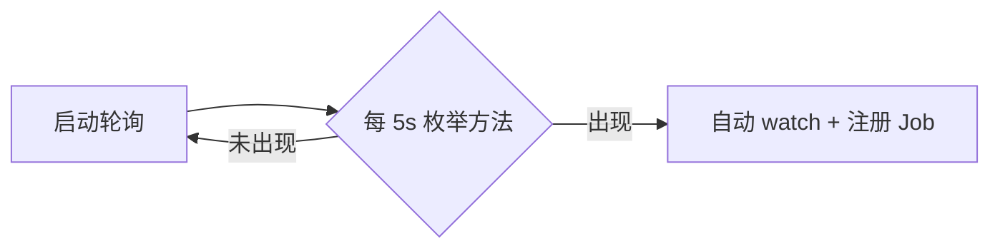

# 方法 Hook

Hook 是动态测试的核心能力：在不修改源码、不重打包的前提下，改变 App 方法的运行时行为。objection 把它做成了几个开箱即用的命令。

## 解决的问题

你想知道：

- 某方法被调用了吗？参数是什么？返回值是什么？谁调用的？
- 能不能强制让某方法返回 true / false，走特定分支？

静态分析答不了"运行时实际值"，Hook 才能答。

## 能力一览



## 列举

### 列出所有已加载的类

```text
android hooking list classes
```

实现（`agent/src/android/hooking.ts:42`）：

```ts
return Java.enumerateLoadedClassesSync();
```

::: warning 只列"已加载"的类
Java 是按需加载类的。App 启动早期，很多类还没加载，`list classes` 看不到。可以先用 `android hooking search classes 关键词` 触发加载，或等 App 多操作几下再列。
:::

### 列出某类的所有方法

```text
android hooking list class_methods com.example.Foo
```

实现（`hooking.ts:135`）：用反射拿 `getDeclaredMethods()`，转成可读签名。

### 搜索类

```text
android hooking search classes login
```

基于 `Java.enumerateMethods(query)`（`hooking.ts:124`），支持模式匹配。带 `!` 的查询被当作正则，否则当作类名模式包裹成 `*xxx*!*`。

## 监听（watch）

### watch 整个类

```text
android hooking watch class com.example.App
# 带参数与返回值
android hooking watch class com.example.App --dump-args --dump-return
# 带调用栈
android hooking watch class com.example.App --dump-backtrace
```

实现（`hooking.ts:296` `watchClass`）：遍历该类所有声明的方法，对每个方法的**每个重载**替换 `implementation`：



核心替换逻辑（`hooking.ts:366`）：

```ts
m.implementation = function () {
  send(`Called ${clazz}.${method}(${calleeArgTypes.join(", ")})`);
  if (dbt) send(/* 调用栈 */);
  if (dargs) send(/* 参数值 */);
  const retVal = m.apply(this, arguments);   // 原样调用原方法
  if (dret) send(`Return Value: ${retVal}`);
  return retVal;                              // 返回原值
};
```

注意 `m.apply(this, arguments)`——Hook 之后**仍然执行原方法**，只是顺便观察。这就是"监听"语义。

### watch 单个方法

```text
android hooking watch class_method com.example.App.login
# 指定某个重载（按参数类型过滤）
android hooking watch class_method com.example.App.login --dump-args
```

### 懒加载监听（lazy watch）

类还没加载？用 `notify`/`lazyWatchForPattern`（`hooking.ts:73`）：每 5 秒轮询一次 `Java.enumerateMethods`，一旦目标类出现就自动 Hook。



## 改返回值

```text
android hooking set return_value com.example.App.isRooted false
```

实现（`hooking.ts:535` `setReturnValue`）：Hook 方法，调用原方法拿到返回值后，**强制改写**成指定值：

```ts
m.implementation = function () {
  let retVal = m.apply(this, arguments);
  if (retVal !== newRet) {
    send(`Return value was not ${newRet}, setting to ${newRet}.`);
    retVal = newRet;   // 强制改写
  }
  return retVal;
};
```

典型用途：把 `isRooted()` / `isJailbroken()` / `isDebuggable()` 强制返回 `false`，绕过检测。

## 多 ClassLoader 支持

Android 插件化/热修复框架会用自定义 ClassLoader 加载类，默认 `Java.use` 找不到。objection 提供 `getClassHandle`（`hooking.ts:157`）遍历所有 ClassLoader 逐个尝试：

```ts
const loaders = Java.enumerateClassLoadersSync();
for (const loader of loaders) {
  const factory = Java.ClassFactory.get(loader);
  try { clazz = factory.use(className); break; } catch {}
}
```

## 关键细节

- **重载（overload）**：同名方法可能有多个参数不同的重载，Hook 时会遍历所有 `overloads`（`hooking.ts:359`），否则只 Hook 一个；
- **方法名解析**：`com.example.App.login` 这种全限定名用 `lastIndexOf('.')` 拆成类名 + 方法名（`hooking.ts:32`）；
- **Job 化**：每次 watch / set return_value 创建一个 Job，可撤销。

## 源码索引

| 内容 | 位置 |
| --- | --- |
| Python 命令 | `objection/commands/android/hooking.py` |
| RPC 注册 | `agent/src/rpc/android.ts:49` |
| 列类 | `agent/src/android/hooking.ts:42` |
| watch class | `agent/src/android/hooking.ts:296` |
| watch method 实现 | `agent/src/android/hooking.ts:342` |
| set return_value | `agent/src/android/hooking.ts:535` |
| 多 ClassLoader | `agent/src/android/hooking.ts:157` |
