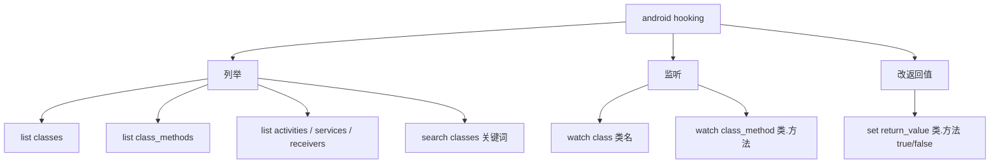
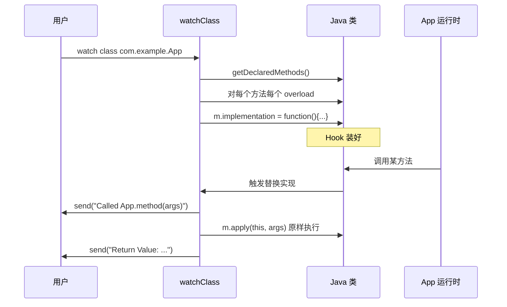
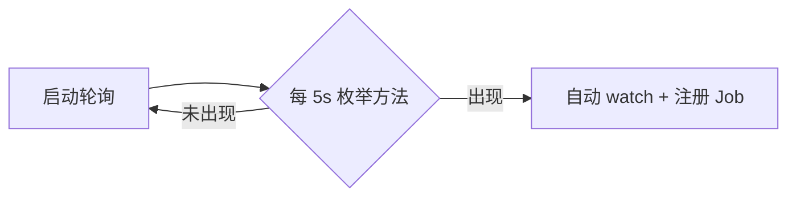
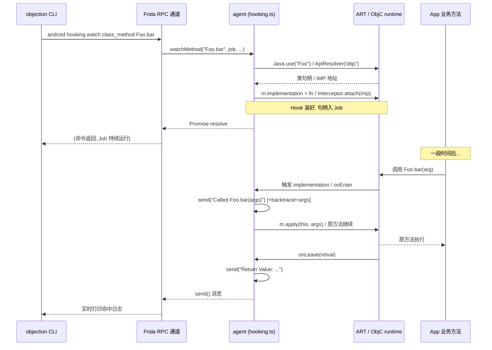

# 方法 Hook

Hook 是动态测试的核心能力：在不修改源码、不重打包的前提下，改变 App 方法的运行时行为。objection 把它做成了几个开箱即用的命令。

## 解决的问题

你想知道：

- 某方法被调用了吗？参数是什么？返回值是什么？谁调用的？
- 能不能强制让某方法返回 true / false，走特定分支？

静态分析答不了"运行时实际值"，Hook 才能答。

## 能力一览



## 列举

### 列出所有已加载的类

```text
android hooking list classes
```

实现（[`agent/src/android/hooking.ts:42`](https://github.com/android-security-engineer/objection-skills/blob/master/agent/src/android/hooking.ts#L42)）：

```ts
return Java.enumerateLoadedClassesSync();
```

::: warning 只列"已加载"的类
Java 是按需加载类的。App 启动早期，很多类还没加载，`list classes` 看不到。可以先用 `android hooking search classes 关键词` 触发加载，或等 App 多操作几下再列。
:::

### 列出某类的所有方法

```text
android hooking list class_methods com.example.Foo
```

实现（`hooking.ts:135`）：用反射拿 `getDeclaredMethods()`，转成可读签名。

### 搜索类

```text
android hooking search classes login
```

基于 `Java.enumerateMethods(query)`（`hooking.ts:124`），支持模式匹配。带 `!` 的查询被当作正则，否则当作类名模式包裹成 `*xxx*!*`。

## 监听（watch）

### watch 整个类

```text
android hooking watch class com.example.App
# 带参数与返回值
android hooking watch class com.example.App --dump-args --dump-return
# 带调用栈
android hooking watch class com.example.App --dump-backtrace
```

实现（`hooking.ts:296` `watchClass`）：遍历该类所有声明的方法，对每个方法的**每个重载**替换 `implementation`：



核心替换逻辑（`hooking.ts:366`）：

```ts
m.implementation = function () {
  send(`Called ${clazz}.${method}(${calleeArgTypes.join(", ")})`);
  if (dbt) send(/* 调用栈 */);
  if (dargs) send(/* 参数值 */);
  const retVal = m.apply(this, arguments);   // 原样调用原方法
  if (dret) send(`Return Value: ${retVal}`);
  return retVal;                              // 返回原值
};
```

注意 `m.apply(this, arguments)`——Hook 之后**仍然执行原方法**，只是顺便观察。这就是"监听"语义。

### watch 单个方法

```text
android hooking watch class_method com.example.App.login
# 指定某个重载（按参数类型过滤）
android hooking watch class_method com.example.App.login --dump-args
```

### 懒加载监听（lazy watch）

类还没加载？用 `notify`/`lazyWatchForPattern`（`hooking.ts:73`）：每 5 秒轮询一次 `Java.enumerateMethods`，一旦目标类出现就自动 Hook。



## 改返回值

```text
android hooking set return_value com.example.App.isRooted false
```

实现（`hooking.ts:535` `setReturnValue`）：Hook 方法，调用原方法拿到返回值后，**强制改写**成指定值：

```ts
m.implementation = function () {
  let retVal = m.apply(this, arguments);
  if (retVal !== newRet) {
    send(`Return value was not ${newRet}, setting to ${newRet}.`);
    retVal = newRet;   // 强制改写
  }
  return retVal;
};
```

典型用途：把 `isRooted()` / `isJailbroken()` / `isDebuggable()` 强制返回 `false`，绕过检测。

## 多 ClassLoader 支持

Android 插件化/热修复框架会用自定义 ClassLoader 加载类，默认 `Java.use` 找不到。objection 提供 `getClassHandle`（`hooking.ts:157`）遍历所有 ClassLoader 逐个尝试：

```ts
const loaders = Java.enumerateClassLoadersSync();
for (const loader of loaders) {
  const factory = Java.ClassFactory.get(loader);
  try { clazz = factory.use(className); break; } catch {}
}
```

## 关键细节

- **重载（overload）**：同名方法可能有多个参数不同的重载，Hook 时会遍历所有 `overloads`（`hooking.ts:359`），否则只 Hook 一个；
- **方法名解析**：`com.example.App.login` 这种全限定名用 `lastIndexOf('.')` 拆成类名 + 方法名（`hooking.ts:32`）；
- **Job 化**：每次 watch / set return_value 创建一个 Job，可撤销。

## 🔬 边界情况与失败模式

### 类未加载 vs 类不存在，两种静默

`watchClass` 与 `watchMethod` 都用 `isClassNotFoundError`（[`hooking.ts:27`](https://github.com/android-security-engineer/objection-skills/blob/master/agent/src/android/hooking.ts#L27)）判定异常栈里是否含 `java.lang.ClassNotFoundException`，是则静默 return。但两种"找不到"语义不同：

- **类还没加载**（懒加载）：类此刻不在 ClassTable，但稍后可能加载——这种静默会让 watch 看似成功却永远不触发。解法是改用 `lazyWatchForPattern`；
- **类名拼错/真不存在**：永远加载不了，静默等于吞错。

agent 不区分两者，需要用户根据日志判断（成功会打 `Watching clazz.method(...)`，失败无任何输出）。

### `lazyWatchForPattern` 的竞态

源码注释 `TODO: The javaEnumerate promise makes this racy. Figure it out one day.`（[`hooking.ts:106`](https://github.com/android-security-engineer/objection-skills/blob/master/agent/src/android/hooking.ts#L106)）点明已知缺陷：首次 `javaEnumerate` 的 Promise 与 5 秒 `setInterval` 之间无同步保障，极端情况下首次枚举返回慢于第一个 interval 触发，可能重复 watch。实际影响小（`found` 标志位会拦住二次注册），但 Job 计数可能偏高。

### `watchClass` 方法名清洗的脆弱性

`watchClass` 把 `Method.toGenericString()` 的输出（如 `public void android.widget.ScrollView.draw(android.graphics.Canvas) throws Exception`）通过一系列字符串切清洗成纯方法名（[`hooking.ts:308`](https://github.com/android-security-engineer/objection-skills/blob/master/agent/src/android/hooking.ts#L308)）：去泛型 `<...>`、去 `throws`、去前两个词（scope+返回类型）、去类名、取 `(` 之前。任何一步遇到非预期格式（如 Kotlin 编译产物的特殊签名）可能漏 Hook 或名错。这是为什么有时 `watch class` 报"Watching X"但方法实际没被替换。

### iOS `ApiResolver('objc')` 的多匹配警告

iOS `watchMethod` 用 `ApiResolver` 解析 selector，匹配数 >1 时只打 warning 但**仍只 attach 第一个**（[`ios/hooking.ts:101`](https://github.com/android-security-engineer/objection-skills/blob/master/agent/src/ios/hooking.ts#L101) + 注释 `TODO: loop correctly when globbing`）。带通配符的 selector（如 `*[*login* *]`）会命中多个方法，只 hook 第一个显然不全。要全 hook 用 `watch` 的 pattern 分支（它 `forEach` 遍历所有 match）。

### iOS selector 参数个数靠数冒号

iOS `onEnter` 里 `argumentCount = (selector.match(/:/g) || []).length`（[`ios/hooking.ts:122`](https://github.com/android-security-engineer/objection-skills/blob/master/agent/src/ios/hooking.ts#L122)）——ObjC selector 的参数个数等于冒号数。`args[position + 2]` 取参数值（前 2 个是 self + selector）。若 selector 写错（冒号数与实际不符），会读到错位的寄存器，dump 出来的是垃圾值而非真参数。

## 🔧 与底层 Frida/系统 API 的交互细节

### Android `implementation =` vs iOS `Interceptor.attach` 的本质差异

两端 watch 走的是完全不同的 Frida 机制：

- **Android**：`m.implementation = function(){}` 替换 ART 方法入口的艺术指针（ART method entry pointer）。Frida-java-bridge 在 ART 上把方法的 native entry 改指向 trampoline，回调里能直接用 `m.apply(this, arguments)` 调原实现（原指针已备份）。这是 **Java 层替换**，只对 Java/Kotlin 方法生效；
- **iOS**：`Interceptor.attach(matchedMethod.address, {onEnter, onLeave})` 是 **Native 层插桩**，在 IMP（方法实现的函数指针）地址上挂 trampoline。ObjC 方法本质是 C 函数（`objc_msgSend` 派发到 IMP），所以 attach 的是 IMP 地址。`onEnter`/`onLeave` 是插桩回调，不替换实现——原方法照常跑，只是在进出时被观测。

差异后果：Android watch 能改返回值（在 implementation 里直接 `return` 新值），iOS watch 只能观测（要改返回值得用 `setMethodReturn`，它在 `onLeave` 里 `retval.replace`）。

### `m.apply(this, arguments)` 的 `this` 与 `arguments`

Android watch 实现里 `m.apply(this, arguments)`（[`hooking.ts:394`](https://github.com/android-security-engineer/objection-skills/blob/master/agent/src/android/hooking.ts#L394)）：

- `this` 是被 Hook 方法的 receiver（实例方法时是对象实例，静态方法时是类）；
- `arguments` 是 JS 的类数组对象，Frida 把 Java 参数已转成 JS 可用的句柄。

用 `.apply` 而非 `.call` 是因为参数个数不固定（不同 overload）。注意：若原方法抛异常，会原样向上抛——Hook 不会吞异常，App 行为不变。

### `Thread.backtrace(this.context, Backtracer.ACCURATE)`

iOS `--dump-backtrace` 用 `Backtracer.ACCURATE`（[`ios/hooking.ts:135`](https://github.com/android-security-engineer/objection-skills/blob/master/agent/src/ios/hooking.ts#L135)）。Frida 有两种回溯器：

- `ACCURATE`：依赖 DWARF 调试信息，准确但慢，且需要符号；
- `FUZZY`：靠栈帧指针启发式回溯，快但可能漏帧。

iOS 用 ACCURATE 是因为符号通常齐全。Android 侧用 `Throwable().getStackTrace()`（[`hooking.ts:376`](https://github.com/android-security-engineer/objection-skills/blob/master/agent/src/android/hooking.ts#L376)）走 Java 异常栈，是 JVM 原生能力，比 Native backtrace 更准。

### `getClassHandle` 的 `Java.ClassFactory.get(loader)`

多 ClassLoader 支持（[`hooking.ts:157`](https://github.com/android-security-engineer/objection-skills/blob/master/agent/src/android/hooking.ts#L157)）：`Java.use` 默认用 bootstrap ClassLoader，找不到插件框架加载的类。`Java.enumerateClassLoadersSync()` 列出所有 ClassLoader，对每个 `Java.ClassFactory.get(loader).use(name)` 尝试——每个 ClassLoader 有独立 ClassFactory，缓存在 Frida 的 `classFactories` map。找到即 break，保证用最小开销定位。

## ⚡ 性能与并发考量

- **`watch class` 一次性装大量 Hook**：一个有 50 个方法的类，watch 整类会装 50×（每个 overload）个 `implementation` 替换。每个方法每次调用都进 JS 回调，高频方法（如 `View.draw`）会让 App 帧率暴跌。生产测试建议用 `watch class_method` 精确到方法；
- **`--dump-backtrace` 是性能重锤**：每次命中都 `Throwable().getStackTrace()` 或 `Thread.backtrace()`，前者要填栈异常对象、后者要读 DWARF。开这个开关相当于每次命中 +10ms 量级开销；
- **`--dump-args` 的 `(h || "(none)").toString()`**：对每个参数调 toString，若参数是巨型对象（如 Bitmap）会触发昂贵的 Java->JS 桥接序列化，甚至 OOM；
- **iOS `ApiResolver('objc')` 的 enumerate 成本**：每次 `watch`/`search` 都全量遍历 ObjC runtime 的类与方法表，大 App（几万 selector）单次枚举数百毫秒。`watchClass` 用 `$ownMethods` 避免了枚举，只 watch 类自身方法，更快；
- **Job identifier 与多 watch 共存**：每次 watch 起独立 Job，日志带 `[N]`。多个 watch 同时命中同一方法时（不同 Job 都 hook 了它），Frida 的 hook 链是 LIFO 栈式调用——后装的先执行 onEnter，后执行 onLeave。日志顺序会交错，靠 `[N]` 区分。

## 📊 watch 命令从 CLI 到 Hook 触发的完整时序



## 📊 lazy watch 轮询状态机

```mermaid
stateDiagram-v2
    [*] --> InitialCheck: 启动 lazyWatchForPattern
    InitialCheck --> AlreadyLoaded: javaEnumerate 首次返回非空
    InitialCheck --> Polling: 首次返回空
    AlreadyLoaded --> Watching: watchMatches + jobs.add
    AlreadyLoaded --> [*]
    Polling --> Polling: setInterval 每 5s 再枚举, 仍空
    Polling --> Found: 枚举返回非空
    Found --> Watching: watchMatches + jobs.add
    Found --> Stopped: clearInterval
    Watching --> [*]
    Note right of Polling: 已知竞态: 首次 Promise 与 interval 不同步
```

## 🧱 Android vs iOS Hook 的内存/调用栈布局对比

```text
        Android (Java 层 implementation 替换)          iOS (Native Interceptor.attach)
+-------------------------------------------+   +-------------------------------------------+
| App 调用 foo.bar(arg)                     |   | App 调用 [Foo bar:arg]                    |
|   -> objc_msgSend? 否, 走 ART entry       |   |   -> objc_msgSend(receiver, sel, arg)     |
+---------------------+---------------------+   +---------------------+---------------------+
                      |                                             |
                      v                                             v
+-------------------------------------------+   +-------------------------------------------+
| ART Method Entry (art_method)             |   | IMP (函数指针, 实现 -[Foo bar:])          |
|   [原 entry 已被 Frida 改指向 trampoline] |   |   [Frida 在此地址插 Interceptor trampoline]|
+---------------------+---------------------+   +---------------------+---------------------+
                      |                                             |
                      v                                             v
+-------------------------------------------+   +-------------------------------------------+
| Frida-java-bridge trampoline              |   | Frida Interceptor trampoline             |
|   -> 调 JS implementation(this, args)     |   |   onEnter(args)  <-- 可读 self/sel/参数   |
|   <- m.apply(this, arguments) 调原 entry  |   |   原方法执行 (未替换)                      |
|   -> return retVal (可改写!)              |   |   onLeave(retval) <-- 可 retval.replace   |
+---------------------+---------------------+   +---------------------+---------------------+
                      |                                             |
                      v                                             v
+-------------------------------------------+   +-------------------------------------------+
| 原 ART entry (备份指针) 执行真实方法体     |   | 真实 IMP 函数体执行                       |
+-------------------------------------------+   +-------------------------------------------+

差异: Android 整个替换实现(可改返回值/不调原方法);
      iOS 仅插桩观测(原方法必跑, 改返回值靠 onLeave.replace)
```

## 源码索引

| 内容 | 位置 |
| --- | --- |
| Python 命令 | `objection/commands/android/hooking.py` |
| RPC 注册 | [`agent/src/rpc/android.ts:49`](https://github.com/android-security-engineer/objection-skills/blob/master/agent/src/rpc/android.ts#L49) |
| 列类 | [`agent/src/android/hooking.ts:42`](https://github.com/android-security-engineer/objection-skills/blob/master/agent/src/android/hooking.ts#L42) |
| watch class | [`agent/src/android/hooking.ts:296`](https://github.com/android-security-engineer/objection-skills/blob/master/agent/src/android/hooking.ts#L296) |
| watch method 实现 | [`agent/src/android/hooking.ts:342`](https://github.com/android-security-engineer/objection-skills/blob/master/agent/src/android/hooking.ts#L342) |
| set return_value | [`agent/src/android/hooking.ts:535`](https://github.com/android-security-engineer/objection-skills/blob/master/agent/src/android/hooking.ts#L535) |
| 多 ClassLoader | [`agent/src/android/hooking.ts:157`](https://github.com/android-security-engineer/objection-skills/blob/master/agent/src/android/hooking.ts#L157) |
