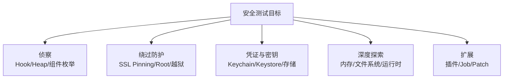

# 🎯 功能详解

本分区按**安全测试场景**组织，每个主题讲清"解决什么问题、怎么用、背后原理"。这是面向使用者的学习路径——想按代码模块查则看 [源码模块文档](/reference/)。

## 🗺️ 功能地图

## 📂 文档清单

### 🤖 Android

| 文档 | 场景 |
| --- | --- |
| [SSL Pinning 绕过](/features/android-ssl-pinning) | 抓 HTTPS 流量 |
| [Root 检测绕过](/features/root-jailbreak-detection) | 绕过 root 检测 |
| [方法 Hook](/features/hooking) | 监听/改写方法调用 |
| [Keystore 监控](/features/android-keystore) | 提取与监控密钥 |
| [堆搜索与操作](/features/heap) | 搜实例、调方法 |
| [运行时监控](/features/android-runtime-monitoring) | 监控剪贴板/Intent 等 |
| [APK Patch](/features/patcher) | 免 root 植入 Gadget |

### 🍎 iOS

| 文档 | 场景 |
| --- | --- |
| [Keychain Dump](/features/ios-keychain) | dump 钥匙串 |
| [本地存储取证](/features/ios-local-storage) | NSUserDefaults/cookies/plist |

### 🛠️ 通用

| 文档 | 场景 |
| --- | --- |
| [内存 Dump/Patch](/features/memory) | dump/搜索/改写内存 |
| [文件系统](/features/filesystem) | 浏览/上传/下载文件 |
| [运行时操作命令](/features/runtime-commands) | UI/HTTP/SQLite/Intent 等 |
| [插件系统](/features/plugins) | 扩展 objection |
| [Jobs 任务](/features/jobs) | 管理后台 Hook 任务 |

## 🔗 相关文档

- [指南](/guide/what-is-objection)
- [源码模块文档](/reference/)
- [命令速查](/reference/cli/)
