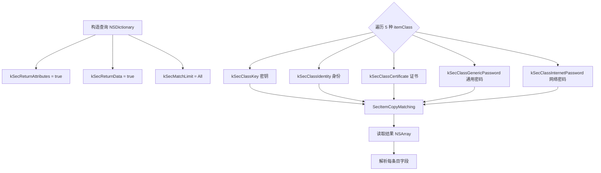
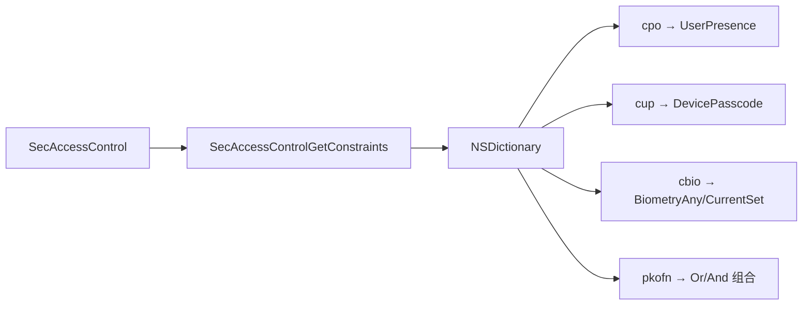
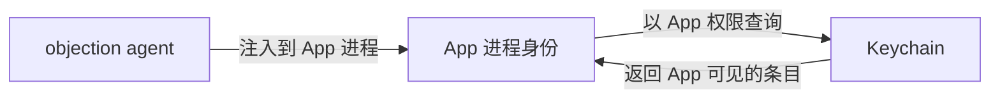

# iOS Keychain Dump

iOS Keychain（钥匙串）是 App 存储敏感凭证（token、密码、证书）的加密仓库。objection 能把它整个 dump 出来。

## 解决的问题

iOS App 把用户凭证存在 Keychain 里——它跨 App 隔离、由系统加密保护，普通方式读不到。渗透测试时，你需要看到 App 到底存了哪些凭证、明文是什么、保护级别如何。

## 用法

```text
# dump 整个 keychain
ios keychain dump

# 智能解码（尝试把二进制数据转成可读形式）
ios keychain dump --smart-decode

# 清空 keychain（慎用）
ios keychain clear
```

## 实现原理

关键文件：`agent/src/ios/keychain.ts`。核心是调用 Security 框架的 C 函数 `SecItemCopyMatching`，这是 Apple 官方查询 Keychain 的 API。



### 构造查询

`keychain.ts:39` `enumerateKeychain()` 构造一个 `NSMutableDictionary` 查询，要求返回所有条目的属性和数据：

```ts
const searchDictionary = ObjC.classes.NSMutableDictionary.alloc().init();
searchDictionary.setObject_forKey_(kCFBooleanTrue, kSec.kSecReturnAttributes);
searchDictionary.setObject_forKey_(kCFBooleanTrue, kSec.kSecReturnData);
searchDictionary.setObject_forKey_(kSec.kSecMatchLimitAll, kSec.kSecMatchLimit);
searchDictionary.setObject_forKey_(kSec.kSecAttrSynchronizableAny, kSec.kSecAttrSynchronizable);
```

### 遍历 5 种 itemClass

Keychain 条目分 5 类，逐类查询（`keychain.ts:29`）：

```ts
const itemClasses = [
  kSec.kSecClassKey, kSec.kSecClassIdentity, kSec.kSecClassCertificate,
  kSec.kSecClassGenericPassword, kSec.kSecClassInternetPassword,
];
```

对每类，设置 `kSecClass` 后调用 `SecItemCopyMatching`（`keychain.ts:92`）：

```ts
const resultsPointer = Memory.alloc(Process.pointerSize);
const copyResult = libObjc.SecItemCopyMatching(searchDictionary, resultsPointer);
if (copyResult.isNull()) { /* 0 = errSecSuccess，读结果 */ }
```

`Memory.alloc(Process.pointerSize)` 分配一个指针用于接收结果，`copyResult.isNull()` 表示返回 `errSecSuccess`（0）。

### 解析字段

`keychain.ts:130` `list()` 把每个条目解析成结构化字段：

| 字段 | 来源 | 含义 |
| --- | --- | --- |
| `account` | kSecAttrAccount | 账号 |
| `service` | kSecAttrService | 服务名 |
| `data` | kSecValueData | **凭证明文** |
| `dataHex` | kSecValueData | 凭证的十六进制 |
| `accessible_attribute` | kSecAttrAccessible | 何时可访问（如解锁后） |
| `access_control` | kSecAttrAccessControl | ACL（生物识别等约束） |
| `entitlement_group` | kSecAttrAccessGroup | 所属访问组 |
| `create_date` / `modification_date` | kSecAttrCreation/ModificationDate | 时间戳 |

`bytesToUTF8` 把 `NSData` 转 UTF-8 字符串；`--smart-decode` 用 `smartDataToString` 对非文本数据做智能转换。

### ACL 解码（亮点）

`keychain.ts:238` `decodeAcl()` 调用**未公开**的 `SecAccessControlGetConstraints`，把访问控制约束翻译成人话：



这能告诉你某条凭证是否要求指纹/面容/锁屏才能访问——安全评估的关键信息。

## 关键细节

### 为什么能跨 App 读

Keychain 默认按 `accessGroup` 隔离，但 objection 注入到目标 App 进程内，**以该 App 的身份**调用 `SecItemCopyMatching`，所以读到的是该 App 有权访问的所有条目（包括共享组的）。



### 写入与删除

除了 dump，还提供 `add` / `update` / `remove` / `empty`（`keychain.ts:166` 起），底层调用 `SecItemAdd` / `SecItemUpdate` / `SecItemDelete`——可用于伪造或清除凭证。

### 限制

- **iOS 沙盒**：只能读当前 App 可见的条目，读不到其他 App 私有的（除非同 accessGroup）；
- **数据保护级别**：若条目设为 `kSecAttrAccessibleWhenUnlockedThisDeviceOnly` 且设备锁屏，可能读不到明文；
- **Secure Enclave 里的密钥**：私钥不可导出，`data` 显示 `(Key data not displayed)`（`keychain.ts:143`）。

## 源码索引

| 内容 | 位置 |
| --- | --- |
| Python 命令 | `objection/commands/ios/keychain.py` |
| RPC 注册 | `agent/src/rpc/ios.ts` |
| 枚举主逻辑 | `agent/src/ios/keychain.ts:39` |
| 5 种 itemClass | `agent/src/ios/keychain.ts:29` |
| 字段解析 | `agent/src/ios/keychain.ts:130` |
| ACL 解码 | `agent/src/ios/keychain.ts:238` |
