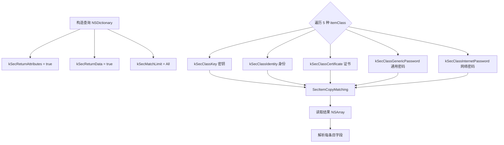
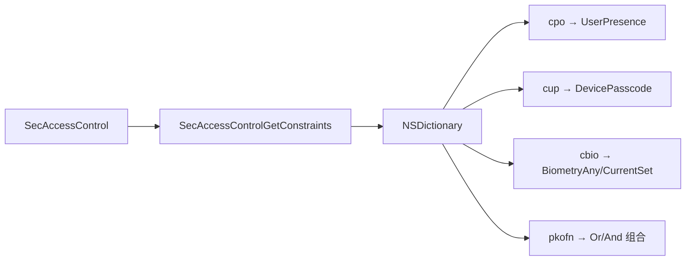
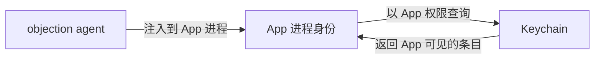
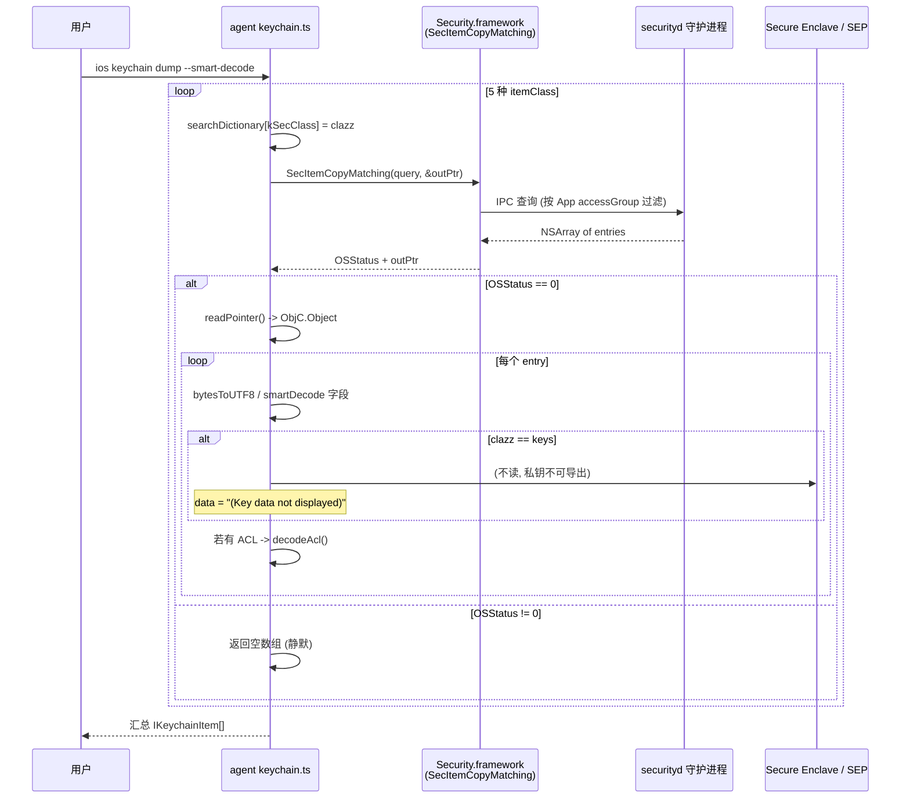
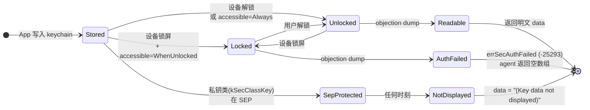

# iOS Keychain Dump

iOS Keychain（钥匙串）是 App 存储敏感凭证（token、密码、证书）的加密仓库。objection 能把它整个 dump 出来。

## 解决的问题

iOS App 把用户凭证存在 Keychain 里——它跨 App 隔离、由系统加密保护，普通方式读不到。渗透测试时，你需要看到 App 到底存了哪些凭证、明文是什么、保护级别如何。

## 用法

```text
# dump 整个 keychain
ios keychain dump

# 智能解码（尝试把二进制数据转成可读形式）
ios keychain dump --smart-decode

# 清空 keychain（慎用）
ios keychain clear
```

## 实现原理

关键文件：`agent/src/ios/keychain.ts`。核心是调用 Security 框架的 C 函数 `SecItemCopyMatching`，这是 Apple 官方查询 Keychain 的 API。



### 构造查询

`keychain.ts:39` `enumerateKeychain()` 构造一个 `NSMutableDictionary` 查询，要求返回所有条目的属性和数据：

```ts
const searchDictionary = ObjC.classes.NSMutableDictionary.alloc().init();
searchDictionary.setObject_forKey_(kCFBooleanTrue, kSec.kSecReturnAttributes);
searchDictionary.setObject_forKey_(kCFBooleanTrue, kSec.kSecReturnData);
searchDictionary.setObject_forKey_(kSec.kSecMatchLimitAll, kSec.kSecMatchLimit);
searchDictionary.setObject_forKey_(kSec.kSecAttrSynchronizableAny, kSec.kSecAttrSynchronizable);
```

### 遍历 5 种 itemClass

Keychain 条目分 5 类，逐类查询（`keychain.ts:29`）：

```ts
const itemClasses = [
  kSec.kSecClassKey, kSec.kSecClassIdentity, kSec.kSecClassCertificate,
  kSec.kSecClassGenericPassword, kSec.kSecClassInternetPassword,
];
```

对每类，设置 `kSecClass` 后调用 `SecItemCopyMatching`（`keychain.ts:92`）：

```ts
const resultsPointer = Memory.alloc(Process.pointerSize);
const copyResult = libObjc.SecItemCopyMatching(searchDictionary, resultsPointer);
if (copyResult.isNull()) { /* 0 = errSecSuccess，读结果 */ }
```

`Memory.alloc(Process.pointerSize)` 分配一个指针用于接收结果，`copyResult.isNull()` 表示返回 `errSecSuccess`（0）。

### 解析字段

`keychain.ts:130` `list()` 把每个条目解析成结构化字段：

| 字段 | 来源 | 含义 |
| --- | --- | --- |
| `account` | kSecAttrAccount | 账号 |
| `service` | kSecAttrService | 服务名 |
| `data` | kSecValueData | **凭证明文** |
| `dataHex` | kSecValueData | 凭证的十六进制 |
| `accessible_attribute` | kSecAttrAccessible | 何时可访问（如解锁后） |
| `access_control` | kSecAttrAccessControl | ACL（生物识别等约束） |
| `entitlement_group` | kSecAttrAccessGroup | 所属访问组 |
| `create_date` / `modification_date` | kSecAttrCreation/ModificationDate | 时间戳 |

`bytesToUTF8` 把 `NSData` 转 UTF-8 字符串；`--smart-decode` 用 `smartDataToString` 对非文本数据做智能转换。

### ACL 解码（亮点）

`keychain.ts:238` `decodeAcl()` 调用**未公开**的 `SecAccessControlGetConstraints`，把访问控制约束翻译成人话：



这能告诉你某条凭证是否要求指纹/面容/锁屏才能访问——安全评估的关键信息。

## 关键细节

### 为什么能跨 App 读

Keychain 默认按 `accessGroup` 隔离，但 objection 注入到目标 App 进程内，**以该 App 的身份**调用 `SecItemCopyMatching`，所以读到的是该 App 有权访问的所有条目（包括共享组的）。



### 写入与删除

除了 dump，还提供 `add` / `update` / `remove` / `empty`（`keychain.ts:166` 起），底层调用 `SecItemAdd` / `SecItemUpdate` / `SecItemDelete`——可用于伪造或清除凭证。

### 限制

- **iOS 沙盒**：只能读当前 App 可见的条目，读不到其他 App 私有的（除非同 accessGroup）；
- **数据保护级别**：若条目设为 `kSecAttrAccessibleWhenUnlockedThisDeviceOnly` 且设备锁屏，可能读不到明文；
- **Secure Enclave 里的密钥**：私钥不可导出，`data` 显示 `(Key data not displayed)`（`keychain.ts:143`）。

## 🔬 边界情况与失败模式

### `kCFBooleanTrue` 必须用 `__NSCFBoolean`

`enumerateKeychain` 用 `ObjC.classes.__NSCFBoolean.numberWithBool_(true)` 构造查询里的 `kCFBooleanTrue`（[`keychain.ts:75`](https://github.com/android-security-engineer/objection-skills/blob/master/agent/src/ios/keychain.ts#L75)），而不是直接传 JS `true` 或 `NSNumber.numberWithBool_`。原因见代码注释 `http://nshipster.com/bool/`：CoreFoundation 的 `SecItemCopyMatching` 用 `CFBooleanRef`，而 `NSNumber` 桥接的实例类簇（`__NSCFBoolean`）才能被正确识别为 CFBoolean。用错类型会导致查询条件被忽略，返回空结果或全部条目。

### `SecItemCopyMatching` 返回值是 OSStatus，不是指针

代码 `const copyResult = libObjc.SecItemCopyMatching(searchDictionary, resultsPointer)`（[`keychain.ts:92`](https://github.com/android-security-engineer/objection-skills/blob/master/agent/src/ios/keychain.ts#L92)），`copyResult` 是 `OSStatus`（实际上 Frida 把返回的 int 当 NativePointer 返回）。`copyResult.isNull()` 即 OSStatus==0 == `errSecSuccess`。常见非零返回：

- `errSecItemNotFound` (-25300)：该 itemClass 无条目，正常现象；
- `errSecMissingEntitlement` (-34018)：App 缺 keychain-access-groups entitlement，越狱/重签的 App 常见；
- `errSecAuthFailed` (-25293)：条目被数据保护锁住（设备锁屏 + WhenUnlocked 此刻读不到）。

非零时 agent 直接 `return data`（空数组），不区分错误码——用户看到的是"某类无条目"，实际可能是权限/锁屏导致。

### `searchResults.length <= 0` 的快速失败

拿到结果 NSDictionary 后 `if (searchResults.length <= 0) { return data; }`（[`keychain.ts:102`](https://github.com/android-security-engineer/objection-skills/blob/master/agent/src/ios/keychain.ts#L102)）跳过空结果。但 `kSecMatchLimitAll` 模式下无条目应返回 nil（`resultsPointer.readPointer()` 为 0），构造 `ObjC.Object(0)` 会是僵尸对象——`length` 访问可能崩。代码靠 OSStatus 非 0 时提前 return 规避了 nil 情形，但理论上 `errSecSuccess` + nil 仍可能触发。

### `(Key data not displayed)` 的硬编码跳过

`list` 里 `data: (clazz !== "keys") ? ... : "(Key data not displayed)"`（[`keychain.ts:143`](https://github.com/android-security-engineer/objection-skills/blob/master/agent/src/ios/keychain.ts#L143)）。`clazz === "keys"` 即 `kSecClassKey`——密钥类条目，私钥材料受 Secure Enclave / SEP 保护不可导出。agent 不读 `kSecValueData` 而是直接返回占位串。注意 `dataHex` 字段（`:148`）仍然调 `bytesToHexString`，对 keys 类可能返回空 hex 或垃圾——读 `dataHex` 时要结合 item_class 判断。

### `decodeAcl` 依赖未公开 API

`decodeAcl` 调 `SecAccessControlGetConstraints`（[`keychain.ts:240`](https://github.com/android-security-engineer/objection-skills/blob/master/agent/src/ios/keychain.ts#L240)），这是 Apple **未公开**的 Security 框架函数，不在公开头文件里。Frida 通过 `libObjc.SecAccessControlGetConstraints` 直接按符号地址调。后果：

- 该符号在不同 iOS 版本可能改名/移除，调用会 `undefined` 报错；
- 返回的 NSDictionary 结构（`dacl`/`osgn`/`od`/`prp` 键、`cpo`/`cup`/`cbio`/`pkofn` 子键）是 Apple 内部表示，无文档，全靠逆向得出——iOS 版本变化可能导致新键不被识别（落入 `default: break` 静默跳过）。

### `add` 不设 `accessible` 属性

`add`（[`keychain.ts:211`](https://github.com/android-security-engineer/objection-skills/blob/master/agent/src/ios/keychain.ts#L211)）构造的 itemDict 只设了 class/account/service/data，没设 `kSecAttrAccessible`。默认会落到 `kSecAttrAccessibleWhenUnlocked`，意味着设备锁屏后读不到。要写入更高保护级别（如 `WhenUnlockedThisDeviceOnly`）或带 ACL（生物识别约束）的条目，`add` 不支持，需自己扩展。

## 🔧 与底层 Frida/系统 API 的交互细节

### `Memory.alloc(Process.pointerSize)` 的 out-parameter 约定

`SecItemCopyMatching` 是 C 函数，签名 `OSStatus SecItemCopyMatching(CFDictionaryRef query, CFTypeRef *result)`——`result` 是**出参指针**。Frida 调 C 函数没法直接拿到 out-param，所以 agent 用 `Memory.alloc(Process.pointerSize)` 在进程堆上分配一个指针大小的内存（[`keychain.ts:91`](https://github.com/android-security-engineer/objection-skills/blob/master/agent/src/ios/keychain.ts#L91)），把它的地址传给函数，函数返回后 `resultsPointer.readPointer()` 读出被写入的真实结果指针。这是 Frida 调带 out-param 的 C API 的标准模式。`Process.pointerSize` 保证 64 位进程上分配 8 字节、32 位 4 字节。

### `libObjc` 与 Security 框架符号

`libObjc.SecItemCopyMatching` / `libObjc.SecItemAdd` / `libObjc.SecItemUpdate` / `libObjc.SecItemDelete` / `libObjc.SecAccessControlGetConstraints`（[`keychain.ts:92`](https://github.com/android-security-engineer/objection-skills/blob/master/agent/src/ios/keychain.ts#L92) 等）——这些是 agent 的 `libObjc` 封装（`agent/src/ios/lib/libobjc.js`），通过 `Module.findExportByName` 在 `Security.framework` 里定位符号地址。Frida 的 `NativeFunction` 包装这些地址成可调用的 JS 函数，调用时按 C ABI 传参。

### `__bridge` 转换的 Frida 等价

注释里的 ObjC 示例用 `(__bridge id)kCFBooleanTrue` 桥接 CF 与 ObjC（[`keychain.ts:42`](https://github.com/android-security-engineer/objection-skills/blob/master/agent/src/ios/keychain.ts#L42) 区块）。Frida 里不存在 bridge 问题——`ObjC.Object` 与 CFType 都是 JS 包装的 native pointer，`NSMutableDictionary` 的 `setObject:forKey:` 直接接收任意 pointer，无需 bridge cast。

### `kSec` 常量字典

`kSec.kSecClassKey` 等常量来自 `./lib/constants.js`（[`keychain.ts:7`](https://github.com/android-security-engineer/objection-skills/blob/master/agent/src/ios/keychain.ts#L7)）。这些是 Apple Security 框架的 CFString 常量指针（如 `kSecClass` == `CFSTR("class")` 的地址），agent 在初始化时从 framework 导出表查到地址缓存。`reverseEnumLookup(kSec, clazz)` 反查常量名（`keychain.ts:135`）用于把返回的 class 常量转回可读字符串。

## ⚡ 性能与并发考量

- **5 次 `SecItemCopyMatching` 调用串行**：`itemClasses.map(...)` 同步遍历，每次查询都是 IPC 到 `securityd` 守护进程。条目多的 App（几百条）单次 `dump` 可能数百 ms；
- **`kSecMatchLimitAll` 一次取全量**：不分页、不延迟加载，所有条目的 `kSecValueData`（明文）一次性读进内存。条目极多 + 数据大时，agent 进程内存占用飙升；
- **`decodeAcl` 对每条带 ACL 的条目调一次未公开 API**：`SecAccessControlGetConstraints` 内部遍历约束字典，单次轻，但条目多时累计；
- **`smartDecode` 的额外解码开销**：`smartDataToString` 对每条 data 尝试多种解码（UTF-8、plist、base64 等），命中多条时 CPU 开销显著高于纯 `bytesToUTF8`；
- **`empty` 不返回结果、不确认**：`SecItemDelete` 对每类调一次（[`keychain.ts:173`](https://github.com/android-security-engineer/objection-skills/blob/master/agent/src/ios/keychain.ts#L173)），全量删除该 App 可见的条目，无回滚。误操作会清掉 App 的全部凭证。

## 📊 keychain dump 查询时序



## 📊 凭证可读性状态机（受数据保护影响）



## 🧱 SecItemCopyMatching 的 out-parameter 内存布局

```text
  Memory.alloc(Process.pointerSize)  在 agent 进程堆分配 8 字节 (64位)
  +-------------------+
  | 0x???????0  <-- resultsPointer (alloc 返回的地址)
  +-------------------+
  |  0x00000000...    |  初始未写入, 全 0
  +-------------------+
          |
          |  传给 SecItemCopyMatching(query, resultsPointer) 作为第2参数
          v
  +---------------------------------------------------+
  | Security.framework::SecItemCopyMatching           |
  |   内部查询后, 把结果 NSArray 的指针写入 *resultsPtr |
  +---------------------------------------------------+
          |
          v  返回后
  +-------------------+
  | 0x???????0  <-- resultsPointer
  +-------------------+
  |  0x1a2b3c4d...    |  <-- resultsPointer.readPointer() 读出
  +-------------------+       这是真正的 CFTypeRef (NSArray)
          |
          v
  new ObjC.Object(0x1a2b3c4d...)  包装成 ObjC 对象
  +---------------------------------------------------+
  | NSArray: [ {account:.., service:.., data:..},     |
  |            {...}, ... ]                            |
  +---------------------------------------------------+

  关键: copyResult (OSStatus) 与 resultsPointer 是两个独立通道:
    - copyResult.isNull() == true  => errSecSuccess, 结果在 outPtr
    - copyResult 非零              => 错误, outPtr 不应被读
```

## 源码索引

| 内容 | 位置 |
| --- | --- |
| Python 命令 | `objection/commands/ios/keychain.py` |
| RPC 注册 | `agent/src/rpc/ios.ts` |
| 枚举主逻辑 | [`agent/src/ios/keychain.ts:39`](https://github.com/android-security-engineer/objection-skills/blob/master/agent/src/ios/keychain.ts#L39) |
| 5 种 itemClass | [`agent/src/ios/keychain.ts:29`](https://github.com/android-security-engineer/objection-skills/blob/master/agent/src/ios/keychain.ts#L29) |
| 字段解析 | [`agent/src/ios/keychain.ts:130`](https://github.com/android-security-engineer/objection-skills/blob/master/agent/src/ios/keychain.ts#L130) |
| ACL 解码 | [`agent/src/ios/keychain.ts:238`](https://github.com/android-security-engineer/objection-skills/blob/master/agent/src/ios/keychain.ts#L238) |
