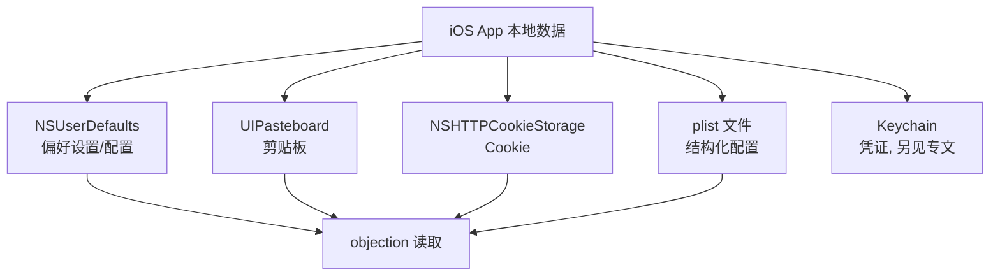
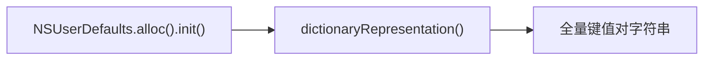
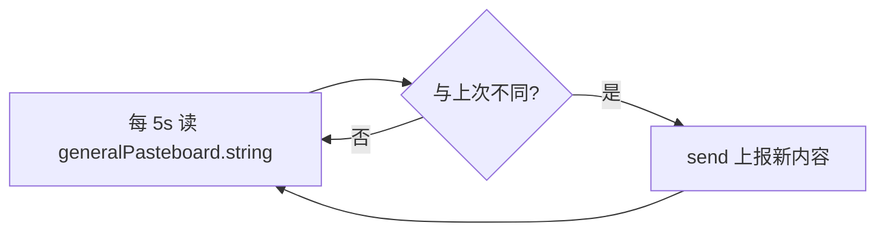

# iOS 本地存储取证

App 把大量数据留在本地——配置、token、剪贴板、Cookie、plist。这些是取证与安全评估的金矿。objection 提供一组命令把 iOS 的本地存储读出来。

## 解决的问题

iOS App 的敏感数据散落在多个存储机制里：



它们各有系统 API 保护，普通方式读不到。objection 注入后以 App 身份调用这些 API，把数据 dump 出来。

## 用法

```text
# NSUserDefaults 全量
ios nsuserdefaults get

# 剪贴板内容
ios pasteboard monitor

# Cookie
ios cookies get

# plist 文件（解析成可读结构）
ios plist cat <文件路径>
```

## 各存储机制原理

### NSUserDefaults

`agent/src/ios/nsuserdefaults.ts`。NSUserDefaults 是 iOS 的轻量偏好存储（设置项、登录态、开关）。读取很简单——调 `dictionaryRepresentation` 拿到全部键值：

```ts
const defaults = ObjC.classes.NSUserDefaults;
const data = defaults.alloc().init().dictionaryRepresentation();
return data.toString();
```



### UIPasteboard（剪贴板）

`agent/src/ios/pasteboard.ts`。iOS 剪贴板是全局共享的——用户复制的密码、token 都可能暂存于此。`monitor` 每 5 秒轮询一次剪贴板内容，变化时上报：

```ts
const Pasteboard = ObjC.classes.UIPasteboard.generalPasteboard();
let data = "";
setInterval(() => {
  const currentString = Pasteboard.string().toString();
  if (currentString === data) return;   // 内容没变就跳过
  data = currentString;
  send(`[pasteboard-monitor] Data: ${data}`);
}, 1000 * 5);
```



::: warning 安全含义
剪贴板监控能抓到用户复制的敏感内容；反过来，这也提示开发者不应让敏感数据进剪贴板（或用 `expirationDate` 设过期）。
:::

### NSHTTPCookieStorage

`agent/src/ios/...`（cookies 命令）。Cookie 存在 `NSHTTPCookieStorage` / `NSURLCredentialStorage`，objection 调 API 枚举出来——会话 Cookie、认证凭证都在这里。

### plist

`agent/src/ios/plist.ts`。plist 是 iOS/macOS 的标准配置格式（XML 或二进制）。`ios plist cat` 把指定 plist 文件解析成可读结构返回，用于读取 App 的配置、 entitlements、Info.plist 等。

## 与 Keychain 的关系

Keychain 是单独的加密存储（[Keychain Dump](/features/ios-keychain) 已专文介绍）。本页覆盖的是**非加密**的本地存储。两者常配合：Keychain 存核心凭证，NSUserDefaults/plist 存配置，剪贴板存临时数据——全 dump 一遍才能完整还原 App 的本地数据面。

## 关键细节

- **以 App 身份**：所有读取都在 App 进程内，受 App 沙盒与权限约束，只能读 App 可见的数据；
- **剪贴板全局性**：UIPasteboard 是跨 App 的，监控能抓到其他 App 复制的内容（在被监控 App 处于前台时）；
- **轮询而非 Hook**：pasteboard 用 `setInterval` 轮询而非 Hook，因为它没有"内容变化"的回调 API；
- **二进制 plist**：`plist cat` 能解析二进制 plist（`NSPropertyListSerialization`），不限于 XML。

## 源码索引

| 内容 | 位置 |
| --- | --- |
| NSUserDefaults | `agent/src/ios/nsuserdefaults.ts` |
| Pasteboard | `agent/src/ios/pasteboard.ts` |
| Cookies | `objection/commands/ios/cookies.py` |
| plist | `agent/src/ios/plist.ts` |
| iOS RPC 注册 | `agent/src/rpc/ios.ts` |
