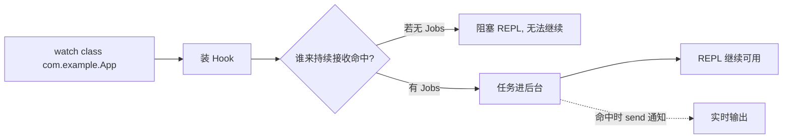
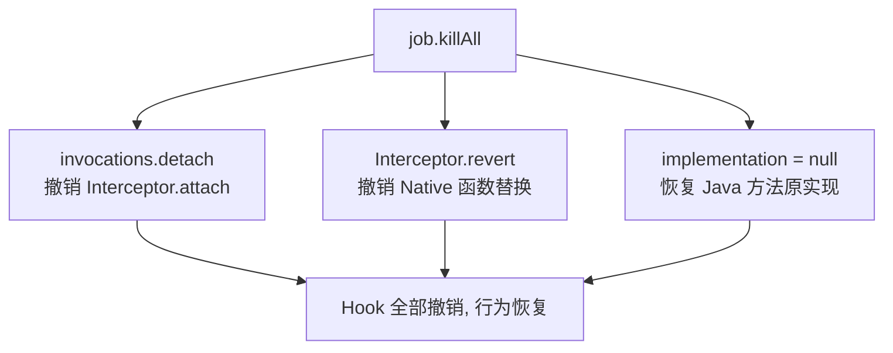
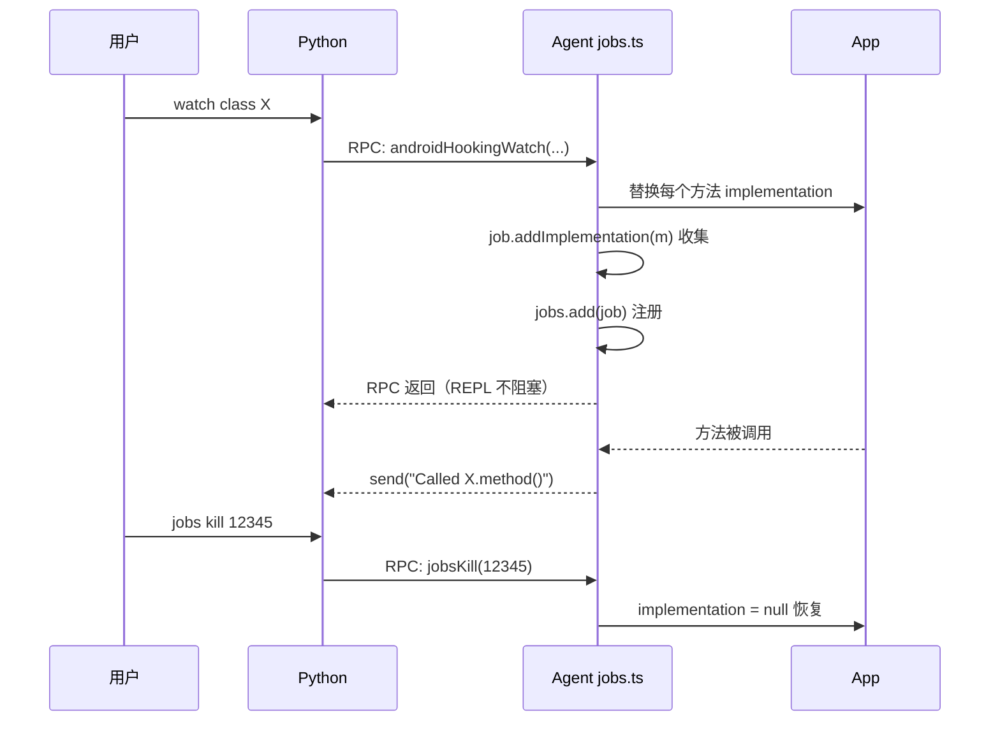

# Jobs 任务

很多 objection 命令（Hook、监听、SSL Pinning 绕过）是**持续性**的——装上 Hook 后还要一直留着观察。如果这些操作阻塞 REPL，你就没法继续输入命令。Jobs 系统解决的就是这个：把持续性任务托管到后台，统一管理、可撤销。

## 解决的问题



Hook 装好后，每次方法被调用都要能收到通知。Jobs 把这些 Hook 实现收集起来，作为后台任务托管，REPL 立即返回。

## 用法

```text
# 列出所有后台 Job
jobs

# 结束某个 Job
jobs kill <id>
```

## 实现原理

Jobs 涉及两侧：**agent 侧**记录 Hook 实现以便撤销，**Python 侧**展示状态。核心在 agent。

### agent 侧：Job 类

关键文件：`agent/src/lib/jobs.ts`。`Job` 类（`:3`）是一个容器，收集本次任务装上的所有 Hook：

```ts
class Job {
  identifier: number;
  private invocations: InvocationListener[] = [];
  private replacements: any[] = [];
  private implementations: any[] = [];
  // ...
}
```

它支持三种"可撤销物"：

| 类型 | 收集方法 | 撤销方式 |
| --- | --- | --- |
| InvocationListener | `addInvocation` | `listener.detach()` |
| Interceptor 替换 | `addReplacement` | `Interceptor.revert(addr)` |
| 方法实现替换 | `addImplementation` | `method.implementation = null` |

### 三种 Hook 的撤销



以方法 Hook 为例，watch 时每替换一个重载就 `job.addImplementation(m)`（`hooking.ts:407`）。kill 时（`jobs.ts:58`）：

```ts
this.implementations.forEach((method) => {
  method.implementation = null;   // 置空 = 恢复原实现
});
```

`implementation = null` 是 Frida 恢复方法原实现的约定——撤销 Hook，App 行为回到原始状态。

### Job 注册中心

`jobs.ts:74` 维护一个全局 `currentJobs` 数组，`add()` 注册、`all()` 列举、`kill(ident)` 按 ID 撤销并移除：

```ts
export const kill = (ident: number): boolean => {
  currentJobs.forEach((job) => {
    if (job.identifier !== ident) return;
    job.killAll();                    // 撤销所有 Hook
    currentJobs = currentJobs.filter(j => j.identifier !== job.identifier);
  });
  return true;
};
```

### identifier 的生成

`jobs.ts:77`：

```ts
export const identifier = (): number => Number(Math.random().toString(36).substring(2, 8));
```

每次任务生成一个随机 ID，作为 Job 标识，也是 REPL 里 `jobs kill <id>` 用的编号。

## Python 侧

Python 端也有对应的 `Job` / `job_manager_state`（`objection/state/jobs.py`），用于在 REPL 里展示 Job 列表、退出时清理（`utils/agent.py:396` `teardown` 会调 `job_manager_state.cleanup()`）。



## 关键细节

- **非阻塞**：watch/sslpinning 等 RPC 调用装好 Hook 后立即返回，Hook 在后台持续生效；
- **可撤销**：每个 Job 都能 `kill`，把 `implementation` 置 null 恢复原状——这是"安全测试"的重要特性，能随时回退修改；
- **容错**：`addImplementation` 对 `null`/`undefined` 做了过滤（`jobs.ts:25`），因为找不到类时 Hook 实现为 null，不应让 Job 注册失败；
- **退出清理**：REPL 退出时自动 kill 所有 Job、unload agent（`teardown`）。

## 哪些命令产生 Job

| 命令 | Job 内容 |
| --- | --- |
| `android sslpinning disable` | 7 处 Pinning Hook |
| `android hooking watch ...` | 方法实现替换 |
| `android hooking set return_value` | 返回值改写 Hook |
| `android keystore watch` | load/getKey Hook |
| `android clipboard monitor` | 剪贴板监听 |
| 自定义脚本注入 | 脚本 session |

## 源码索引

| 内容 | 位置 |
| --- | --- |
| agent Job 类 | [`agent/src/lib/jobs.ts:3`](https://github.com/android-security-engineer/objection-skills/blob/master/agent/src/lib/jobs.ts#L3) |
| 撤销逻辑 | [`agent/src/lib/jobs.ts:41`](https://github.com/android-security-engineer/objection-skills/blob/master/agent/src/lib/jobs.ts#L41) `killAll` |
| 注册中心 | [`agent/src/lib/jobs.ts:74`](https://github.com/android-security-engineer/objection-skills/blob/master/agent/src/lib/jobs.ts#L74) |
| identifier 生成 | [`agent/src/lib/jobs.ts:77`](https://github.com/android-security-engineer/objection-skills/blob/master/agent/src/lib/jobs.ts#L77) |
| Python Job 状态 | `objection/state/jobs.py` |
| 退出清理 | [`objection/utils/agent.py:393`](https://github.com/android-security-engineer/objection-skills/blob/master/objection/utils/agent.py#L393) `teardown` |
