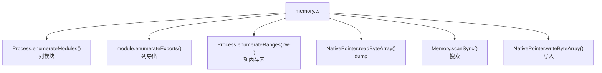
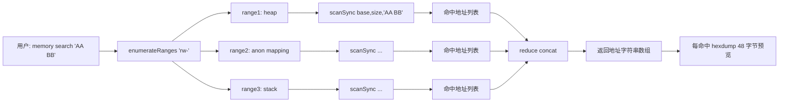
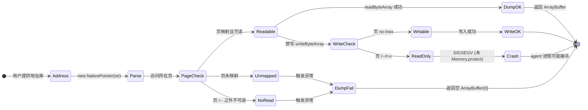

# 内存 Dump 与 Patch

这是与平台无关的能力（iOS/Android 通用），直接操作目标进程的**内存**——列模块、搜内存、dump、改写。

## 解决的问题

- App 把敏感数据放在内存里（解密后的明文、密钥、token），你想 dump 出来；
- 你想在内存里**改写某个值**（如游戏金币、某状态标志）；
- 你想知道进程加载了哪些 native 模块、某模块导出了哪些符号。

这些都在 Java/ObjC 抽象之下，需要直接操作内存。

## 用法

```text
# 列出进程加载的模块（.so / .dylib）
memory list modules

# 列出某模块的导出符号
memory list exports 模块名

# dump 某地址开始的 N 字节
memory dump from 地址 字节数 输出文件

# 在 rw- 内存区搜索模式（hex）
memory search "AA BB CC DD"

# 把搜索到的模式替换成新值
memory write 地址 --bytes AA,BB

# 列出内存区域
memory list ranges
```

## 实现原理

关键文件：`agent/src/generic/memory.ts`。全部基于 Frida 的 `Process` / `Memory` API，不依赖任何语言运行时桥接——所以 iOS/Android 通用。



### 列模块 / 导出

`memory.ts:3` `listModules()`：

```ts
return Process.enumerateModules();
```

`memory.ts:7` `listExports(name)`：按名字过滤模块后 `enumerateExports()`，用于找某 `.so` 导出了哪些函数符号。

### dump 内存

`memory.ts:19` `dump()`：

```ts
const data = new NativePointer(address).readByteArray(size);
```

把任意地址的内存读出来。常用于 dump 解密后的明文、密钥材料等。

### 内存搜索

`memory.ts:31` `search()`：在所有 `rw-`（可读写）内存区扫描 hex 模式：

```ts
const addresses = listRanges("rw-").map((range) => {
  return Memory.scanSync(range.base, range.size, pattern)
    .map((match) => {
      if (!onlyOffsets) colors.log(hexdump(match.address, { length: 48 })); // 打印 hex 预览
      return match.address.toString();
    });
});
```


为什么只搜 `rw-`？因为只读区（代码段、rodata）通常不是你要找的运行时数据，且写不进去。搜 `rw-` 覆盖了堆、栈、数据段等"活的"数据。

### 写入 / 替换

`memory.ts:54` `replace()`：先 `search` 拿到所有匹配地址，再逐个 `write`：

```ts
return search(pattern, true).map((match) => {
  write(match, replace);
  return match;
});
```

`memory.ts:61` `write()`：

```ts
new NativePointer(address).writeByteArray(value);
```

这就是内存修改的本质——**找到地址，写入新字节**。游戏外挂改金币、绕过某布尔判断，原理都是这个。

## 关键细节

### 模式匹配是 hex

`memory search` 的 pattern 是 hex 字节序列（如 `"AA BB CC DD"` 或 `"AA BB ?? DD"` 用 `??` 通配）。`Memory.scanSync` 原生支持这种模式。

### 地址是字符串

所有地址以**字符串形式**传递（`"0x12345678"`），agent 内部用 `new NativePointer(address)` 转换。这是 Frida 的标准约定。

### hexdump 预览

非 onlyOffsets 模式下，搜索命中会打印一段 hexdump（`memory.ts:37`），让你直接看到匹配处的上下文数据，判断是不是你要找的。

## 局限

- **地址会变**：ASLR + 对象移动使得硬编码地址每次运行不同，需动态搜索；
- **写只读区会崩**：往 `r-x`（代码段）写要先用 `Memory.protect` 改权限，objection 的 `write` 不自动处理；
- **搜索大内存慢**：`scanSync` 是同步全量扫描，进程内存大时较慢。

## 🔬 边界情况与失败模式

### `listExports` 的模块名精确匹配

`listExports` 用 `m.name === name` 过滤（[`memory.ts:8`](https://github.com/android-security-engineer/objection-skills/blob/master/agent/src/generic/memory.ts#L8)）——**完全相等**，不是包含。`memory list exports libfoo` 找不到 `libfoo.so`，因为 name 带后缀。命名大小写敏感（iOS 上 `UIKit` 与 `UIKit.framework` 是不同 name）。匹配到 0 个时返回空数组，不报错——用户要自己核对模块名。

### `readByteArray` 跨页边界与未映射页

`dump` 用 `NativePointer(address).readByteArray(size)`（[`memory.ts:22`](https://github.com/android-security-engineer/objection-skills/blob/master/agent/src/generic/memory.ts#L22)）。若 `[address, address+size)` 范围内有未映射页或不可读页，整次读取抛异常返回空 `ArrayBuffer(0)`。不会部分返回——要么全读、要么全失败。dump 跨越映射边界（如堆尾后的 guard page）会静默返回 0 字节，容易误以为"内存是空的"。

### `Memory.scanSync` 的同步阻塞与超时

`search` 对每个 `rw-` range 调 `Memory.scanSync`（[`memory.ts:34`](https://github.com/android-security-engineer/objection-skills/blob/master/agent/src/generic/memory.ts#L34)），这是**同步全量扫描**。Frida 内部用编译过的 pattern matcher 扫描，速度尚可，但大进程（GB 级堆）单次 search 可能数秒。期间 agent JS 线程阻塞，其他 RPC 请求排队。无内置超时——大扫描会一直阻塞到扫完。

### `writeByteArray` 不改权限

`write`（[`memory.ts:61`](https://github.com/android-security-engineer/objection-skills/blob/master/agent/src/generic/memory.ts#L61)）直接 `writeByteArray`。若目标页是 `r--`（只读数据段）或 `r-x`（代码段），写入会触发 SIGSEGV，agent 进程可能被杀。`replace` 先 `search(pattern, true)` 拿到的地址都是 `rw-` 区的（因为 search 只扫 rw-），所以 `replace` 内部 write 一般安全。但用户单独调 `write` 往任意地址写就要自己保证页可写——`Memory.protect` 改权限 objection 没封装。

### `replace` 的"先搜后写"竞态

`replace`（[`memory.ts:54`](https://github.com/android-security-engineer/objection-skills/blob/master/agent/src/generic/memory.ts#L54)）先 `search(pattern, true)` 拿地址列表，再逐个 `write`。两次调用之间目标内存可能被 App 改写（如 GC 移动对象、App 自己改值）——写到的是旧地址，可能写到已释放的内存。高频变动数据（如栈上的临时变量）用 `replace` 容易写空或写错。

### 模式串格式

`Memory.scanSync` 的 pattern 支持空格分隔的 hex 与 `??` 通配（如 `"48 8B ?? 00"`）。不支持正则、不支持 ASCII 直接搜（要先把字符串转 hex）。pattern 解析失败会抛异常，整个 search 中止。

## 🔧 与底层 Frida/系统 API 的交互细节

### `Process.enumerateRanges` 的 protection 过滤语义

`listRanges("rw-")`（[`memory.ts:15`](https://github.com/android-security-engineer/objection-skills/blob/master/agent/src/generic/memory.ts#L15)）传 protection 字符串。Frida 的语义：`r`/`w`/`x` 表示必须有该权限，`-` 表示必须**无**该权限。所以 `"rw-"` = 可读可写但**不可执行**（堆、数据段），排除了 `rwx`（JIT 区，如 ART 的 JIT 代码缓存）和 `r-x`（代码段）。想搜 JIT 区得用 `"rwx"` 或 `"rw"`（不限执行位）。

### `Module.enumerateExports` vs `enumerateSymbols`

`listExports` 用 `module.enumerateExports()`（[`memory.ts:12`](https://github.com/android-security-engineer/objection-skills/blob/master/agent/src/generic/memory.ts#L12)）。Frida 区分 exports 与 symbols：

- **exports**：动态符号表（`.dynsym`），即通过 `dlsym` 能拿到的，跨模块可见；
- **symbols**：完整符号表（`.symtab`），包括 static 函数，但 stripped binary 没有。

objection 只列 exports，所以看不到被 strip 的内部函数。要看完整符号表得自己写 Frida 脚本调 `module.enumerateSymbols()`。

### `hexdump` 的 ansi 输出

`search` 命中时用 `hexdump(match.address, { ansi: true, header: false, length: 48 })`（[`memory.ts:37`](https://github.com/android-security-engineer/objection-skills/blob/master/agent/src/generic/memory.ts#L37)）。`ansi: true` 让 hexdump 带颜色码输出到终端，`header: false` 去掉地址头（因为 match.address 已知），`length: 48` 只看 48 字节上下文。这些是默认 UI 行为，`onlyOffsets=true` 时跳过（`replace` 内部调就用 true，避免刷屏）。

### `NativePointer` 的地址解析

所有入口接收字符串地址（`"0x..."`、`"123"`），内部 `new NativePointer(address)`（[`memory.ts:22`](https://github.com/android-security-engineer/objection-skills/blob/master/agent/src/generic/memory.ts#L22)、[`:62`](https://github.com/android-security-engineer/objection-skills/blob/master/agent/src/generic/memory.ts#L62)）。`NativePointer` 构造器接受十进制或 0x 前缀十六进制字符串，非法格式抛异常。64 位进程上指针 8 字节，32 位上 4 字节——objection 不做位数判断，靠 Frida 自动处理。

## ⚡ 性能与并发考量

- **`search` 扫描总字节 = sum(所有 rw- range size)**：大进程可能有几 GB 的 rw- 区（堆 + 匿名映射）。单次 `memory search` 可能扫数秒到数十秒；
- **`hexdump` 命中预览的代价**：非 onlyOffsets 模式每个命中都 `hexdump(48)`，命中多时（如全零字节模式可能命中百万次）会爆 RPC 通道——objection 的 send 是流式但仍有背压。命中极多时建议加 `--offsets-only` 类参数（对应 `onlyOffsets=true`）；
- **`replace` 是 search + N 次 write**：search 一次 + 每个命中一次 write。write 本身快（单次内存写），但 N 大时 RPC 往返开销主导；
- **`dump` 返回 ArrayBuffer 走 RPC**：大 dump（MB 级）通过 Frida 的 send 序列化传回 CLI，序列化 + 传输开销显著。极小 dump（KB）无感；
- **并发不可重入**：`scanSync` 是同步阻塞，agent 单 JS 线程，多个 `memory search` 并发请求会串行排队。无并行加速。

## 📊 内存搜索到写入的完整数据流



## 📊 dump/write 的页权限状态机



## 🧱 进程内存区(rw- only)扫描的数据结构布局

```text
Process.enumerateRanges("rw-")  返回 RangeDetails[]
+-----------------------------------------------------------+
|  range[0]  base=0x7a000000  size=0x2000000  prot=rw-      |  <- 主堆
|  range[1]  base=0x7c000000  size=0x100000   prot=rw-      |  <- 匿名映射
|  range[2]  base=0x7fff0000  size=0x80000    prot=rw-      |  <- 栈
|  ...                                                       |
+-----------------------------------------------------------+

对每个 range 调 Memory.scanSync(base, size, "AA BB ?? DD")
+-----------------------------------------------------------+
|  range[0] 扫描:                                            |
|    0x7a001234 -> match (AA BB ?? DD)                       |
|    0x7a0099a0 -> match                                     |
|  range[1] 扫描:                                            |
|    (无命中)                                                |
|  range[2] 扫描:                                            |
|    0x7fff4321 -> match                                     |
+-----------------------------------------------------------+
        |
        v  filter(m.length !== 0) + reduce(concat)
+-----------------------------------------------------------+
|  最终地址字符串数组:                                       |
|    ["0x7a001234", "0x7a0099a0", "0x7fff4321"]             |
+-----------------------------------------------------------+
        |
        v  replace: 对每个地址 writeByteArray(新值)
+-----------------------------------------------------------+
|  0x7a001234: [AA BB] -> [CC DD]  写入 (rw- 页, 安全)      |
|  0x7a0099a0: [AA BB] -> [CC DD]  写入                      |
|  0x7fff4321: [AA BB] -> [CC DD]  写入 (栈, 可能在写完后   |
|                                    被函数返回覆盖)         |
+-----------------------------------------------------------+

注: 仅扫 rw- 排除了 r-x(代码段) 与 rwx(JIT 区).
    要改代码段得先 Memory.protect(addr, size, 'rwx').
```

## 源码索引

| 内容 | 位置 |
| --- | --- |
| Python 命令 | `objection/commands/memory.py` |
| RPC 注册 | `agent/src/rpc/memory.ts` |
| listModules | [`agent/src/generic/memory.ts:3`](https://github.com/android-security-engineer/objection-skills/blob/master/agent/src/generic/memory.ts#L3) |
| dump | [`agent/src/generic/memory.ts:19`](https://github.com/android-security-engineer/objection-skills/blob/master/agent/src/generic/memory.ts#L19) |
| search | [`agent/src/generic/memory.ts:31`](https://github.com/android-security-engineer/objection-skills/blob/master/agent/src/generic/memory.ts#L31) |
| replace/write | [`agent/src/generic/memory.ts:54`](https://github.com/android-security-engineer/objection-skills/blob/master/agent/src/generic/memory.ts#L54) |
