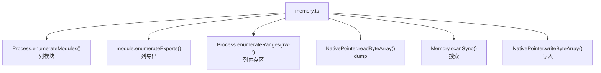
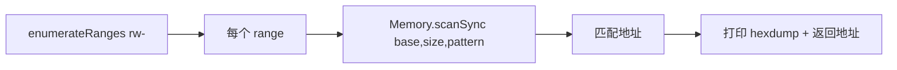

# 内存 Dump 与 Patch

这是与平台无关的能力（iOS/Android 通用），直接操作目标进程的**内存**——列模块、搜内存、dump、改写。

## 解决的问题

- App 把敏感数据放在内存里（解密后的明文、密钥、token），你想 dump 出来；
- 你想在内存里**改写某个值**（如游戏金币、某状态标志）；
- 你想知道进程加载了哪些 native 模块、某模块导出了哪些符号。

这些都在 Java/ObjC 抽象之下，需要直接操作内存。

## 用法

```text
# 列出进程加载的模块（.so / .dylib）
memory list modules

# 列出某模块的导出符号
memory list exports 模块名

# dump 某地址开始的 N 字节
memory dump from 地址 字节数 输出文件

# 在 rw- 内存区搜索模式（hex）
memory search "AA BB CC DD"

# 把搜索到的模式替换成新值
memory write 地址 --bytes AA,BB

# 列出内存区域
memory list ranges
```

## 实现原理

关键文件：`agent/src/generic/memory.ts`。全部基于 Frida 的 `Process` / `Memory` API，不依赖任何语言运行时桥接——所以 iOS/Android 通用。



### 列模块 / 导出

`memory.ts:3` `listModules()`：

```ts
return Process.enumerateModules();
```

`memory.ts:7` `listExports(name)`：按名字过滤模块后 `enumerateExports()`，用于找某 `.so` 导出了哪些函数符号。

### dump 内存

`memory.ts:19` `dump()`：

```ts
const data = new NativePointer(address).readByteArray(size);
```

把任意地址的内存读出来。常用于 dump 解密后的明文、密钥材料等。

### 内存搜索

`memory.ts:31` `search()`：在所有 `rw-`（可读写）内存区扫描 hex 模式：

```ts
const addresses = listRanges("rw-").map((range) => {
  return Memory.scanSync(range.base, range.size, pattern)
    .map((match) => {
      if (!onlyOffsets) colors.log(hexdump(match.address, { length: 48 })); // 打印 hex 预览
      return match.address.toString();
    });
});
```



为什么只搜 `rw-`？因为只读区（代码段、rodata）通常不是你要找的运行时数据，且写不进去。搜 `rw-` 覆盖了堆、栈、数据段等"活的"数据。

### 写入 / 替换

`memory.ts:54` `replace()`：先 `search` 拿到所有匹配地址，再逐个 `write`：

```ts
return search(pattern, true).map((match) => {
  write(match, replace);
  return match;
});
```

`memory.ts:61` `write()`：

```ts
new NativePointer(address).writeByteArray(value);
```

这就是内存修改的本质——**找到地址，写入新字节**。游戏外挂改金币、绕过某布尔判断，原理都是这个。

## 关键细节

### 模式匹配是 hex

`memory search` 的 pattern 是 hex 字节序列（如 `"AA BB CC DD"` 或 `"AA BB ?? DD"` 用 `??` 通配）。`Memory.scanSync` 原生支持这种模式。

### 地址是字符串

所有地址以**字符串形式**传递（`"0x12345678"`），agent 内部用 `new NativePointer(address)` 转换。这是 Frida 的标准约定。

### hexdump 预览

非 onlyOffsets 模式下，搜索命中会打印一段 hexdump（`memory.ts:37`），让你直接看到匹配处的上下文数据，判断是不是你要找的。

## 局限

- **地址会变**：ASLR + 对象移动使得硬编码地址每次运行不同，需动态搜索；
- **写只读区会崩**：往 `r-x`（代码段）写要先用 `Memory.protect` 改权限，objection 的 `write` 不自动处理；
- **搜索大内存慢**：`scanSync` 是同步全量扫描，进程内存大时较慢。

## 源码索引

| 内容 | 位置 |
| --- | --- |
| Python 命令 | `objection/commands/memory.py` |
| RPC 注册 | `agent/src/rpc/memory.ts` |
| listModules | `agent/src/generic/memory.ts:3` |
| dump | `agent/src/generic/memory.ts:19` |
| search | `agent/src/generic/memory.ts:31` |
| replace/write | `agent/src/generic/memory.ts:54` |
