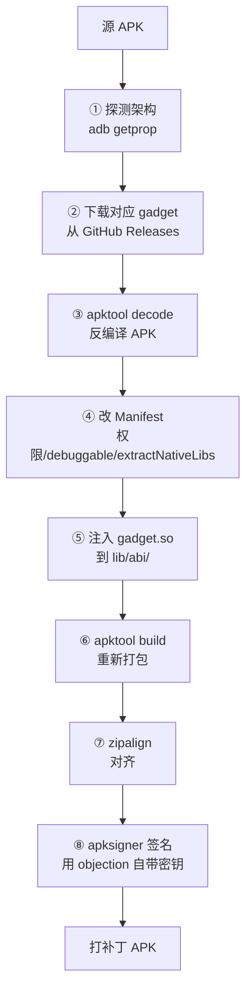
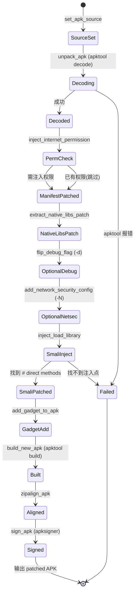
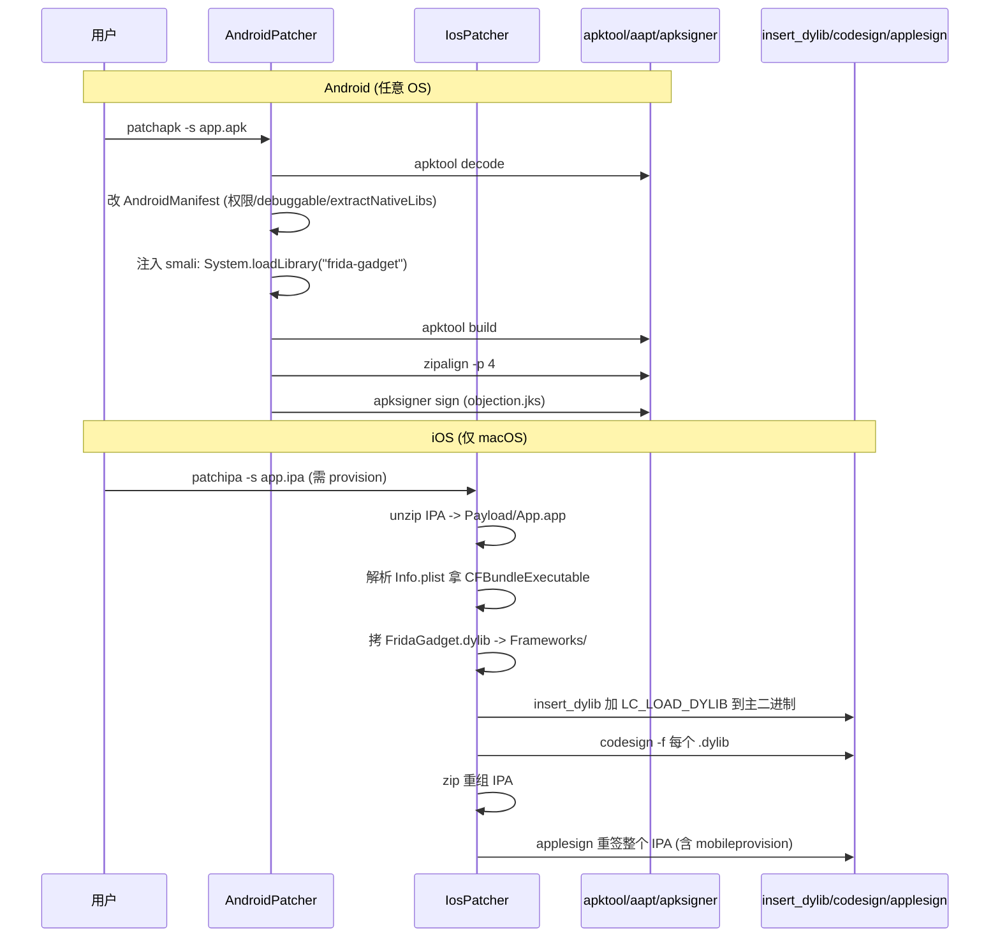

# APK Patch（植入 Frida Gadget）

这是 objection 实现"无需 root 即可测试"的关键能力：把 Frida Gadget 重新打包进 APK，让普通设备也能跑 agent。

## 解决的问题

frida-server 模式需要设备 root。但很多测试机不方便 root（公司设备、保修、检测风险）。**Gadget 模式**绕开这个限制：把 `frida-gadget.so` 作为 native 库嵌入 APK，App 启动时系统加载它，gadget 随即拉起 agent——**普通设备即可**。

```mermaid
flowchart LR
    APK[原 APK] -->|patchapk| NEW[打补丁 APK]
    NEW --> LIB["lib/<abi>/libfrida-gadget.so"]
    NEW --> INST[安装到普通设备]
    INST --> LAUNCH[App 启动]
    LAUNCH --> LOAD[系统加载 gadget.so]
    LOAD --> AGENT[agent 被拉起]
    AGENT --> OBJ["objection -g 包名 start<br/>附加]
```

## 用法

```bash
objection patchapk -s app.apk
# 指定架构（否则自动探测）
objection patchapk -s app.apk -a arm64-v8a
# 指定 gadget 版本
objection patchapk -s app.apk -V 16.7.19
# 顺便开启可调试 + 信任用户 CA（Android 7+）
objection patchapk -s app.apk -d -N
```

常用参数（见 `console/cli.py:299`）：

| 参数 | 含义 |
| --- | --- |
| `-s / --source` | 源 APK（必填） |
| `-a / --architecture` | 目标架构，不指定则自动探测 |
| `-V / --gadget-version` | gadget 版本，不指定取最新 |
| `-d / --enable-debug` | 把 `android:debuggable` 置 true |
| `-N / --network-security-config` | 注入信任用户 CA 的网络安全配置 |
| `-D / --skip-resources` | 跳过资源解码（更快，但与 -d/-N 互斥） |
| `-C / --skip-signing` | 跳过签名 |
| `-n / --ignore-nativelibs` | 不改 extractNativeLibs |
| `-c / --gadget-config` | 自定义 gadget 配置文件 |
| `-l / --script-source` | gadget 配置为 path 模式时的脚本 |

## 实现原理

关键文件：`objection/utils/patchers/android.py`。整个流程是一个典型的 APK 重打包管线：



### ① 架构探测与 gadget 下载

`AndroidGadget`（`patchers/android.py:19`）维护架构映射表（`arm64-v8a` → `arm64` 等），从 GitHub Releases 下载对应 `frida-gadget-<ver>-android-<arch>.so.xz` 并解压（`.xz` 压缩）。

### ② apktool 反编译

`unpack_apk()`（`patchers/android.py:397`）调用 `apktool decode`，把 APK 拆成可编辑的 smali + 资源 + Manifest。`--skip-resources` 可跳过资源解码（更快），但会与 `-d`/`-N` 冲突——因为改 debuggable 和网络安全配置需要解码资源。

### ③ 改 Manifest（关键）

重打包时要在 `AndroidManifest.xml` 上做几处必要修改：

| 修改 | 方法 | 为什么 |
| --- | --- | --- |
| 注入 `INTERNET` 权限 | `inject_internet_permission()` (`:415`) | gadget 联网通信需要 |
| `extractNativeLibs` → true | `extract_native_libs_patch()` (`:455`) | AndroidStudio 2.1+ 默认 false，会导致 gadget.so 不被解压到磁盘加载失败 |
| `debuggable` → true | `flip_debug_flag_to_true()` (`:496`) | `-d` 选项，便于调试 |
| 注入网络安全配置 | `add_network_security_config()` (`:531`) | `-N` 选项，让 Android 7+ 信任用户安装的 CA |

### ④ 注入 gadget

`add_gadget_to_apk()`（`patchers/android.py:867`）：把 `libfrida-gadget.so` 复制到 APK 的 `lib/<abi>/` 目录。Android 系统安装时会按设备架构解压对应 native 库，App 启动时加载它。


可选的 `gadget.config.so`（`-c`）一并放入，控制 gadget 行为（监听模式、脚本路径等，见 [Frida Gadget 文档](https://frida.re/docs/gadget/)）。

### ⑤ 重打包 + 对齐 + 签名

- `build_new_apk()`（`:892`）：`apktool build` 重新打包；
- `zipalign_apk()`（`:918`）：`zipalign` 对齐（Android 安装要求）；
- `sign_apk()`（`:942`）：`apksigner` 签名。objection 自带一个签名密钥（`objection/utils/assets/objection.jks`），所以默认无需你提供密钥；也可用 `objection signapk` 单独签名。

### 依赖外部工具

patcher 依赖三个外部命令（`patchers/android.py:192`）：`apksigner`、`apktool`（≥2.6.0）、`zipalign`。缺一不可，安装方式见代码里的提示（如 Kali 上 `apt install apksigner zipalign`）。

## gadget 如何自动加载

光放进 `lib/` 还不够——系统不会无缘无故加载一个 `.so`。gadget 之所以能被加载，是因为它**伪装成一个会被 App 自然加载的 native 库**：App 自身的代码在运行时会 `System.loadLibrary` 或链接到 native 库，gadget 蹭这条加载链路被载入。某些情况下 patcher 会把 gadget 注入到 App 已有 native 库的加载路径上。


## 局限

- **重签名**：打补丁后 APK 签名变了，App 若校验自身签名会检测到（需配合 Hook 绕过）；
- **架构必须匹配**：gadget 是 native 库，必须与设备 ABI 一致，否则加载失败；
- **加固/壳 APK**：apktool 可能无法正确反编译加壳 APK；
- **Play Protect**：自带签名密钥签出的 APK 可能被 Google Play Protect 标记。

## 🔬 边界情况与失败模式

### `--skip-resources` 与 `-d`/`-N` 的互斥

`unpack_apk` 用 `apktool decode -r` 跳过资源解码（[`android.py:415`](https://github.com/android-security-engineer/objection-skills/blob/master/objection/utils/patchers/android.py#L415)）后，`AndroidManifest.xml` 仍是二进制编码格式（AXML），无法用 `ElementTree` 解析。`_get_android_manifest` 显式检测这种情形并抛异常（[`android.py:293`](https://github.com/android-security-engineer/objection-skills/blob/master/objection/utils/patchers/android.py#L293)）。所以 `-D`（skip-resources）与 `-d`（debuggable）/`-N`（netsec）不能同用——后者都要改 manifest，需要资源已解码。解法：用 `--manifest` 手动指定一个已解码的 manifest 文件路径（[`android.py:300`](https://github.com/android-security-engineer/objection-skills/blob/master/objection/utils/patchers/android.py#L300)）。

### apktool 版本探测的脆弱性

`is_apktool_ready`（[`android.py:220`](https://github.com/android-security-engineer/objection-skills/blob/master/objection/utils/patchers/android.py#L220)）解析 `apktool -version` 输出。但 Apktool v2.12.0 改了语法（`-version` 不再单独输出版本，而是混在 usage 里），代码靠 `o.split(' ')[1]` 兜底（[`android.py:242`](https://github.com/android-security-engineer/objection-skills/blob/master/objection/utils/patchers/android.py#L242)）。Windows 上还有 `Press any key to continue` 本地化提示，靠取第一行规避（`:237`）。版本探测失败会返回 False 终止 patch——新 apktool 版本若再改输出格式，可能误判为版本过低。

### smali 注入的 `.locals` 计数风险

`_revalue_locals_count`（[`android.py:760`](https://github.com/android-security-engineer/objection-skills/blob/master/objection/utils/patchers/android.py#L760)）注入 `const-string v0` 后需把方法的 `.locals` 计数 +1。若原方法 `.locals 0`，注入后用 v0 寄存器但计数还是 0，运行时校验失败 App 崩。代码尝试自增，失败时只打 warning（`:771` 的 `_h()`）不中止——注释明确说"Sometimes this may break things, but not always"。失败场景：`.locals` 行格式非预期、值非数字。命中时要靠 `--pause` 手动修 smali。

### multidex APK 的 smali 定位

`_determine_smali_path_for_class`（[`android.py:586`](https://github.com/android-security-engineer/objection-skills/blob/master/objection/utils/patchers/android.py#L586)）先在 `smali/` 找，找不到遍历 `smali_classes2` 到 `smali_classes99`（`:609` 的 `range(2, 100)`）。multidex APK（方法数超 65535 拆多 dex）的启动 Activity 可能在 `smali_classes2`，必须扫这些目录。上限 100 是硬编码——极端 APK（超 100 个 dex）会漏，实际罕见。

### `aapt` 探测 launchable activity 的回退

`_get_launchable_activity`（[`android.py:328`](https://github.com/android-security-engineer/objection-skills/blob/master/objection/utils/patchers/android.py#L328)）先用 `aapt dump badging` 正则抓 `launchable-activity: name='...'`。aapt 在新版 build-tools 里有时被移除或行为变化，抓不到时回退手动解析 manifest 的 `activity-alias` 标签找 `LAUNCHER` category（`:357`）。两个都失败抛异常终止 patch。注意 `required_commands` 里 `aapt` 是必需的（`:186`），但实际探测 activity 不一定依赖它——这是潜在的依赖冗余。

### iOS patcher 需要 macOS + 真实证书

`IosPatcher`（[`ios.py:136`](https://github.com/android-security-engineer/objection-skills/blob/master/objection/utils/patchers/ios.py#L136)）依赖 `xcodebuild`/`codesign`/`security`/`plutil`——全是 macOS 内置工具，**Linux/Windows 跑不了 iOS patch**。且需要有效的 `mobileprovision`（开发者证书）。`set_provsioning_profile` 在用户未指定时自动扫 `~/Library/Developer/Xcode/DerivedData/` 找 provision 文件（[`ios.py:216`](https://github.com/android-security-engineer/objection-skills/blob/master/objection/utils/patchers/ios.py#L216)），按剩余有效期排序取最长那个。无任何有效 provision 则抛异常——这是 iOS patch 的硬门槛。

### iOS `insert_dylib` 注入 LC_LOAD_DYLIB

iOS patch 的核心是 `patch_and_codesign_binary`（[`ios.py:330`](https://github.com/android-security-engineer/objection-skills/blob/master/objection/utils/patchers/ios.py#L330)）调 `insert_dylib` 往 App 主二进制的 Mach-O load commands 里加一条 `LC_LOAD_DYLIB` 指向 `@executable_path/Frameworks/FridaGadget.dylib`。App 启动时 dyld 加载这条命令，拉起 gadget。注入后必须**对所有 .dylib 重新 codesign**（`:379` 遍历 `app_folder` 下所有 `.dylib`）——iOS 校验签名时若 Frameworks 目录里有未签名的 dylib，整个 App 启动失败。

### iOS provision 文件的 bundle id 提取

`_set_bundle_id_from_profile`（[`ios.py:450`](https://github.com/android-security-engineer/objection-skills/blob/master/objection/utils/patchers/ios.py#L450)）用一串管道命令（`security cms -D` 解码 → `plutil -extract` → `grep string` → `sed`）从 mobileprovision 里提 `application-identifier`。provision 文件是 PKCS#7 签名的 plist，必须先 `security cms -D` 解包。bundle id 提取失败会导致 applesign 重签时 bundle id 错，装上设备后启动崩。

## 🔧 与底层工具/系统 API 的交互细节

### `delegator.run` 包装外部命令

patcher 大量用 `delegator.run(self.list2cmdline([...]))` 调外部命令（apktool/apksigner/zipalign/codesign 等）。`list2cmdline` 是 `BasePlatformPatcher` 的方法，把参数列表转成 shell 命令字符串（处理引号转义）。`delegator` 是 Python 的 shell 命令包装库，捕获 stdout/stderr。`timeout=self.command_run_timeout` 防止卡死。注意 `o.err` 非空不一定代表失败（apktool 把警告写到 stderr）——代码只打红字提示"may have failed"，不中止。

### AndroidManifest 的命名空间处理

`_get_android_manifest` 调 `ElementTree.register_namespace('android', 'http://schemas.android.com/apk/res/android')`（[`android.py:299`](https://github.com/android-security-engineer/objection-skills/blob/master/objection/utils/patchers/android.py#L299)）。Android 的 manifest 属性都用 `android:` 前缀（如 `android:debuggable`），对应 XML namespace。不注册的话 ElementTree 写回时会生成 `ns0:debuggable` 这种丑陋前缀，apktool 重新打包可能解析失败。改属性时也必须用全限定名 `{http://schemas.android.com/apk/res/android}debuggable`（[`android.py:519`](https://github.com/android-security-engineer/objection-skills/blob/master/objection/utils/patchers/android.py#L519)）。

### gadget 下载的流式与 .xz 解压

`AndroidGadget.download`（[`android.py:107`](https://github.com/android-security-engineer/objection-skills/blob/master/objection/utils/patchers/android.py#L107)）用 `requests.get(url, stream=True)` + `shutil.copyfileobj(library.raw, f)` 流式下载，避免大文件占内存。下载的是 `.so.xz` 压缩包，`unpack` 用 `lzma.open` 解压（[`android.py:164`](https://github.com/android-security-engineer/objection-skills/blob/master/objection/utils/patchers/android.py#L164)）。iOS 侧同理（[`ios.py:113`](https://github.com/android-security-engineer/objection-skills/blob/master/objection/utils/patchers/ios.py#L113)），下载 `ios-universal.dylib.xz`。universal 表示一个 dylib 兼容 arm64 + x86_64（模拟器）。

### 签名密钥的硬编码密码

`sign_apk`（[`android.py:942`](https://github.com/android-security-engineer/objection-skills/blob/master/objection/utils/patchers/android.py#L942)）用 `--ks-pass pass:basil-joule-bug` 直接把 keystore 密码写在命令行里（注释 `:948` 写明密码 `basil-joule-bug`）。这个 `objection.jks` 是公开仓库里的密钥，任何人都能签——所以 objection 签出的 APK 签名毫无安全价值，仅满足 Android 安装要求。App 若校验自身签名会立刻发现不符（见局限）。

### `zipalign -p 4` 的对齐语义

`zipalign_apk`（[`android.py:918`](https://github.com/android-security-engineer/objection-skills/blob/master/objection/utils/patchers/android.py#L918)）用 `zipalign -p 4`。`-p` 表示对齐 .so 文件到页边界（4KB），`4` 表示其他文件 4 字节对齐。Android 6+ 安装时校验对齐，未对齐的 APK 安装失败或运行时 mmap native 库异常。gadget.so 是 native 库，必须页对齐才能被正确加载——这就是 `-p` 的意义。

## ⚡ 性能与并发考量

- **apktool decode/build 是最慢的两步**：大 APK（几百 MB、上万个资源）decode 可能几十秒到几分钟，build 同量级。`--skip-resources` 能大幅加速 decode，但牺牲了改 manifest 的能力；
- **smali 注入是文件级操作**：`inject_load_library`（[`android.py:816`](https://github.com/android-security-engineer/objection-skills/blob/master/objection/utils/patchers/android.py#L816)）读整个 .smali 文件到内存、改、写回。单文件，开销小；
- **gadget 下载依赖网络**：首次 patch 需从 GitHub Releases 下载 gadget（几 MB 到十几 MB）。下载后缓存在 `objection_path/android/<arch>/`，后续 patch 同架构直接用缓存（`gadget_exists` 检查，[`android.py:95`](https://github.com/android-security-engineer/objection-skills/blob/master/objection/utils/patchers/android.py#L95)）；
- **iOS codesign 逐个签名**：`patch_and_codesign_binary` 对每个 .dylib 调一次 `codesign`（[`ios.py:385`](https://github.com/android-security-engineer/objection-skills/blob/master/objection/utils/patchers/ios.py#L385)），串行。dylib 多的 App（如 Flutter 的 App.framework + 自带 framework）签名耗时累计；
- **临时文件清理**：`__del__` 析构函数清理临时目录（[`android.py:974`](https://github.com/android-security-engineer/objection-skills/blob/master/objection/utils/patchers/android.py#L974)、[`ios.py:504`](https://github.com/android-security-engineer/objection-skills/blob/master/objection/utils/patchers/ios.py#L504)）。`--skip-cleanup` 保留中间产物供调试。注意 `__del__` 依赖对象被 GC，Python 不保证及时调用——大量 patch 后可能残留临时文件占磁盘；
- **无并行**：整个 patch 流程严格串行（decode → patch manifest → inject smali → add gadget → build → align → sign），无多进程加速。

## 📊 Android patch 全流程状态机



## 📊 Android vs iOS patch 流程时序对比



## 🧱 Android APK 重打包后的内部结构布局

```text
原始 APK                          patch 后 APK
+-----------------------+         +-------------------------------+
| AndroidManifest.xml   |         | AndroidManifest.xml           |
|   (二进制 AXML)        |         |   android:debuggable=true (-d)|
|                       |         |   extractNativeLibs=true      |
|                       |         |   +uses-permission INTERNET   |
|                       |         |   networkSecurityConfig (-N)  |
+-----------------------+         +-------------------------------+
| classes.dex           |         | classes.dex                   |
+-----------------------+         +-------------------------------+
| smali/ (apktool 解出) |         | smali/                        |
|   LaunchActivity.smali|         |   LaunchActivity.smali        |
|     .method <clinit>  |         |     .method <clinit>          |
|       ...             |  -->    |       const-string v0,"frida- |
|     .end method       |         |                       gadget" |
|                       |         |       invoke-static {v0},     |
|                       |         |         Ljava/lang/System;    |
|                       |         |         ->loadLibrary(...)V    |
|                       |         |       return-void             |
|                       |         |     .end method   (.locals+1) |
+-----------------------+         +-------------------------------+
| lib/                  |         | lib/                          |
|   arm64-v8a/          |         |   arm64-v8a/                  |
|     libnative.so      |         |     libnative.so              |
|                       |         |     libfrida-gadget.so  <--+  |
|                       |         |     libfrida-gadget.config.so| (可选 -c)
+-----------------------+         +-------------------------------+
| res/                  |         | res/                          |
|                       |         |   xml/network_security_       |
|                       |         |       config.xml  <-- (-N)    |
+-----------------------+         +-------------------------------+
| META-INF/ (旧签名)    |         | META-INF/ (新签名, objection.jks)
+-----------------------+         +-------------------------------+

启动链路: 系统 dlopen libfrida-gadget.so -> gadget 构造函数 -> 监听 -> objection 附加
```

## 源码索引

| 内容 | 位置 |
| --- | --- |
| Python 命令 | [`objection/console/cli.py:335`](https://github.com/android-security-engineer/objection-skills/blob/master/objection/console/cli.py#L335) `patchapk` |
| patcher 主类 | [`objection/utils/patchers/android.py:182`](https://github.com/android-security-engineer/objection-skills/blob/master/objection/utils/patchers/android.py#L182) |
| gadget 下载 | [`objection/utils/patchers/android.py:107`](https://github.com/android-security-engineer/objection-skills/blob/master/objection/utils/patchers/android.py#L107) |
| apktool decode | [`objection/utils/patchers/android.py:397`](https://github.com/android-security-engineer/objection-skills/blob/master/objection/utils/patchers/android.py#L397) |
| 注入 gadget | [`objection/utils/patchers/android.py:867`](https://github.com/android-security-engineer/objection-skills/blob/master/objection/utils/patchers/android.py#L867) |
| 重打包 | [`objection/utils/patchers/android.py:892`](https://github.com/android-security-engineer/objection-skills/blob/master/objection/utils/patchers/android.py#L892) |
| 签名密钥 | `objection/utils/assets/objection.jks` |
