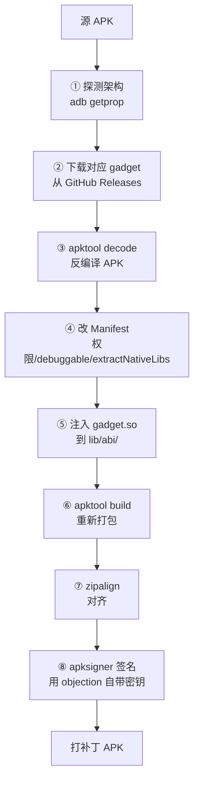

# APK Patch（植入 Frida Gadget）

这是 objection 实现"无需 root 即可测试"的关键能力：把 Frida Gadget 重新打包进 APK，让普通设备也能跑 agent。

## 解决的问题

frida-server 模式需要设备 root。但很多测试机不方便 root（公司设备、保修、检测风险）。**Gadget 模式**绕开这个限制：把 `frida-gadget.so` 作为 native 库嵌入 APK，App 启动时系统加载它，gadget 随即拉起 agent——**普通设备即可**。

```mermaid
flowchart LR
    APK[原 APK] -->|patchapk| NEW[打补丁 APK]
    NEW --> LIB["lib/<abi>/libfrida-gadget.so"]
    NEW --> INST[安装到普通设备]
    INST --> LAUNCH[App 启动]
    LAUNCH --> LOAD[系统加载 gadget.so]
    LOAD --> AGENT[agent 被拉起]
    AGENT --> OBJ["objection -g 包名 start<br/>附加]
```

## 用法

```bash
objection patchapk -s app.apk
# 指定架构（否则自动探测）
objection patchapk -s app.apk -a arm64-v8a
# 指定 gadget 版本
objection patchapk -s app.apk -V 16.7.19
# 顺便开启可调试 + 信任用户 CA（Android 7+）
objection patchapk -s app.apk -d -N
```

常用参数（见 `console/cli.py:299`）：

| 参数 | 含义 |
| --- | --- |
| `-s / --source` | 源 APK（必填） |
| `-a / --architecture` | 目标架构，不指定则自动探测 |
| `-V / --gadget-version` | gadget 版本，不指定取最新 |
| `-d / --enable-debug` | 把 `android:debuggable` 置 true |
| `-N / --network-security-config` | 注入信任用户 CA 的网络安全配置 |
| `-D / --skip-resources` | 跳过资源解码（更快，但与 -d/-N 互斥） |
| `-C / --skip-signing` | 跳过签名 |
| `-n / --ignore-nativelibs` | 不改 extractNativeLibs |
| `-c / --gadget-config` | 自定义 gadget 配置文件 |
| `-l / --script-source` | gadget 配置为 path 模式时的脚本 |

## 实现原理

关键文件：`objection/utils/patchers/android.py`。整个流程是一个典型的 APK 重打包管线：



### ① 架构探测与 gadget 下载

`AndroidGadget`（`patchers/android.py:19`）维护架构映射表（`arm64-v8a` → `arm64` 等），从 GitHub Releases 下载对应 `frida-gadget-<ver>-android-<arch>.so.xz` 并解压（`.xz` 压缩）。

### ② apktool 反编译

`unpack_apk()`（`patchers/android.py:397`）调用 `apktool decode`，把 APK 拆成可编辑的 smali + 资源 + Manifest。`--skip-resources` 可跳过资源解码（更快），但会与 `-d`/`-N` 冲突——因为改 debuggable 和网络安全配置需要解码资源。

### ③ 改 Manifest（关键）

重打包时要在 `AndroidManifest.xml` 上做几处必要修改：

| 修改 | 方法 | 为什么 |
| --- | --- | --- |
| 注入 `INTERNET` 权限 | `inject_internet_permission()` (`:415`) | gadget 联网通信需要 |
| `extractNativeLibs` → true | `extract_native_libs_patch()` (`:455`) | AndroidStudio 2.1+ 默认 false，会导致 gadget.so 不被解压到磁盘加载失败 |
| `debuggable` → true | `flip_debug_flag_to_true()` (`:496`) | `-d` 选项，便于调试 |
| 注入网络安全配置 | `add_network_security_config()` (`:531`) | `-N` 选项，让 Android 7+ 信任用户安装的 CA |

### ④ 注入 gadget

`add_gadget_to_apk()`（`patchers/android.py:867`）：把 `libfrida-gadget.so` 复制到 APK 的 `lib/<abi>/` 目录。Android 系统安装时会按设备架构解压对应 native 库，App 启动时加载它。


可选的 `gadget.config.so`（`-c`）一并放入，控制 gadget 行为（监听模式、脚本路径等，见 [Frida Gadget 文档](https://frida.re/docs/gadget/)）。

### ⑤ 重打包 + 对齐 + 签名

- `build_new_apk()`（`:892`）：`apktool build` 重新打包；
- `zipalign_apk()`（`:918`）：`zipalign` 对齐（Android 安装要求）；
- `sign_apk()`（`:942`）：`apksigner` 签名。objection 自带一个签名密钥（`objection/utils/assets/objection.jks`），所以默认无需你提供密钥；也可用 `objection signapk` 单独签名。

### 依赖外部工具

patcher 依赖三个外部命令（`patchers/android.py:192`）：`apksigner`、`apktool`（≥2.6.0）、`zipalign`。缺一不可，安装方式见代码里的提示（如 Kali 上 `apt install apksigner zipalign`）。

## gadget 如何自动加载

光放进 `lib/` 还不够——系统不会无缘无故加载一个 `.so`。gadget 之所以能被加载，是因为它**伪装成一个会被 App 自然加载的 native 库**：App 自身的代码在运行时会 `System.loadLibrary` 或链接到 native 库，gadget 蹭这条加载链路被载入。某些情况下 patcher 会把 gadget 注入到 App 已有 native 库的加载路径上。


## 局限

- **重签名**：打补丁后 APK 签名变了，App 若校验自身签名会检测到（需配合 Hook 绕过）；
- **架构必须匹配**：gadget 是 native 库，必须与设备 ABI 一致，否则加载失败；
- **加固/壳 APK**：apktool 可能无法正确反编译加壳 APK；
- **Play Protect**：自带签名密钥签出的 APK 可能被 Google Play Protect 标记。

## 源码索引

| 内容 | 位置 |
| --- | --- |
| Python 命令 | `objection/console/cli.py:335` `patchapk` |
| patcher 主类 | `objection/utils/patchers/android.py:182` |
| gadget 下载 | `objection/utils/patchers/android.py:107` |
| apktool decode | `objection/utils/patchers/android.py:397` |
| 注入 gadget | `objection/utils/patchers/android.py:867` |
| 重打包 | `objection/utils/patchers/android.py:892` |
| 签名密钥 | `objection/utils/assets/objection.jks` |
