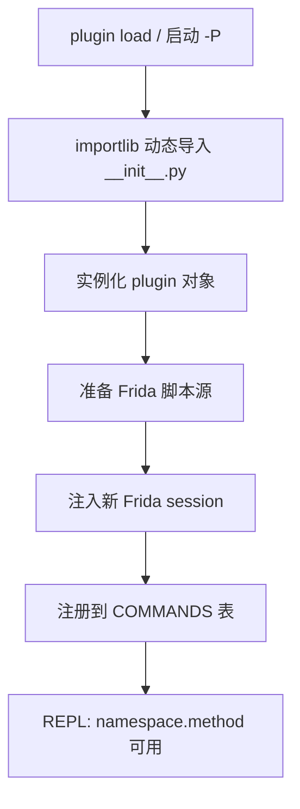
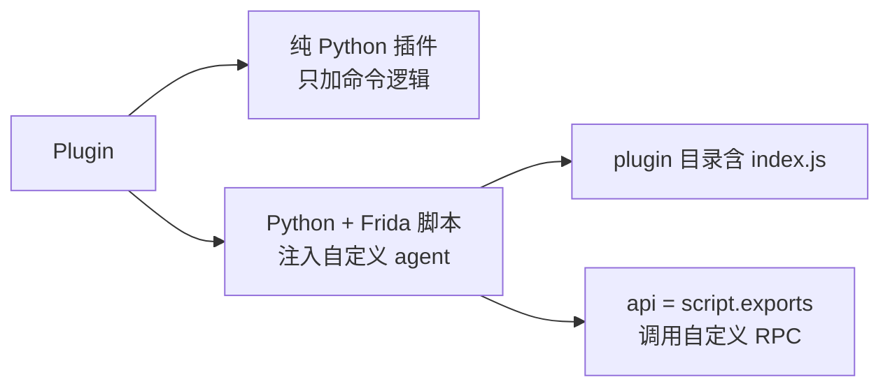

# 插件系统

objection 内置命令覆盖了高频场景，但总有定制需求。插件系统让你用 Python + Frida 脚本扩展自定义能力，无缝接入 REPL。

## 解决的问题

- 你有一组针对特定 App 的 Hook 脚本，想封装成命令复用；
- 你想给 objection 加一个它没有的能力（如某个自定义协议的分析）；
- 你想暴露一个 HTTP API 端点供外部调用。

手写 Frida 脚本每次都要单独注入管理，插件把它们组织成有命名空间、能像原生命令一样调用的模块。

## 用法

```bash
# 启动时从目录加载插件
objection -g com.example.app start -P ./myplugins

# REPL 里加载单个插件
plugin load /path/to/plugin
```

加载后，插件的能力以 `插件命名空间.方法` 的形式出现在 REPL 里，像内置命令一样调用。

## 实现原理

插件系统由两部分组成：**Python 端的加载与注册**、**可选的 Frida 脚本注入**。



### Python 端：动态加载

关键文件：`objection/commands/plugin_manager.py`。`load_plugin()`（`:11`）用 `importlib` 动态加载插件的 `__init__.py`：

```python
spec = importlib.util.spec_from_file_location(str(uuid.uuid4())[:8], path)
plugin = importlib.util.module_from_spec(spec)
spec.loader.exec_module(plugin)
instance = plugin.plugin(namespace)   # 实例化插件
```

然后把它注册进全局命令表（`:58`）：

```python
commands.COMMANDS['plugin']['commands'][instance.namespace] = instance.implementation
```

这样 `namespace.xxx` 就成了 REPL 里的合法命令。

### 插件基类

关键文件：`objection/utils/plugin.py`。插件继承 `Plugin` 基类（`:9`），构造时做两件事：

1. **`_prepare_source()`**（`:41`）：准备要注入的 Frida 脚本源，按优先级：
   - 已设 `script_src` → 直接用；
   - 已设 `script_path` → 读文件；
   - 否则读插件目录下的 `index.js`；
   - 都没有 → 仅 Python 插件，不注入脚本。

2. **`inject()`**（`:77`）：把脚本注入一个**新的 Frida session**（与主 agent 独立），拿到自己的 `exports`：

```python
self.session = self.agent.device.attach(self.agent.pid)
self.script = self.session.create_script(source=self.script_src)
self.script.on('message', self.on_message_handler or 默认handler)
self.script.load()
self.api = self.script.exports
```

### 两种插件形态



- **纯 Python**：不注入脚本，只把 Python 函数注册成命令（调用主 agent 已有能力做组合）；
- **Python + 脚本**：带 `index.js`，注入后插件有自己的 RPC 方法表 `self.api`，可调用脚本里 `rpc.exports` 的自定义方法。

### HTTP API 扩展

插件还可定义 `http_api()` 方法，返回一个 Flask `Blueprint`，会被追加到 objection 的 HTTP API（`plugin.py:101` `_append_to_api`）。这让插件能暴露自定义 REST 端点。

## 官方示例插件

仓库 `plugins/` 目录下有几个示例：

| 插件 | 作用 |
| --- | --- |
| `flex` | 注入 Flex 框架，运行时修改 UI |
| `mettle` | Metasploit 集成 |
| `stetho` | Stetho 调试桥 |
| `api` | API 相关 |

它们展示了插件如何把一个外部能力封装进 objection。

## 关键细节

- **独立 session**：每个脚注插件注入到独立 Frida session，与主 agent 互不干扰，崩溃不影响主功能；
- **命名空间**：插件方法以 `namespace.` 前缀隔离，避免与内置命令冲突；加载时可传第二个参数覆盖命名空间；
- **消息处理**：插件可自定义 `on_message_handler`，否则用 objection 默认的 `script_on_message`；
- **动态导入**：用 `importlib` + 随机 uuid 模块名加载，避免同名冲突。

## 源码索引

| 内容 | 位置 |
| --- | --- |
| 加载入口 | `objection/commands/plugin_manager.py:11` |
| 注册命令表 | `objection/commands/plugin_manager.py:58` |
| 插件基类 | `objection/utils/plugin.py:9` |
| 准备脚本源 | `objection/utils/plugin.py:41` |
| 注入 session | `objection/utils/plugin.py:77` |
| HTTP API 扩展 | `objection/utils/plugin.py:101` |
