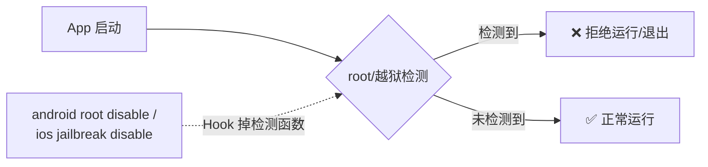
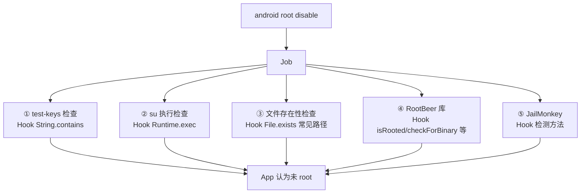
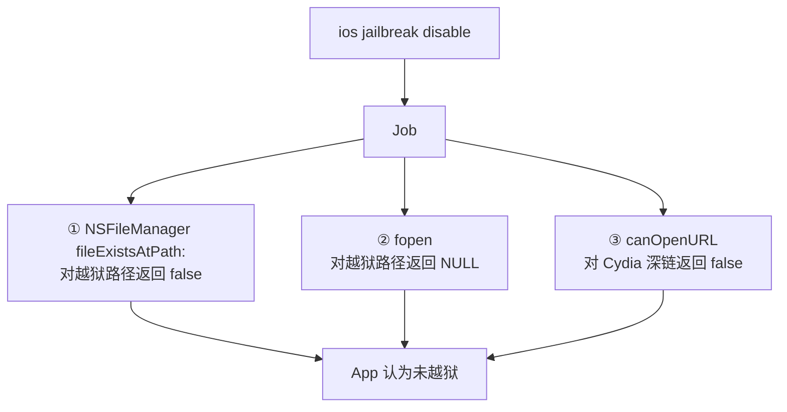
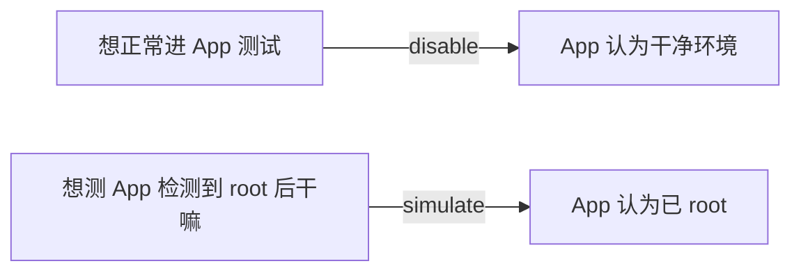

# Root / 越狱检测绕过

App 出于业务保护（支付、DRM、风控）常做 root/越狱检测，检测到就拒绝运行或降级功能。objection 能绕过这些检测，让 App 在已 root/越狱设备上正常跑——这是和 SSL Pinning 绕过并列的高频需求。

## 解决的问题



测试 root/越狱设备时，App 一启动就闪退，根本没法进入主界面做后续分析。绕过检测是测试的第一道门。

## 用法

### Android

```text
# 绕过 root 检测（让检测返回"未 root"）
android root disable

# 模拟 root 已检出（反向，用于测试 App 的检测逻辑分支）
android root simulate
```

### iOS

```text
# 绕过越狱检测
ios jailbreak disable
```

## 实现原理

策略和 SSL Pinning 一样：**广撒网 Hook 掉所有常见检测点**。

### Android root 检测绕过

关键文件：`agent/src/android/root.ts`。`disable()`（`:430`）创建一个 Job，装上多个 Hook：



每个 Hook 的逻辑都是"拦截检测调用，强制返回未 root 的结果"：

| 检测点 | Hook 方式 | 强制返回 |
| --- | --- | --- |
| `test-keys`（编译标志） | `String.contains("test-keys")` | 返回 false（`:30`） |
| `su` 命令执行 | `Runtime.exec("su")` | 抛 IOException 模拟不存在（`:52`） |
| su/busybox 等文件存在 | `File.exists()` 对 `commonPaths` | 返回 false（`:14` 路径表） |
| RootBeer 库 | `isRooted()` / `checkForBinary()` / `checkForDangerousProps()` | 返回 false |
| JailMonkey 库 | 检测方法 | 返回未 root |

`commonPaths`（`root.ts:14`）列出了 12 个常见 su/busybox 路径（`/system/bin/su`、`/system/xbin/su`、`/sbin/su` 等），Hook 时只对这些路径改返回值，不影响正常文件操作。

`simulate` 则相反——把这些检测都强制返回"已 root"，用于验证 App **检测到 root 后的行为**（比如是否会清数据、上报）。

### iOS 越狱检测绕过

关键文件：`agent/src/ios/jailbreak.ts`。检测主要靠查越狱特征文件/Cydia，绕过靠 Hook 文件系统 API：



核心是 `fileExistsAtPath` Hook（`jailbreak.ts:47`），用 `Interceptor.attach` 在 `onEnter` 记录查询路径，`onLeave` 翻转返回值：

```ts
onEnter(args) {
  this.path = new ObjC.Object(args[2]).toString();
  this.is_common_path = jailbreakPaths.indexOf(this.path) >= 0;
},
onLeave(retval) {
  if (!this.is_common_path) return;       // 只动越狱特征路径
  retval.replace(new NativePointer(0x00)); // 强制"文件不存在"
}
```

`jailbreakPaths`（`jailbreak.ts:9`）列了 30+ 个越狱特征路径（`/Applications/Cydia.app`、`/bin/bash`、`/usr/sbin/sshd`、`/private/var/lib/apt` 等）。

## 关键细节

### 为什么设备没越狱也要绕过

`jailbreak.ts` 顶部注释点出一个反直觉场景：设备因系统升级**失去了越狱**，但越狱留下的文件系统痕迹还在，会导致 App **误判为已越狱**。所以即便非越狱设备，也可能需要绕过检测。

### 双向操作

`disable`（伪装成未 root/越狱）和 `simulate`（伪装成已 root/越狱）双向都有用：



### 容错

每个 Hook 都 try/catch `ClassNotFoundException`（RootBeer/JailMonkey 不是每个 App 都用），找不到类时静默跳过，不致 Job 失败。

### Job 化

所有 Hook 注册进 Job，可 `jobs kill <id>` 撤销，恢复原始检测。

## 局限

- **Native 层检测**：若 App 用 C/C++ 自行 `stat()`/`fopen()` 检查文件，Java/ObjC 层 Hook 不一定覆盖（iOS 的 fopen Hook 能挡一部分，但 Android 侧主要在 Java 层）；
- **服务端风控**：检测结果若上报服务器做风控决策，本地绕过不改变服务端判定；
- **强度校验**：部分 App 用 SafetyNet/Play Integrity 这类**远程证明**，本地 Hook 无法伪造，需其他手段。

## 源码索引

| 内容 | 位置 |
| --- | --- |
| Android 命令 | `objection/commands/android/root.py` |
| Android agent | `agent/src/android/root.ts:430` |
| commonPaths | `agent/src/android/root.ts:14` |
| RootBeer 绕过 | `agent/src/android/root.ts`（rootBeerCheck*） |
| iOS 命令 | `objection/commands/ios/jailbreak.py` |
| iOS agent | `agent/src/ios/jailbreak.ts` |
| jailbreakPaths | `agent/src/ios/jailbreak.ts:9` |
| fileExistsAtPath Hook | `agent/src/ios/jailbreak.ts:47` |
