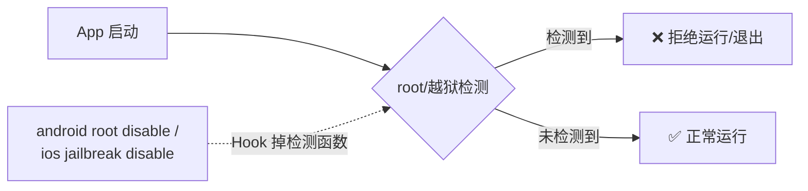
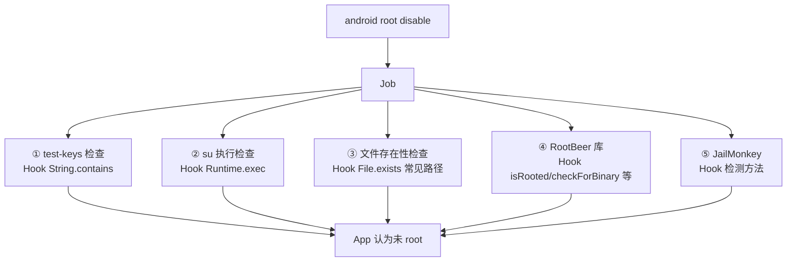
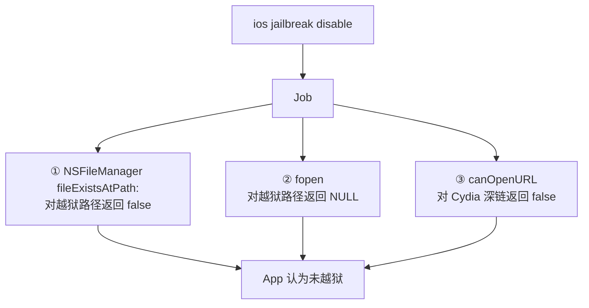
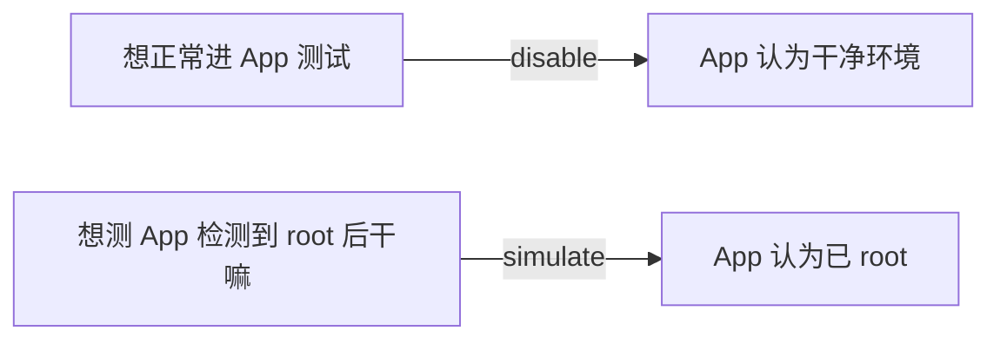
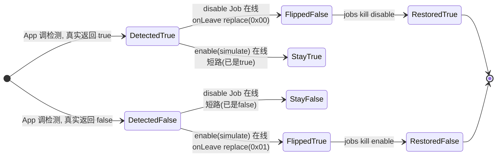
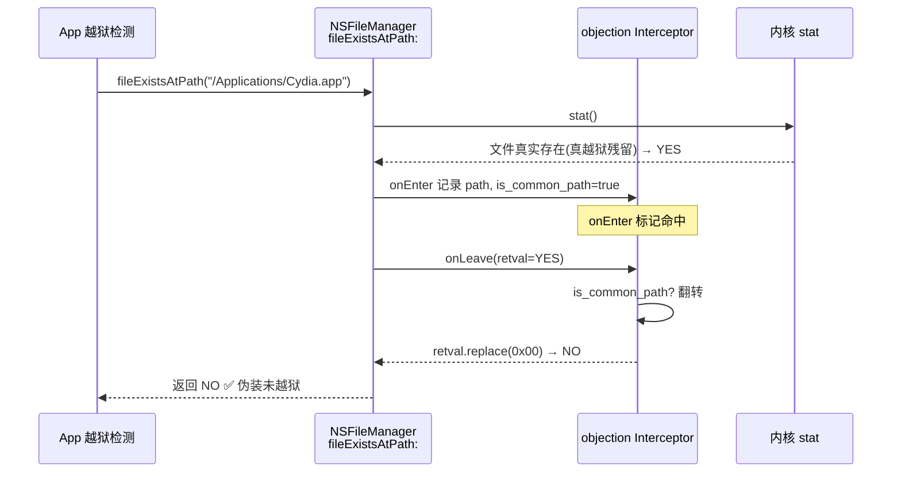

# Root / 越狱检测绕过

App 出于业务保护（支付、DRM、风控）常做 root/越狱检测，检测到就拒绝运行或降级功能。objection 能绕过这些检测，让 App 在已 root/越狱设备上正常跑——这是和 SSL Pinning 绕过并列的高频需求。

## 解决的问题



测试 root/越狱设备时，App 一启动就闪退，根本没法进入主界面做后续分析。绕过检测是测试的第一道门。

## 用法

### Android

```text
# 绕过 root 检测（让检测返回"未 root"）
android root disable

# 模拟 root 已检出（反向，用于测试 App 的检测逻辑分支）
android root simulate
```

### iOS

```text
# 绕过越狱检测
ios jailbreak disable
```

## 实现原理

策略和 SSL Pinning 一样：**广撒网 Hook 掉所有常见检测点**。

### Android root 检测绕过

关键文件：`agent/src/android/root.ts`。`disable()`（`:430`）创建一个 Job，装上多个 Hook：



每个 Hook 的逻辑都是"拦截检测调用，强制返回未 root 的结果"：

| 检测点 | Hook 方式 | 强制返回 |
| --- | --- | --- |
| `test-keys`（编译标志） | `String.contains("test-keys")` | 返回 false（`:30`） |
| `su` 命令执行 | `Runtime.exec("su")` | 抛 IOException 模拟不存在（`:52`） |
| su/busybox 等文件存在 | `File.exists()` 对 `commonPaths` | 返回 false（`:14` 路径表） |
| RootBeer 库 | `isRooted()` / `checkForBinary()` / `checkForDangerousProps()` | 返回 false |
| JailMonkey 库 | 检测方法 | 返回未 root |

`commonPaths`（`root.ts:14`）列出了 12 个常见 su/busybox 路径（`/system/bin/su`、`/system/xbin/su`、`/sbin/su` 等），Hook 时只对这些路径改返回值，不影响正常文件操作。

`simulate` 则相反——把这些检测都强制返回"已 root"，用于验证 App **检测到 root 后的行为**（比如是否会清数据、上报）。

### iOS 越狱检测绕过

关键文件：`agent/src/ios/jailbreak.ts`。检测主要靠查越狱特征文件/Cydia，绕过靠 Hook 文件系统 API：



核心是 `fileExistsAtPath` Hook（`jailbreak.ts:47`），用 `Interceptor.attach` 在 `onEnter` 记录查询路径，`onLeave` 翻转返回值：

```ts
onEnter(args) {
  this.path = new ObjC.Object(args[2]).toString();
  this.is_common_path = jailbreakPaths.indexOf(this.path) >= 0;
},
onLeave(retval) {
  if (!this.is_common_path) return;       // 只动越狱特征路径
  retval.replace(new NativePointer(0x00)); // 强制"文件不存在"
}
```

`jailbreakPaths`（`jailbreak.ts:9`）列了 30+ 个越狱特征路径（`/Applications/Cydia.app`、`/bin/bash`、`/usr/sbin/sshd`、`/private/var/lib/apt` 等）。

## 关键细节

### 为什么设备没越狱也要绕过

`jailbreak.ts` 顶部注释点出一个反直觉场景：设备因系统升级**失去了越狱**，但越狱留下的文件系统痕迹还在，会导致 App **误判为已越狱**。所以即便非越狱设备，也可能需要绕过检测。

### 双向操作

`disable`（伪装成未 root/越狱）和 `simulate`（伪装成已 root/越狱）双向都有用：



### 容错

每个 Hook 都 try/catch `ClassNotFoundException`（RootBeer/JailMonkey 不是每个 App 都用），找不到类时静默跳过，不致 Job 失败。

### Job 化

所有 Hook 注册进 Job，可 `jobs kill <id>` 撤销，恢复原始检测。

## 局限

- **Native 层检测**：若 App 用 C/C++ 自行 `stat()`/`fopen()` 检查文件，Java/ObjC 层 Hook 不一定覆盖（iOS 的 fopen Hook 能挡一部分，但 Android 侧主要在 Java 层）；
- **服务端风控**：检测结果若上报服务器做风控决策，本地绕过不改变服务端判定；
- **强度校验**：部分 App 用 SafetyNet/Play Integrity 这类**远程证明**，本地 Hook 无法伪造，需其他手段。

## 🔬 边界情况与失败模式

### `String.contains` Hook 的全局副作用

`testKeysCheck` Hook 的是 `java.lang.String.contains`（[`root.ts:34`](https://github.com/android-security-engineer/objection-skills/blob/master/agent/src/android/root.ts#L34)）——这是**全进程所有字符串**的 `contains` 调用。实现里做了精确短路：参数不是 `"test-keys"` 时走原实现（`this.contains.call(this, name)`），否则翻转返回值。这意味着：

- 命中频率极高（App 内任何 `str.contains("test-keys")` 都触发回调）；
- 必须保持原实现的尾调用，否则 `String.contains` 的其他语义会被破坏，App 可能崩；
- 这是把双刃剑：能挡住 RootBeer 的 `detectTestKeys`，但也会让任何恰好用 `contains("test-keys")` 做无关判断的代码被误改返回值（极少见，但存在）。

### `File.exists` 同理的"路径白名单"

`fileExistsCheck` Hook `java.io.File.exists`（[`root.ts:80`](https://github.com/android-security-engineer/objection-skills/blob/master/agent/src/android/root.ts#L80)）。短路条件是 `this.getAbsolutePath()` 落在 `commonPaths` 12 条路径里。不在表里的路径走原 `this.exists.call(this)`——文件操作不受影响。注意 `commonPaths` 里有的路径带尾斜杠（`/dev/com.koushikdutta.superuser.daemon/`），App 拼路径时若不一致就匹配不上、绕过失效。

### `Runtime.exec` 的命令尾匹配

`execSuCheck` 判定条件是 `command.endsWith("su")`（[`root.ts:59`](https://github.com/android-security-engineer/objection-skills/blob/master/agent/src/android/root.ts#L59)）。`disable` 时抛 `IOException("objection anti-root")`，`enable`(simulate) 时放行真实执行。坑：命令是 `"su -c ..."` 也匹配；但 `"psu"`、`"musu"` 这类后缀也是 `su` 结尾——会误伤。代价可接受，因为 App 真 root 检测基本只 exec `su`。

### iOS `fopen` 的 Frida 版本兼容

`fopen` Hook 用了 `Module.findGlobalExportByName`，并在不存在时打补丁回退到老 API `findExportByName(null, name)`（[`jailbreak.ts:120`](https://github.com/android-security-engineer/objection-skills/blob/master/agent/src/ios/jailbreak.ts#L120)）。这是为了兼容 Frida < 16.7。若 `fopen` 导出没找到（极罕见，如静态链接进二进制），返回 `null`，`Job.addInvocation` 会跳过——不致命。

### JailMonkey 的"HashMap 全量伪造"

`jailMonkeyBypass`（Android 侧，[`root.ts:387`](https://github.com/android-security-engineer/objection-skills/blob/master/agent/src/android/root.ts#L387)）替换 `JailMonkeyModule.getConstants()`，返回一个全新 `HashMap`，5 个键全置 true/false。**注意 `success` 分支里把 `hookDetected` 也置 true**——simulate 模式会让 JailMonkey 自报"检测到 Hook"，这对测 App 反 Hook 分支有用；但 disable 分支置 false 时连 `hookDetected` 一起否掉，等于顺手藏住了 objection 自己。

### iOS `enable`(simulate) 的 fork 强制失败

`libSystemBFork`（[`jailbreak.ts:248`](https://github.com/android-security-engineer/objection-skills/blob/master/agent/src/ios/jailbreak.ts#L248)）Hook `libSystem.B.dylib::fork`。`success=false`（disable）时把 fork 返回值改 0（伪装 fork 失败），挡掉"fork 自身检测调试器"这类越狱检测。源码 `TODO: Hook vfork` 注明 vfork 还没覆盖——这是已知缺口。

## 🔧 与底层 Frida/系统 API 的交互细节

### Java 层 vs ObjC/Native 层 Hook 的混用

Android root 绕过**全部用 Java 层 Hook**（`Java.use` + `implementation =`），因为检测点都在 Java API 上。iOS 越狱绕过则**混用 ObjC 与 Native**：

- `fileExistsAtPath:` / `canOpenURL:` 走 ObjC（`ObjC.classes.X["- method"]`）；
- `fopen` / `fork` 走 Native Interceptor（`Module.findGlobalExportByName` + `Interceptor.attach`）。

差异原因：iOS 越狱检测常直接 C 层 `fopen`/`fork`，纯 ObjC Hook 挡不住。Android 反例——`su` 检测基本走 `Runtime.exec` 或 `File.exists`，Java 层够用；Native `access()` 检测没覆盖（见局限）。

### `onEnter` 记录 `this` 状态、`onLeave` 翻转返回值

iOS 三个 `Interceptor.attach` Hook 都用同一套模式：`onEnter` 读参数（路径/URL）、判定是否目标、把布尔标记挂在 `this`（Frida 的 per-invocation 上下文对象）上；`onLeave` 读标记决定是否 `retval.replace`。这样避免在 `onLeave` 重新解析参数（参数寄存器此时已变），是 Frida Interceptor 的标准写法。

### `retval.replace(NativePointer(0x01))` 的 BOOL 语义

ObjC `fileExistsAtPath:` 返回 `BOOL`（ARM64 上是 `w0` 寄存器低字节）。`retval.replace(new NativePointer(0x01))` 把整个返回寄存器写 1——对 BOOL 而言等价 `YES`。iOS ABI 下 BOOL 是 `signed char`，写 0x01 而非 0xff 是对的，避免有 App 用 `== YES` 严格比较时穿帮。

## ⚡ 性能与并发考量

- **`String.contains` / `File.exists` 是热点路径**：前者每次字符串搜索都进 Frida JS 回调，后者每次文件 stat 都进。App 启动期可能有上千次 `contains` 调用，会显著拖慢启动。Hook 的精确短路（非目标参数立刻走原实现）是性能命脉；
- **iOS `Interceptor.attach` 比 Java Hook 轻**：Native 层 attach 不涉及 ART/GC 桥接，单次开销低一个数量级。这也是 iOS 侧能放心 Hook `fopen`/`fork` 的原因；
- **多 Job 并存的标记隔离**：每个 Hook 闭包捕获 `ident`，日志带 `[N]` 前缀。`disable` 和 `simulate` 可同时跑（不同 Job ID），但两者会互相覆盖返回值——后触发的 Hook 在 `onLeave` 翻转的结果会被先注册的 Job 再次翻转，最终值取决于 Hook 链顺序。实际别同时开两个反向 Job。

## 📊 Android root 检测函数返回值翻转状态机



## 📊 iOS 越狱绕过完整调用时序



## 🧱 iOS 越狱绕过的 Hook 层次布局

```text
+-------------------------------------------------------------+
|  App 检测代码 (Swift/ObjC)                                  |
|     isJailBroken = fileExists("/Applications/Cydia.app")    |
|                || canOpenURL("cydia://")                    |
|                || fopen("/bin/bash","r") != NULL            |
+-----------------------+-------------------------------------+
                        |  各检测 API
            +-----------+-----------+-----------+
            v           v           v           v
+----------------+ +--------------+ +--------+ +-----------+
| NSFileManager  | | UIApplication| | fopen  | | fork()    |
| fileExists:    | | canOpenURL:  | | (libc) | | libSystem |
|  [ObjC Hook]   | |  [ObjC Hook] | |[Native]| |  [Native] |
+-------+--------+ +------+-------+ +---+----+ +-----+-----+
        |                 |             |             |
        +-----------------+-------------+-------------+
                          |
                          v
+-------------------------------------------------------------+
|  objection Interceptor.onLeave                              |
|  - 读 this.is_common_path / this.is_flagged                 |
|  - retval.replace(NativePointer(0x00 or 0x01))              |
+-------------------------------------------------------------+
```

## 源码索引

| 内容 | 位置 |
| --- | --- |
| Android 命令 | `objection/commands/android/root.py` |
| Android agent | [`agent/src/android/root.ts:430`](https://github.com/android-security-engineer/objection-skills/blob/master/agent/src/android/root.ts#L430) |
| commonPaths | [`agent/src/android/root.ts:14`](https://github.com/android-security-engineer/objection-skills/blob/master/agent/src/android/root.ts#L14) |
| RootBeer 绕过 | `agent/src/android/root.ts`（rootBeerCheck*） |
| iOS 命令 | `objection/commands/ios/jailbreak.py` |
| iOS agent | `agent/src/ios/jailbreak.ts` |
| jailbreakPaths | [`agent/src/ios/jailbreak.ts:9`](https://github.com/android-security-engineer/objection-skills/blob/master/agent/src/ios/jailbreak.ts#L9) |
| fileExistsAtPath Hook | [`agent/src/ios/jailbreak.ts:47`](https://github.com/android-security-engineer/objection-skills/blob/master/agent/src/ios/jailbreak.ts#L47) |
