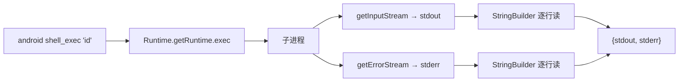
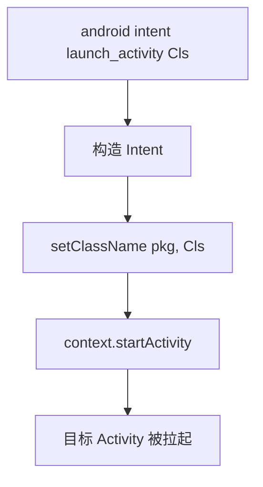
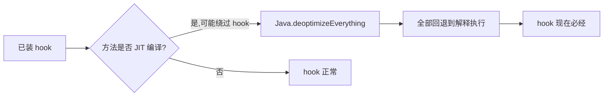
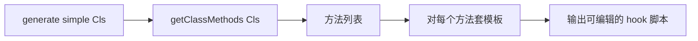
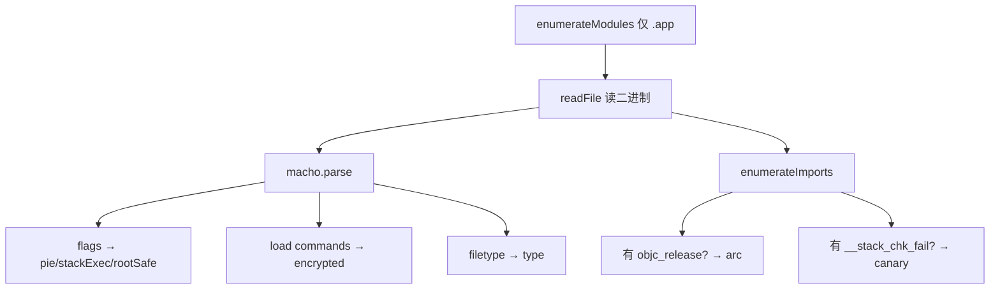

# 运行时操作命令

除了 hook 与取证，objection 还能直接**驱动设备**：跑 shell、截屏、弹窗、发 Intent、开 HTTP 服务、生成 hook 脚本。这些命令把"被动观察"变成了"主动操控"，是动态测试的高阶手段。

## 解决的问题

很多测试场景不只是"看 App 在干什么"，而是要**从外部推 App 一下**：

- 想在设备上跑个 `id` / `ls` 看 context，又不想退出 objection 会话？
- 想截一张当前界面的图，验证你刚绕过的检测确实放行了？
- 想直接拉起某个 Activity / Service，跳过导航直接到目标页？
- 想生成一份针对某个类的 hook 脚本骨架，再手工精修？
- 想评估一个 iOS 二进制的加固情况（加密、PIE、ARC、栈 canary）？

这些都需要在已注入的 agent 会话里，**借 agent 之手**执行设备侧操作。

## 用法

```text
# Android：在设备上跑 shell（共享 agent 的进程权限）
android shell_exec id
android shell_exec ls -l /data/data/com.example/cache

# 截图（写入本地 png）
android ui screenshot /tmp/screen.png
ios ui screenshot /tmp/screen.png

# iOS 弹窗 / 导出 UI 层级 / 绕过 TouchID
ios ui alert "hello from objection"
ios ui dump
ios ui bypass_touchid

# Android FLAG_SECURE（控制能否截屏/录屏）
android ui flag_secure true     # 开启安全标志，禁止截屏
android ui flag_secure false    # 关闭，允许截屏

# Intent：直接拉起 Activity / Service
android intent launch_activity com.example.MainActivity
android intent launch_service com.example.Service
android intent analyze_implicit_intents --dump-backtrace

# VM：强制解释执行（防 hook 被 JIT 绕过）
android deoptimize

# 生成 hook 脚本骨架
android hooking generate simple com.example.Session
ios hooking generate simple Session

# iOS 二进制加固信息
ios binary info

# 命令历史
commands history
commands save history.txt
commands clear

# 设备上的 HTTP 服务器（暴露文件系统）
http start 9000
http status
http stop
```

## 实现原理

这些命令分两类：**借 Java/ObjC 运行时做事**（shell、intent、ui、deoptimize），和**借 Frida 能力做事**（binary、generate、screenshot）。

### Android shell —— `Runtime.exec()`

关键文件：`agent/src/android/shell.ts:15`。`execute()` 用 `Java.use("java.lang.Runtime")` 拿到 Runtime，`exec(cmd)` 起子进程，再分别读 stdout / stderr：



**关键点**：命令跑在 App 的进程上下文里，共享其 uid 与权限——所以 `id` 看到的是 App 的 uid，`ls /data/data/<pkg>` 能直接读（无须 root）。

### Android Intent

关键文件：`agent/src/android/intent.ts`。

- `startActivity()` (`intent.ts:18`)：构造 `Intent`，设 `setClassName(packageName, activityClass)`，调 `context.startActivity()`。用于跳过 UI 导航直达某个 Activity。
- `startService()` (`intent.ts:45`)：同理启动 Service。
- `analyzeImplicits()` (`intent.ts:73`)：Hook `Context.startActivity` / `Activity.startActivityForResult` 等入口，**捕获 App 自己发的隐式 Intent**——这对追踪"App 跳去哪了"非常有用。



### Android deoptimize —— 强制解释执行

关键文件：`agent/src/android/general.ts:6`。一行核心：`Java.deoptimizeEverything()`。

Art 虚拟机会 JIT 编译热点方法为机器码，**已编译的方法可能绕过你的 Java 层 hook**（因为 hook 改的是方法入口，而 JIT 版已脱离）。`deoptimize` 把所有方法打回解释执行，确保 hook 生效：



::: warning 代价
全量 deoptimize 会让 App 明显变慢——只在"hook 装了但不生效"时才用。
:::

### UI 截图与弹窗

**Android 截图** `agent/src/android/userinterface.ts:19`：调 Frida 的 `screenshot()` API（底层走 SurfaceFlinger），返回 RGBA 字节流，Python 侧 `bytearray(map(lambda x: x % 256, data))` 把每字节压到 0–255 写入 png。

**iOS 截图** `agent/src/ios/userinterface.ts:9`：`take()` 同样用 Frida 截图 API。

**iOS 弹窗** `agent/src/ios/userinterface.ts:19`：构造 `UIAlertController`，加一个 OK 按钮，`presentViewController` 弹出。**纯 ObjC 调用**，不依赖 UI 线程阻塞。

**iOS UI dump** `agent/src/ios/userinterface.ts:15`：调 `ios_ui_window_dump`，返回当前界面控件的序列化层级——自动化测试常用。

**TouchID 绕过** `agent/src/ios/userinterface.ts:48`：装一个 Job，Hook `LAContext.evaluatePolicy`，让生物识别校验恒返成功。

### FLAG_SECURE

`agent/src/android/userinterface.ts:60` `setFlagSecure(v)`：调当前 Activity 的 `Window.setFlags(FLAG_SECURE, FLAG_SECURE)`。开启后系统禁止对该窗口截屏/录屏——你反过来用它**关闭**这个保护，就能截屏了。

### Hook 脚本生成

`android hooking generate simple <class>` (`objection/commands/android/generate.py:26`)：调 `android_hooking_get_class_methods` 拿到类所有方法，对每个方法生成一段 `Java.use(clazz).method.implementation = function(){...}` 骨架，输出给用户当起点。



iOS 版同理，生成 `Interceptor.attach(target['method'].implementation, {...})` 骨架。

### iOS 二进制信息

关键文件：`agent/src/ios/binary.ts`。`info()` 用 `macho-ts` 解析 Mach-O 头，结合 Frida `enumerateImports()` 推断加固属性：

| 属性 | 怎么得到 |
| --- | --- |
| `type` | Mach-O `filetype`（如 `MH_EXECUTE`） |
| `encrypted` | 找 `encryption_info` load command，`cryptid != 0` 即加密 |
| `pie` | Mach-O flags 的 `pie` 位 |
| `arc` | 检查是否 import 了 `objc_release` 符号 |
| `canary` | 检查是否 import 了 `__stack_chk_fail` |
| `stackExec` | flags 的 `allow_stack_execution` |
| `rootSafe` | flags 的 `root_safe` |



::: tip 安全评估价值
一眼看出 App 是否上 App Store（必加密）、是否开 PIE/ARC/canary、是否标记 root_safe。未开 PIE+canary 的旧 App 更易被栈溢出利用。
:::

### 命令历史与插件

- `commands history/save/clear`（`objection/commands/command_history.py`）：读写 `app_state.successful_commands`——记录本会话成功跑过的命令，便于复盘。
- `plugin load <path>`（`objection/commands/plugin_manager.py`）：动态加载一个 Python 插件模块，注册其命令到 REPL 树。用于扩展 objection 能力。

## 关键细节

- **shell 共享 App 权限**：`android shell_exec` 跑的是 App 的 uid，不是 root——`id` 显示 `u0_aXXX`。要 root 操作得 App 本身是 root 进程；
- **截图字节取模**：Android 截图字节流可能超 255，Python 侧 `x % 256` 防溢出，但这意味着颜色可能轻微失真；
- **deoptimize 是全局的**：`Java.deoptimizeEverything()` 影响所有方法，无法只针对某个；
- **binary info 只看 .app**：代码 `if (!a.path.includes('.app")) return` 跳过系统库，只解析 App 自身与同级 framework；
- **generate 不装钩**：它只**生成**脚本文本，不实际注入——拿到的脚本你得自己 `evaluate` 或贴进 Frida 跑。

## Agent 接口

这些命令都已接入统一 JSON 输出层，Agent 可结构化调用。例如 `android shell_exec id` 返回：

```json
{"status":"ok","command":"android shell_exec","result":{"command":"id","stdout":"uid=10270...","stderr":""}}
```

完整 result schema 见 SKILL 包 `reference/runtime.md`。

## 源码索引

| 内容 | 位置 |
| --- | --- |
| Android shell | `objection/commands/android/command.py` / `agent/src/android/shell.ts:15` |
| Android intent | `objection/commands/android/intents.py` / `agent/src/android/intent.ts` |
| Android deoptimize | `objection/commands/android/general.py` / `agent/src/android/general.ts:6` |
| Android UI（截图/FLAG_SECURE） | `objection/commands/ui.py` / `agent/src/android/userinterface.ts` |
| iOS UI（弹窗/截图/dump/TouchID） | `objection/commands/ui.py` / `agent/src/ios/userinterface.ts` |
| hook 生成 | `objection/commands/android/generate.py` / `objection/commands/ios/generate.py` |
| iOS binary info | `objection/commands/ios/binary.py` / `agent/src/ios/binary.ts` |
| 命令历史 | `objection/commands/command_history.py` |
| 插件加载 | `objection/commands/plugin_manager.py` |
| HTTP 服务器 | `objection/commands/http.py` / `agent/src/generic/http.ts` |
