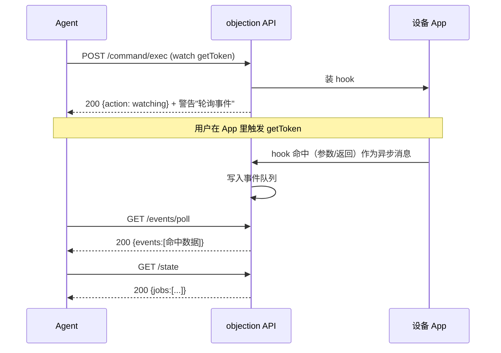

# HTTP API 端点

当 objection 作为 API 服务器运行（`objection -g <pkg> api`，或 `objection start --enable-api`）时，暴露以下 HTTP 端点。默认监听 `127.0.0.1:8888`（可用 `--api-host`/`--api-port` 调整）。

## Agent 端点（推荐）

这组端点工作在 objection 命令层，复用统一输出层，返回 [统一 JSON Schema](./agent-schema)。

### `POST /command/exec`

执行一条或多条 objection 命令。

**请求体**（JSON）：

```json
{ "command": "android hooking list classes" }
```

或多条：

```json
{ "commands": ["android hooking list classes", "env"] }
```

**响应**：单命令时返回一个 envelope 对象；多命令时返回数组。

```bash
curl -X POST http://127.0.0.1:8888/command/exec \
  -H 'Content-Type: application/json' \
  -d '{"command":"android hooking list classes"}'
```

### `GET /state`

返回当前会话状态快照：连接信息、设备、PID、运行中的 Job。

```json
{
  "status": "ok",
  "command": "/state",
  "result": {
    "connection": { "type": "usb", "name": "com.example.app", "spawn": false, ... },
    "pid": 12345,
    "jobs": [ { "id": 1, "type": "hook", "name": "..." } ]
  },
  ...
}
```

若未注入 agent（未以 `api`/`start --enable-api` 启动），返回 `503`。

### `GET /events/poll`

拉取并清空异步事件缓冲（Hook 命中、canary、剪贴板/剪贴板变化、raw keychain、JS 求值输出）。**这是读取 Hook 命中的方式**。

- `?peek=1`：仅查看不清空。

```bash
curl 'http://127.0.0.1:8888/events/poll'
curl 'http://127.0.0.1:8888/events/poll?peek=1'
```

### `GET /capabilities`

枚举所有可用命令及其结构（静态注册表快照，**不需设备连接**）。Agent 应首先调用此端点发现能力。

```bash
curl http://127.0.0.1:8888/capabilities
```

### `GET|POST /agent/rpc/<method>`

直调 agent 的一个 RPC 方法（绕过人类命令层），返回原始结构化数据。

- **GET**：无参方法。
- **POST**：请求体为 JSON 数组，作为方法的位置参数。

```bash
# 无参
curl http://127.0.0.1:8888/agent/rpc/android_hooking_get_classes

# 带参
curl -X POST http://127.0.0.1:8888/agent/rpc/android_hooking_watch \
  -H 'Content-Type: application/json' \
  -d '["com.example.Session!getToken", false, false, true]'
```

## 遗留端点

### `GET|POST /rpc/invoke/<method>`

原始 Frida RPC 桥接（早于 Agent 端点）。行为类似 `/agent/rpc/<method>`，但响应默认 `jsonify`，可用 `?json=false` 取原始响应。新代码推荐用 `/agent/rpc/<method>`（始终返回统一 schema）。

### `POST /script/runonce`

在已连接设备上运行一段任意 Frida 脚本（请求体为脚本源码）。

```bash
curl -X POST http://127.0.0.1:8888/script/runonce \
  --data-binary @my-script.js
```

## 典型多步流程

```bash
# 1. 发现能力
curl http://127.0.0.1:8888/capabilities

# 2. 装钩
curl -X POST http://127.0.0.1:8888/command/exec \
  -H 'Content-Type: application/json' \
  -d '{"command":"android hooking watch com.example.Session!getToken --dump-args --dump-return"}'

# 3. （在应用里触发该功能）

# 4. 读命中
curl http://127.0.0.1:8888/events/poll

# 5. 看已装 Job
curl http://127.0.0.1:8888/state
```

装钩后到拿到命中的完整时序——注意"装钩"与"命中"之间隔着用户在 App 里触发操作：



## 启动 API 服务器

```bash
# 纯 API 模式（无 REPL）
objection -g com.example.app api

# REPL + API（后台线程）
objection -g com.example.app start --enable-api

# 自定义端口
objection -g com.example.app --api-host 0.0.0.0 --api-port 9000 api
```

API 服务器与注入的 agent **共进程**——它操作的是已连接的同一 agent 会话，故 `/state`、`/events/poll` 能反映实时状态。
