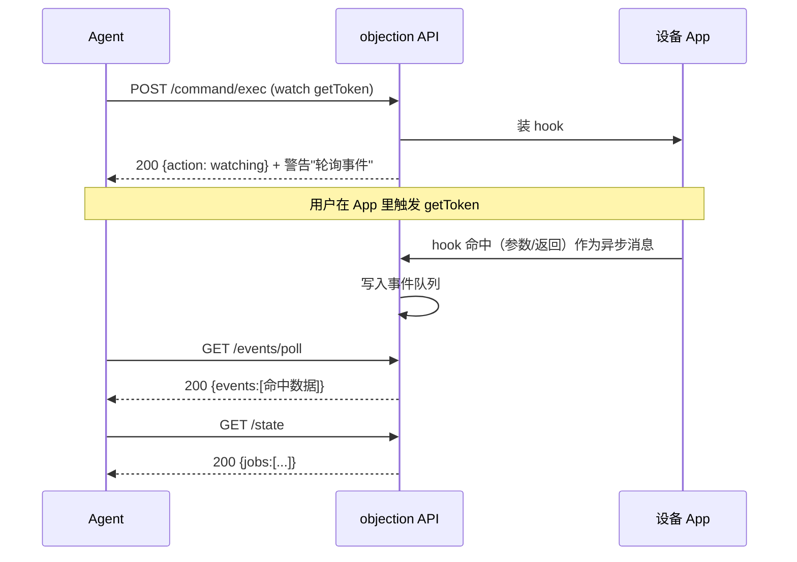
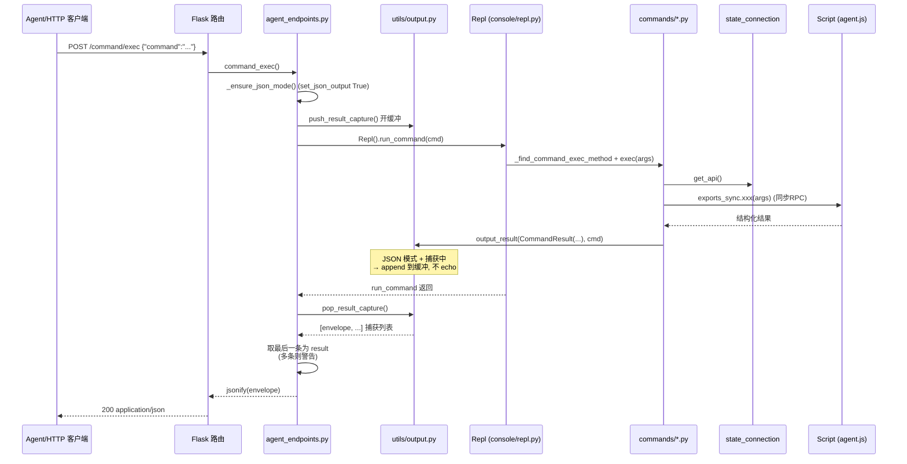

# HTTP API 端点

当 objection 作为 API 服务器运行（`objection -g <pkg> api`，或 `objection start --enable-api`）时，暴露以下 HTTP 端点。默认监听 `127.0.0.1:8888`（可用 `--api-host`/`--api-port` 调整）。

## Agent 端点（推荐）

这组端点工作在 objection 命令层，复用统一输出层，返回 [统一 JSON Schema](./agent-schema)。

### `POST /command/exec`

执行一条或多条 objection 命令。

**请求体**（JSON）：

```json
{ "command": "android hooking list classes" }
```

或多条：

```json
{ "commands": ["android hooking list classes", "env"] }
```

**响应**：单命令时返回一个 envelope 对象；多命令时返回数组。

```bash
curl -X POST http://127.0.0.1:8888/command/exec \
  -H 'Content-Type: application/json' \
  -d '{"command":"android hooking list classes"}'
```

### `GET /state`

返回当前会话状态快照：连接信息、设备、PID、运行中的 Job。

```json
{
  "status": "ok",
  "command": "/state",
  "result": {
    "connection": { "type": "usb", "name": "com.example.app", "spawn": false, ... },
    "pid": 12345,
    "jobs": [ { "id": 1, "type": "hook", "name": "..." } ]
  },
  ...
}
```

若未注入 agent（未以 `api`/`start --enable-api` 启动），返回 `503`。

### `GET /events/poll`

拉取并清空异步事件缓冲（Hook 命中、canary、剪贴板/剪贴板变化、raw keychain、JS 求值输出）。**这是读取 Hook 命中的方式**。

- `?peek=1`：仅查看不清空。

```bash
curl 'http://127.0.0.1:8888/events/poll'
curl 'http://127.0.0.1:8888/events/poll?peek=1'
```

### `GET /capabilities`

枚举所有可用命令及其结构（静态注册表快照，**不需设备连接**）。Agent 应首先调用此端点发现能力。

```bash
curl http://127.0.0.1:8888/capabilities
```

### `GET|POST /agent/rpc/<method>`

直调 agent 的一个 RPC 方法（绕过人类命令层），返回原始结构化数据。

- **GET**：无参方法。
- **POST**：请求体为 JSON 数组，作为方法的位置参数。

```bash
# 无参
curl http://127.0.0.1:8888/agent/rpc/android_hooking_get_classes

# 带参
curl -X POST http://127.0.0.1:8888/agent/rpc/android_hooking_watch \
  -H 'Content-Type: application/json' \
  -d '["com.example.Session!getToken", false, false, true]'
```

## 遗留端点

### `GET|POST /rpc/invoke/<method>`

原始 Frida RPC 桥接（早于 Agent 端点）。行为类似 `/agent/rpc/<method>`，但响应默认 `jsonify`，可用 `?json=false` 取原始响应。新代码推荐用 `/agent/rpc/<method>`（始终返回统一 schema）。

### `POST /script/runonce`

在已连接设备上运行一段任意 Frida 脚本（请求体为脚本源码）。

```bash
curl -X POST http://127.0.0.1:8888/script/runonce \
  --data-binary @my-script.js
```

## 典型多步流程

```bash
# 1. 发现能力
curl http://127.0.0.1:8888/capabilities

# 2. 装钩
curl -X POST http://127.0.0.1:8888/command/exec \
  -H 'Content-Type: application/json' \
  -d '{"command":"android hooking watch com.example.Session!getToken --dump-args --dump-return"}'

# 3. （在应用里触发该功能）

# 4. 读命中
curl http://127.0.0.1:8888/events/poll

# 5. 看已装 Job
curl http://127.0.0.1:8888/state
```

装钩后到拿到命中的完整时序——注意"装钩"与"命中"之间隔着用户在 App 里触发操作：



## 🔄 HTTP 请求 → CommandResult → 响应：完整时序

`POST /command/exec` 把一条人类命令字符串变成统一 JSON 响应，中间经过"强制 JSON 模式 → 复用 REPL 分派 → 命令实现产生 CommandResult → 捕获而非打印 → 包装成 envelope"五段。下图把这条链路画到代码层：



这条链路里有几处设计值得注意：

1. **复用 REPL 分派**：HTTP 端点不另写命令路由，而是 new 一个 `Repl()` 调 [`run_command`](https://github.com/android-security-engineer/objection-skills/blob/master/objection/console/repl.py#L101)——与人类在 REPL 敲命令走**同一条分派路径**（见 [`agent_endpoints.py:90`](https://github.com/android-security-engineer/objection-skills/blob/master/objection/api/agent_endpoints.py#L90)）。这让"命令改造一次、CLI 与 HTTP 同时受益"。
2. **结果捕获而非解析 stdout**：HTTP 场景 stdout 不可靠（可能被并发请求污染），故用 `push_result_capture()`/`pop_result_capture()`（[`objection/utils/output.py:47`](https://github.com/android-security-engineer/objection-skills/blob/master/objection/utils/output.py#L47)）让 `output_result` 在 JSON 模式下把 payload append 到缓冲而非 `click.echo`（[output.py:144](https://github.com/android-security-engineer/objection-skills/blob/master/objection/utils/output.py#L144)）。已改造的命令无需任何改动即可服务于 HTTP。
3. **未改造命令的降级**：若命令没走 `output_result`（仍只打印文本），缓冲为空，端点返回 `result: null` + 警告（[`agent_endpoints.py:108`](https://github.com/android-security-engineer/objection-skills/blob/master/objection/api/agent_endpoints.py#L108)），引导 Agent 改用 `/agent/rpc`。
4. **多条结果取最后**：一条命令偶发产生多个 `CommandResult`（如内部多次 `output_result`），端点取最后一条作 `result`，其余计入警告（[agent_endpoints.py:119](https://github.com/android-security-engineer/objection-skills/blob/master/objection/api/agent_endpoints.py#L119)）。

## 🧱 三种 HTTP 端点的栈深度对照

`/command/exec`、`/agent/rpc`、`/rpc/invoke` 三者都通向 agent，但穿透的层数不同。下面 ASCII 框图对照三者经手的层：

```text
                    /command/exec          /agent/rpc             /rpc/invoke (遗留)
                    ─────────────          ───────────            ─────────────────
┌─ Flask 路由 ──────────────────────────────────────────────────────────────────────┐
│  command_exec()        agent_rpc()          rpc/invoke 路由                       │
└──────┬─────────────────────┬──────────────────────┬──────────────────────────────┘
       │                      │                      │
┌─ 统一输出层 ─────────────────────────────────────────────────────────────────────┐
│  push/pop capture      (无, 直接 jsonify)      (无, 直接 jsonify)                │
│  CommandResult 包装                                                            │
└──────┬─────────────────────┬──────────────────────┬──────────────────────────────┘
       │                      │                      │
┌─ 人类命令层 ─────────────────────────────────────────────────────────────────────┐
│  Repl.run_command      (绕过)               (绕过)                                │
│  → commands/*.py                                                                │
└──────┬─────────────────────┬──────────────────────┬──────────────────────────────┘
       │                      │                      │
┌─ state/connection ───────────────────────────────────────────────────────────────┐
│  get_api() → agent.exports() → script.exports_sync                              │
└──────┬─────────────────────┬──────────────────────┬──────────────────────────────┘
       │                      │                      │
┌─ frida-python ───────────────────────────────────────────────────────────────────┐
│  exports_sync.xxx(args)  (同步RPC, 阻塞)                                          │
└──────┬─────────────────────┬──────────────────────┬──────────────────────────────┘
       │                      │                      │
       ▼                      ▼                      ▼
   agent.js rpc.exports（目标进程内）
```

对照结论：

- **`/command/exec` 最厚**：经人类命令层，能享受 `CommandResult` 的 `warnings`/`jobs_created`/状态语义，但只能调已注册的 objection 命令。
- **`/agent/rpc` 最薄且统一**：绕过命令层直调 agent RPC，但仍强制返统一 schema（[`agent_endpoints.py:277`](https://github.com/android-security-engineer/objection-skills/blob/master/objection/api/agent_endpoints.py#L277)）。适合命令未改造或要原始结构化数据时。
- **`/rpc/invoke` 留作兼容**：行为类似 `/agent/rpc` 但默认 `jsonify` 原始返回，无统一 schema。新代码应优先 `/agent/rpc`。

## ⚖️ 设计权衡

| 决策 | 选择 | 替代方案 | 权衡理由 |
| --- | --- | --- | --- |
| HTTP 复用 REPL 分派 | new Repl + run_command | 为 HTTP 单写命令路由 | 一套命令实现服务 CLI 与 HTTP，避免双份维护。代价是 Repl 构造略重（含 prompt_session），但 run_command 不依赖交互态，可安全复用。 |
| 结果用捕获栈而非解析 stdout | push/pop_result_capture | 解析 stdout / 每命令显式 return | stdout 受并发污染、人类命令本就不 return。捕获栈是透明注入：已改造命令无感复用。 |
| 503 表示无 agent | `_no_agent_response()` 返 503 | 200 + error | 语义上"服务未就绪"比"命令失败"更准确，Agent 可据此判断是否要先 `objection api`。 |
| 事件队列有界 | deque maxlen 1000 | 无界 | Hook 风暴防护（见 [events.py:22](https://github.com/android-security-engineer/objection-skills/blob/master/objection/utils/events.py#L22)）。`dropped` 计数让 Agent 感知丢失。 |
| `peek` 不清空 | `?peek=1` 走 peek_events | 始终 drain | 让 Agent 能"看一眼再决定要不要消费"，便于调试与多客户端共享观察。 |
| `/capabilities` 不需设备 | 静态注册表快照 | 实时枚举 agent | 能力注册表是 Python 侧静态定义，不依赖 agent 会话；这让 Agent 在连设备前就能发现能力、规划流程。 |

## 📜 历史演进

- **`/rpc/invoke` 最早**：直接桥接 Frida RPC，响应 `jsonify`，是 objection 加 HTTP 能力时的第一版。
- **`/script/runonce`**：为跑任意 Frida 脚本加的端点，绕过 objection 命令体系。
- **Agent 友好端点（近期）**：随着 AI Agent 需求，新增 `/command/exec`、`/state`、`/events/poll`、`/capabilities`、`/agent/rpc`（[`agent_endpoints.py`](https://github.com/android-security-engineer/objection-skills/blob/master/objection/api/agent_endpoints.py)）。核心改进是引入 `CommandResult` 统一输出层与事件缓冲，让 HTTP 端点能返回结构化、可轮询的结果——而非裸 RPC 值。
- **`/state` 增强**：早期 state 只返回连接信息；后加入运行中 Job 列表（[agent_endpoints.py:149](https://github.com/android-security-engineer/objection-skills/blob/master/objection/api/agent_endpoints.py#L149)），让 Agent 能跟踪自己装的钩子。

## 启动 API 服务器

```bash
# 纯 API 模式（无 REPL）
objection -g com.example.app api

# REPL + API（后台线程）
objection -g com.example.app start --enable-api

# 自定义端口
objection -g com.example.app --api-host 0.0.0.0 --api-port 9000 api
```

API 服务器与注入的 agent **共进程**——它操作的是已连接的同一 agent 会话，故 `/state`、`/events/poll` 能反映实时状态。
