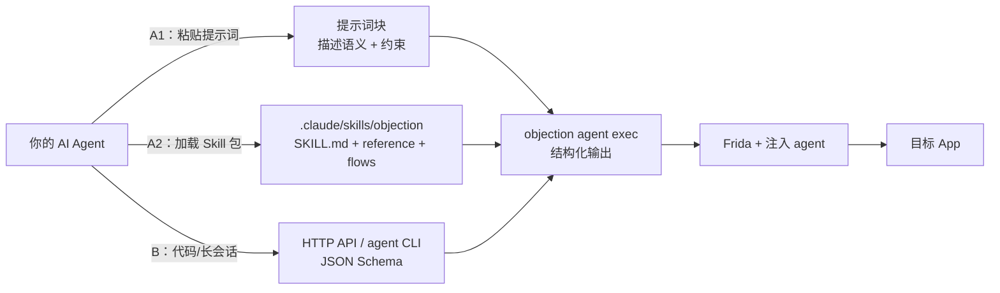

# 🤖 把 objection 装进你的 AI Agent

> objection 已经为 **AI Agent 优先** 设计好了：不再只有面向人类的彩色终端 REPL，而是提供**结构化 JSON 输出、能力自描述、状态感知、事件轮询**。你的 Agent 可以像用一个函数库一样，自主发现并调用它。

本页给你**两条让 Agent 立即会用 objection 的路径**：一条"一键复制"（提示词 + Skill），一条"协议级对接"（HTTP API / agent CLI）。选你顺手的一条，把 objection 变成你 Agent 工具箱里的一个真工具。



---

## 为什么 Agent 比人更需要这种"安装"

传统工具的安装方式是给人准备的：`pip install objection`、打开 REPL、记住彩色命令、人眼看输出。

但**未来的软件是给 Agent 用的**。Agent 需要的是：

| 人的需求 | Agent 的需求 |
| --- | --- |
| 彩色高亮、可读排版 | **结构化 JSON**，可解析、可分支 |
| 记住命令语法 | **能力自描述**（`capabilities`），随时枚举可用命令 |
| 交互式确认 | **非交互**，命令直接执行、不阻塞 |
| 看屏幕上的输出 | **读返回的 `result` 字段**，把结果喂给下一步决策 |
| 手工分步操作 | **长会话复用 + 事件轮询**，异步 hook 命中自动送达 |

objection 为此专门做了四件事：

1. 所有命令返回统一 JSON Schema（`{status, command, result, jobs_created, warnings}`）。
2. 增加 `objection agent ...` CLI 子命令组，**一次性执行单条命令**。
3. 增加 HTTP API server，**长会话 + 事件轮询**（hook 命中、canary、剪贴板变更）。
4. 提供一个官方 **Agent Skill 包**（`.claude/skills/objection/`），把"何时用、怎么用、返回怎么解析"全部写清楚。

---

## 路径 A：一键复制 —— 提示词 / Skill 接入

### A1. 直接把这段"提示词"交给你的 Agent

> 你的助手可以把下面的提示词直接交给任意 AI Agent（Claude、GPT、DeepSeek…）。Agent 会用其中描述的接口与 JSON 语义，自主操作目标 App。

```text
你是一个移动端安全测试 Agent。你的工具是 objection——基于 Frida 的 Android/iOS 运行时测试工具。
它通过注入 agent 到运行中的 App 进程，提供结构化 JSON 输出。

【调用方式】
- 一次性命令：objection -g <包名/包标识> agent exec '<命令>'
- 长会话 API：  objection -g <包名> api start   （启动 HTTP API，默认 127.0.0.1:8888）
- 能力枚举：    objection agent capabilities     （不连设备，列出所有可用命令）
- 状态查询：    objection -g <包名> agent state

【统一返回 Schema】
{ "status": "ok"|"error", "command": "...", "result": {...}, "jobs_created": [...], "warnings": [...] }
先看 status，再看 result；warnings 里常写着"下一步看哪"。

【关键约束】
- 安装 hook 的命令（android hooking watch、android sslpinning disable 等）不返回 Job id，hook 已装好，
  命中事件通过 GET /events/poll 轮询获得。
- JSON 模式下 keystore/keychain clear 等破坏性命令自动执行、不确认，请自行谨慎调用。
- 命令先跑 capabilities 看可用项，不要凭空猜测命令名。
```

### A2. 加载官方 Skill 包（推荐，能力最强）

仓库里已经内置了一份**给 AI Agent 用的 objection Skill**（`.claude/skills/objection/`），包含：

- `SKILL.md` —— 什么时候用、两条传输方式（CLI/HTTP）、统一 JSON Schema、**5 条 Agent 关键约束**、推荐流程、常见能力速查表、故障排查。
- `reference/` —— 按场景拆的速查（hooking、secrets、memory、heap、filesystem、runtime、bypass、jobs-state）。
- `flows/typical-tasks.md` —— 端到端典型任务流。
- `tools/objection_agent.sh` —— 给 Agent 用的 bash 薄封装（强制 JSON 输出）。

**给 Claude Code 用：** 把仓库里 `.claude/skills/objection/` 整个目录放进你项目的 `.claude/skills/` 下（或放进 `~/.claude/skills/` 全局），你的 Claude 就能直接"会" objection：

```bash
# 全局安装（所有项目可用）
mkdir -p ~/.claude/skills
cp -r .claude/skills/objection ~/.claude/skills/
```

**给其他 Agent（GPT / DeepSeek / 自建）用：** Skill 是 Claude 生态格式，但其中 `SKILL.md` 里"调用方式 + JSON 语义 + 约束"这段，**本身就是一段通用提示词**——复制 A1 的提示词块，或把 `SKILL.md` 的正文贴给你的 Agent 作为 system prompt，效果等同。

---

## 路径 B：协议级对接 —— HTTP API / agent CLI

如果你的 Agent 是**代码实现的**（而非提示词驱动的 LLM），或需要**长会话 + 事件流**，走协议对接。

### B1. 启动 API Server

```bash
objection -g com.example.app api start     # 短命令，附带到目标 App
# 或
objection start --enable-api                # 交互式会话里启用
```

默认监听 `127.0.0.1:8888`。

### B2. 关键端点

| 端点 | 方法 | 作用 |
| --- | --- | --- |
| `/command/exec` | POST | 执行命令，body `{"command":"..."}` 或 `{"commands":[...]}` |
| `/state` | GET | 连接 / 设备 / 已装 Job 快照 |
| `/events/poll` | GET | 拉取异步事件（hook 命中、canary、剪贴板）。`?peek=1` 只看不清空 |
| `/capabilities` | GET | 枚举所有命令（静态，不连设备） |
| `/agent/rpc/<method>` | GET/POST | 直调 agent RPC 方法 |

### B3. 最小代码示例（Python）

```python
import requests

BASE = "http://127.0.0.1:8888"

# 1. 发现能力
caps = requests.get(f"{BASE}/capabilities").json()
print("可用命令数:", len(caps.get("result", {})))

# 2. 执行命令
resp = requests.post(f"{BASE}/command/exec", json={"command": "android hooking list classes"})
payload = resp.json()   # {status, command, result, jobs_created, warnings}
if payload["status"] == "ok":
    classes = payload["result"]["classNames"]   # 具体字段见对应 reference 页

# 3. 装 hook 后轮询事件
requests.post(f"{BASE}/command/exec", json={"command": "android hooking watch com.example!login --dump-args"})
# 触发 App 内功能...
events = requests.get(f"{BASE}/events/poll").json()   # 拿到 hook 命中详情
```

### B4. 一次性 CLI（不想起服务的场景）

```bash
objection -g com.example.app agent exec 'android hooking list classes'
objection -g com.example.app agent state
objection agent capabilities
```

每次 `exec` 独立注入，适合脚本 / CI 里的单点查询；多步流程建议走 HTTP API。

---

## 常见接入场景速查

| 你的 Agent 想做什么 | 用它 |
| --- | --- |
| 枚举 App 能测什么 | `agent capabilities` |
| 列已加载类 / 方法 | `agent exec 'android hooking list classes'` |
| 观察某个方法调用 | `agent exec 'android hooking watch <类>!<方法> --dump-args --dump-return'` + `/events/poll` |
| 拿钥匙串 / KeyStore 凭证 | `agent exec 'ios keychain dump'` / `agent exec 'android keystore list'` |
| 绕过证书校验 | `agent exec 'android sslpinning disable'` |
| 搜索内存特征 | `agent exec 'memory search <pattern> --string'` |
| 让 Agent 自己发现命令 | `GET /capabilities` |

---

## 下一步

- 读 [面向 AI Agent 使用](/guide/agent-usage) —— 完整命令与 JSON 字段逐条讲解。
- 读 [统一 JSON Schema](/guide/agent-schema) —— 每条命令的 `result` 长什么样。
- 读 [HTTP API 端点](/guide/agent-http) —— 每个端点的详细参数。
