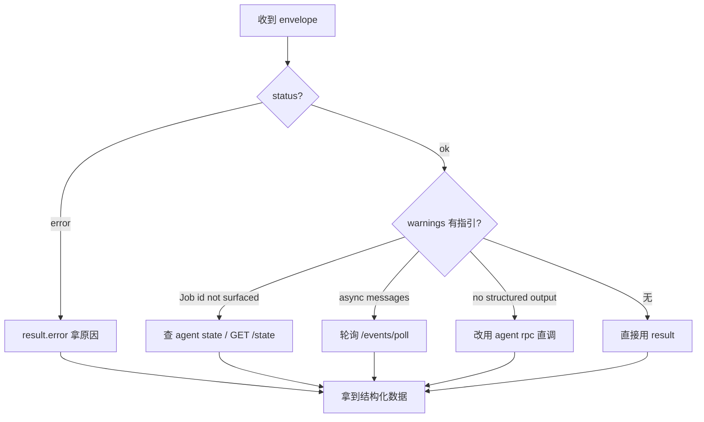
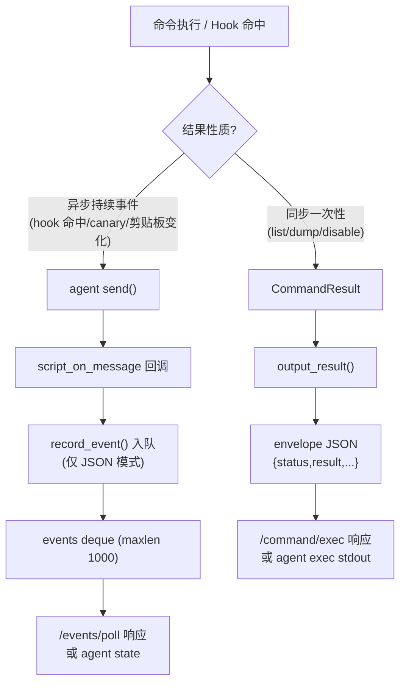

# 统一 JSON Schema

所有 Agent 接口（`agent exec`、`POST /command/exec`、`agent rpc` 等）的输出遵循同一结构，便于 Agent 用统一逻辑解析。

## 完整结构

```json
{
  "status": "ok" | "error",
  "command": "<触发该结果的命令字符串>",
  "result": <任意结构化数据>,
  "jobs_created": [<int>, ...],
  "warnings": ["<string>", ...]
}
```

| 字段 | 类型 | 说明 |
|---|---|---|
| `status` | `"ok"` \| `"error"` | **首先看这个**。失败时 `result` 通常含 `error` 字段。 |
| `command` | string | 触发该结果的命令字符串（用于日志/追踪）。 |
| `result` | 任意 | 命令的核心结构化输出。查询命令是数据；动作命令是 `{"action":"..."}`；错误是 `{"error":"..."}`。 |
| `jobs_created` | int[] | 本次命令创建的 Job id 列表。**当前多数动作命令无法填充**（agent RPC 返回 void），见 `warnings`。 |
| `warnings` | string[] | 非致命警告。**务必读**——常指示下一步去哪看（如 "Job id not surfaced; use `agent state`"）。 |

Agent 解析一个 envelope 的决策路径——先看 `status`，再看 `warnings` 指引的下一步：



## 示例：查询命令

```json
{
  "status": "ok",
  "command": "android hooking list classes",
  "result": {
    "classes": ["com.example.App", "com.example.Session"],
    "count": 2
  },
  "jobs_created": [],
  "warnings": []
}
```

## 示例：动作命令（装钩）

```json
{
  "status": "ok",
  "command": "android hooking watch",
  "result": {
    "action": "watching",
    "pattern": "com.example.Session!getToken",
    "dump_args": true,
    "dump_backtrace": false,
    "dump_return": true
  },
  "jobs_created": [],
  "warnings": [
    "Job id not surfaced; use `agent state` to list running jobs.",
    "Hook invocations arrive as async messages; poll via `agent state` or HTTP /events."
  ]
}
```

钩子已装好，但 Job id 没返回——`warnings` 指引去 `agent state` 查。命中结果走异步事件（见下）。

## 示例：错误

参数缺失：

```json
{
  "status": "error",
  "command": "android hooking watch",
  "result": { "error": "missing pattern" },
  "jobs_created": [],
  "warnings": []
}
```

## 异步事件 schema

异步结果（Hook 命中、canary、剪贴板变化、raw keychain dump、JS 求值输出）不进上面的 envelope，而是缓冲在事件队列，由 `GET /events/poll` 拉取：

```json
{
  "status": "ok",
  "command": "/events/poll",
  "result": {
    "events": [
      { "message": { "type": "send", "payload": { ... } }, "data": null }
    ],
    "dropped": 0,
    "remaining": 0
  },
  "jobs_created": [],
  "warnings": []
}
```

每个 `event.message` 是原始 Frida 消息——典型为 `{"type":"send","payload":{...}}`，`payload` 携带钩子记录的参数/返回/回溯。`dropped` 是队列溢出时丢弃的旧事件数（队列上限 1000）。

## 何时 result 为 null

若一条命令**尚未转换**为结构化输出（仍只打印人类文本），`agent exec`/`/command/exec` 会返回：

```json
{
  "status": "ok",
  "command": "<cmd>",
  "result": null,
  "jobs_created": [],
  "warnings": ["command produced no structured output; it may be unconverted or interactive-only."]
}
```

此时改用 `agent rpc <method>` 直调底层 RPC，或回退到人类命令文本（非 JSON 模式）。

## 🧱 envelope 的组装与序列化

统一 JSON schema 不是凭空产生的，它由 [`CommandResult.to_dict()`](https://github.com/android-security-engineer/objection-skills/blob/master/objection/utils/output.py#L104) 在渲染时组装。下面这张 ASCII 框图画的是一个 `CommandResult` 如何变成 HTTP 响应或 stdout JSON 行：

```text
  命令实现                          output_result()              最终输出
  ────────                          ──────────────              ────────
  ┌────────────────────┐  构造   ┌─────────────────────────┐
  │ CommandResult(     │ ──────▶ │ payload = to_dict(cmd)  │
  │   result=...,      │         │  {status,command,result,│
  │   status='ok',     │         │   jobs_created,warnings}│
  │   warnings=[...],  │         └────────────┬────────────┘
  │   jobs_created=[]  │                      │
  │ )                  │                      │
  └────────────────────┘                      │
                                  ┌───────────┴────────────┐
                                  │                        │
                          _capturing()?              否(CLI agent exec)
                          │ 是(HTTP端点)              │
                          ▼                          ▼
                  append 到捕获缓冲          click.echo(json.dumps)
                          │                          │
                          ▼                          ▼
                  pop_result_capture()       stdout JSON 行
                          │                  (Agent 按行解析)
                          ▼
                  jsonify(envelope)
                          │
                          ▼
                  HTTP 200 application/json
```

组装细节对应到源码：

- **字段填充**：`status`/`result`/`jobs_created`/`warnings` 来自 `CommandResult` 的字段（[`output.py:97-102`](https://github.com/android-security-engineer/objection-skills/blob/master/objection/utils/output.py#L97)）；`command` 字符串由调用方传入（`output_result(result, command=...)`），用于日志追踪。
- **序列化容错**：`json.dumps(payload, ensure_ascii=False, default=str, indent=2)`（[output.py:147](https://github.com/android-security-engineer/objection-skills/blob/master/objection/utils/output.py#L147)）用 `default=str` 兜底非 JSON 原生类型（如 `bytes`、自定义对象），避免序列化崩溃。`ensure_ascii=False` 保留中文等 Unicode。
- **HTTP 路径的捕获**：`/command/exec` 用 `push_result_capture`/`pop_result_capture`（[agent_endpoints.py:95-105](https://github.com/android-security-engineer/objection-skills/blob/master/objection/api/agent_endpoints.py#L95)）把 payload 截到缓冲而非 stdout，再 `jsonify` 返回。
- **CLI 路径直 echo**：`agent exec` 不开捕获，`output_result` 直接 `click.echo` JSON 到 stdout（[output.py:147](https://github.com/android-security-engineer/objection-skills/blob/master/objection/utils/output.py#L147)）。

## 🔄 envelope 与异步事件的分流

envelope 是"同步结果"的容器，异步事件（Hook 命中等）**不进 envelope**，而是走独立的事件队列。下图把两条数据流的分流点画清楚：



这条分流是 Agent 协议的核心约定：

- **envelope 是"我问了一次，拿到一次结果"**：如 `android hooking list classes` 的返回，`result` 里是类列表。
- **事件队列是"我装了钩，之后陆续有命中"**：如 `watch` 的命中，每次方法被调用产生一条事件。Agent 必须**轮询** `/events/poll` 才能拿到，envelope 里不会有。
- **`warnings` 是桥梁**：动作命令的 envelope 里 `warnings` 会明确提示"命中走异步事件"（见上方示例），引导 Agent 去轮询。这是给 Agent 的"下一步路标"。

## ⚖️ 设计权衡

| 决策 | 选择 | 替代方案 | 权衡理由 |
| --- | --- | --- | --- |
| envelope 用固定 5 字段 | status/command/result/jobs_created/warnings | 自由结构 | 固定字段让 Agent 用统一逻辑解析（先看 status，再看 warnings）。`result` 是任意类型承载命令特异数据，平衡了统一与灵活。 |
| `result` 为任意类型 | 不强约束 result schema | 强制 result 为统一形状 | 命令输出千差万别（类列表 vs 密钥树 vs 动作确认），强行统一会失真。各命令 result 形状由 `reference/` 文档单独描述。 |
| `jobs_created` 多数留空 | 动作命令返 `[]` + 警告 | 强制 agent 返回 job id | agent RPC 返回 void，Python 拿不到 job id（job 在 agent 内部创建）。务实做法是用警告引导 `agent state`。 |
| `warnings` 必读 | 非致命警告单列字段 | 混入 result 或 stderr | 警告常含"下一步去哪看"的路标信息，单列字段让 Agent 容易程序化检查，不与数据混杂。 |
| 异步事件独立 schema | `/events/poll` 返 `{events,dropped,remaining}` | 把事件塞进 envelope | 事件是后续陆续到达的，与"一次命令一次结果"的 envelope 生命周期不同；独立队列 + 独立端点更清晰。 |
| `dropped` 计数 | 队列溢出时记 dropped | 静默丢弃 | 让 Agent 能感知"有事件因风暴丢失"，触发更勤轮询或缩窄 Hook。这是有界队列的必要配套。 |

## 📜 历史演进

- **无 schema 阶段**：命令直接打印文本，无结构化输出。
- **`--json <file>` 阶段**：少数命令写 JSON 文件，形状各不相同，无统一约定。
- **统一 envelope 引入**：[`CommandResult`](https://github.com/android-security-engineer/objection-skills/blob/master/objection/utils/output.py#L80) 与 `output_result` 落地，5 字段固定 schema 成为所有 Agent 接口的共识。
- **异步事件 schema**：随事件缓冲（[`events.py`](https://github.com/android-security-engineer/objection-skills/blob/master/objection/utils/events.py)）引入，`/events/poll` 返 `{events,dropped,remaining}`。后加 `?peek=1` 支持不清空查看。
- **`result: null` 降级约定**：为兼容未改造命令，约定返回 `result: null` + 警告引导 `agent rpc`——这让 Agent 能优雅处理"命令还没结构化"的情况，而非崩在解析上。

## 各命令的 result 形状

每个命令的 `result` 字段具体形状，见 SKILL 包的 `reference/` 目录（`hooking.md`、`secrets.md`、`bypass.md`、`heap.md`、`memory.md`、`filesystem.md`、`jobs-state.md`、`environment.md`）。
