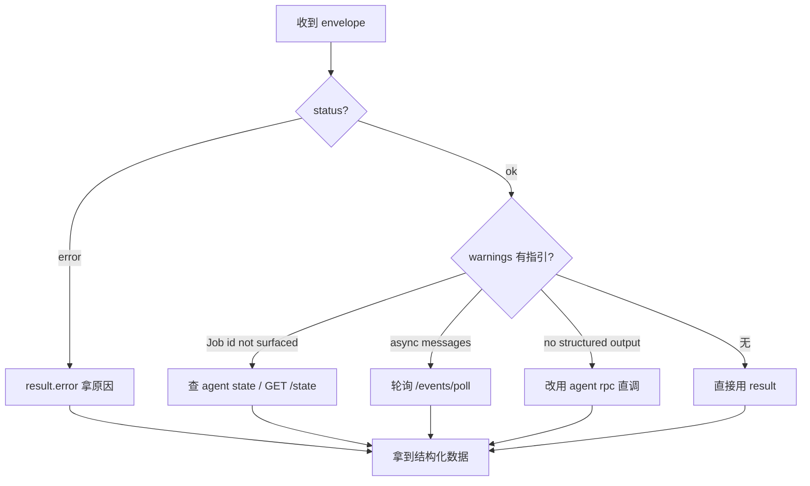

# 统一 JSON Schema

所有 Agent 接口（`agent exec`、`POST /command/exec`、`agent rpc` 等）的输出遵循同一结构，便于 Agent 用统一逻辑解析。

## 完整结构

```json
{
  "status": "ok" | "error",
  "command": "<触发该结果的命令字符串>",
  "result": <任意结构化数据>,
  "jobs_created": [<int>, ...],
  "warnings": ["<string>", ...]
}
```

| 字段 | 类型 | 说明 |
|---|---|---|
| `status` | `"ok"` \| `"error"` | **首先看这个**。失败时 `result` 通常含 `error` 字段。 |
| `command` | string | 触发该结果的命令字符串（用于日志/追踪）。 |
| `result` | 任意 | 命令的核心结构化输出。查询命令是数据；动作命令是 `{"action":"..."}`；错误是 `{"error":"..."}`。 |
| `jobs_created` | int[] | 本次命令创建的 Job id 列表。**当前多数动作命令无法填充**（agent RPC 返回 void），见 `warnings`。 |
| `warnings` | string[] | 非致命警告。**务必读**——常指示下一步去哪看（如 "Job id not surfaced; use `agent state`"）。 |

Agent 解析一个 envelope 的决策路径——先看 `status`，再看 `warnings` 指引的下一步：



## 示例：查询命令

```json
{
  "status": "ok",
  "command": "android hooking list classes",
  "result": {
    "classes": ["com.example.App", "com.example.Session"],
    "count": 2
  },
  "jobs_created": [],
  "warnings": []
}
```

## 示例：动作命令（装钩）

```json
{
  "status": "ok",
  "command": "android hooking watch",
  "result": {
    "action": "watching",
    "pattern": "com.example.Session!getToken",
    "dump_args": true,
    "dump_backtrace": false,
    "dump_return": true
  },
  "jobs_created": [],
  "warnings": [
    "Job id not surfaced; use `agent state` to list running jobs.",
    "Hook invocations arrive as async messages; poll via `agent state` or HTTP /events."
  ]
}
```

钩子已装好，但 Job id 没返回——`warnings` 指引去 `agent state` 查。命中结果走异步事件（见下）。

## 示例：错误

参数缺失：

```json
{
  "status": "error",
  "command": "android hooking watch",
  "result": { "error": "missing pattern" },
  "jobs_created": [],
  "warnings": []
}
```

## 异步事件 schema

异步结果（Hook 命中、canary、剪贴板变化、raw keychain dump、JS 求值输出）不进上面的 envelope，而是缓冲在事件队列，由 `GET /events/poll` 拉取：

```json
{
  "status": "ok",
  "command": "/events/poll",
  "result": {
    "events": [
      { "message": { "type": "send", "payload": { ... } }, "data": null }
    ],
    "dropped": 0,
    "remaining": 0
  },
  "jobs_created": [],
  "warnings": []
}
```

每个 `event.message` 是原始 Frida 消息——典型为 `{"type":"send","payload":{...}}`，`payload` 携带钩子记录的参数/返回/回溯。`dropped` 是队列溢出时丢弃的旧事件数（队列上限 1000）。

## 何时 result 为 null

若一条命令**尚未转换**为结构化输出（仍只打印人类文本），`agent exec`/`/command/exec` 会返回：

```json
{
  "status": "ok",
  "command": "<cmd>",
  "result": null,
  "jobs_created": [],
  "warnings": ["command produced no structured output; it may be unconverted or interactive-only."]
}
```

此时改用 `agent rpc <method>` 直调底层 RPC，或回退到人类命令文本（非 JSON 模式）。

## 各命令的 result 形状

每个命令的 `result` 字段具体形状，见 SKILL 包的 `reference/` 目录（`hooking.md`、`secrets.md`、`bypass.md`、`heap.md`、`memory.md`、`filesystem.md`、`jobs-state.md`、`environment.md`）。
