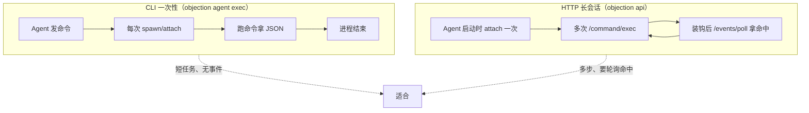
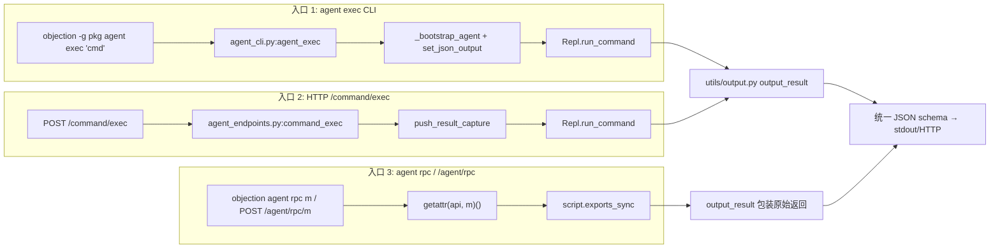

# 面向 AI Agent 使用 objection

objection 既是面向人类渗透测试者的交互式工具，也是**面向 AI Agent 的可编程运行时探测工具**。本文说明如何让 AI Agent（如 Claude）把 objection 当作一个可调用的 SKILL 来驱动。

## 为什么需要专门的 Agent 接口

objection 的传统命令输出是**彩色终端文本**——对人类友好，但对 Agent 不友好：

- 输出无法可靠解析（表格、颜色码、人类措辞）
- 命令不返回值，只打印
- 缺乏能力发现机制（Agent 不知道能调什么、参数是什么）
- 动作命令（Hook、监控）不返回 Job id，Agent 无法跟踪

为此，objection 增加了一层 **Agent 友好接口**：所有命令在 JSON 模式下返回结构化数据，并提供 CLI 子命令组与 HTTP API 两种调用方式。

## 两种调用方式

### 1. CLI 子命令组 `objection agent ...`

一次性调用，自行 attach/spawn 目标：

```bash
# 发现能力（不需设备）
objection agent capabilities

# 执行一条命令，拿 JSON 结果
objection -g com.example.app agent exec 'android hooking list classes'

# 查询会话状态
objection -g com.example.app agent state

# 直调底层 agent RPC
objection -g com.example.app agent rpc android_hooking_get_classes
```

`agent exec` 后接 objection 命令字符串（同 REPL 语法），stdout 输出统一 JSON。

### 2. HTTP API（长会话 + 事件轮询）

若 objection 以 API 服务器运行（`objection -g <pkg> api`），用 HTTP 端点更适合多步流程——保持单一 agent 会话，且可轮询异步事件（Hook 命中）：

```bash
# 执行命令
curl -X POST http://127.0.0.1:8888/command/exec \
  -H 'Content-Type: application/json' \
  -d '{"command":"android hooking list classes"}'

# 拉取异步事件（Hook 命中、canary、剪贴板变化等）
curl http://127.0.0.1:8888/events/poll

# 会话状态
curl http://127.0.0.1:8888/state
```

完整端点见 [HTTP API 端点](./agent-http)。

两种传输方式的对照——CLI 是"一次性会话"，HTTP 是"长会话 + 事件流"：



## 推荐工作流

大部分任务遵循这个形状：

```
1. 发现可用能力   → agent capabilities / GET /capabilities
2. 摸清环境       → agent exec 'env'
3. 定位目标       → agent exec 'android hooking search <class>!<method>'
4. 装钩/取密钥/绕过 → agent exec 'android hooking watch ...' / 'ios keychain dump' / 'android sslpinning disable'
5. 观察结果       → GET /events/poll（Hook 命中）+ GET /state（已装 Job）
```

## 运行时操作命令

除了 hook/取证，objection 还支持一类**运行时操作**命令，均返回统一 JSON schema，Agent 可直接驱动：

- **设备 shell**：`android shell_exec <cmd...>` → `{"command","stdout","stderr"}`，在设备上执行任意 shell 命令，适合探查文件、进程、属性。
- **UI 交互**：`ios ui alert <msg>`、`ios ui screenshot <png>`、`ios ui dump`（导出 UI 层级）、`ios ui bypass_touchid`、`android ui screenshot <png>`、`android ui flag_secure <true|false>`。
- **Intent**：`android intent launch_activity <class>`、`android intent launch_service <class>`、`android intent analyze_implicit_intents [--dump-backtrace]`。
- **VM**：`android deoptimize`（强制解释执行，防 hook 被 JIT 绕过）。
- **生成 hook 脚本**：`android hooking generate simple <class>`、`ios hooking generate simple <class>` → 返回 `{"class","methods","hooks"}`，Agent 可据此生成定制 hook。
- **二进制信息**：`ios binary info` → `{"binaries":{...},"count":n}`（加密/PIE/ARC/Canary 等）。
- **命令历史**：`commands history`、`commands save <file>`、`commands clear`。
- **设备 HTTP 服务器**：`http start [port]`、`http stop`、`http status`（在设备上开 HTTP 暴露文件系统）。
- **插件**：`plugin load <path> [namespace]`。

各命令的 `result` 形状见 SKILL 包 `reference/runtime.md`。

## Agent 必读约束

1. **动作命令不返回 Job id**：装钩命令（`watch`、`sslpinning disable`、`root disable`、各 monitor）返回 `{"action":"..."}` + 警告。钩子**已装好**，命中结果通过 `/events/poll` 取。

2. **异步结果走事件流**：`watch` 的响应只确认钩子已装。实际命中（参数/返回/回溯）在 Agent 触发应用功能后，通过异步消息到达——轮询 `/events/poll`。

3. **JSON 模式无交互提示**：需要 `click.confirm` 的命令（keystore/keychain clear、文件删除、递归下载）在 JSON 模式**自动继续**，不阻塞。开交互 shell 的命令（`sqlite connect`、JS prompt 编辑器）在 JSON 模式**不可用**，返回错误并引导非交互替代。

4. **`--json <filename>` vs 全局 JSON 模式**：某些命令（`memory list modules`、`ios keychain dump`、`android hooking search`）历史上有 `--json <file>` 写文件。在 `agent exec`/HTTP（全局 JSON 模式）下，它们改为返回数据到 stdout/响应；若需文件，显式传 `--json <filename>` 会得到 `{"dumped_to":"<file>"}`。

5. **Android 类惰性加载**：`android hooking list classes` 只列**已加载**的类——先在应用里触发该功能，或用 `android hooking notify <pattern>` 懒装钩。

## SKILL 包

objection 仓库内置了一个 SKILL 包（`.claude/skills/objection/`），供 Claude 等 Agent 直接加载使用：

- `SKILL.md` — 能力自描述、约束、先决条件、典型流程
- `reference/` — 每个命令的参数与返回 schema
- `flows/` — 典型任务流（dump keychain、绕过 pinning、堆操作等）
- `tools/objection_agent.sh` — CLI 包装脚本

加载该 SKILL 后，Agent 即可按上述接口驱动 objection，无需猜测命令格式或解析输出。

## 🧱 Agent 化输出的双层渲染

objection 的命令函数传统上直接 `click.secho` 打印人类文本。Agent 化改造引入了 [`CommandResult`](https://github.com/android-security-engineer/objection-skills/blob/master/objection/utils/output.py#L80) 结构化结果对象：命令函数构造它返回，由 [`output_result`](https://github.com/android-security-engineer/objection-skills/blob/master/objection/utils/output.py#L129) 根据当前模式渲染。下面这张 ASCII 框图画的是同一个 `CommandResult` 在两种模式下走的不同出口：

```text
                  命令实现 commands/*.py
                          │
                          │ 构造并返回
                          ▼
              ┌───────────────────────┐
              │   CommandResult       │
              │  result / status      │
              │  jobs_created         │
              │  warnings / human_text│
              └───────────┬───────────┘
                          │
                          ▼
              ┌───────────────────────┐
              │  output_result()      │  ← utils/output.py:129
              └───────────┬───────────┘
                          │
            ┌─────────────┴─────────────┐
            │                           │
   is_json_output()?                   否（人类模式）
            │ 是（Agent 模式）          │
            ▼                           ▼
  ┌─────────────────────┐    ┌──────────────────────────┐
  │ to_dict() → JSON    │    │ warnings→黄色            │
  │ {status,command,    │    │ human_text 或 result repr │
  │  result,jobs_created│    │ → click.echo 彩色文本    │
  │  ,warnings}         │    └──────────────────────────┘
  └──────────┬──────────┘
             │
   _capturing()?
   ├─ 是(HTTP捕获栈) → append 到缓冲, 供 HTTP 端点取回
   └─ 否(CLI agent exec) → click.echo JSON 到 stdout
```

这套渲染层是 Agent 化的基础设施，关键点：

- **一套数据，两种出口**：`CommandResult` 是纯数据，`output_result` 是渲染策略。Agent 模式产出可解析 JSON，人类模式保留彩色文本——同一个命令实现同时服务两类用户。
- **捕获栈服务 HTTP**：HTTP 端点不能依赖 stdout（并发污染），故 `push_result_capture()` 让 `output_result` 在 JSON 模式下把 payload append 到缓冲而非打印（[output.py:144](https://github.com/android-security-engineer/objection-skills/blob/master/objection/utils/output.py#L144)）。这让改造过的命令无需任何改动即可服务于 HTTP。
- **异步事件独立**：Hook 命中等异步结果不进 `CommandResult`，而是经 `script_on_message` → `record_event` 入事件队列（[events.py:29](https://github.com/android-security-engineer/objection-skills/blob/master/objection/utils/events.py#L29)），由 `/events/poll` 或 `agent state` 取回。这是"动作命令返 envelope + 命中走事件流"双轨制的底层实现。

## 🔄 Agent 调用 objection 的三入口对照

AI Agent 驱动 objection 有三条入口路径，落地到不同代码：



三入口的选择逻辑：

- **`agent exec` / `/command/exec`**：走人类命令层，享受 `CommandResult` 的 warnings/jobs_created 语义，但只能调已注册命令。适合 Agent 走标准 objection 命令（[agent_cli.py:91](https://github.com/android-security-engineer/objection-skills/blob/master/objection/console/agent_cli.py#L91)）。
- **`agent rpc` / `/agent/rpc`**：绕过命令层直调 agent RPC，拿原始结构化返回，仍包装成统一 schema（[agent_cli.py:158](https://github.com/android-security-engineer/objection-skills/blob/master/objection/console/agent_cli.py#L158)、[agent_endpoints.py:264](https://github.com/android-security-engineer/objection-skills/blob/master/objection/api/agent_endpoints.py#L264)）。适合命令未改造或要原始数据。
- **`agent capabilities` / `/capabilities`**：静态注册表快照，不需设备（[agent_cli.py:240](https://github.com/android-security-engineer/objection-skills/blob/master/objection/console/agent_cli.py#L240)）。Agent 第一步用它发现能力。

## ⚖️ 设计权衡

| 决策 | 选择 | 替代方案 | 权衡理由 |
| --- | --- | --- | --- |
| Agent 接口与人类命令共用实现 | `set_json_output(True)` + `CommandResult` 双出口 | 为 Agent 单写一套命令 | 一套命令逻辑服务两类用户，避免双份维护。代价是命令函数要兼顾两种输出（多数靠 `output_result` 统一处理）。 |
| `agent exec` 复用 Repl.run_command | new Repl + run_command | 单写分派 | 复用与人类 REPL 完全相同的命令分派与补全注册表。代价是 Repl 构造略重，但 run_command 不依赖交互态。 |
| 动作命令不返 Job id | 装 hook 返 `{"action":...}` + 警告 | 让 agent 返回 Job id | agent RPC 返回 void，Python 侧拿不到 Job id（job 是 agent 内部创建）。务实做法是用警告引导 Agent 调 `agent state`。 |
| 异步结果走事件队列 | `/events/poll` 拉取 | 实时 stdout 流 | Agent 调用是请求—响应模型，无法接收持续推送。可轮询队列契合 Agent 的拉取模型；有界 + dropped 计数防风暴。 |
| JSON 模式无交互提示 | `click.confirm` 自动继续 | 阻塞等输入 | Agent 无人在终端前，阻塞会挂死。代价是危险操作（如 keychain clear）在 JSON 模式不再确认——靠 Agent 自身谨慎。 |
| 交互命令返错引导 | `sqlite connect` 等返错 + 引导替代 | 强行支持 | 交互编辑器无法在 JSON 模式表达；明确返错并给替代方案（如 `filesystem download` 拉回本地）比半支持更安全。 |

## 📜 历史演进

- **传统命令层**：所有命令直接 `click.secho` 打印彩色文本，只有人类入口。
- **`--json <file>` 阶段**：部分命令（`memory list modules`、`ios keychain dump`）加 `--json` 参数写文件，是最早的结构化输出尝试，但只覆盖少数命令、且写文件而非 stdout。
- **`CommandResult` + 全局 JSON 模式**：引入统一输出层 [`objection/utils/output.py`](https://github.com/android-security-engineer/objection-skills/blob/master/objection/utils/output.py)，`set_json_output(True)` 后所有改造命令走 JSON 出口。`agent exec`/HTTP 全局开启此模式（[agent_cli.py:42](https://github.com/android-security-engineer/objection-skills/blob/master/objection/console/agent_cli.py#L42)）。
- **`agent` 子命令组与 HTTP 端点**：新增 [`objection/console/agent_cli.py`](https://github.com/android-security-engineer/objection-skills/blob/master/objection/console/agent_cli.py) 与 [`objection/api/agent_endpoints.py`](https://github.com/android-security-engineer/objection-skills/blob/master/objection/api/agent_endpoints.py)，提供能力发现、状态查询、事件轮询、直调 RPC——这是为 AI Agent 量身打造的入口层。
- **SKILL 包**：仓库内置 `.claude/skills/objection/` SKILL 包，让 Claude 等 Agent 加载后即按上述接口驱动，无需猜命令格式。这是把"Agent 友好接口"再封装成 Agent 原生可发现的技能。

## 故障排查

- **"Frida server is not running"** → 设备上未跑 `frida-server`，或包名错误。让用户启动它（Android：`adb shell su -c frida-server &`）并用 `frida-ps -U` 确认。
- **类列表为空** → 类未加载；先在应用里导航到该功能。
- **钩子装好但无事件** → 还没在应用里触发被钩方法；触发后再轮询 `/events/poll`。
- **`sqlite connect` 报错** → JSON 模式预期行为；用 `filesystem download` 拉回 DB 本地分析。
- **命令返回 `result: null` + "no structured output" 警告** → 该命令尚未转换；改用 `agent rpc <method>` 直调底层 RPC，或告知用户。
