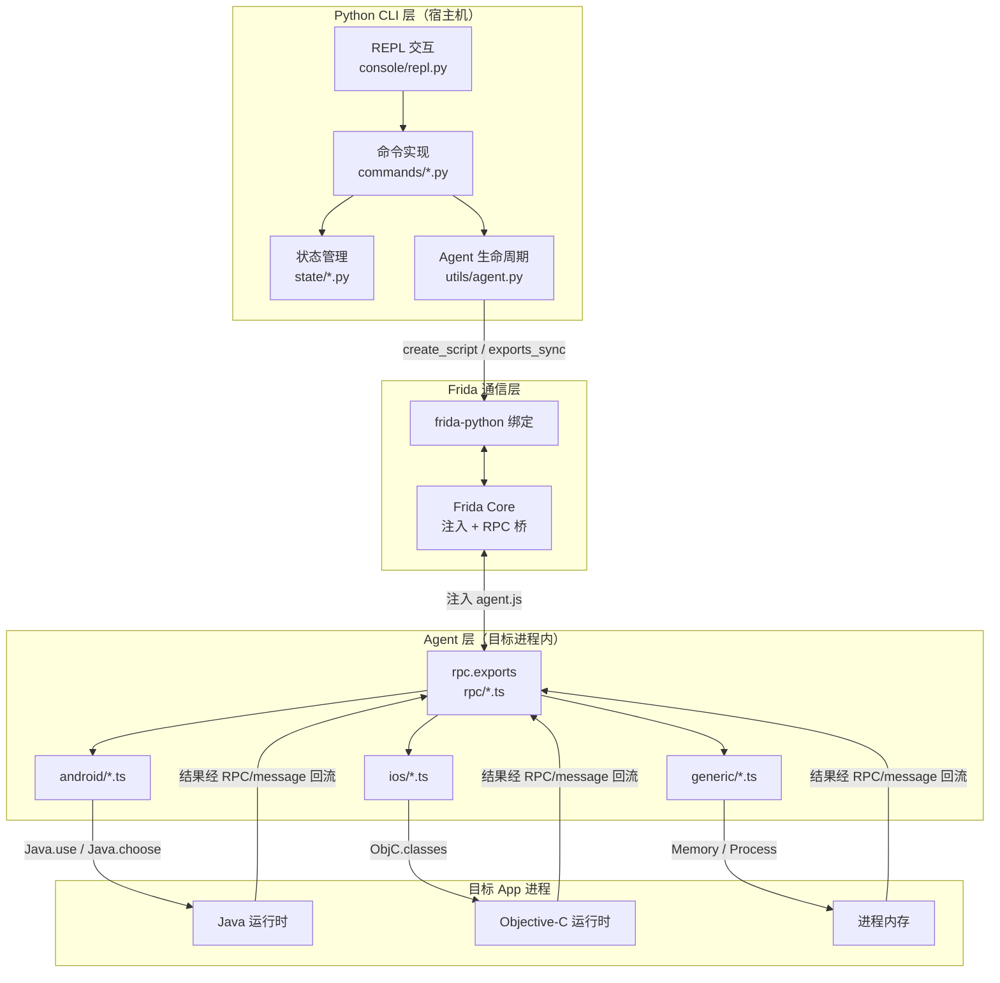
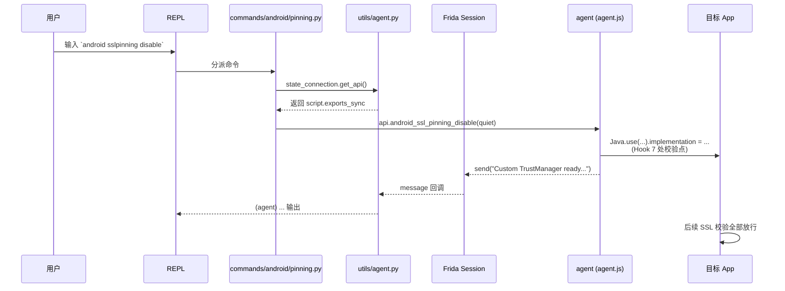
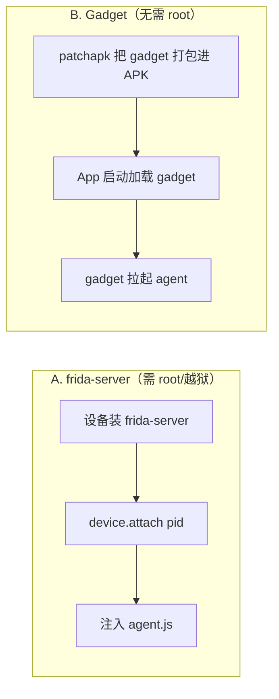

# 整体架构

objection 由三层组成：**Python CLI 层**、**Frida 通信层**、**Agent 层**。理解这三层以及它们之间如何协作，是理解一切功能原理的基础。

## 三层架构总览



## 第 1 层：Python CLI 层

这一层运行在你的**宿主机**上，是你直接交互的对象。

| 组件 | 路径 | 职责 |
| --- | --- | --- |
| 入口命令 | `objection/console/cli.py` | 用 [Click](https://click.palletsprojects.com/) 定义 `objection start / run / patchapk / api` 等命令 |
| REPL | `objection/console/repl.py` | 交互式命令行，把用户输入的命令分派给对应实现 |
| 命令实现 | `objection/commands/android/*.py`、`ios/*.py` | 每个功能点的 Python 侧逻辑，负责调用 agent RPC、格式化输出 |
| 状态管理 | `objection/state/connection.py` 等 | 维护连接方式（USB/网络/本地）、设备、agent 句柄等全局状态 |

CLI 层**不直接操作 App**，它通过 agent 暴露的 RPC 间接操作。

## 第 2 层：Frida 通信层

Python 与目标进程之间的桥梁是 Frida。

- `frida-python`：Frida 的 Python 绑定，objection 用它来枚举设备、attach 进程、注入脚本、调用 RPC。
- 关键 API（见 `objection/utils/agent.py`）：
  - `frida.get_device()` / `get_remote_device()`：获取目标设备；
  - `device.spawn(name)` / `device.attach(pid)`：启动或附加目标进程；
  - `session.create_script(source=agent.js)`：把编译好的 agent 注入进程；
  - `script.exports_sync`：**拿到 agent 暴露的 RPC 方法集合**，Python 端像调普通函数一样调用它们；
  - `script.on('message', handler)`：注册回调，接收 agent 主动 `send()` 回来的消息（如 Hook 命中通知）。

## 第 3 层：Agent 层

agent 是一段注入到**目标进程内部**的代码，用 TypeScript 编写，编译成单个 `agent.js`（`objection/agent.js`）。

- **入口** `agent/src/index.ts`：把所有 RPC 方法聚合并赋给 `rpc.exports`：

  ```ts
  rpc.exports = {
    ...android, ...ios, ...env, ...jobs, ...memory, ...other,
    ping: () => ping(),
  };
  ```

- **能力分模块**：
  - `android/`：Android 专属能力（hooking、pinning、keystore、heap...）；
  - `ios/`：iOS 专属能力（keychain、binary、pasteboard...）；
  - `generic/`：与平台无关的能力（memory、filesystem、http...）；
  - `rpc/`：把上述能力重新组织成扁平的 RPC 方法表，供 `index.ts` 聚合。

agent 在进程内通过 Frida 的运行时桥接操作目标：
- Android：`Java.use(className)` 拿到类句柄，替换 `method.implementation`；
- iOS：`ObjC.classes.XXX` 拿到类，调用 Objective-C 方法；
- 通用：`Memory.scanSync`、`Process.enumerateModules` 等直接操作内存。

## 一次命令的完整流转

以 `android sslpinning disable` 为例，追踪它从敲下回车到 App 行为改变的全过程：



对应代码位置：

1. 命令分派后调用 `objection/commands/android/pinning.py:26` 的 `api.android_ssl_pinning_disable(...)`；
2. `get_api()` 返回 `state/connection.py:73` 的 `agent.exports()`，即 `script.exports_sync`；
3. 这会触发 agent 侧 `agent/src/rpc/android.ts:84` 的 `androidSslPinningDisable` → `agent/src/android/pinning.ts:374` 的 `disable()`；
4. agent 在进程内 Hook 完成，并通过 `send()` 把进度消息回流给 Python 的 `script_on_message` 回调（`utils/agent.py:79`）。

## 两种注入方式

objection 连接目标有两种主流路径，决定了 agent 如何进入进程：



- **frida-server 模式**：设备上常驻一个 frida-server 进程，objection 通过 USB/网络附加到目标 App。能力最强，但需要 root/越狱。
- **Gadget 模式**：把 `frida-gadget.so` 嵌入 APK/IPA，App 启动时 gadget 自动加载 agent。**普通设备可用**，代价是需要重新打包并重签名。

## 小结

| 层 | 在哪 | 用什么 | 干什么 |
| --- | --- | --- | --- |
| Python CLI | 宿主机 | Python + Click | 接收命令、管状态、调 RPC、格式化输出 |
| Frida 通信 | 宿主机 ↔ 设备 | frida-python | 设备枚举、进程附加、脚本注入、RPC 桥接 |
| Agent | 目标进程内 | TypeScript + Frida API | 实际操作 Java/ObjC/内存，执行具体能力 |

带着这个架构，接下来看 [Frida 与 Agent](/guide/frida-agent) 和 [RPC 通信机制](/guide/rpc) 的细节。
