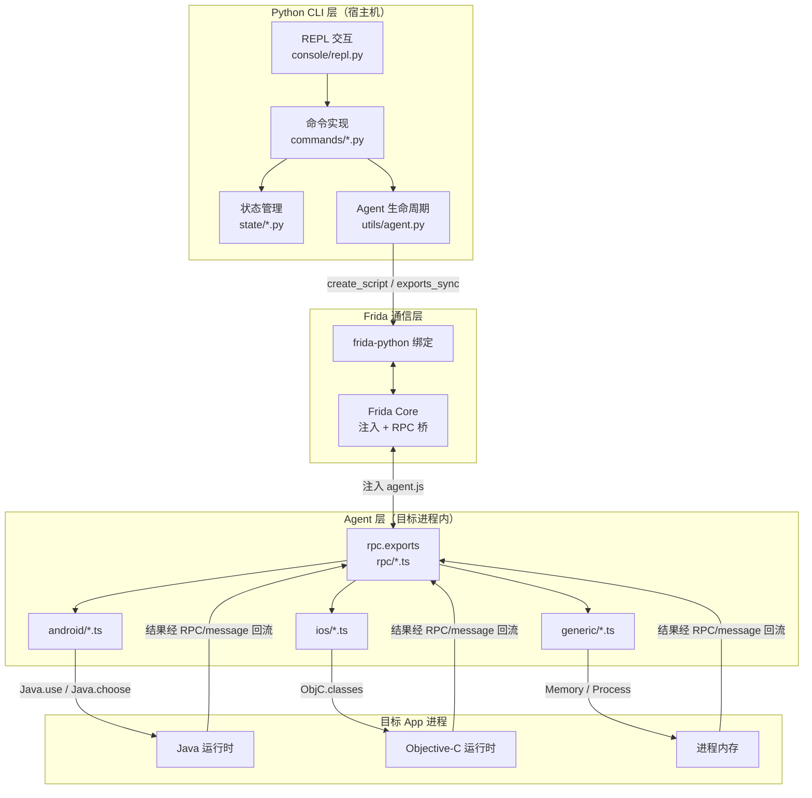
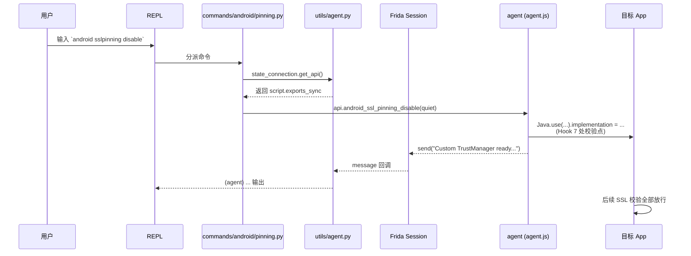
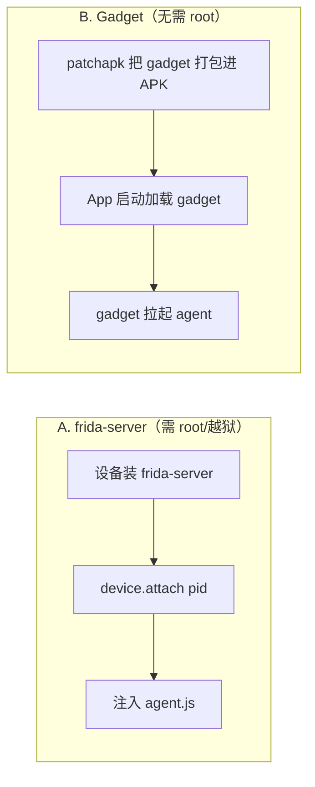
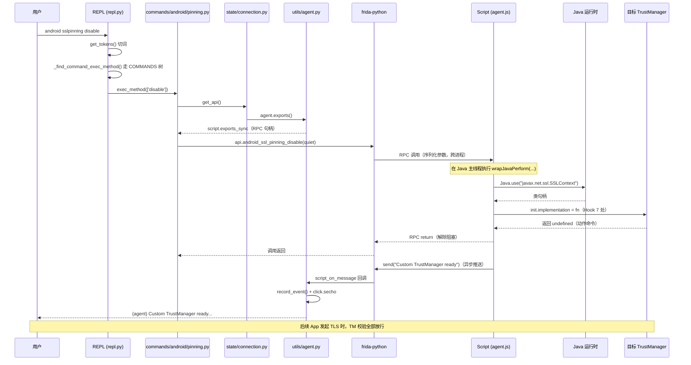
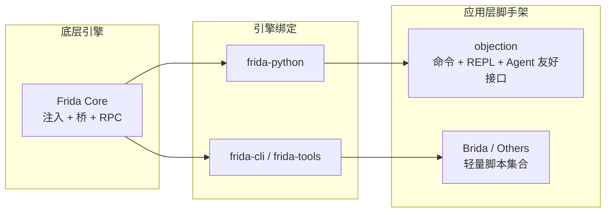

# 整体架构

objection 由三层组成：**Python CLI 层**、**Frida 通信层**、**Agent 层**。理解这三层以及它们之间如何协作，是理解一切功能原理的基础。

## 三层架构总览



## 第 1 层：Python CLI 层

这一层运行在你的**宿主机**上，是你直接交互的对象。

| 组件 | 路径 | 职责 |
| --- | --- | --- |
| 入口命令 | `objection/console/cli.py` | 用 [Click](https://click.palletsprojects.com/) 定义 `objection start / run / patchapk / api` 等命令 |
| REPL | `objection/console/repl.py` | 交互式命令行，把用户输入的命令分派给对应实现 |
| 命令实现 | `objection/commands/android/*.py`、`ios/*.py` | 每个功能点的 Python 侧逻辑，负责调用 agent RPC、格式化输出 |
| 状态管理 | `objection/state/connection.py` 等 | 维护连接方式（USB/网络/本地）、设备、agent 句柄等全局状态 |

CLI 层**不直接操作 App**，它通过 agent 暴露的 RPC 间接操作。

## 第 2 层：Frida 通信层

Python 与目标进程之间的桥梁是 Frida。

- `frida-python`：Frida 的 Python 绑定，objection 用它来枚举设备、attach 进程、注入脚本、调用 RPC。
- 关键 API（见 `objection/utils/agent.py`）：
  - `frida.get_device()` / `get_remote_device()`：获取目标设备；
  - `device.spawn(name)` / `device.attach(pid)`：启动或附加目标进程；
  - `session.create_script(source=agent.js)`：把编译好的 agent 注入进程；
  - `script.exports_sync`：**拿到 agent 暴露的 RPC 方法集合**，Python 端像调普通函数一样调用它们；
  - `script.on('message', handler)`：注册回调，接收 agent 主动 `send()` 回来的消息（如 Hook 命中通知）。

## 第 3 层：Agent 层

agent 是一段注入到**目标进程内部**的代码，用 TypeScript 编写，编译成单个 `agent.js`（`objection/agent.js`）。

- **入口** `agent/src/index.ts`：把所有 RPC 方法聚合并赋给 `rpc.exports`：

  ```ts
  rpc.exports = {
    ...android, ...ios, ...env, ...jobs, ...memory, ...other,
    ping: () => ping(),
  };
  ```

- **能力分模块**：
  - `android/`：Android 专属能力（hooking、pinning、keystore、heap...）；
  - `ios/`：iOS 专属能力（keychain、binary、pasteboard...）；
  - `generic/`：与平台无关的能力（memory、filesystem、http...）；
  - `rpc/`：把上述能力重新组织成扁平的 RPC 方法表，供 `index.ts` 聚合。

agent 在进程内通过 Frida 的运行时桥接操作目标：
- Android：`Java.use(className)` 拿到类句柄，替换 `method.implementation`；
- iOS：`ObjC.classes.XXX` 拿到类，调用 Objective-C 方法；
- 通用：`Memory.scanSync`、`Process.enumerateModules` 等直接操作内存。

## 一次命令的完整流转

以 `android sslpinning disable` 为例，追踪它从敲下回车到 App 行为改变的全过程：



对应代码位置：

1. 命令分派后调用 [`objection/commands/android/pinning.py:26`](https://github.com/android-security-engineer/objection-skills/blob/master/objection/commands/android/pinning.py#L26) 的 `api.android_ssl_pinning_disable(...)`；
2. `get_api()` 返回 `state/connection.py:73` 的 `agent.exports()`，即 `script.exports_sync`；
3. 这会触发 agent 侧 [`agent/src/rpc/android.ts:84`](https://github.com/android-security-engineer/objection-skills/blob/master/agent/src/rpc/android.ts#L84) 的 `androidSslPinningDisable` → [`agent/src/android/pinning.ts:374`](https://github.com/android-security-engineer/objection-skills/blob/master/agent/src/android/pinning.ts#L374) 的 `disable()`；
4. agent 在进程内 Hook 完成，并通过 `send()` 把进度消息回流给 Python 的 `script_on_message` 回调（`utils/agent.py:79`）。

## 两种注入方式

objection 连接目标有两种主流路径，决定了 agent 如何进入进程：



- **frida-server 模式**：设备上常驻一个 frida-server 进程，objection 通过 USB/网络附加到目标 App。能力最强，但需要 root/越狱。
- **Gadget 模式**：把 `frida-gadget.so` 嵌入 APK/IPA，App 启动时 gadget 自动加载 agent。**普通设备可用**，代价是需要重新打包并重签名。

## 🔄 一次完整命令的端到端时序

把"用户敲下回车"到"App 行为改变"拆成 12 步，可以看到三层各干了什么、何时切换线程上下文。下图把同步 RPC 往返与异步 `send()` 推送画在同一条时序里，便于看出二者何时介入：



关键切换点解读：

1. **第 6-7 步**：`get_api()` 只是返回 [`objection/state/connection.py:73`](https://github.com/android-security-engineer/objection-skills/blob/master/objection/state/connection.py#L73) 的 `agent.exports()` 句柄，并不触网。真正的跨进程调用发生在第 9 步。
2. **第 9-10 步**：frida-python 把 Python 的位置参数序列化，经 Frida Core 的 RPC 桥传给目标进程内的 agent。这一步**阻塞当前 Python 线程**——这就是 `exports_sync` 中"sync"的含义（区别于异步的 `exports` 返回 Promise）。
3. **第 11-13 步**：agent 在目标进程内执行，但**所有 Java 操作必须在 Java 主线程上下文**跑，故包在 `wrapJavaPerform(() => { ... })` 里。这正是 Hook 7 处校验点的 [`agent/src/android/pinning.ts:374`](https://github.com/android-security-engineer/objection-skills/blob/master/agent/src/android/pinning.ts#L374) `disable()` 的内部结构。
4. **第 14-15 步**：动作命令（装 Hook）的 RPC 返回值通常是 `undefined`，Python 线程被唤醒。
5. **第 16-18 步**：agent 主动 `send()` 的进度消息走的是**另一条通道**（见 [RPC 通信机制](/guide/rpc)），由 [`objection/utils/agent.py:79`](https://github.com/android-security-engineer/objection-skills/blob/master/objection/utils/agent.py#L79) `script_on_message` 接收，先 `record_event()` 缓冲、再 `click.secho` 打印。

## 🧱 进程内存布局：三层各占哪块

理解三层架构时，画清楚"谁在哪块内存"能消除大量混淆。下面这张 ASCII 框图展示一次 attach 后宿主机与目标设备上的进程/内存分布：

```text
┌─────────────────────────── 宿主机（你的电脑）───────────────────────────┐
│                                                                         │
│  objection Python 进程                                                  │
│  ┌───────────────────────────────────────────────────────────────────┐  │
│  │ click CLI / REPL              frida-python 绑定                    │  │
│  │ ┌─────────────────┐           ┌─────────────────────────────────┐  │  │
│  │ │ commands/*.py   │──────────▶│ device / session / script 句柄  │  │  │
│  │ │ state/* 单例    │           │ script.exports_sync (RPC 桩)     │  │  │
│  │ │ utils/agent.py  │           │ script.on('message', cb)        │  │  │
│  │ └─────────────────┘           └──────────────┬──────────────────┘  │  │
│  └───────────────────────────────────────────────┼─────────────────────┘  │
│                                                  │ USB / TCP / local      │
└──────────────────────────────────────────────────┼──────────────────────────┘
                                                   │
                       ┌───────────────────────────┴────────────────────────┐
                       │  Frida Core（设备侧：frida-server 或 gadget 内）   │
                       │  注入 agent.js → 目标进程地址空间                   │
                       └───────────────────────────┬────────────────────────┘
                                                   │ ptrace/动态链接器
┌──────────────────────────────────────────────────┼──────────────────────────────────┐
│  目标 App 进程（com.example.app）                ▼                                  │
│  ┌──────────────────────────────────────────────────────────────────────────────┐  │
│  │  agent.js（Frida 注入的脚本，运行在 Frida V8/QJS 运行时）                     │  │
│  │  ┌──────────────────┐  ┌──────────────────┐  ┌────────────────────────┐    │  │
│  │  │ rpc.exports      │  │ Java.choose/use  │  │ Memory.scanSync /      │    │  │
│  │  │ (Python 可调)    │  │ ObjC.classes     │  │ Process.enumerate*     │    │  │
│  │  └──────────────────┘  └────────┬─────────┘  └───────────┬────────────┘    │  │
│  │           │                       │                        │                 │  │
│  └───────────┼───────────────────────┼────────────────────────┼─────────────────┘  │
│              │ 调用桥接               │                        │                    │
│  ┌───────────▼──────────┐ ┌──────────▼─────────┐ ┌───────────▼──────────────┐     │
│  │ ART / Dalvik 运行时  │ │ ObjC runtime       │ │ 进程自身内存（heap/栈）  │     │
│  │ Java 类、方法、实例  │ │ 类、方法、对象     │ │ 模块、映射区             │     │
│  └──────────────────────┘ └────────────────────┘ └──────────────────────────┘     │
└────────────────────────────────────────────────────────────────────────────────────┘
```

要点：

- **Python 端只持有句柄**：`device`/`session`/`script` 是 frida-python 给的代理对象，Python 侧并不持有目标进程的内存。所有"操作"都是经 RPC 桥让 agent 在进程内代为执行。
- **agent 与目标同进程**：agent.js 被注入目标进程，和 App 的 Java/ObjC 运行时**共享地址空间**——这就是它能 `Java.use`、`Memory.scanSync` 直接操作的原因，也是 Frida 强大的根源。
- **agent 的运行时是独立的**：Frida 在目标进程内塞了一个 V8（或 QuickJS）运行时来跑 agent.js，它和 ART/Dalvik 是两套执行环境，靠 frida-java-bridge 这类桥接包互通（见 [`agent/package.json`](https://github.com/android-security-engineer/objection-skills/blob/master/agent/package.json#L33) 的 `frida-java-bridge` 依赖）。

## ⚖️ 设计权衡

三层架构不是偶然，每个分层决策背后都有明确的取舍：

| 决策 | 选择 | 替代方案 | 权衡理由 |
| --- | --- | --- | --- |
| Agent 用什么写 | TypeScript | 直接写 JS / 用 Python | TS 编译期捕获类型错误；agent 依赖大量 Frida 桥接 API，类型提示让维护成本可控。代价是多一道 frida-compile 构建步骤（见 [Frida 与 Agent](/guide/frida-agent)）。 |
| Agent 与命令的边界 | Agent 暴露细粒度 RPC，命令层负责编排+格式化 | Agent 直接返回格式化文本 | 让 Agent 输出**结构化数据**，Python 端可同时服务人类（彩色文本）与 AI Agent（JSON），见 [`objection/utils/output.py`](https://github.com/android-security-engineer/objection-skills/blob/master/objection/utils/output.py)。 |
| 同步 vs 异步通道 | `exports_sync`（阻塞）+ `send()`（回调） | 全异步 | 简单命令（`keystore list`）用同步拿一次性结果最直观；持续事件（Hook 命中）天然适合异步。两者职责清晰、互不替代。 |
| 状态管理 | 进程内单例 `state_connection` | 每次传参 | REPL 命令实现需要一个稳定的"当前会话"概念；单例让任意命令实现都能拿到 agent 句柄（见 [`objection/state/connection.py:96`](https://github.com/android-security-engineer/objection-skills/blob/master/objection/state/connection.py#L96)）。代价是并发受限——一次 REPL 只服务一个会话。 |
| 注入方式 | spawn + 暂停 + resume | 直接 attach 已运行进程 | spawn+pause 让 agent 在 App 任何用户代码执行**之前**就位，能 Hook 启动期逻辑（如 Application.onCreate 里的初始化）。attach 错过启动期但可热插入运行中的 App。 |

## 🆚 与同类工具对比

把 objection 放进运行时插桩工具的谱系里看，三层架构的位置更清楚：



| 维度 | frida-tools（`frida`/`frida-trace`） | objection | 自写 Frida 脚本 |
| --- | --- | --- | --- |
| 形态 | 通用 REPL/trace | 移动安全测试命令包 | 一次性脚本 |
| 能力发现 | 无（你写什么跑什么） | `agent capabilities` / `/capabilities` 自描述 | 无 |
| 输出 | 原始 JS 值 | 统一 JSON schema + 人类文本双模式 | 自行处理 |
| 任务管理 | 手动 | `jobs` 注册表 + Job 生命周期 | 手动 |
| 平台能力 | 通用 | 内置 SSL Pinning 绕过、Keychain/Keystore dump、堆搜索等高频封装 | 全靠手写 |
| 学习曲线 | 低（但要懂 Frida API） | 中（命令多但开箱即用） | 高（每个任务从零） |

objection 的差异化正在于**应用层**：它把 Frida 引擎的通用能力，针对移动安全测试的高频场景做了命令化封装，并补齐了 AI Agent 友好的结构化输出层——这是 frida-tools 不提供、自写脚本要重复造的部分。

## 📜 历史演进

三层架构是逐步长出来的，理解它现在的样子需要看它从哪来：

- **早期（v1）**：objection 起源于 Leon Jacobs 在 SensePost 的工作，最初就是"Frida + 一组移动安全脚本 + REPL"，三层雏形即定。
- **Agent TypeScript 化**：早期 agent 是纯 JS，后迁到 TypeScript 并用 frida-compile 打包成单文件 `objection/agent.js`。这让 agent 代码量增长后仍可维护（见 [构建 Agent](/guide/frida-agent#构建-agent-开发者)）。
- **HTTP API（`objection api`）**：为支持脚本/CI 驱动，加了 Flask 蓝图，最早只有 `/rpc/invoke` 直接桥接 Frida RPC。
- **AI Agent 友好层（近期）**：随着 LLM Agent 兴起，新增了 `agent exec`/`agent rpc`/`agent state`/`agent capabilities` CLI 子命令组（[`objection/console/agent_cli.py`](https://github.com/android-security-engineer/objection-skills/blob/master/objection/console/agent_cli.py)）与 `/command/exec`、`/state`、`/events/poll`、`/capabilities`、`/agent/rpc` HTTP 端点（[`objection/api/agent_endpoints.py`](https://github.com/android-security-engineer/objection-skills/blob/master/objection/api/agent_endpoints.py)），并引入 `CommandResult` 统一输出层（[`objection/utils/output.py`](https://github.com/android-security-engineer/objection-skills/blob/master/objection/utils/output.py)）和异步事件缓冲（[`objection/utils/events.py`](https://github.com/android-security-engineer/objection-skills/blob/master/objection/utils/events.py)）。这是在原有"Python CLI ↔ Frida ↔ Agent"三层之上，为 Agent 又加了一层结构化输出与事件轮询能力——**三层没变，但每层都长了 Agent 友好的副通道**。
- **Reconnect 增强**：REPL 的 `reconnect`/`reset`/`reconnect_spawn` 命令（[`objection/console/repl.py:283`](https://github.com/android-security-engineer/objection-skills/blob/master/objection/console/repl.py#L283)）让会话断裂后能在不退出 REPL 的情况下重建 agent，提升长测试会话的鲁棒性。

## 小结

| 层 | 在哪 | 用什么 | 干什么 |
| --- | --- | --- | --- |
| Python CLI | 宿主机 | Python + Click | 接收命令、管状态、调 RPC、格式化输出 |
| Frida 通信 | 宿主机 ↔ 设备 | frida-python | 设备枚举、进程附加、脚本注入、RPC 桥接 |
| Agent | 目标进程内 | TypeScript + Frida API | 实际操作 Java/ObjC/内存，执行具体能力 |

带着这个架构，接下来看 [Frida 与 Agent](/guide/frida-agent) 和 [RPC 通信机制](/guide/rpc) 的细节。
