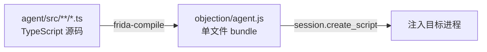
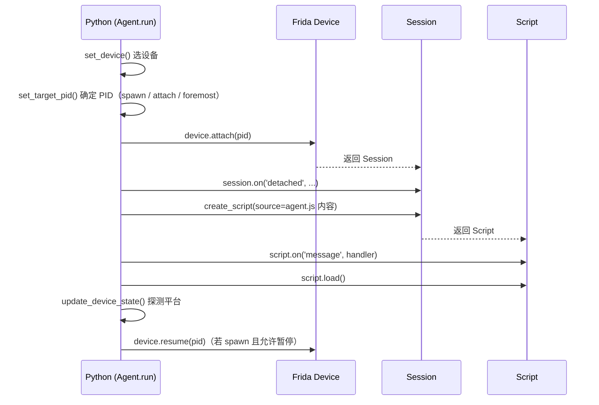

# Frida 与 Agent

这一页讲 Agent 层的细节：它是什么、怎么构建、怎么注入、注入后如何与目标交互。

## Agent 是什么

Agent 是一段**运行在目标进程内部**的 JavaScript 代码。在 objection 中，它用 TypeScript 编写，源码在 `agent/src/`，经 [frida-compile](https://github.com/frida/frida-compiler) 编译打包成单个 `objection/agent.js` 文件。



为什么用 TypeScript？因为 agent 要频繁调用 Frida 的 Java/ObjC 桥接 API，类型系统能在编译期 catches 大量错误，也让代码更易维护。

## Agent 的目录结构

```text
agent/src/
├── index.ts          # 入口：聚合所有 rpc.exports
├── android/          # Android 专属能力
│   ├── hooking.ts    #   方法 Hook
│   ├── pinning.ts    #   SSL Pinning 绕过
│   ├── keystore.ts   #   Keystore 监控
│   ├── heap.ts       #   堆搜索
│   └── ...
├── ios/              # iOS 专属能力
│   ├── keychain.ts   #   Keychain dump
│   └── ...
├── generic/          # 平台无关能力
│   ├── memory.ts     #   内存 dump/patch
│   └── ...
├── rpc/              # 把能力组织成扁平 RPC 方法表
│   ├── android.ts
│   ├── ios.ts
│   └── ...
└── lib/              # 公共工具（jobs、color、helpers）
```

`index.ts` 把 `rpc/*.ts` 里导出的方法表合并，挂到 Frida 的全局 `rpc.exports` 上——这就是 Python 端能调用的全部方法。

## 注入过程

注入由 Python 侧的 `Agent` 类（`objection/utils/agent.py`）驱动：



关键代码：

- 选设备：`utils/agent.py:155` `set_device()`，按 `device_id` / host / 类型枚举；
- 定 PID：`utils/agent.py:190` `set_target_pid()`，支持 foremost / spawn / 已有 PID / 包名匹配；
- 注入：`utils/agent.py:276` `attach()`，`session.create_script(source=self._get_agent_source())` 把 `agent.js` 全文塞进去；
- 加载：`script.load()` 后，agent 在目标进程内开始执行，`rpc.exports` 生效。

## Agent 如何操作目标

注入后，agent 在进程内拥有几乎任意能力，靠的是 Frida 提供的运行时桥接：

### Android（Java 桥接）

```ts
// 拿到某个 Java 类
constclazz = Java.use("javax.net.ssl.SSLContext");
// 替换某方法的实现
const init = clazz.init.overload("...", "...");
init.implementation = function (...) { /* 自定义逻辑 */ };
// 遍历堆上某类的所有实例
Java.choose("com.example.Foo", {
  onMatch: instance => { /* 拿到实例 */ },
  onComplete: () => {},
});
```

所有 Android 操作都包在 `wrapJavaPerform(() => { ... })` 里，确保在 Java 主线程上下文执行。

### iOS（Objective-C 桥接）

```ts
// 拿到 Objective-C 类
const dict = ObjC.classes.NSMutableDictionary.alloc().init();
// 直接发消息（调方法）
dict.setObject_forKey_(value, key);
// 调用 C 函数（如 Security 框架）
const result = libObjc.SecItemCopyMatching(query, ptr);
```

### 通用（内存/进程）

```ts
Process.enumerateModules();      // 列模块
Memory.scanSync(base, size, pat); // 内存搜索
new NativePointer(addr).readByteArray(n); // 读内存
new NativePointer(addr).writeByteArray(bytes); // 写内存
```

## 构建 Agent（开发者）

发布版的 `objection/agent.js` 已随包提供，普通用户无需自行构建。但开发时若改了 `agent/src/`，需要重新编译：

```bash
cd agent
npm install
# 见 agent/package.json 的 scripts
```

::: warning 注意
`objection/agent.js` 在 `.gitignore` 中被忽略（它是构建产物）。PyPI 发布时由 CI 构建（见 `.github/workflows/pypi.yml` 的 `Build Agent` 步骤）。
:::

---

理解了 agent，下一页 [RPC 通信机制](/guide/rpc) 讲 Python 与 agent 之间具体怎么对话。
