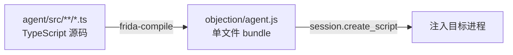
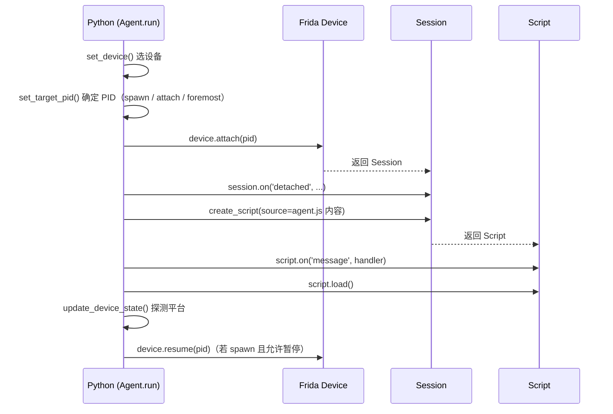
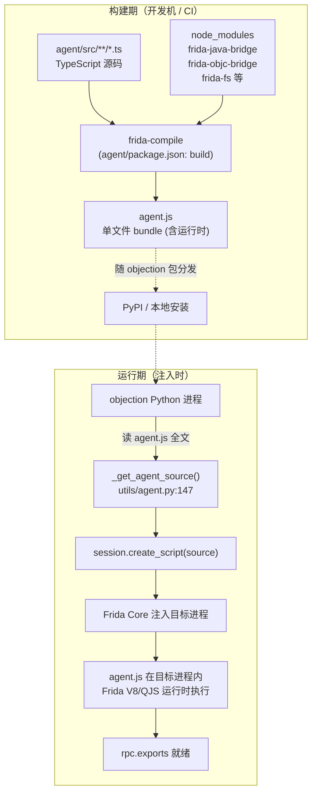

# Frida 与 Agent

这一页讲 Agent 层的细节：它是什么、怎么构建、怎么注入、注入后如何与目标交互。

## Agent 是什么

Agent 是一段**运行在目标进程内部**的 JavaScript 代码。在 objection 中，它用 TypeScript 编写，源码在 `agent/src/`，经 [frida-compile](https://github.com/frida/frida-compiler) 编译打包成单个 `objection/agent.js` 文件。



为什么用 TypeScript？因为 agent 要频繁调用 Frida 的 Java/ObjC 桥接 API，类型系统能在编译期 catches 大量错误，也让代码更易维护。

## Agent 的目录结构

```text
agent/src/
├── index.ts          # 入口：聚合所有 rpc.exports
├── android/          # Android 专属能力
│   ├── hooking.ts    #   方法 Hook
│   ├── pinning.ts    #   SSL Pinning 绕过
│   ├── keystore.ts   #   Keystore 监控
│   ├── heap.ts       #   堆搜索
│   └── ...
├── ios/              # iOS 专属能力
│   ├── keychain.ts   #   Keychain dump
│   └── ...
├── generic/          # 平台无关能力
│   ├── memory.ts     #   内存 dump/patch
│   └── ...
├── rpc/              # 把能力组织成扁平 RPC 方法表
│   ├── android.ts
│   ├── ios.ts
│   └── ...
└── lib/              # 公共工具（jobs、color、helpers）
```

`index.ts` 把 `rpc/*.ts` 里导出的方法表合并，挂到 Frida 的全局 `rpc.exports` 上——这就是 Python 端能调用的全部方法。

## 注入过程

注入由 Python 侧的 `Agent` 类（`objection/utils/agent.py`）驱动：



关键代码：

- 选设备：`utils/agent.py:155` `set_device()`，按 `device_id` / host / 类型枚举；
- 定 PID：`utils/agent.py:190` `set_target_pid()`，支持 foremost / spawn / 已有 PID / 包名匹配；
- 注入：`utils/agent.py:276` `attach()`，`session.create_script(source=self._get_agent_source())` 把 `agent.js` 全文塞进去；
- 加载：`script.load()` 后，agent 在目标进程内开始执行，`rpc.exports` 生效。

## Agent 如何操作目标

注入后，agent 在进程内拥有几乎任意能力，靠的是 Frida 提供的运行时桥接：

### Android（Java 桥接）

```ts
// 拿到某个 Java 类
const clazz = Java.use("javax.net.ssl.SSLContext");
// 替换某方法的实现
const init = clazz.init.overload("...", "...");
init.implementation = function (...) { /* 自定义逻辑 */ };
// 遍历堆上某类的所有实例
Java.choose("com.example.Foo", {
  onMatch: instance => { /* 拿到实例 */ },
  onComplete: () => {},
});
```

所有 Android 操作都包在 `wrapJavaPerform(() => { ... })` 里，确保在 Java 主线程上下文执行。

### iOS（Objective-C 桥接）

```ts
// 拿到 Objective-C 类
const dict = ObjC.classes.NSMutableDictionary.alloc().init();
// 直接发消息（调方法）
dict.setObject_forKey_(value, key);
// 调用 C 函数（如 Security 框架）
const result = libObjc.SecItemCopyMatching(query, ptr);
```

### 通用（内存/进程）

```ts
Process.enumerateModules();      // 列模块
Memory.scanSync(base, size, pat); // 内存搜索
new NativePointer(addr).readByteArray(n); // 读内存
new NativePointer(addr).writeByteArray(bytes); // 写内存
```

## 构建 Agent（开发者）

发布版的 `objection/agent.js` 已随包提供，普通用户无需自行构建。但开发时若改了 `agent/src/`，需要重新编译：

```bash
cd agent
npm install
# 见 agent/package.json 的 scripts
```

::: warning 注意
`objection/agent.js` 在 `.gitignore` 中被忽略（它是构建产物）。PyPI 发布时由 CI 构建（见 `.github/workflows/pypi.yml` 的 `Build Agent` 步骤）。
:::

## 🔧 agent.ts 编译注入流程

`agent/src/**/*.ts` 变成运行在目标进程内的 `agent.js`，中间经过"frida-compile 打包 → 随包分发 → Python 注入"三段。下图把构建期与运行期分开画，避免混淆"哪一步在开发机上、哪步在目标设备上"：



关键事实对应到源码与配置：

- **构建命令**在 [`agent/package.json:10`](https://github.com/android-security-engineer/objection-skills/blob/master/agent/package.json#L10)：`frida-compile src/index.ts -o ../objection/agent.js -T none`。`-T none` 关闭 source map（减小体积），输出落到 `objection/agent.js`。
- **入口**在 [`agent/src/index.ts:9`](https://github.com/android-security-engineer/objection-skills/blob/master/agent/src/index.ts#L9) `rpc.exports = { ... }`——frida-compile 从这个入口出发，递归打包所有 import。
- **bundle 含运行时桥接**：frida-compile 会把 `frida-java-bridge`、`frida-objc-bridge` 等 npm 依赖一起打进 `agent.js`（见 [`agent/package.json:31-37`](https://github.com/android-security-engineer/objection-skills/blob/master/agent/package.json#L31) dependencies）。所以最终的单文件 agent 自带 Java/ObjC 桥接，不依赖目标设备上装任何 npm 包。
- **分发**：`objection/agent.js` 在 `.gitignore` 里（第 68 行），但 PyPI 发布时由 CI 构建（[`.github/workflows/pypi.yml`](https://github.com/android-security-engineer/objection-skills/blob/master/.github/workflows/pypi.yml) 的 `Build Agent` 步骤跑 `cd agent && npm ci`）。`pip install objection` 拿到的包里已含编译好的 agent。
- **注入**：Python 端 [`objection/utils/agent.py:147`](https://github.com/android-security-engineer/objection-skills/blob/master/objection/utils/agent.py#L147) `_get_agent_source()` 把 `agent.js` 全文读成字符串，[`objection/utils/agent.py:303`](https://github.com/android-security-engineer/objection-skills/blob/master/objection/utils/agent.py#L303) `session.create_script(source=...)` 塞给 Frida，[`objection/utils/agent.py:306`](https://github.com/android-security-engineer/objection-skills/blob/master/objection/utils/agent.py#L306) `script.load()` 触发注入。此时 agent 在目标进程内执行，`rpc.exports` 生效。

## 🧱 agent.js 在目标进程内的内存落点

注入完成后，目标进程地址空间里多了哪些东西？下面这张 ASCII 框图画的是注入后的稳态：

```text
┌──────────────── 目标 App 进程地址空间 ────────────────────────────────┐
│                                                                       │
│  原生 App 内存（注入前就有）                                          │
│  ┌──────────────────────────────────────────────────────────────────┐ │
│  │ App 自身 .so/.dylib 映射  │  ART/Dalvik 或 ObjC runtime  │ 堆/栈 │ │
│  └──────────────────────────────────────────────────────────────────┘ │
│                                                                       │
│  Frida 注入后新增 ─────────────────────────────────────────────────┐  │
│  │                                                                  │  │
│  │  ┌────────────────────────────────────────────────────────────┐  │  │
│  │  │ Frida 运行时（V8 或 QJS）                                   │  │  │
│  │  │  - JS 堆 / GC                                               │  │  │
│  │  │  - rpc.exports 注册表                                       │  │  │
│  │  └────────────────────────────────────────────────────────────┘  │  │
│  │                                                                  │  │
│  │  ┌────────────────────────────────────────────────────────────┐  │  │
│  │  │ agent.js（frida-compile 打的单文件 bundle）                │  │  │
│  │  │  ┌──────────────┐  ┌──────────────┐  ┌─────────────────┐  │  │  │
│  │  │  │ 业务逻辑     │  │ 桥接包       │  │ frida-gum API   │  │  │  │
│  │  │  │ android/ios/ │  │ java-bridge  │  │ Java.use/Memory │  │  │  │
│  │  │  │ generic/rpc  │  │ objc-bridge  │  │  .scanSync 等   │  │  │  │
│  │  │  └──────────────┘  └──────┬───────┘  └────────┬────────┘  │  │  │
│  │  └───────────────────────────┼───────────────────┼───────────┘  │  │
│  │                              │                   │              │  │
│  └──────────────────────────────┼───────────────────┼──────────────┘  │
│                                 │                   │                 │
│             ┌───────────────────▼───────────────────▼─────────────┐   │
│             │  跨边界调用：Frida 运行时 ↔ ART/ObjC/原生内存       │   │
│             │  (frida-java-bridge 用 JNI，objc-bridge 用 runtime) │   │
│             └──────────────────────────────────────────────────────┘   │
└───────────────────────────────────────────────────────────────────────┘
```

要点：

- **agent.js 不是被解析成原生代码**：它跑在 Frida 注入的独立 JS 运行时（V8 或 QuickJS）里，与 App 的 ART/ObjC 运行时是**两套执行环境**。
- **桥接包是胶水**：`frida-java-bridge` 底层走 JNI 调 Java 方法，`frida-objc-bridge` 走 ObjC runtime 发消息——它们让 agent 的 JS 代码能"调"Java/ObjC，但每次跨边界都有开销。
- **`rpc.exports` 是出口**：agent 内部所有能力最终聚合成 [`agent/src/index.ts:9`](https://github.com/android-security-engineer/objection-skills/blob/master/agent/src/index.ts#L9) 的 `rpc.exports` 对象，Frida 把它暴露给 Python 端的 `script.exports_sync`。这就是"Agent 层"对外的唯一面。

## ⚖️ 设计权衡

| 决策 | 选择 | 替代方案 | 权衡理由 |
| --- | --- | --- | --- |
| 单文件 bundle | frida-compile 打成单个 `agent.js` | 多文件 + 模块加载器 | 目标进程内没有 npm/文件系统，无法运行时 import。单文件让 `create_script(source=全文)` 一次注入即可。代价是构建步骤与较大的脚本体积。 |
| TS + frida-compile 而非纯 JS | TypeScript，`noEmit:true`（[tsconfig.json:6](https://github.com/android-security-engineer/objection-skills/blob/master/agent/tsconfig.json#L6)），实际编译靠 frida-compile | 直接写 JS，免构建 | TS 类型在开发期 catch 错误；frida-compile 既做 TS 转译又做打包，`tsconfig` 的 `noEmit` 表明 tsc 只负责类型检查、不产输出。 |
| `strictNullChecks: false` | 关闭空值检查（[tsconfig.json:11](https://github.com/android-security-engineer/objection-skills/blob/master/agent/tsconfig.json#L11)） | 开启 | agent 大量调用返回 `undefined` 的 Frida API（如 `Java.use` 失败），强严格会噪音过大。这是务实的妥协。 |
| 依赖自带桥接包 | `frida-java-bridge`/`frida-objc-bridge` 作为 npm 依赖打进 bundle | 用 Frida 内置全局 | 这些桥接包封装了 JNI/runtime 细节，提供 `Java.use`/`ObjC.classes` 等高层 API。Frida 内置的 `Java`/`ObjC` 全局较底层，桥接包更易用。 |
| V8 vs QJS 运行时 | 默认 QJS，`--debugger` 时切 V8（[agent.py:300](https://github.com/android-security-engineer/objection-skills/blob/master/objection/utils/agent.py#L300)） | 始终 V8 | V8 支持 Chrome DevTools 调试（`chrome://inspect`），但体积大、启动慢；QJS 轻量。调试需求才切 V8。 |
| agent.js 不入 git | `.gitignore` 排除（第 68 行），CI 构建 | 提交编译产物 | 避免产物污染 git 历史；CI 保证发布包里有最新构建。代价是开发改 agent 后必须本地 `npm run build`。 |

## 🆚 与同类 Agent/脚本形态对比

agent 这一层在不同工具里有不同形态：

| 形态 | 代表 | 注入物 | 特点 |
| --- | --- | --- | --- |
| 预编译单文件 agent | objection | TypeScript → frida-compile → `agent.js` | 能力固化、开箱即用；改能力要重构建+重注入 |
| 运行时手写脚本 | frida CLI / `frida -l` | 用户当场写的 JS | 灵活，但每个任务从零写、无统一能力发现 |
| 脚本仓库 + 加载器 | Brida 等 | 一堆零散 .js + Python 加载 | 比 objection 轻，但缺统一 RPC/输出 schema |
| 静态插桩（非 Frida） | Xposed、Frida Gadget 配置文件 | 模块/配置 | Xposed 需刷框架；objection 的 Gadget 模式仍靠运行时 agent |

objection 的选择是"预编译 agent + 细粒度 RPC"：把高频能力固化进 agent，再以 RPC 暴露，换取开箱即用与统一输出。代价是新增能力要改 TS 源码并重构建——这正是开发者一节的背景。

## 📜 历史演进

- **纯 JS → TypeScript**：早期 agent 是手写 JavaScript，随能力增多维护成本上升，遂迁 TS 并引入 frida-compile，`agent/src/` 才有了今日的目录结构。
- **桥接包外置**：早期 Frida 把 `Java`/`ObjC` 桥做进运行时全局；后来桥接逻辑拆成 npm 包（`frida-java-bridge`/`frida-objc-bridge`），agent 通过依赖引入并打进 bundle。这让桥接能独立版本化、独立升级。
- **调试支持**：`--debugger` 选项（[agent.py:298](https://github.com/android-security-engineer/objection-skills/blob/master/objection/utils/agent.py#L298)）切到 V8 运行时并 `enable_debugger()`，可用 `chrome://inspect` 断点调试 agent——这是后期为复杂 agent 逻辑加的开发体验。
- **Crash 报告**：[`objection/utils/agent.py:69`](https://github.com/android-security-engineer/objection-skills/blob/master/objection/utils/agent.py#L69) 处理 Frida 12.3 引入的 crash reporting，进程崩溃时能拿到报告——这是跟随 Frida 版本演进的副作用增强。
- **`attach_script` 多脚本**：[agent.py:308](https://github.com/android-security-engineer/objection-skills/blob/master/objection/utils/agent.py#L308) `attach_script` 支持在已注入 agent 之外再挂任意 Frida 脚本（作为 Job 管理），让用户能跑自定义脚本而不重建会话。

---

理解了 agent，下一页 [RPC 通信机制](/guide/rpc) 讲 Python 与 agent 之间具体怎么对话。
