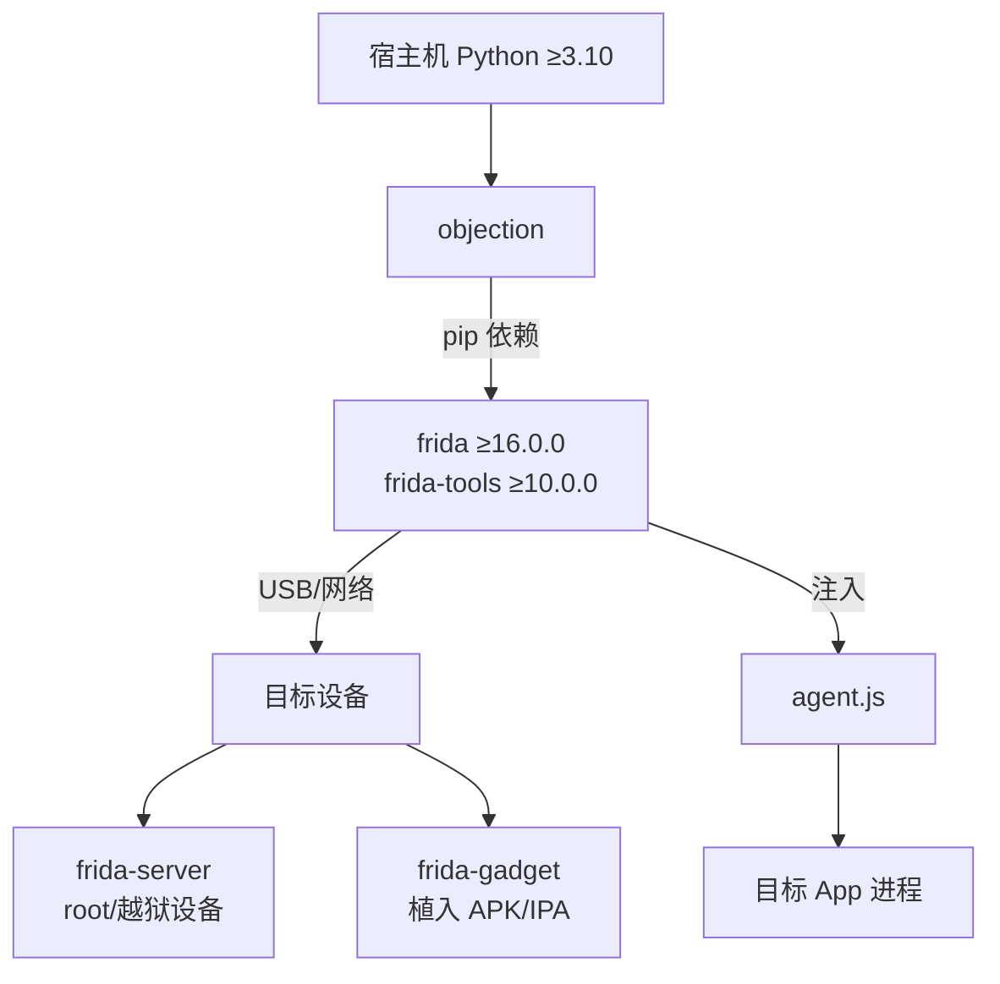

# 📦 安装与依赖

本页讲清 objection 的运行前提：Python 环境、frida 生态版本匹配、设备侧 frida-server / frida-gadget 的准备。新人最常踩的坑都在这里。

## 依赖关系全景



## 🐍 Python 环境

objection 要求 **Python ≥ 3.10**（见 `pyproject.toml`）。

```bash
# 推荐：用 uv 管理（仓库自带 .python-version 与 uv.lock）
uv sync

# 或直接 pip
pip install objection
pip install --upgrade objection
```

验证安装：

```bash
objection version
# objection: 1.12.5
```

::: tip 开发模式
若要从本仓库源码安装（开发/改文档）：
```bash
pip install -e .
```
:::

## 🔗 frida 版本匹配（最关键）

objection 通过 `frida` Python 库与设备通信。**宿主机的 frida 库版本必须与设备侧的 frida-server / frida-gadget 大版本一致**，否则 attach 时报 `Failed to load Frida library` 或协议不兼容。

| 组件 | 来源 | 版本要求 |
| --- | --- | --- |
| `frida` Python 包 | pip 随 objection 装 | ≥16.0.0 |
| `frida-tools` | pip 随 objection 装 | ≥10.0.0 |
| frida-server（设备） | [frida releases](https://github.com/frida/frida/releases) | 与宿主 frida 库同版本 |
| frida-gadget（植入 App） | [frida releases](https://github.com/frida/frida/releases) | 与宿主 frida 库同版本 |

```bash
# 查看宿主 frida 版本
python -c "import frida; print(frida.__version__)"

# 在设备上确认 frida-server 版本
adb shell frida-server --version   # Android（需 root）
```

## 📱 设备侧：frida-server（root/越狱路径）

适合**已 root 的 Android 或已越狱的 iOS**。frida-server 是一个在设备上常驻的守护进程，宿主机通过它注入目标进程。

### Android

```bash
# 1. 下载对应架构的 frida-server（与宿主 frida 库同版本）
#    https://github.com/frida/frida/releases/tag/<version>

# 2. 推到设备并运行（需 root）
adb push frida-server /data/local/tmp/
adb shell "chmod 755 /data/local/tmp/frida-server"
adb shell "su -c '/data/local/tmp/frida-server &'"

# 3. 宿主机验证连接
frida-ps -U          # 列出设备进程
```


### iOS

越狱设备通过 Cydia/Sileo 添加 Frida 源后安装 `frida`，或手启 frida-server。之后宿主机 `frida-ps -U` 即可发现。

## 🧩 设备侧：frida-gadget（免 root 路径）

适合**普通设备**。把 frida-gadget 共享库植入 App 安装包，App 启动时自动加载 gadget 并监听，宿主机再连上去。objection 把这一步封装成了 `patchapk` / `patchipa`。

```bash
# Android：自动下载 gadget、解包 APK、植入、重签名、回打包
objection patchapk -s app.apk

# iOS：植入 gadget 到 IPA
objection patchipa -s app.ipa
```

详见 [APK Patch 功能详解](/features/patcher) 与 [patchers 源码文档](/reference/utils/patchers/android)。


## 🌐 连接模式对照

| 模式 | 参数 | 适用 |
| --- | --- | --- |
| USB | （默认） | 真机 USB 连接 |
| 网络 | `-N -h <ip> -P <port>` | frida-server 远程监听 |
| 本地 | `-L` | iOS 模拟器（本机进程） |
| 指定设备 | `-S <serial>` | 多设备时选其一 |

## 🧪 验证全链路

```bash
# 1. 宿主能看到设备
frida-ps -U | head

# 2. objection 能 attach
objection -g com.example.app start

# 3. REPL 内 ping agent
ping
```

如果第 1 步失败 → 检查 frida-server 是否运行 / 版本是否匹配；第 2 步失败 → 检查包名 / 设备是否被选中；第 3 步失败 → 检查 agent 是否成功注入（见 [故障排查](/guide/troubleshooting)）。

## 🔗 相关文档

- [快速上手](/guide/quickstart)
- [APK Patch](/features/patcher)
- [patchers/android 源码](/reference/utils/patchers/android)
