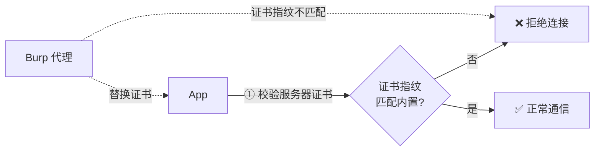
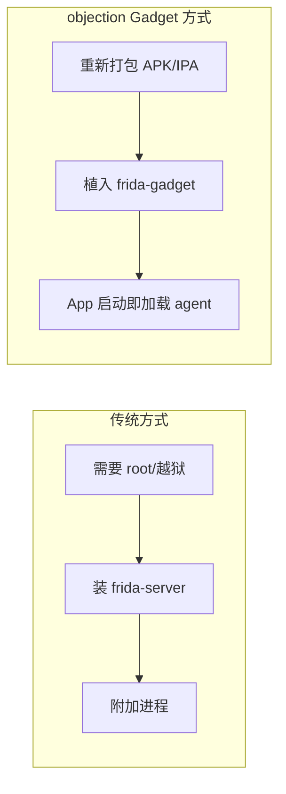

# 它能解决什么问题

理解 objection 解决了什么问题，关键在于理解**移动端安全测试的痛点**。这一页我们用"场景驱动"的方式展开。

## 痛点 1：抓不到 HTTPS 流量

现代 App 几乎都用 HTTPS。你想用 Burp / Charles 做中间人代理来观察请求，但 App 会做 **SSL Pinning（证书固定）**——它不信任系统证书链，只认自己内置的证书指纹。结果就是代理工具抓到的全是加密乱码，或者 App 直接拒绝连接。

**objection 的解法**：`android sslpinning disable`。一行命令，agent 会 Hook 掉 SSLContext、OkHttp CertificatePinner、Android 7+ 的 TrustManagerImpl 等 7 处校验点，让 App 信任任何证书。详见 [SSL Pinning 绕过](/features/android-ssl-pinning)。

## 痛点 2：看不到 App 内部发生了什么

App 是闭源的、混淆的、加壳的。你不知道：

- 登录时调用了哪些方法？
- 某个加密方法入参出参是什么？
- 某个判断分支返回 true 还是 false？

静态反编译能看到代码结构，但看不到**运行时实际值**。

**objection 的解法**：方法 Hook。监听任意方法的调用，dump 参数、返回值、调用栈；甚至直接改返回值，强制走某个分支。详见 [方法 Hook](/features/hooking)。

## 痛点 3：凭证和密钥藏得很深

App 把敏感数据存在哪？

- **iOS**：Keychain（钥匙串）——App 存 token、密码的地方；
- **Android**：Keystore——密钥的存储区；
- **本地存储**：NSUserDefaults、SharedPreferences、SQLite、plist。

这些存储有系统级保护，普通方式读不到（尤其 iOS Keychain 跨 App 隔离）。

**objection 的解法**：直接调用系统 API 把它们 dump 出来。`ios keychain dump`、`android keystore list`。详见 [Keychain Dump](/features/ios-keychain)、[Keystore 监控](/features/android-keystore)。

## 痛点 4：对象实例难触及

你发现某个类有敏感方法，但它是实例方法，需要对象才能调用。运行时这个对象在哪？怎么拿到？

**objection 的解法**：堆搜索。`android heap search` 用 Frida 的 `Java.choose` 遍历堆上所有该类实例，拿到句柄后可直接调用其方法、读字段。详见 [堆搜索与操作](/features/heap)。

## 痛点 5：测试需要 root / 越狱

传统动态测试往往要求设备已 root 或越狱，才能装 Frida server、注入进程。但测试机不一定方便 root。

**objection 的解法**：**Gadget 模式**。把 Frida Gadget（一个 .so/.dylib）打包进 APK / IPA，App 启动时自动加载 agent——**普通设备即可**，无需 root。详见 [APK Patch](/features/patcher)。

## 痛点 6：Frida 脚本重复造轮子

每个测试任务都用 Frida 从零写脚本，效率低、易错、难复用。

**objection 的解法**：把高频任务沉淀为内置命令 + REPL + 插件机制。开箱即用，还能用 Python 插件扩展自定义能力。详见 [插件系统](/features/plugins)。

---

## 解决得如何

客观地说，objection 不是万能的：

- **能**：极大降低运行时测试门槛，覆盖了移动端测试 80% 的高频场景；
- **不能**：对强反 Frida 检测、加固壳、自有协议加密的 App，仍需结合手动 Frida 脚本与其他工具；
- **定位**：它是一个"快速覆盖 + 工程化"的工具，让你把精力集中在真正需要手动深挖的少数点上。

下一页 [整体架构](/guide/architecture) 会拆解它是怎么做到这些的。
