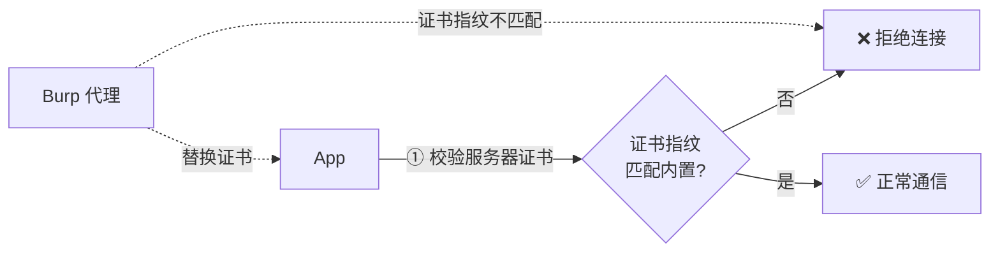
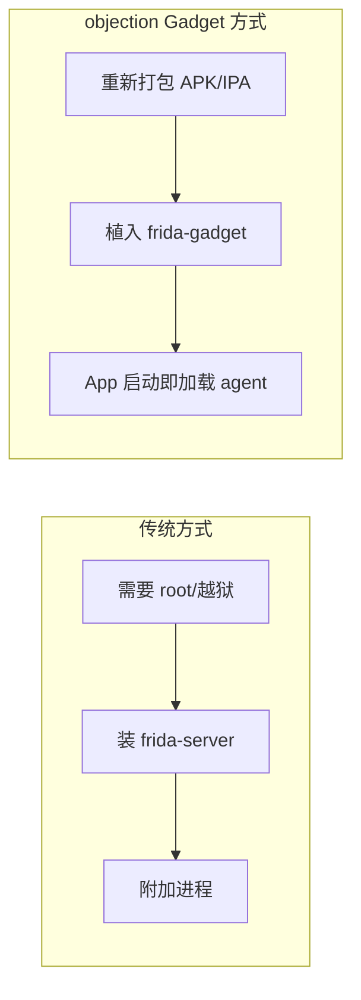
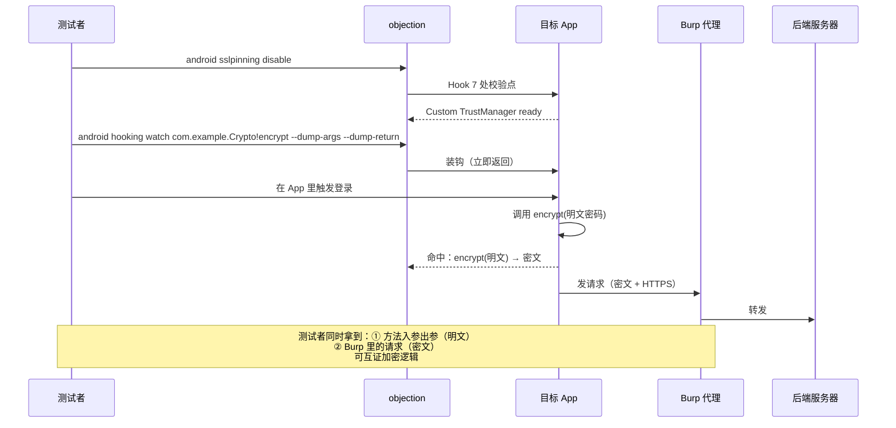
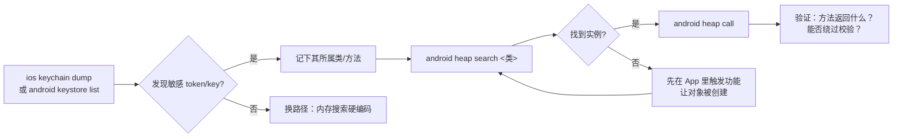

# 它能解决什么问题

理解 objection 解决了什么问题，关键在于理解**移动端安全测试的痛点**。这一页我们用"场景驱动"的方式展开。

## 痛点 1：抓不到 HTTPS 流量

现代 App 几乎都用 HTTPS。你想用 Burp / Charles 做中间人代理来观察请求，但 App 会做 **SSL Pinning（证书固定）**——它不信任系统证书链，只认自己内置的证书指纹。结果就是代理工具抓到的全是加密乱码，或者 App 直接拒绝连接。



**objection 的解法**：`android sslpinning disable`。一行命令，agent 会 Hook 掉 SSLContext、OkHttp CertificatePinner、Android 7+ 的 TrustManagerImpl 等 7 处校验点，让 App 信任任何证书。详见 [SSL Pinning 绕过](/features/android-ssl-pinning)。

## 痛点 2：看不到 App 内部发生了什么

App 是闭源的、混淆的、加壳的。你不知道：

- 登录时调用了哪些方法？
- 某个加密方法入参出参是什么？
- 某个判断分支返回 true 还是 false？

静态反编译能看到代码结构，但看不到**运行时实际值**。

**objection 的解法**：方法 Hook。监听任意方法的调用，dump 参数、返回值、调用栈；甚至直接改返回值，强制走某个分支。详见 [方法 Hook](/features/hooking)。

## 痛点 3：凭证和密钥藏得很深

App 把敏感数据存在哪？

- **iOS**：Keychain（钥匙串）——App 存 token、密码的地方；
- **Android**：Keystore——密钥的存储区；
- **本地存储**：NSUserDefaults、SharedPreferences、SQLite、plist。

这些存储有系统级保护，普通方式读不到（尤其 iOS Keychain 跨 App 隔离）。

**objection 的解法**：直接调用系统 API 把它们 dump 出来。`ios keychain dump`、`android keystore list`。详见 [Keychain Dump](/features/ios-keychain)、[Keystore 监控](/features/android-keystore)。

## 痛点 4：对象实例难触及

你发现某个类有敏感方法，但它是实例方法，需要对象才能调用。运行时这个对象在哪？怎么拿到？

**objection 的解法**：堆搜索。`android heap search` 用 Frida 的 `Java.choose` 遍历堆上所有该类实例，拿到句柄后可直接调用其方法、读字段。详见 [堆搜索与操作](/features/heap)。

## 痛点 5：测试需要 root / 越狱

传统动态测试往往要求设备已 root 或越狱，才能装 Frida server、注入进程。但测试机不一定方便 root。

**objection 的解法**：**Gadget 模式**。把 Frida Gadget（一个 .so/.dylib）打包进 APK / IPA，App 启动时自动加载 agent——**普通设备即可**，无需 root。详见 [APK Patch](/features/patcher)。



## 痛点 6：Frida 脚本重复造轮子

每个测试任务都用 Frida 从零写脚本，效率低、易错、难复用。

**objection 的解法**：把高频任务沉淀为内置命令 + REPL + 插件机制。开箱即用，还能用 Python 插件扩展自定义能力。详见 [插件系统](/features/plugins)。

---

## 解决得如何

客观地说，objection 不是万能的：

- **能**：极大降低运行时测试门槛，覆盖了移动端测试 80% 的高频场景；
- **不能**：对强反 Frida 检测、加固壳、自有协议加密的 App，仍需结合手动 Frida 脚本与其他工具；
- **定位**：它是一个"快速覆盖 + 工程化"的工具，让你把精力集中在真正需要手动深挖的少数点上。

## 🧱 痛点全景：objection 覆盖的攻击面

把上面 6 个痛点汇总到一张图，可以看出 objection 覆盖的攻击面是"App 运行时可触及的一切"：

```text
┌──────────────── 目标 App 进程 ────────────────────────────────────────┐
│                                                                       │
│  ┌──────────── 网络层 ────────────┐    ┌───────── 运行时方法 ────────┐ │
│  │ ① SSL Pinning                  │    │ ② 方法 Hook                │ │
│  │   objection: sslpinning disable│    │   objection: hooking watch │ │
│  └────────────────────────────────┘    └────────────────────────────┘ │
│                                                                       │
│  ┌──────── 凭证存储 ──────────────┐    ┌────────── 堆对象 ───────────┐ │
│  │ ③ iOS Keychain                │    │ ④ 实例方法调用             │ │
│  │   Android Keystore            │    │   objection: heap search   │ │
│  │   objection: keychain/keystore│    │   objection: heap call      │ │
│  └────────────────────────────────┘    └─────────────────────────────┘ │
│                                                                       │
│  ┌──────── 进程内存 ──────────────┐    ┌────────── 沙盒文件 ─────────┐ │
│  │ ⑤ 硬编码密钥/Token             │    │ ⑥ SQLite/plist/SharedPrefs │ │
│  │   objection: memory search     │    │   objection: file/env       │ │
│  └────────────────────────────────┘    └─────────────────────────────┘ │
│                                                                       │
└───────────────────────────────────────────────────────────────────────┘
          │                                            │
          ▼                                            ▼
   ┌──────────┐                                ┌──────────────┐
   │ root/越狱 │                                │ 普通设备      │
   │ frida-   │                                │ patchapk     │
   │ server   │                                │ gadget       │
   └──────────┘                                └──────────────┘
```

六块攻击面之外，还有两条部署路径（frida-server vs gadget）覆盖不同设备条件——这就是 objection "不越狱也能测"的根基。

## 🔄 痛点 1 与 2 的联动：绕 Pinning 后看方法

实际测试中痛点常联动。最典型的是"绕 Pinning 抓流量 + Hook 加解密方法看明文"组合：



这种联动的价值：Burp 只看到加密后的密文，但 Hook `encrypt` 方法能拿到加密**前**的明文——两层证据对照，就能确认"这个字段是这么加密的"，进而逆向出加密算法或直接复现请求。

## 🔄 痛点 3 与 4 的联动：从凭证到实例

另一组常见联动是"Dump 凭证发现线索 → 堆搜索拿实例 → 调方法验证"：



这组联动体现了 objection 的"运行时探索"本质：静态分析看到类与方法，但**对象实例只在运行时存在**——必须先让 App 跑起来、触发功能创建对象，才能 `Java.choose` 拿到它并调用实例方法。

## ⚖️ 设计权衡：覆盖范围 vs 深度

objection 在"覆盖广度"与"单点深度"间做了明确取舍：

| 维度 | objection 的选择 | 代价 |
| --- | --- | --- |
| 覆盖范围 | 覆盖移动安全 80% 高频场景（Pin/Hook/凭证/堆/内存/文件） | 对剩下 20%（强反 Frida、加固壳、自定义协议加密）需手动 Frida 脚本深挖 |
| 能力粒度 | 内置高频封装，开箱即用 | 新增能力要改 agent TS 源码并重构建（见 [Frida 与 Agent](/guide/frida-agent#构建-agent-开发者)） |
| 设备条件 | 既支持 root（frida-server）也支持普通设备（gadget） | gadget 需重打包重签名，且部分 App 的签名校验会挡路 |
| 反检测 | 不内置强反 Frida 检测绕过 | 对做了 Frida 检测的 App，需结合其他工具或手写脚本 |
| 输出 | 双模式（人类文本 + Agent JSON） | 命令函数要兼顾两种输出，改造工作量集中在输出层 |

## 🆚 与替代方案对比（按痛点）

每个痛点都有替代方案，objection 的优势在"统一 + 开箱即用"：

| 痛点 | 替代方案 | objection 优势 |
| --- | --- | --- |
| 抓不到 HTTPS | 手写 Frida 脚本绕 Pinning / 用 Magisk 模块 | 一行命令，覆盖 7 处校验点，跨 Android 版本 |
| 看不到内部 | 反编译猜逻辑 / 手写 Hook | 内置 watch + dump_args/return/backtrace，即时出结果 |
| 凭证藏深 | 越狱后手动查 Keychain / root 后翻 Keystore | 直接调系统 API dump，跨 App 隔离 |
| 实例难触及 | 反编译找构造点 / 手写 Java.choose | heap search + heap call 一条龙 |
| 需 root | 买越狱设备 / 刷 Magisk | gadget 模式普通设备可用 |
| 重复造轮子 | 每次手写 Frida 脚本 | 内置命令 + REPL + 插件 + Agent 接口 |

## 📜 历史演进：痛点驱动的功能生长

objection 的功能集是痛点驱动逐步长出来的：

- **起源**：Leon Jacobs 在 SensePost 为移动渗透测试造的"Frida + 命令包"，最早覆盖 Pinning 绕过与方法 Hook（痛点 1、2）。
- **凭证 dump**：为 Keychain/Keystore 取证加命令（痛点 3）。
- **堆操作**：为调实例方法加 `heap search/call`（痛点 4）。
- **Gadget 模式**：为普通设备测试加 `patchapk`（痛点 5）。
- **插件 + HTTP API**：为复用与脚本驱动加插件机制与 `/rpc/invoke`（痛点 6 的工程化）。
- **Agent 友好层**：随 AI Agent 兴起，加统一 JSON schema、事件流、`agent` 子命令组——让 objection 不仅是人类工具，也是 Agent 可驱动的运行时探测 SKILL。这是从"解决人类痛点"到"解决 Agent 痛点"的延伸。

下一页 [整体架构](/guide/architecture) 会拆解它是怎么做到这些的。
