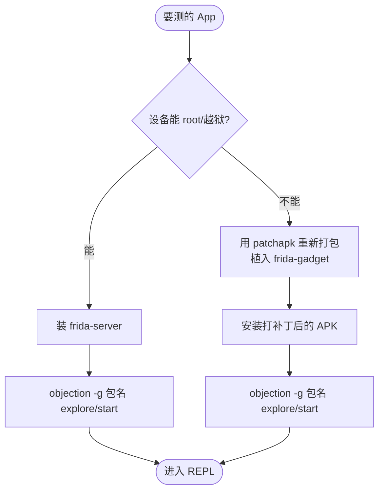
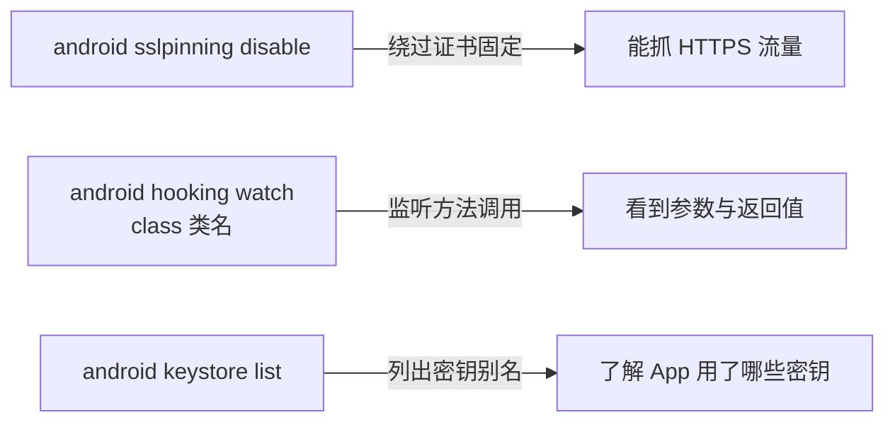

# 快速上手

这一页带你从零跑通 objection：安装 → 连接设备 → 进入 REPL → 执行第一条命令。

## 1. 安装

objection 是 Python 包，直接 pip 安装：

```bash
pip install objection
# 或升级已有版本
pip install --upgrade objection
```

安装后会得到 `objection` 命令。验证：

```bash
objection version
# objection: 1.12.5
```

::: tip Python 版本
objection 要求 Python ≥ 3.10（见 `pyproject.toml`）。
:::

## 2. 准备目标

你需要决定**怎么连接目标**。两条路径对应不同前提：



- **frida-server 路径**：设备上装并运行 [frida-server](https://github.com/frida/frida/releases)，宿主机用 USB 连接。
- **Gadget 路径**：用 `objection patchapk` 把 gadget 嵌入 APK（详见 [APK Patch](/features/patcher)），装到普通设备即可。

## 3. 启动一个会话

最常用的命令是 `objection start`（旧名 `explore`，已弃用但兼容）：

```bash
# USB 连接，附加/拉起指定包名
objection -g com.example.app start

# 通过网络连接远程设备（如 frida-server 监听在 192.168.1.10:27042）
objection -N -h 192.168.1.10 -P 27042 -g com.example.app start

# 直接 spawn 目标（App 未启动时拉起）
objection -g com.example.app -s start

# 连接当前前台 App
objection --foremost start
```

常用顶层参数（见 `console/cli.py:44`）：

| 参数 | 含义 |
| --- | --- |
| `-g / --name` | 目标 App 的包名 / bundle id |
| `-N / --network` | 用网络而非 USB 连接 |
| `-L / --local` | 本地连接（iOS 模拟器） |
| `-h / --host`、`-P / --port` | 网络模式的地址端口 |
| `-S / --serial` | 指定设备序列号 |
| `-s / --spawn` | spawn 模式拉起目标 |
| `-f / --foremost` | 附加到当前前台 App |
| `-p / --no-pause` | spawn 后立即恢复执行 |
| `-d / --debug` | 调试模式，输出详细日志 |

## 4. 进入 REPL

成功后会进入交互式 REPL，提示符类似 `com.example.app on (usb) #`。在这里敲 objection 命令：

```text
com.example.app on (usb) # android sslpinning disable
(agent) Custom TrustManager ready, overriding SSLContext.init()
(agent) Found okhttp3.CertificatePinner, overriding CertificatePinner.check()
...

com.example.app on (usb) # android hooking list classes
java.lang.String
java.lang.Object
...

com.example.app on (usb) # ios keychain dump
```

::: tip 不进 REPL 也能用
单条命令可用 `objection run`：
```bash
objection -g com.example.app run android sslpinning disable
```
:::

## 5. 三条最该先试的命令



## 6. 退出与帮助

- REPL 里输入 `exit` 或 `quit` 退出；
- 输入 `help` 查看所有命令，`help <命令>` 查看某命令用法（帮助文件位于 `objection/console/helpfiles/`）；
- `jobs` 查看后台任务，`jobs kill <id>` 结束任务。

---

到这里你已经能跑通基本流程。接下来深入原理：[Frida 与 Agent](/guide/frida-agent)。
