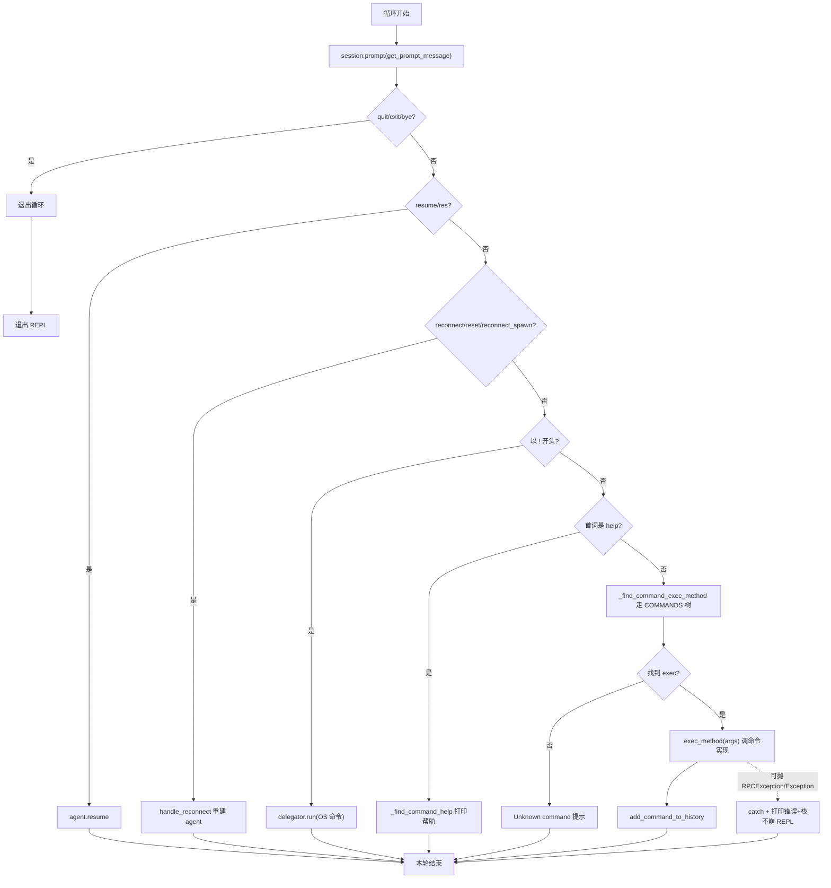

# REPL 与命令

REPL 是用户与 objection 交互的主界面。这一页讲 REPL 如何把一行输入分派到具体实现，以及命令的命名约定。

## REPL 的角色


REPL（`objection/console/repl.py`）核心做三件事：

1. **读取**用户输入的一行命令；
2. **分派**到对应的 Python 实现函数；
3. **输出**结果与 agent 回传的消息。

## 命令的组织

命令按平台/主题分目录：

```text
objection/commands/
├── android/      # android.* 命令
│   ├── hooking.py    # android hooking ...
│   ├── pinning.py    # android sslpinning ...
│   ├── keystore.py   # android keystore ...
│   └── ...
├── ios/          # ios.* 命令
│   ├── keychain.py   # ios keychain ...
│   └── ...
├── memory.py     # memory ... 通用命令
├── filemanager.py
└── ...
```

命令名采用**点分层级**，与目录/模块对应：

| 命令前缀 | 平台 | 例子 |
| --- | --- | --- |
| `android.*` | Android | `android sslpinning disable` |
| `ios.*` | iOS | `ios keychain dump` |
| `memory *` | 通用 | `memory list modules` |
| `env *`、`file *`、`cd`、`ls` | 通用 | `file download /data/.../x.db` |

## 帮助系统

每个命令都有对应的帮助文件（`objection/console/helpfiles/*.txt`）。REPL 里：

```text
# 列出所有命令
help

# 查看某命令用法
help android hooking watch
```

帮助文件名与命令名严格对应，例如 `android.hooking.watch.txt`。

## 常用命令速查

### 连接与环境

```text
env                       # 查看当前环境信息（包名、平台、版本）
```

### 后台任务

很多命令（Hook、监听）会创建**后台 Job**，不阻塞 REPL：

```text
jobs                      # 列出所有 Job
jobs kill <id>            # 结束某个 Job
```

详见 [Jobs 任务](/features/jobs)。

### 执行自定义脚本

```text
# 加载一段 Frida 脚本
objection -g pkg start -S my_script.js
```

## 启动时自动化

`objection start` 支持在进入 REPL 前自动执行命令/脚本（`console/cli.py:142`）：

```bash
# 启动前执行一条命令
objection -g com.example.app start -s 'android sslpinning disable'

# 启动前执行命令文件（每行一条）
objection -g com.example.app start -c cmds.txt

# 启动前加载 Frida 脚本
objection -g com.example.app start -S hook.js
```

这对"一键配置好测试环境"非常有用——比如自动绕过 Pinning + 装好一组 Hook，再进入交互。

## 🔄 REPL 主循环：读取—分派—输出

REPL 的核心是一个 `while True` 循环（[`objection/console/repl.py:367`](https://github.com/android-security-engineer/objection-skills/blob/master/objection/console/repl.py#L367)），每轮做读取、特殊命令短路、分派、异常兜底。下图把一轮循环里所有分支画全：



这个循环的关键设计：

- **特殊命令短路在前**：`quit`/`resume`/`reconnect`/`!`/`help` 都在调 `run_command` 前被拦截，不进 COMMANDS 树。这让"控制会话本身"的命令与"操作 App"的命令职责分离。
- **异常兜底不崩**：`run_command` 外层 try/except 捕获 `RPCException` 与通用 `Exception`（[repl.py:394-403](https://github.com/android-security-engineer/objection-skills/blob/master/objection/console/repl.py#L394)），打印错误与栈但**继续循环**——单条命令崩了不会退出 REPL。
- **历史记录**：成功的命令 `add_command_to_history`（[repl.py:172](https://github.com/android-security-engineer/objection-skills/blob/master/objection/console/repl.py#L172)），配合 `FileHistory('~/.objection/objection_history')`（[repl.py:43](https://github.com/android-security-engineer/objection-skills/blob/master/objection/console/repl.py#L43)）实现跨会话上下箭头回放。

## 🧱 命令分派的字典树走法

REPL 把命令组织成嵌套字典（`COMMANDS` 注册表，[`objection/console/commands.py`](https://github.com/android-security-engineer/objection-skills/blob/master/objection/console/commands.py)），`_find_command_exec_method` 沿着 token 逐层下钻，找到最深的 `exec`。下面用 ASCII 框图画 `android hooking watch class com.example.Foo --dump-args` 这条命令的走法：

```text
输入 tokens: [android, hooking, watch, class, com.example.Foo, --dump-args]

COMMANDS 注册表（嵌套 dict）
│
└─ android ──┐   walked=1
             │
             └─ commands ──┐
                  │
                  └─ hooking ──┐   walked=2
                       │
                       └─ commands ──┐
                            │
                            └─ watch ──┐   walked=3
                                 │
                                 └─ commands ──┐
                                      │
                                      └─ class ──┐   walked=4
                                           │
                                           └─ exec = <function watch_class>   ← 命中！break

返回 (walked_tokens=4, exec_method=watch_class)

→ arguments = tokens[4:] = ['com.example.Foo', '--dump-args']
→ exec_method(['com.example.Foo', '--dump-args'])
```

走法要点：

- **逐 token 下钻**：每个 token 匹配一个子 dict 的 key；遇到 `'commands'` 键就继续往下，遇到没有 `'commands'` 但有 `'exec'` 的节点就命中（[`repl.py:214-218`](https://github.com/android-security-engineer/objection-skills/blob/master/objection/console/repl.py#L214)）。
- **walked_tokens 决定参数切分**：返回走了几步，调用方据此 `tokens[walked_tokens:]` 切出剩余作参数（[repl.py:167](https://github.com/android-security-engineer/objection-skills/blob/master/objection/console/repl.py#L167)）。这是为什么命令名长度可变、参数总是正确分离。
- **补全与分派共用同一棵树**：`CommandCompleter` 也走这棵树给提示，`_find_command_help` 也走它找 helpfile——注册表是 REPL 的单一事实源。

## ⚖️ 设计权衡

| 决策 | 选择 | 替代方案 | 权衡理由 |
| --- | --- | --- | --- |
| 命令注册表为嵌套 dict | `COMMANDS` 字典树 | 装饰器注册 / 类继承 | 字典树结构简单、可静态枚举（支撑 `capabilities`/补全/帮助），改一处全受益。代价是定义较声明式、不够"Pythonic"，但换来统一数据源。 |
| 分派靠走树而非 argparse | 自写 `_find_command_exec_method` | 每命令一个 argparse 子parser | 走树让命令名层级与目录结构对应，补全/帮助/分派共用。argparse 适合参数解析而非命令发现。 |
| 异常兜底继续循环 | try/except 包 run_command | 让异常上抛退出 | REPL 是长会话，单命令崩了不应退出。代价是用户看不到原始 traceback 退出码，但栈已 dim 打印供调试。 |
| prompt_toolkit 而非 readline | PromptSession + FuzzyCompleter + FileHistory | 内置 input + readline | 模糊补全、历史回放、多行编辑、`patch_stdout`（异步消息不破坏输入行）大幅提升体验。代价是多一个重依赖。 |
| `!` 前缀跑 OS 命令 | delegator.run | 禁止 / 单独 shell 子命令 | 渗透测试常需在 REPL 里跑 `adb`/`frida-ps`，前缀法零成本集成。代价是有命令注入风险，但 REPL 本就是受信环境。 |
| reconnect 重建 agent | unload+detach+get_agent | 退出重启 | 长测试会话中 agent 偶尔断裂，原地重建保留历史与状态。代价是重建逻辑较复杂（[repl.py:283](https://github.com/android-security-engineer/objection-skills/blob/master/objection/console/repl.py#L283)）。 |

## 📜 历史演进

- **早期 REPL**：基于简单 input + 自写补全，命令集小。
- **迁 prompt_toolkit**：为模糊补全、历史、`patch_stdout`（让 agent 异步 `send()` 消息不破坏正在输入的命令行）引入重依赖。
- **命令注册表结构化**：`COMMANDS` 演化为带 `meta`/`dynamic`/`commands`/`exec` 的嵌套 dict，让补全、帮助、分派共用单一数据源。
- **reconnect 系列命令**：后期为长会话鲁棒性加的 `reconnect`/`reset`/`reconnect_spawn`（[repl.py:283](https://github.com/android-security-engineer/objection-skills/blob/master/objection/console/repl.py#L283)），支持软重启（重新 attach）与全重启（spawn 重建）。
- **Agent 复用 REPL**：`agent exec` 与 `/command/exec` 都 new 一个 `Repl` 调 `run_command`（[agent_cli.py:91](https://github.com/android-security-engineer/objection-skills/blob/master/objection/console/agent_cli.py#L91)、[agent_endpoints.py:90](https://github.com/android-security-engineer/objection-skills/blob/master/objection/api/agent_endpoints.py#L90)），让命令分派逻辑在人类与 Agent 入口共用——这是 REPL 从"人类界面"演化为"通用命令分派器"的关键一步。

## 小结

- REPL = 读取 + 分派 + 输出；
- 命令按 `android.* / ios.* / 通用` 分目录，点分命名；
- 持续性任务以 Job 形式在后台运行，可用 `jobs` 管理；
- 启动期可注入命令/脚本实现自动化。

接下来进入 [功能详解](/features/android-ssl-pinning)，逐个拆解每个能力的实现原理。
