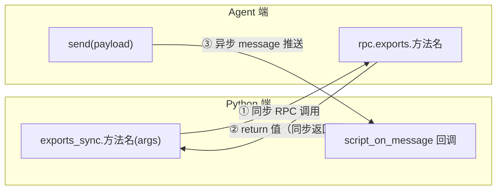
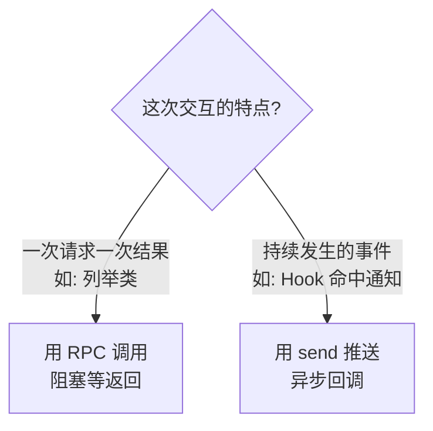
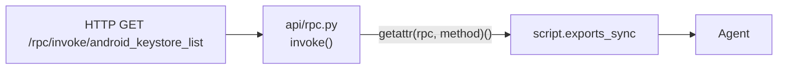
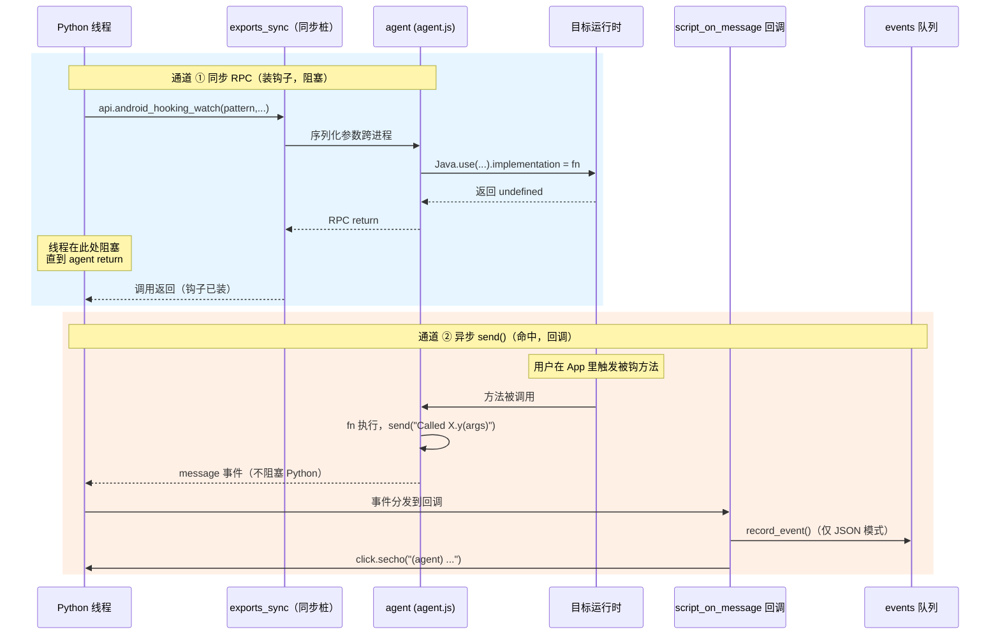
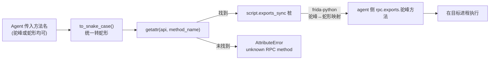

# RPC 通信机制

objection 的 Python 端与 agent 端之间有**两条通信通道**。理解它们，才能理解命令是如何下发、结果是如何回流的。

## 两条通道总览



| 通道 | 方向 | 触发方式 | 用途 |
| --- | --- | --- | --- |
| **RPC 调用** | Python → Agent | Python 主动 `exports_sync.xxx(args)` | 下发命令、拿回结构化结果 |
| **message 回调** | Agent → Python | Agent 主动 `send(payload)` | 推送 Hook 命中通知、进度日志 |

## 通道 1：RPC 调用（同步）

Agent 在 `agent/src/index.ts` 把方法挂到 `rpc.exports`：

```ts
rpc.exports = {
  ...android, ...ios, ...env, ...jobs, ...memory, ...other,
  ping: () => ping(),
};
```

Python 端通过 `script.exports_sync` 拿到这个方法集合（`utils/agent.py:362` `exports()`），调用方式就像普通函数：

```python
# objection/commands/android/pinning.py
api = state_connection.get_api()          # 返回 script.exports_sync
api.android_ssl_pinning_disable(quiet)    # 同步调用 agent 的同名方法
```

::: tip 命名转换
TypeScript 里方法叫 `androidSslPinningDisable`，Python 调用时用蛇形 `android_ssl_pinning_disable`——frida-python 会自动做驼峰↔蛇形映射。
:::

**同步语义**：`exports_sync` 会阻塞当前 Python 线程，直到 agent 执行完并 `return` 结果。适合"发命令、拿一次性结果"的场景（如 `keystore list` 返回密钥列表）。

## 通道 2：message 回调（异步推送）

很多场景下，agent 需要**主动**向 Python 推消息——比如 Hook 命中时通知"某方法被调用了，参数是 X"。这时用 `send()`：

```ts
// agent/src/android/hooking.ts
m.implementation = function () {
  send(`Called ${clazz}.${method}(${args})`);
  return m.apply(this, arguments);
};
```

Python 端在注入时注册了回调（`utils/agent.py:301`）：

```python
self.script.on('message', self.handlers.script_on_message)
```

回调 `script_on_message`（`utils/agent.py:79`）收到消息后格式化打印：

```text
(agent) Called com.example.App.login(user, pass)
```

这就是你在 REPL 里看到的一行行 `(agent) ...` 输出的来源。

## 为什么需要两条通道



- **RPC**：请求-响应模型，拿确定的结果。
- **message**：发布-订阅模型，处理持续事件。

比如 `android hooking watch`：watch 这个 RPC 调用本身**立即返回**（Hook 装好了），但之后每次方法被调用，agent 都会 `send` 一条通知——这才是"持续监听"的本质。

## 第三条隐藏通道：HTTP API

objection 还能用 Flask 起一个 HTTP 服务（`objection api` 或 REPL 里 `-a`），把 RPC 能力通过 REST 暴露：



`api/rpc.py` 的 `invoke` 路由把 HTTP 请求桥接到 Frida RPC：GET `/rpc/invoke/<method>` 即可调用任意 agent 方法。这让 objection 能被脚本、CI、其他工具以 HTTP 方式驱动。

## 🔀 同步 RPC vs 异步 send()：双通道对照

两条通道最容易混淆的是"谁阻塞、谁推、何时用哪条"。下图把同一个 Hook 场景里两条通道的时序画在一起，左边是同步 RPC 往返（装钩子），右边是异步 `send()` 推送（命中通知）：



两条通道的本质区别在于**线程模型**：

- **同步 RPC**：Python 调用线程被 frida-python 阻塞，等待 agent 在目标进程内执行完并 `return`。这是一次"请求—响应"的远程过程调用，参数经序列化跨进程传输。Python 拿到的是 agent 的 **return 值**。入口在 [`objection/utils/agent.py:366`](https://github.com/android-security-engineer/objection-skills/blob/master/objection/utils/agent.py#L366) `exports()` 返回的 `script.exports_sync`。
- **异步 send()**：agent 主动 `send(payload)`，frida-core 把消息塞进 Python 端的事件队列，由注册的回调（[`objection/utils/agent.py:305`](https://github.com/android-security-engineer/objection-skills/blob/master/objection/utils/agent.py#L305) `script.on('message', ...)`）异步消费。Python 线程**不被阻塞**——它可能正在跑下一条命令。消息走的是**发布—订阅**模型，与 RPC 的请求—响应正交。

这就是为什么 `android hooking watch` 这个命令设计成：**watch 调用本身立即返回**（钩装好了），而后续每次命中都走 `send()`——装钩是"一次请求一次结果"，命中是"持续发生的事件"，两者天然落在不同通道。

## 🧱 双通道在进程内的落点

用 ASCII 框图看两条通道各自接在哪一层，能避免"参数怎么传的、回调谁触发的"这类混淆：

```text
┌──────────────── Python 进程 ─────────────────────────────────┐
│                                                              │
│   命令实现 commands/*.py                                     │
│        │                                                     │
│        │ api.android_xxx(args)        script_on_message(cb)  │
│        ▼                               ▲                     │
│   ┌─────────────────┐            ┌──────┴──────────────┐     │
│   │ exports_sync    │  同步RPC   │ message 回调         │     │
│   │ (RPC 桩,阻塞)   │──────────▶│ record_event() +     │     │
│   │                 │  return值  │ click.secho("(agent)")│    │
│   └────────┬────────┘            └──────────▲──────────┘     │
│            │                                │ 事件            │
│            │ ① 序列化参数跨进程              │ ③ 异步消息推送  │
└────────────┼────────────────────────────────┼────────────────┘
             │                                │
             │           ② Frida Core 桥      │
             ▼                                │
┌──────────────── 目标进程 ───────────────────┼────────────────┐
│  ┌──────────────────────────────┐           │                │
│  │ agent.js (Frida 运行时)       │           │                │
│  │                              │           │                │
│  │  rpc.exports.android_xxx     │  return   │  send(payload) │
│  │  (被 exports_sync 调用)       │───────────┘  (主动推送)    │
│  │       │                      │                            │
│  │       ▼ Java.use / Memory.*  │                            │
│  └───────┬──────────────────────┘                            │
│          ▼ 目标运行时 (ART/ObjC/内存)                         │
└──────────────────────────────────────────────────────────────┘
```

图里两条编号路径很关键：

- **路径 ①②**：Python `exports_sync.x(args)` → 参数序列化 → agent 的 `rpc.exports.x` 执行 → return 值原路返回。这条路径上 Python 线程**全程阻塞**。
- **路径 ③**：agent `send(payload)` → Frida Core 把消息推给 Python → `script_on_message` 回调 → `record_event()` 入队（仅 JSON 模式，见 [`objection/utils/events.py:29`](https://github.com/android-security-engineer/objection-skills/blob/master/objection/utils/events.py#L29)）+ `click.secho` 打印。这条路径**与路径 ①② 独立**，可在 Python 跑别的命令时并发到达。

注意 agent 侧 `rpc.exports` 的方法名是驼峰（如 `androidSslPinningDisable`，见 [`agent/src/rpc/android.ts:84`](https://github.com/android-security-engineer/objection-skills/blob/master/agent/src/rpc/android.ts#L84)），Python 调用时用蛇形（`android_ssl_pinning_disable`）。frida-python 自动做这个映射——这是历史遗留的命名约定，下一节展开。

## ⚖️ 设计权衡

| 决策 | 选择 | 替代方案 | 权衡理由 |
| --- | --- | --- | --- |
| 同步调用的阻塞语义 | `exports_sync`（阻塞到 return） | 非阻塞 `exports`（返回 Promise） | 简单命令拿一次性结果最直观，Python 侧不用写 async/await。代价是长任务（如全量 dump）会卡住 REPL——所以长任务内部用 `send()` 流式推送进度。 |
| 命中通知用 send 而非 RPC | `send()` + 回调 | 让 agent 调用 Python 的 RPC（反向 RPC） | 反向 RPC 要 Python 暴露 exports，且需匹配请求—响应语义；命中是单向、高频的"事件"，发布—订阅模型更合适。 |
| 事件缓冲有无界 | 有界 deque，上限 1000（[events.py:22](https://github.com/android-security-engineer/objection-skills/blob/master/objection/utils/events.py#L22)） | 无界 | Hook 风暴（如热路径方法被高频调用）会瞬间产生海量消息；无界队列会撑爆 Python 进程内存。有界 + `dropped` 计数让 Agent 能感知"有事件丢了"。代价是极高频场景下 Agent 必须勤轮询否则丢数据。 |
| 人类模式不缓冲 | `record_event` 仅 JSON 模式入队（[events.py:41](https://github.com/android-security-engineer/objection-skills/blob/master/objection/utils/events.py#L41)） | 始终缓冲 | 人类模式下消息已 `click.secho` 实时打印，再缓冲是重复且无消费者。JSON 模式下 stdout 被结构化输出占用，需要独立队列供 `/events/poll` 取。 |
| HTTP `/rpc/invoke` 与 `/agent/rpc` 并存 | 新端点 `/agent/rpc` 始终返统一 schema，旧 `/rpc/invoke` 默认 jsonify | 统一一个 | 旧端点已外部使用，强行迁移会破坏兼容。新端点专为 Agent 设计，输出与 `agent exec` 一致（见 [`objection/api/agent_endpoints.py:236`](https://github.com/android-security-engineer/objection-skills/blob/master/objection/api/agent_endpoints.py#L236)）。 |

## 📜 命名映射与历史演进

frida-python 的蛇形↔驼峰自动映射是一条"隐式契约"，新人最容易在这里踩坑：

- agent 侧 TypeScript 方法叫 `androidSslPinningDisable`（驼峰）；
- Python 侧调用 `api.android_ssl_pinning_disable`（蛇形）；
- frida-python 在两端做转换，无需手动处理。

这条契约是 frida-python 早年定下的，objection 沿用至今。`to_snake_case`（[`objection/utils/helpers.py`](https://github.com/android-security-engineer/objection-skills/blob/master/objection/utils/helpers.py)）在 `agent rpc`/`/agent/rpc` 端点里也用了同一规则（[agent_cli.py:138](https://github.com/android-security-engineer/objection-skills/blob/master/objection/console/agent_cli.py#L138)、[agent_endpoints.py:252](https://github.com/android-security-engineer/objection-skills/blob/master/objection/api/agent_endpoints.py#L252)），所以 Agent 传驼峰或蛇形方法名都能命中。从 Agent 传方法名到命中 agent 函数的解析路径：



通道层面也有演进史：

- **早期**：只有同步 RPC + `send()` 两条，面向人类 REPL。`send()` 的消息直接 `click.secho` 打印，无人缓冲。
- **HTTP API 时代**：加 `/rpc/invoke` 直接桥接 Frida RPC，但仍是"调一次拿一次"，无事件流。
- **Agent 友好时代**：为让 Agent 能拿异步事件，新增了 `events` 有界队列（[`objection/utils/events.py`](https://github.com/android-security-engineer/objection-skills/blob/master/objection/utils/events.py)），`script_on_message` 改为先 `record_event` 再打印；`/events/poll` + `agent state` 暴露队列。这等于在原有的"同步 RPC + 异步 send"双通道之上，给异步通道接了一个**可轮询的缓冲出口**——Agent 不再需要解析实时 stdout，改为拉取。

## 小结

- **RPC 调用**（同步）：Python `exports_sync.x()` ↔ agent `rpc.exports.x`，拿结构化结果；
- **message 推送**（异步）：agent `send()` → Python `script_on_message`，处理事件；
- **HTTP API**（可选）：把 RPC 通过 REST 暴露，便于外部集成。

带着这套通信模型，下一页 [REPL 与命令](/guide/repl) 看用户侧的命令是怎么组织的。
