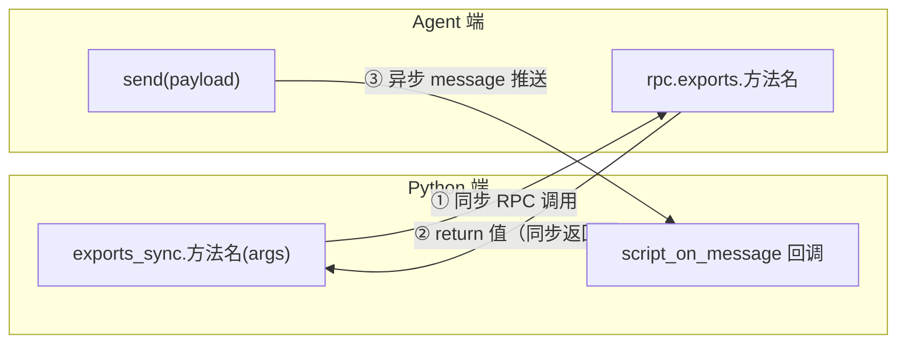
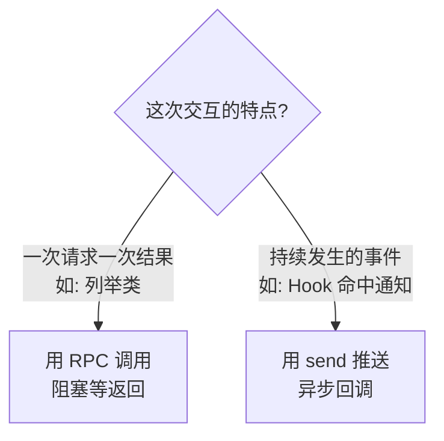
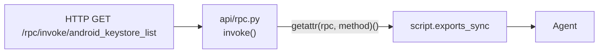

# RPC 通信机制

objection 的 Python 端与 agent 端之间有**两条通信通道**。理解它们，才能理解命令是如何下发、结果是如何回流的。

## 两条通道总览



| 通道 | 方向 | 触发方式 | 用途 |
| --- | --- | --- | --- |
| **RPC 调用** | Python → Agent | Python 主动 `exports_sync.xxx(args)` | 下发命令、拿回结构化结果 |
| **message 回调** | Agent → Python | Agent 主动 `send(payload)` | 推送 Hook 命中通知、进度日志 |

## 通道 1：RPC 调用（同步）

Agent 在 `agent/src/index.ts` 把方法挂到 `rpc.exports`：

```ts
rpc.exports = {
  ...android, ...ios, ...env, ...jobs, ...memory, ...other,
  ping: () => ping(),
};
```

Python 端通过 `script.exports_sync` 拿到这个方法集合（`utils/agent.py:362` `exports()`），调用方式就像普通函数：

```python
# objection/commands/android/pinning.py
api = state_connection.get_api()          # 返回 script.exports_sync
api.android_ssl_pinning_disable(quiet)    # 同步调用 agent 的同名方法
```

::: tip 命名转换
TypeScript 里方法叫 `androidSslPinningDisable`，Python 调用时用蛇形 `android_ssl_pinning_disable`——frida-python 会自动做驼峰↔蛇形映射。
:::

**同步语义**：`exports_sync` 会阻塞当前 Python 线程，直到 agent 执行完并 `return` 结果。适合"发命令、拿一次性结果"的场景（如 `keystore list` 返回密钥列表）。

## 通道 2：message 回调（异步推送）

很多场景下，agent 需要**主动**向 Python 推消息——比如 Hook 命中时通知"某方法被调用了，参数是 X"。这时用 `send()`：

```ts
// agent/src/android/hooking.ts
m.implementation = function () {
  send(`Called ${clazz}.${method}(${args})`);
  return m.apply(this, arguments);
};
```

Python 端在注入时注册了回调（`utils/agent.py:301`）：

```python
self.script.on('message', self.handlers.script_on_message)
```

回调 `script_on_message`（`utils/agent.py:79`）收到消息后格式化打印：

```text
(agent) Called com.example.App.login(user, pass)
```

这就是你在 REPL 里看到的一行行 `(agent) ...` 输出的来源。

## 为什么需要两条通道



- **RPC**：请求-响应模型，拿确定的结果。
- **message**：发布-订阅模型，处理持续事件。

比如 `android hooking watch`：watch 这个 RPC 调用本身**立即返回**（Hook 装好了），但之后每次方法被调用，agent 都会 `send` 一条通知——这才是"持续监听"的本质。

## 第三条隐藏通道：HTTP API

objection 还能用 Flask 起一个 HTTP 服务（`objection api` 或 REPL 里 `-a`），把 RPC 能力通过 REST 暴露：



`api/rpc.py` 的 `invoke` 路由把 HTTP 请求桥接到 Frida RPC：GET `/rpc/invoke/<method>` 即可调用任意 agent 方法。这让 objection 能被脚本、CI、其他工具以 HTTP 方式驱动。

## 小结

- **RPC 调用**（同步）：Python `exports_sync.x()` ↔ agent `rpc.exports.x`，拿结构化结果；
- **message 推送**（异步）：agent `send()` → Python `script_on_message`，处理事件；
- **HTTP API**（可选）：把 RPC 通过 REST 暴露，便于外部集成。

带着这套通信模型，下一页 [REPL 与命令](/guide/repl) 看用户侧的命令是怎么组织的。
