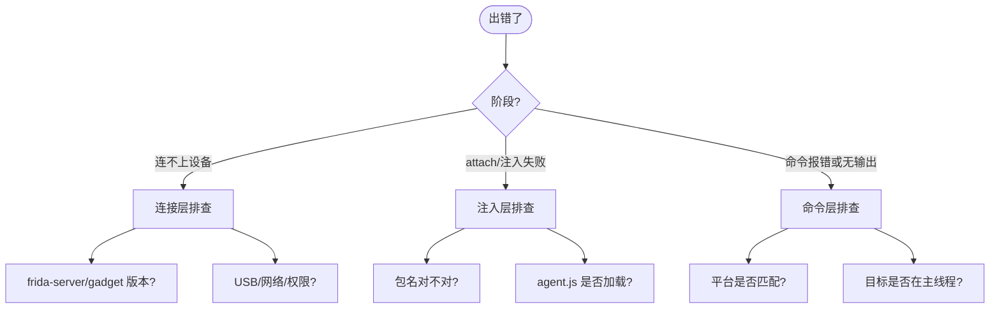
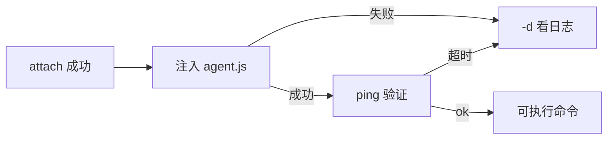
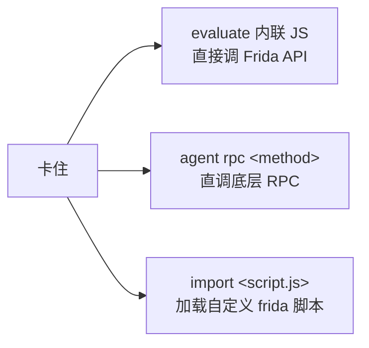

# 🩺 故障排查

本页汇总 objection 使用中最常见的报错与解决路径。按"连接→注入→命令"三阶段排查。

## 排查总览

## 🔌 连接层

### `Failed to enumerate processes` / 看不到设备

- **frida-server 没运行**：`adb shell "su -c 'ps | grep frida-server'"`，无输出则启动它（见 [安装与依赖](/guide/installation)）。
- **版本不匹配**：宿主 `frida` 库与设备 frida-server 大版本必须一致。`python -c "import frida; print(frida.__version__)"` 对比设备 `frida-server --version`。
- **USB 调试未开**：Android 开发者选项里开 USB 调试；`adb devices` 能看到设备。
- **多设备冲突**：用 `-S <serial>` 指定。

### 网络模式连不上

`objection -N -h <ip> -P <port>` 失败：

- 确认 frida-server 以 `frida-server -l 0.0.0.0:<port>` 监听（默认只监听本机）。
- 防火墙/同一网段。

## 💉 注入层

### `failed to attach: unable to find process with name '<pkg>'`

- 包名写错。`frida-ps -U -a` 列出已安装应用，拿真实包名/bundle id。
- App 没运行且未加 `-s`：spawn 模式拉起 `objection -g <pkg> -s start`。
- 想附加当前前台 App：`objection --foremost start`。

### `failed to spawn: unable to start process`

- Android：检查 App 是否已安装、签名是否校验失败（重打包后签名变了）。
- iOS：检查 bundle id 是否正确、设备是否信任。

### Agent 加载后无响应

`ping` 超时或命令无返回：

- 用 `-d` 调试模式启动看详细日志：`objection -g <pkg> -s -d start`。
- agent.js 可能版本过旧：开发模式下重新构建 `cd agent && npm run build`（产物 `objection/agent.js` 是 gitignore 的）。

## 🛠️ 命令层

### `android ...` 命令在 iOS 上报错（反之亦然）

objection 命令分平台。`android hooking list classes` 依赖 Java 桥，在 iOS 上必失败；iOS 用 `ios hooking list classes`。见 [命令速查](/reference/cli/)。

### Hook 后无输出

- 目标方法**没被调用**：Hook 已埋但代码路径没走到，操作 App 触发它。
- 类**尚未加载**（加固/动态加载场景）：用 `android hooking notify <pattern>` 懒监听，类加载时才触发。见 [hooking 源码](/reference/commands/android/hooking)。
- 多线程：某些回调在子线程，Hook 仍生效但日志被混入。

### `watch` 报 overload 不明确

Java 方法有重载时，需指定 overload 签名。`android hooking watch` 不带签名会 hook 所有 overload；`set return_value` 则需 `[overload]` 参数定位具体重载。

### Heap 搜索不到实例

`android heap search instances <class>` 返回空：

- 目标类此刻真的没有活跃实例（已被 GC 或尚未创建）。先操作 App 让实例出现再搜。
- 类名写错或用了内部类（用 `$` 分隔：`com.example.Outer$Inner`）。

## 🔐 SSL Pinning 绕过仍抓不到包

- `android sslpinning disable` 覆盖了常见库（OkHttp、Conscrypt 等），但**原生层 / Cronet / 自实现校验**不在覆盖范围。
- 检查抓包工具的 CA 是否装到系统/用户证书区。
- iOS 同理：`ios sslpinning disable` 覆盖常见库，但 ATS、自定义 SecTrust 校验需手写 Hook。

见 [SSL Pinning 绕过功能详解](/features/android-ssl-pinning)。

## 🧯 通用退路

当内置命令不够时，三条退路：

1. **`evaluate`**：在 REPL 内联执行任意 JavaScript，直接用 `Java.perform` / `ObjC.classes` 调 Frida API。见 [heap/evaluate](/reference/commands/android/heap)。
2. **`agent rpc <method>`**：直调 agent 的 RPC 方法拿原始数据，绕过人类命令层。见 [agent_cli](/reference/console/agent_cli)。
3. **`import <path>`**：加载一个完整 frida 脚本作为后台 job。见 [frida_commands](/reference/commands/frida-commands)。

## 🔗 相关文档

- [安装与依赖](/guide/installation)
- [快速上手](/guide/quickstart)
- [命令速查](/reference/cli/)
- [面向 AI Agent 使用](/guide/agent-usage)
