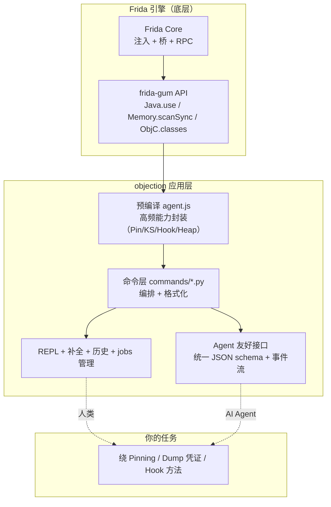

# objection 是什么

`objection` 是一个**运行时移动端安全测试工具包**（Runtime Mobile Exploration Toolkit），底层由 [Frida](https://www.frida.re/) 驱动，专门用于评估 iOS / Android 应用的安全姿态——**而且不需要越狱（jailbreak / root）**。

## 一句话定义

> objection = 把 Frida 的动态插桩能力，封装成一套面向安全测试人员的交互式命令行。

## 它的本质

移动端安全测试有两类典型手段：

| 手段 | 做法 | 局限 |
| --- | --- | --- |
| **静态分析** | 反编译 APK / IPA，阅读代码、找漏洞 | 代码被混淆/加壳后难以为继；看不到运行时实际行为 |
| **动态分析** | 让 App 跑起来，在运行时观察、干预它的行为 | 需要能注入代码到目标进程 |

objection 做的就是**动态分析**。它把一个用 TypeScript 写的 agent（`agent/src/`，编译成 `agent.js`）注入到目标 App 进程中，agent 在进程内部通过 Frida 的 Java / Objective-C 桥接直接调用系统 API、替换方法实现、读取内存，从而让你能：

- 绕过 SSL Pinning，抓到加密流量；
- 列举并 Hook 任意类与方法；
- Dump 钥匙串、Keystore 里的凭证；
- 搜索堆上的对象实例并调用其方法；
- 读写进程内存；
- 探索应用的沙盒文件系统；
- ……

## 与 Frida 的关系

很多人会问：既然底层是 Frida，为什么不直接用 Frida？


Frida 是**引擎**，objection 是建在引擎上的**驾驶舱**：把"绕过证书校验""Hook 某方法""Dump 钥匙串"这些高频、重复的任务做成了开箱即用的命令，并提供 REPL、任务管理、插件机制、HTTP API 等工程化能力。你可以把它理解成 Frida 的"应用层脚手架"。

## 谁在用 objection

- 移动端渗透测试人员：快速评估 App 安全姿态；
- 安全研究员：验证漏洞、研究加壳/混淆 App 的运行时行为；
- App 开发者：自测自己 App 的防护是否真的有效（如 SSL Pinning 是否能被绕过）；
- CTF 选手：移动端题目的常备工具。

## 项目速览

- **语言**：Python（CLI 与逻辑层）+ TypeScript（Frida agent）
- **支持平台**：iOS、Android
- **许可**：GPL-3.0-or-later
- **安装**：`pip install objection`

## 🧱 objection 在测试工作流中的位置

把 objection 放进一个完整的移动端安全评估工作流，它的位置更清楚。下面这张 ASCII 框图画的是从拿到 APK/IPA 到出具发现的全流程，标出 objection 介入的环节：

```text
┌─────────────── 移动端安全评估工作流 ───────────────────────────────────┐
│                                                                         │
│  ① 拿到样本                                                             │
│     APK / IPA                                                           │
│       │                                                                 │
│       ▼                                                                 │
│  ② 静态分析（反编译/看清单）      ── objection 不介入 ──┐              │
│     jadx / class-dump                                   │              │
│       │                                                 ▼              │
│  ③ 决定动态测试策略                          （了解结构、找疑点）       │
│       │                                                                 │
│       ▼                                                                 │
│  ④ 部署运行时插桩  ◀── objection 介入 ──┐                              │
│     ├─ root/越狱设备 → frida-server       │  objection attach          │
│     └─ 普通设备 → patchapk 植入 gadget    │  objection patchapk        │
│       │                                  ┘                              │
│       ▼                                                                 │
│  ⑤ 运行时探测  ◀── objection 主战场                                     │
│     ├─ 绕 SSL Pinning → 抓 HTTPS 流量（配合 Burp）                      │
│     ├─ Hook 关键方法 → 看入参/出参/调用栈                                │
│     ├─ Dump Keychain/Keystore → 取凭证                                  │
│     ├─ 堆搜索 → 拿实例调方法                                            │
│     ├─ 内存搜索/读写 → 找硬编码密钥                                     │
│     └─ 文件系统 → 翻沙盒里的 DB/plist                                   │
│       │                                                                 │
│       ▼                                                                 │
│  ⑥ 结合流量+运行时证据 → 形成发现                                       │
│       │                                                                 │
│       ▼                                                                 │
│  ⑦ 报告                                                                 │
│                                                                         │
└─────────────────────────────────────────────────────────────────────────┘
```

要点：

- **objection 不做静态分析**：第 ② 步用 jadx/class-dump 等专用工具。objection 的价值在第 ④⑤ 步——把"运行时观察与干预"工程化。
- **与 Burp 互补**：objection 绕掉 Pinning 后，加密流量才进得来 Burp；Burp 看请求响应，objection 看方法调用与内存——两层证据互证。
- **两种部署路径**：第 ④ 步依设备是否 root 选 frida-server 或 gadget，这正是 objection 提供 `attach` 与 `patchapk` 两条路径的原因。

## 🔄 objection 与 Frida 的能力分层

"既然底层是 Frida，为什么不直接用 Frida"——下图把 objection 在 Frida 之上加的每一层都标出来，回答这个问题：



每一层解决一个"直接用 Frida 会重复造轮子"的问题：

- **agent 层**：把"Hook SSLContext 的 7 处校验点"这种高频封装固化，免去每次手写。
- **命令层**：把"调 agent RPC → 格式化输出 → 注册 Job"的编排模板化。
- **UX 层**：REPL、补全、历史、Job 管理让交互式测试高效。
- **Agent 接口层**：统一 JSON schema + 事件流让脚本/AI Agent 能可靠驱动——这是直接用 Frida 完全没有的。

## 🆚 与同类工具对比

把 objection 放进移动端安全工具谱系：

| 工具 | 定位 | 形态 | 与 objection 关系 |
| --- | --- | --- | --- |
| Frida | 运行时插桩引擎 | 引擎 + CLI | objection 的底层 |
| frida-tools | 通用 Frida REPL/trace | 轻量 CLI | objection 是其上的应用层脚手架 |
| Burp Suite | HTTPS 中间人代理 | 桌面应用 | 与 objection 互补：objection 绕 Pinning 让流量进 Burp |
| jadx / class-dump | 静态反编译 | 桌面/CLI | objection 不做静态，互补 |
| Xposed | Android 框架级 Hook | 需刷框架 | objection 用 Frida 运行时插桩，不需刷框架；Gadget 模式更轻 |
| MobSF | 自动化移动安全扫描 | Web 平台 | 自动化扫描；objection 偏交互式深度测试，可被 MobSF 类工具编排 |
| Brida | Frida + Burp 桥 | 插件 | 轻量脚本集合；objection 提供更完整的命令/输出/Job 体系 |

objection 的差异化：**Frida 引擎之上，针对移动安全高频场景的命令化封装 + 双模式输出（人类文本 / Agent JSON）**——既服务渗透测试者的交互式测试，又服务 AI Agent 的可编程驱动。

## ⚖️ 设计权衡

| 决策 | 选择 | 替代方案 | 权衡理由 |
| --- | --- | --- | --- |
| 底层选 Frida | Frida | 自研插桩 / Xposed | Frida 跨 iOS+Android、不需刷框架、生态成熟。objection 把精力放在应用层而非重造引擎。 |
| 双模式输出 | 人类文本 + Agent JSON | 只服务一类 | 一套命令实现同时服务渗透测试者与 AI Agent，最大化复用。代价是命令函数要兼顾两种输出。 |
| 交互式 REPL 为主 | REPL + 命令 | 纯脚本/纯 HTTP | 移动安全测试高度探索式，REPL 的即时反馈最契合。HTTP/CLI 子命令作为自动化补充。 |
| Gadget 模式支持普通设备 | patchapk 植入 gadget | 只支持 root 设备 | 扩大可用设备范围，企业测试机不一定方便 root。代价是需重打包重签名。 |

接下来，建议先看 [它能解决什么问题](/guide/problems)，理解为什么需要运行时测试；再看 [整体架构](/guide/architecture)。
