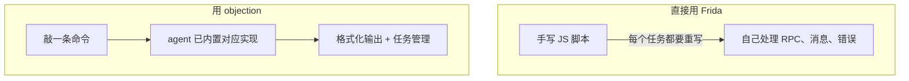

# objection 是什么

`objection` 是一个**运行时移动端安全测试工具包**（Runtime Mobile Exploration Toolkit），底层由 [Frida](https://www.frida.re/) 驱动，专门用于评估 iOS / Android 应用的安全姿态——**而且不需要越狱（jailbreak / root）**。

## 一句话定义

> objection = 把 Frida 的动态插桩能力，封装成一套面向安全测试人员的交互式命令行。

## 它的本质

移动端安全测试有两类典型手段：

| 手段 | 做法 | 局限 |
| --- | --- | --- |
| **静态分析** | 反编译 APK / IPA，阅读代码、找漏洞 | 代码被混淆/加壳后难以为继；看不到运行时实际行为 |
| **动态分析** | 让 App 跑起来，在运行时观察、干预它的行为 | 需要能注入代码到目标进程 |

objection 做的就是**动态分析**。它把一个用 TypeScript 写的 agent（`agent/src/`，编译成 `agent.js`）注入到目标 App 进程中，agent 在进程内部通过 Frida 的 Java / Objective-C 桥接直接调用系统 API、替换方法实现、读取内存，从而让你能：

- 绕过 SSL Pinning，抓到加密流量；
- 列举并 Hook 任意类与方法；
- Dump 钥匙串、Keystore 里的凭证；
- 搜索堆上的对象实例并调用其方法；
- 读写进程内存；
- 探索应用的沙盒文件系统；
- ……

## 与 Frida 的关系

很多人会问：既然底层是 Frida，为什么不直接用 Frida？

Frida 是**引擎**，objection 是建在引擎上的**驾驶舱**：把"绕过证书校验""Hook 某方法""Dump 钥匙串"这些高频、重复的任务做成了开箱即用的命令，并提供 REPL、任务管理、插件机制、HTTP API 等工程化能力。你可以把它理解成 Frida 的"应用层脚手架"。

## 谁在用 objection

- 移动端渗透测试人员：快速评估 App 安全姿态；
- 安全研究员：验证漏洞、研究加壳/混淆 App 的运行时行为；
- App 开发者：自测自己 App 的防护是否真的有效（如 SSL Pinning 是否能被绕过）；
- CTF 选手：移动端题目的常备工具。

## 项目速览

- **语言**：Python（CLI 与逻辑层）+ TypeScript（Frida agent）
- **支持平台**：iOS、Android
- **许可**：GPL-3.0-or-later
- **安装**：`pip install objection`

接下来，建议先看 [它能解决什么问题](/guide/problems)，理解为什么需要运行时测试；再看 [整体架构](/guide/architecture)。
