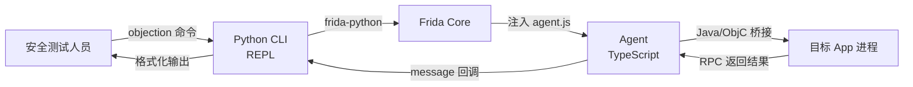

## objection 在做什么

objection 把 [Frida](https://www.frida.re/) 的动态插桩能力，封装成一套**面向安全测试人员**的交互式命令行。你不必手写每一行 Frida 脚本——objection 已经把"绕过证书校验""Hook 某个方法""Dump 钥匙串"这些高频任务做成了开箱即用的命令。

下图展示了从你敲下一行命令，到目标 App 被改变行为之间的完整链路：

## 文档站定位

这是一个**教学站点**。读完它，你将完全理解：

- objection **解决了什么问题**，以及为什么需要运行时测试；
- 它的**整体架构**——Python、Frida、Agent 三者如何协作；
- 每一个功能点的**实现原理与细节**，而不只是"敲哪条命令"。

> 接下来推荐从 [objection 是什么](/guide/what-is-objection) 开始，建立全局认识。
