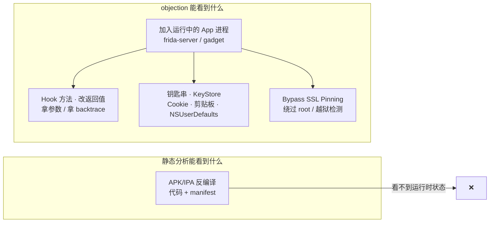
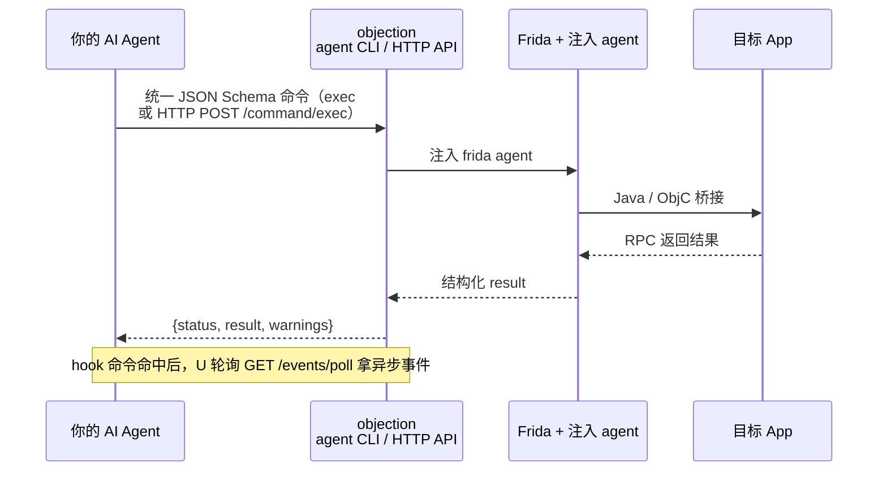

## 这工具解决什么问题？

App 的安全姿态只有在**运行时**才看得见：证书校验是否可绕过、钥匙串里躺着什么凭证、某个方法被调用时传了什么参数、内存里有没有密钥。

静态分析是一份"地图"，而 **objection 是一把可以进去翻东西的钥匙**。

```mermaid
flowchart LR
    subgraph 静态分析[静态分析能看到什么]
        M[APK/IPA 反编译<br/>代码 + manifest]
    end
    subgraph 运行时测试[objection 能看到什么]
        K[加入运行中的 App 进程<br/>frida-server / gadget]
        H[Hook 方法 · 改返回值<br/>拿参数 / 拿 backtrace]
        S[钥匙串 · KeyStore<br/>Cookie · 剪贴板 · NSUserDefaults]
        P[Bypass SSL Pinning<br/>绕过 root / 越狱检测]
    end
    M -->|看不到运行时状态| X[❌]
    K --> H
    K --> S
    K --> P
```

## 你的 AI Agent 怎么装上它？

objection 已经完全按 **Agent 优先** 重新设计了：不用人敲命令、不用人读终端。

```mermaid
sequenceDiagram
    participant U as 你的 AI Agent
    participant O as objection<br/>agent CLI / HTTP API
    participant F as Frida + 注入 agent
    participant A as 目标 App

    U->>O: 统一 JSON Schema 命令（exec<br/>或 HTTP POST /command/exec）
    O->>F: 注入 frida agent
    F->>A: Java / ObjC 桥接
    A-->>F: RPC 返回结果
    F-->>O: 结构化 result
    O-->>U: {status, result, warnings}
    Note over U,O: hook 命令命中后，U 轮询 GET /events/poll 拿异步事件
```

**你的投喂方式，三选一：**

1. **[一键复制提示词](/guide/agent-installation#a1-直接把这段提示词交给你的-agent)**——把现成提示词粘给你的 Agent，立即会用。
2. **[加载官方 Skill 包](/guide/agent-installation#a2-加载官方-skill-包推荐能力最强)**——`cp -r .claude/skills/objection ~/.claude/skills/`，Claude 直接"会"objection。
3. **[走 HTTP API](/guide/agent-installation#路径-b协议级对接--http-api--agent-cli)**——自己代码调用 `/command/exec`、`/events/poll`，做长会话自动化。

> 🔥 **本质切换**：以后软件先给 Agent 用，人不一定需要 `pip install` + REPL。给 Agent 的"安装方式"是 **skill 包 + 提示词 + JSON 协议**——本手册就是教你把这套东西装进你的 Agent。

## 这个站点里有什么

- **[指南](/guide/what-is-objection)** —— objection 解决了什么问题、整体架构、Frida/Agent/RPC 原理。
- **[功能详解](/features/)** —— 每个功能板块：用法、原理、带 mermaid 图的实现解析。
- **[AI Agent 集成](/guide/agent-usage)** —— 统一 JSON Schema、HTTP API 端点、面向 Agent 的调用方式。
- **[源码模块文档](/reference/)** —— 按 Python 模块逐一拆解，配 `file:line` 真实引用。

> 接下来推荐从 [把 objection 装进你的 AI Agent](/guide/agent-installation) 开始——如果它正是你想做的事。