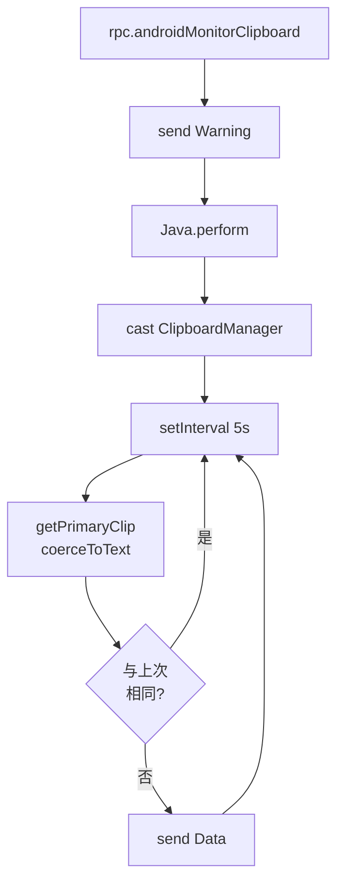
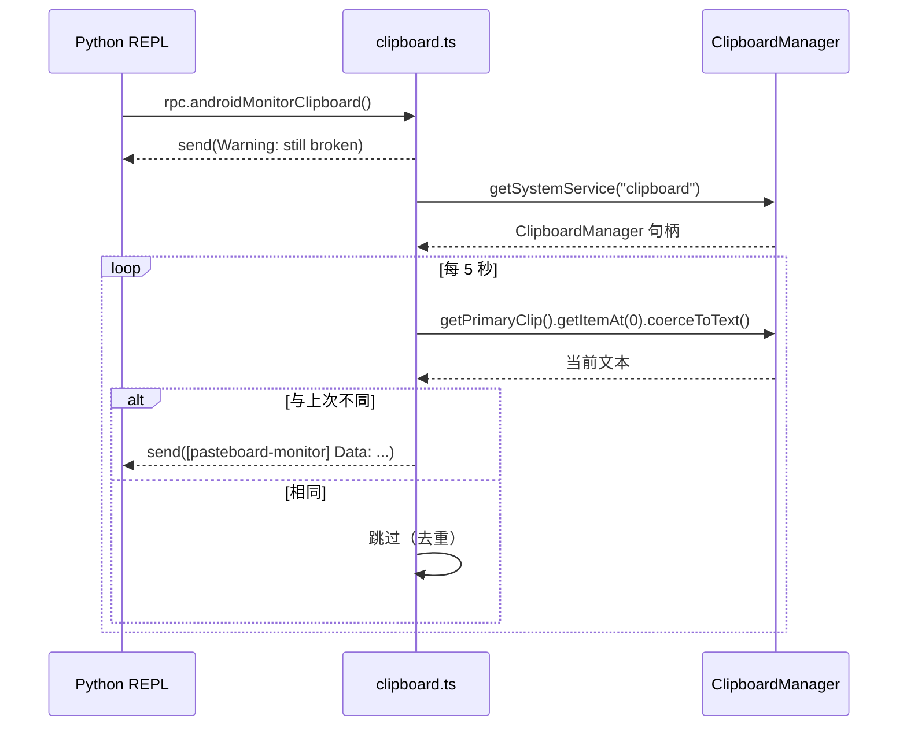

# 剪贴板监控 <code>agent/src/android/clipboard.ts</code>

`clipboard.ts` 在 Android 目标进程内轮询 `ClipboardManager` 的主剪贴板内容，每当文本变化就通过 `send()` 推送给 Python 侧。**注意**：源码顶部明确标注该模块"仍然有 bug，欢迎 PR 修复"。

## 📋 模块概览
| 项目 | 值 |
| --- | --- |
| 文件路径 | `agent/src/android/clipboard.ts` |
| 平台 | Android |
| 导出 RPC | `androidMonitorClipboard` |
| 依赖 | `lib/color.ts`、`android/lib/libjava.ts`、`android/lib/types.ts` |

## 🎯 解决的问题
- 监控 Android 应用读取/写入系统剪贴板的明文内容（密码、Token 等可能被复制进剪贴板）。
- 在文本变化时实时推送给 Python 侧 REPL。

## 🏗️ 导出的 RPC 方法
| RPC 名 | 说明 |
| --- | --- |
| `androidMonitorClipboard` | 启动 5 秒轮询，文本变化时 `send()` |

### `rpc.androidMonitorClipboard` — 剪贴板轮询
源码：[`agent/src/android/clipboard.ts:9`](https://github.com/android-security-engineer/objection-skills/blob/master/agent/src/android/clipboard.ts#L9)

启动时会先打印一条 Warning 告知模块未完全可用：

```ts
// agent/src/android/clipboard.ts:16
send(`${c.yellowBright("Warning!")} This module is still broken. A pull request fixing it would be awesome!`);
```

随后在 `wrapJavaPerform` 内拿到 `ClipboardManager` 句柄并 `setInterval` 每 5 秒读取一次：

```ts
// agent/src/android/clipboard.ts:24-55
return wrapJavaPerform(() => {
  const clipboardManager = Java.use("android.content.ClipboardManager");
  const context = getApplicationContext();
  const clipboardHandle = context.getApplicationContext().getSystemService(CLIPBOARD_SERVICE);
  const cp = Java.cast(clipboardHandle, clipboardManager);
  setInterval(() => {
    const primaryClip = cp.getPrimaryClip();
    if (primaryClip == null || primaryClip.getItemCount() <= 0) { return; }
    const currentString = primaryClip.getItemAt(0).coerceToText(context).toString();
    if (data === currentString) { return; }   // 去重
    data = currentString;
    send(`${c.blackBright(`[pasteboard-monitor]`)} Data: ${c.greenBright(data.toString())}`);
  }, 1000 * 5);
});
```

## ⚙️ 实现要点

- 用 `CLIPBOARD_SERVICE = "clipboard"` 字符串从 `Context.getSystemService` 取系统服务，再 `Java.cast` 成 `ClipboardManager` 强类型句柄。
- 用模块级 `data: string` 缓存上次内容，相同则跳过，避免每 5 秒重复推送。
- `coerceToText(context)` 把 ClipData.Item 强制转成文本，兼容文字/Intent/URI 三种 Item 类型。
- 整个逻辑包在 `wrapJavaPerform`（即 `Java.perform` + Promise）内，确保 Frida Java 运行时已 attach。
- 该轮询没有注册成 Job，因此**无法通过 `jobsKill` 停止**——这也属于源码标注的"broken"点之一。

## 📐 流程



### 轮询时序



## ⚠️ 边界情况与已知缺陷

- **无法停止**：轮询通过 `setInterval` 启动，但**未注册为 Job**（不经过 `lib/jobs.ts` 的注册表），因此 `jobs kill` 无法终止它。一旦启动只能断开会话结束。这是源码标注 "broken" 的核心点。
- **主线程要求**：`getSystemService` 必须在主线程或已 attach 的 Java 运行时上下文调用，`wrapJavaPerform` 保证这一点；若 Agent 尚未完成 Java attach，调用会抛异常。
- **多用户/多剪贴板**：Android 多用户场景下 `getPrimaryClip` 只反映当前用户的系统剪贴板，不覆盖 `DevicePolicyManager` 管控的受限用户。
- **`coerceToText` 的隐式转换**：当 ClipData.Item 是 Intent 或 URI 时，`coerceToText` 会调用 `Intent.toUri` / `URI.toString`，可能把非文本意图也当文本推送，需在 Python 侧甄别。
- **5 秒粒度**：轮询间隔固定 5 秒，短于该间隔的"复制→清空"动作可能被错过。


## 🔍 源码索引
| 符号 | 位置 |
| --- | --- |
| `monitor` | [`agent/src/android/clipboard.ts:9`](https://github.com/android-security-engineer/objection-skills/blob/master/agent/src/android/clipboard.ts#L9) |
| `CLIPBOARD_SERVICE` | [`agent/src/android/clipboard.ts:19`](https://github.com/android-security-engineer/objection-skills/blob/master/agent/src/android/clipboard.ts#L19) |
| `data` 缓存 | [`agent/src/android/clipboard.ts:22`](https://github.com/android-security-engineer/objection-skills/blob/master/agent/src/android/clipboard.ts#L22) |
| `wrapJavaPerform` 块 | [`agent/src/android/clipboard.ts:24`](https://github.com/android-security-engineer/objection-skills/blob/master/agent/src/android/clipboard.ts#L24) |
| `setInterval` 轮询 | [`agent/src/android/clipboard.ts:31`](https://github.com/android-security-engineer/objection-skills/blob/master/agent/src/android/clipboard.ts#L31) |

## 🔗 相关文档
- [Frida 与 Agent](/guide/frida-agent)
- [`libjava.md`](/reference/agent/android/lib/libjava) · [`pasteboard.md`](/reference/agent/ios/pasteboard)
- 命令文档：[/reference/commands/android/clipboard](/reference/commands/android/clipboard)
