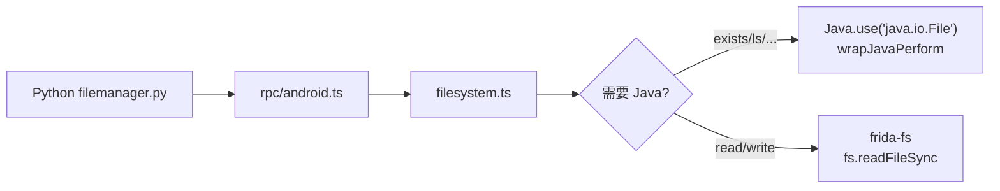

# 文件系统 <code>agent/src/android/filesystem.ts</code>

`filesystem.ts` 在 Android 目标进程内提供文件操作能力：存在性检查、读写权限、当前目录、列出目录、读写文件、删除文件。检查类操作走 `java.io.File`，实际读写走 `frida-fs` 直连目标进程文件系统。

## 📋 模块概览
| 项目 | 值 |
| --- | --- |
| 文件路径 | `agent/src/android/filesystem.ts` |
| 平台 | Android |
| 导出 RPC | `androidFileCwd`、`androidFileDelete`、`androidFileDownload`、`androidFileExists`、`androidFileLs`、`androidFilePathIsFile`、`androidFileReadable`、`androidFileUpload`、`androidFileWritable` |
| 依赖 | `frida-fs`、`buffer`、`lib/helpers.ts`、`android/lib/interfaces.ts`、`android/lib/libjava.ts`、`android/lib/types.ts` |

## 🎯 解决的问题
- 在 App 沙箱内以 App 权限检查/读写文件，绕过外部 adb 的权限限制。
- 把文件下载/上传做成 hex 流，跨 Frida `send` 边界传输二进制。

## 🏗️ 导出的 RPC 方法
| RPC 名 | 说明 |
| --- | --- |
| `androidFileExists(path)` | `java.io.File.exists()` |
| `androidFileReadable(path)` | `canRead()` |
| `androidFileWritable(path)` | `canWrite()` |
| `androidFilePathIsFile(path)` | `isFile()` |
| `androidFileCwd()` | `getApplicationContext().getFilesDir()` |
| `androidFileDownload(path)` | 读文件返回 Buffer |
| `androidFileUpload(path, data)` | 写 hex 字节 |
| `androidFileDelete(path)` | `java.io.File.delete()` |
| `androidFileLs(path)` | 列目录，返回 `IAndroidFilesystem` |

### `rpc.androidFileLs` — 列目录
源码：[`agent/src/android/filesystem.ts:115`](https://github.com/android-security-engineer/objection-skills/blob/master/agent/src/android/filesystem.ts#L115)

```ts
// agent/src/android/filesystem.ts:129-162
return wrapJavaPerform(() => {
  const file = Java.use("java.io.File");
  const directory = file.$new(p);
  const response: IAndroidFilesystem = {
    files: {}, path: p,
    readable: directory.canRead(), writable: directory.canWrite(),
  };
  if (!response.readable) { return response; }
  const files = directory.listFiles();
  for (const f of files) {
    response.files[f.getName()] = {
      attributes: { isDirectory: f.isDirectory(), isFile: f.isFile(),
        isHidden: f.isHidden(), lastModified: f.lastModified(), size: f.length() },
      fileName: f.getName(), readable: f.canRead(), writable: f.canWrite(),
    };
  }
  return response;
});
```

### `rpc.androidFileDownload` / `androidFileUpload`
源码：[`agent/src/android/filesystem.ts:83`](https://github.com/android-security-engineer/objection-skills/blob/master/agent/src/android/filesystem.ts#L83) / `:90`

读写绕开 Java，直接用 `frida-fs`：
```ts
// agent/src/android/filesystem.ts:83-99
export const readFile = (path: string): string | Buffer => {
  if (fs.statSync(path).size == 0) return Buffer.alloc(0);
  return fs.readFileSync(path);
};
export const writeFile = (path: string, data: string): void => {
  const writeStream = fs.createWriteStream(path);
  writeStream.on("error", (error) => { throw error; });
  writeStream.write(hexStringToBytes(data));  // data 是 hex 串
  writeStream.end();
};
```

## ⚙️ 实现要点

- **检查走 Java**：`exists/readable/writable/pathIsFile/delete/ls` 都用 `Java.use("java.io.File").$new(path)`，受 App 进程权限约束。
- **读写走 frida-fs**：`frida-fs` 是 Frida 自带的进程内文件系统模块，比走 Java IO 更直接，且能拿到原始字节。
- **二进制传输契约**：`writeFile` 接收的是 hex 字符串，由 `hexStringToBytes`（`lib/helpers.ts:18`）转回字节。Python 侧 `filemanager.py` 在上传前把文件 hex 编码。
- **空文件处理**：`readFile` 对 0 字节文件返回 `Buffer.alloc(0)`，避免 `readFileSync` 抛错。
- **ls 提前返回**：目录不可读时直接返回只含 `readable:false` 的骨架，不抛异常。

## 📐 调用关系



## 🔍 源码索引
| 符号 | 位置 |
| --- | --- |
| `exists` | [`agent/src/android/filesystem.ts:15`](https://github.com/android-security-engineer/objection-skills/blob/master/agent/src/android/filesystem.ts#L15) |
| `readable` | [`agent/src/android/filesystem.ts:29`](https://github.com/android-security-engineer/objection-skills/blob/master/agent/src/android/filesystem.ts#L29) |
| `writable` | [`agent/src/android/filesystem.ts:43`](https://github.com/android-security-engineer/objection-skills/blob/master/agent/src/android/filesystem.ts#L43) |
| `pathIsFile` | [`agent/src/android/filesystem.ts:57`](https://github.com/android-security-engineer/objection-skills/blob/master/agent/src/android/filesystem.ts#L57) |
| `pwd` | [`agent/src/android/filesystem.ts:71`](https://github.com/android-security-engineer/objection-skills/blob/master/agent/src/android/filesystem.ts#L71) |
| `readFile` | [`agent/src/android/filesystem.ts:83`](https://github.com/android-security-engineer/objection-skills/blob/master/agent/src/android/filesystem.ts#L83) |
| `writeFile` | [`agent/src/android/filesystem.ts:90`](https://github.com/android-security-engineer/objection-skills/blob/master/agent/src/android/filesystem.ts#L90) |
| `deleteFile` | [`agent/src/android/filesystem.ts:101`](https://github.com/android-security-engineer/objection-skills/blob/master/agent/src/android/filesystem.ts#L101) |
| `ls` | [`agent/src/android/filesystem.ts:115`](https://github.com/android-security-engineer/objection-skills/blob/master/agent/src/android/filesystem.ts#L115) |

## 🔗 相关文档
- [Frida 与 Agent](/guide/frida-agent)
- [`filesystem.md`](/reference/agent/ios/filesystem) · [`libjava.md`](/reference/agent/android/lib/libjava)
- 命令文档：[/reference/commands/filemanager](/reference/commands/filemanager)
