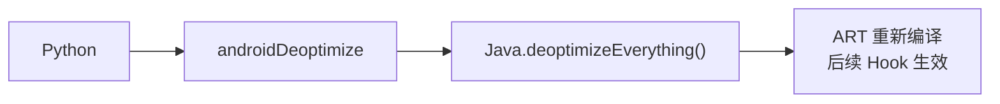

# 通用工具 <code>agent/src/android/general.ts</code>

`general.ts` 是 Android 平台最小的通用工具模块，目前只提供 `deoptimize` 一个方法，强制 ART 重新编译所有已优化的 Java 字节码。常用于"清掉 ART 内联缓存，让后续 Hook 生效"。

## 📋 模块概览
| 项目 | 值 |
| --- | --- |
| 文件路径 | `agent/src/android/general.ts` |
| 平台 | Android |
| 导出 RPC | `androidDeoptimize` |
| 依赖 | `android/lib/libjava.ts` |

## 🎯 解决的问题
- 让 Frida 在某些"已优化"的方法上 Hook 失败后，通过全量 deopt 让 Hook 重新生效。
- 调试 Hook 不生效问题时作为兜底手段。

## 🏗️ 导出的 RPC 方法
| RPC 名 | 说明 |
| --- | --- |
| `androidDeoptimize` | 调用 `Java.deoptimizeEverything()` |

### `rpc.androidDeoptimize` — 全量 deopt
源码：`agent/src/android/general.ts:6`

```ts
// agent/src/android/general.ts:6-10
export const deoptimize = (): Promise<void> => {
  return wrapJavaPerform(() => {
    Java.deoptimizeEverything();
  });
};
```

## ⚙️ 实现要点

- `Java.deoptimizeEverything()` 是 frida-java-bridge 提供的 API，会让 ART 抛弃所有 quickening/optimizing 阶段产物，下次执行重新走解释器或 JIT，此时 Frida 的 `implementation` 替换一定生效。
- 包在 `wrapJavaPerform` 内确保 Java 运行时已 attach（`libjava.ts:19`）。
- 该操作开销大、会影响 App 性能，仅在排查 Hook 不生效时使用。

## 📐 调用关系



## 🔍 源码索引
| 符号 | 位置 |
| --- | --- |
| `deoptimize` | `agent/src/android/general.ts:6` |

## 🔗 相关文档
- [Frida 与 Agent](/guide/frida-agent)
- [`libjava.md`](/reference/agent/android/lib/libjava) · [`hooking.md`](/reference/agent/android/hooking)
