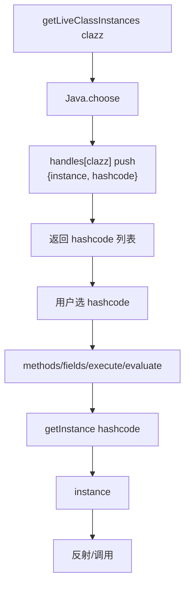

# 堆枚举 <code>agent/src/android/heap.ts</code>

`heap.ts` 在 Android 目标进程内枚举 Java 堆中某类的活实例，并允许在实例上列方法、执行方法、读字段、`eval` 任意 JS。它是 objection `android heapin` 命令族在 Agent 侧的实现。

## 📋 模块概览
| 项目 | 值 |
| --- | --- |
| 文件路径 | `agent/src/android/heap.ts` |
| 平台 | Android |
| 导出 RPC | `androidHeapEvaluateHandleMethod`、`androidHeapExecuteHandleMethod`、`androidHeapGetLiveClassInstances`、`androidHeapPrintFields`、`androidHeapPrintMethods` |
| 依赖 | `lib/color.ts`、`android/lib/interfaces.ts`、`android/lib/libjava.ts`、`frida-java-bridge` |

## 🎯 解决的问题
- 找到内存中某 Java 类的所有活实例（如 `javax.crypto.Cipher` 实例），获取稳定 hashcode 句柄。
- 在不重写方法的前提下，**直接调用**实例方法或读字段，用于"已构造好的对象"取值。
- 在实例上下文里 eval JS，做更灵活的探索。

## 🏗️ 导出的 RPC 方法
| RPC 名 | 说明 |
| --- | --- |
| `androidHeapGetLiveClassInstances(clazz)` | `Java.choose` 枚举，返回 `{hashcode, classname, tostring}` |
| `androidHeapPrintMethods(handle)` | 列该实例类的 `getDeclaredMethods` |
| `androidHeapExecuteHandleMethod(handle, method, returnString)` | 调用实例方法 |
| `androidHeapPrintFields(handle)` | 列 `getDeclaredFields` 并读值 |
| `androidHeapEvaluateHandleMethod(handle, js)` | 在实例上下文 eval |

### `rpc.androidHeapGetLiveClassInstances` — 枚举活实例
源码：[`agent/src/android/heap.ts:46`](https://github.com/android-security-engineer/objection-skills/blob/master/agent/src/android/heap.ts#L46)

```ts
// agent/src/android/heap.ts:49-74
handles[clazz] = [];
Java.choose(clazz, {
  onComplete: function () { c.log(`Class instance enumeration complete for ${clazz}`); },
  onMatch: function (instance) {
    handles[clazz].push({ instance, hashcode: instance.hashCode() });
  },
});
return handles[clazz].map((h): IHeapNormalised => ({
  hashcode: h.hashcode, classname: clazz, tostring: h.instance.toString(),
}));
```

### `getInstance` — 按 hashcode 找回句柄
源码：[`agent/src/android/heap.ts:16`](https://github.com/android-security-engineer/objection-skills/blob/master/agent/src/android/heap.ts#L16)

模块级 `handles` 字典缓存每次 `getInstances` 的结果，后续 `methods/execute/fields/evaluate` 都靠 hashcode 反查：
```ts
// agent/src/android/heap.ts:16-44
const getInstance = (hashcode: number): JavaTypes.Wrapper | null => {
  const matches: IHeapObject[] = [];
  Object.keys(handles).forEach((clazz) => {
    handles[clazz].filter((heapObject) => {
      if (heapObject.hashcode === hashcode) matches.push(heapObject);
    });
  });
  if (matches.length > 1) c.log(`Found ${matches.length} handles, this is probably a bug...`);
  if (matches.length > 0) { ...; return matches[0].instance; }
  c.log(`Warning: Could not find a known handle for ${hashcode}.`);
  return null;
};
```

### `rpc.androidHeapPrintFields` — 读字段
源码：[`agent/src/android/heap.ts:109`](https://github.com/android-security-engineer/objection-skills/blob/master/agent/src/android/heap.ts#L109)

```ts
// agent/src/android/heap.ts:117-134
return clazz.class.getDeclaredFields().map((field: any): IJavaField => {
  const fieldName = field.getName();
  const fieldInstance = clazz.class.getDeclaredField(fieldName);
  fieldInstance.setAccessible(true);          // 绕过 private
  let fieldValue = fieldInstance.get(clazz);
  if (fieldValue) fieldValue = fieldValue.toString();
  return { name: fieldName, value: fieldValue };
});
```

## ⚙️ 实现要点

- **句柄稳定性**：用 `instance.hashCode()` 作为跨 RPC 调用的稳定 key，因为 Java 引用本身不能跨 `Java.perform` 边界传递，但 hashcode 是 int。
- **`handles` 是模块级 `let`**，多次 `getInstances` 会累积。同 hashcode 多匹配时打 warn（`:28-30`）。
- **`setAccessible(true)`**：读私有字段前必须抬高访问权限，对应反射 `Field.setAccessible`。
- **`execute` 调用方式**：`clazz[method]()` 直接通过 Frida 包装层调用无参实例方法，不支持传参（`:99`）。`returnString` 控制是否 `.toString()`。
- **`evaluate`**：在 `wrapJavaPerform` 闭包里 `eval(js)`，js 可引用闭包里的 `clazz` 变量做更复杂操作（`:137-148`）。

## 📐 堆探索流程



## 🔍 源码索引
| 符号 | 位置 |
| --- | --- |
| `handles` | [`agent/src/android/heap.ts:12`](https://github.com/android-security-engineer/objection-skills/blob/master/agent/src/android/heap.ts#L12) |
| `getInstance` | [`agent/src/android/heap.ts:16`](https://github.com/android-security-engineer/objection-skills/blob/master/agent/src/android/heap.ts#L16) |
| `getInstances` | [`agent/src/android/heap.ts:46`](https://github.com/android-security-engineer/objection-skills/blob/master/agent/src/android/heap.ts#L46) |
| `methods` | [`agent/src/android/heap.ts:77`](https://github.com/android-security-engineer/objection-skills/blob/master/agent/src/android/heap.ts#L77) |
| `execute` | [`agent/src/android/heap.ts:90`](https://github.com/android-security-engineer/objection-skills/blob/master/agent/src/android/heap.ts#L90) |
| `fields` | [`agent/src/android/heap.ts:109`](https://github.com/android-security-engineer/objection-skills/blob/master/agent/src/android/heap.ts#L109) |
| `evaluate` | [`agent/src/android/heap.ts:137`](https://github.com/android-security-engineer/objection-skills/blob/master/agent/src/android/heap.ts#L137) |

## 🔗 相关文档
- [Frida 与 Agent](/guide/frida-agent)
- [`heap.md`](/reference/agent/ios/heap) · [`interfaces.md`](/reference/agent/android/lib/interfaces)
- 命令文档：[/reference/commands/android/heap](/reference/commands/android/heap)
